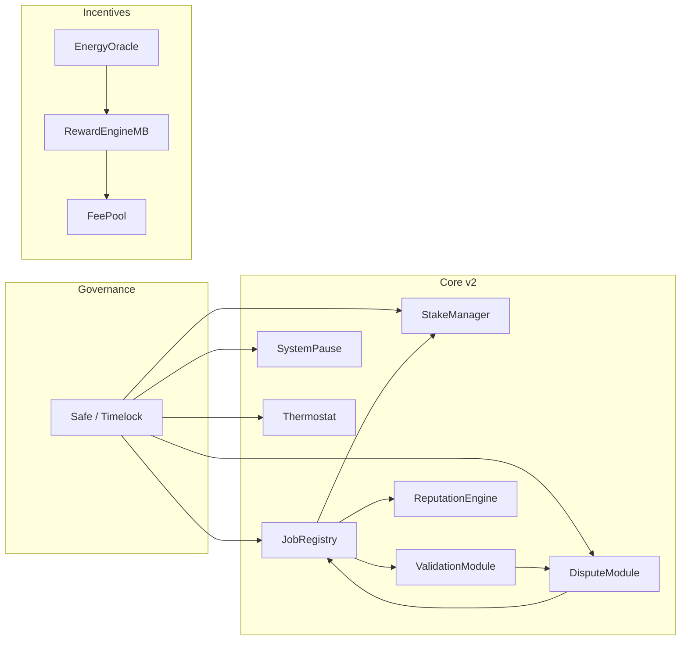
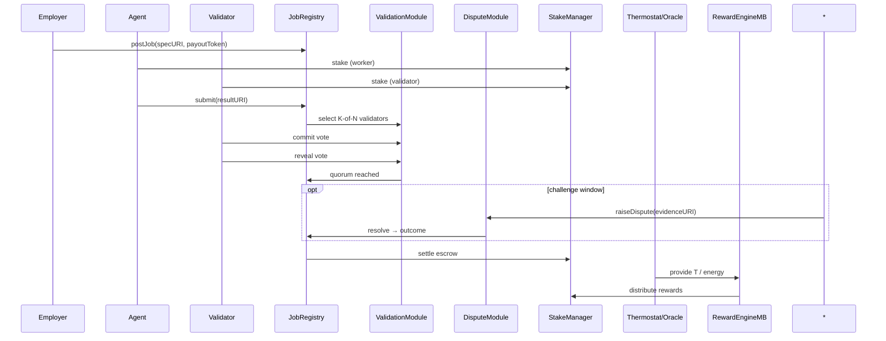

# Project AURORA — AGI Jobs v0 (v2) ASI Take‑Off Demo

**A planetary‑scale, auditable coordination sprint**: governed job posting, stake‑backed K‑of‑N validation with commit→reveal, dispute hooks, dynamic incentives via Thermostat/Energy Oracle, and operator dashboards — using only v2 capabilities.

---

## Quickstart

Local (Anvil):

```bash
cp demo/aurora/env.example .env
npm run demo:aurora:local
```

Target network:

```bash
# ensure RPC + keys in env
npm run demo:aurora:sepolia
```

**Outputs**

* `reports/<network>/aurora/receipts/*.json` — includes lifecycle (`state.json`),
  governance control proofs (`governance.json`), thermostat runs, and per-step receipts.
* `reports/<network>/aurora/aurora-report.md`
* Governance/owner snapshots can be generated via the existing owner tooling

---

## System (high level)



## Lifecycle (AURORA)



---

## Runbook

See [`RUNBOOK.md`](./RUNBOOK.md) for the step‑by‑step orchestration, including:

* Wiring checks and deployment via `scripts/v2/deployDefaults.ts`
* Automated module configuration and staking handled by `aurora.demo.ts`
* Lifecycle/state tracking, pause/unpause proofs, and thermostat dry-run receipts written to `reports/<net>/aurora/receipts`
* Receipt collection and the Markdown mission report summarised by `aurora-report.ts`

All receipts land under `reports/<net>/aurora/`. A Markdown summary is generated at `reports/<net>/aurora/aurora-report.md`.
