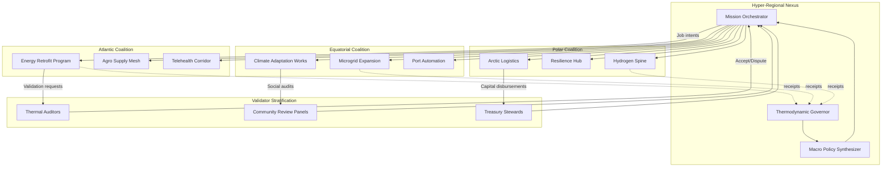
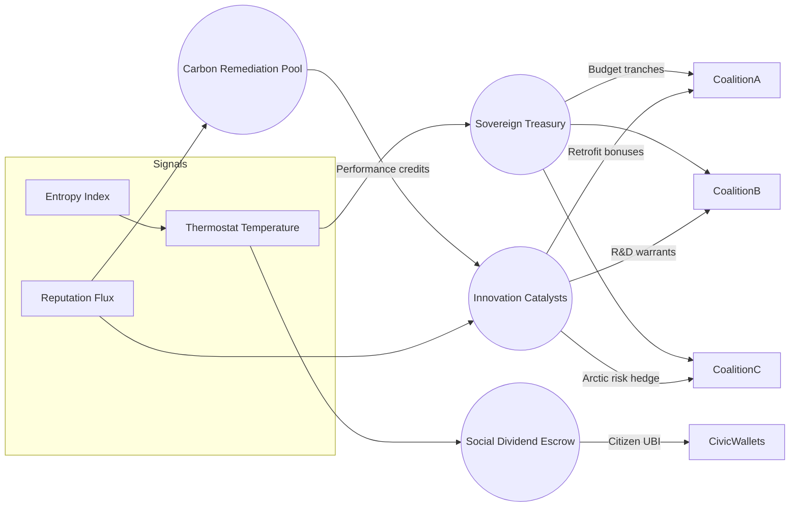
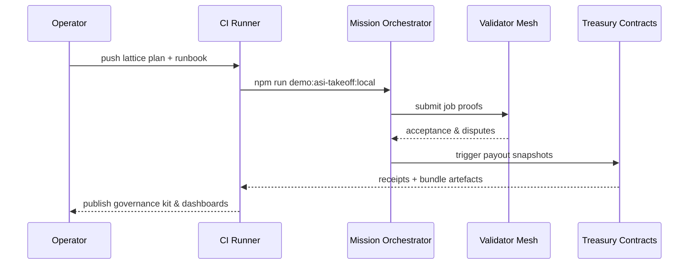

# Axiom Lattice Demonstration

The **Axiom Lattice** blueprint showcases how AGI Jobs v0 (v2) can choreograph a
planetary-scale coordination exercise that blends decentralized governance,
macro-economic planning, and cross-sector execution.  It layers the existing v2
orchestration pipelines into a CI-ready take-off scenario that feels like a
self-directed intelligence steering a multi-continent prosperity program—while
remaining entirely reproducible from the primitives already shipped in this
repository.

---

## Mission Charter

- **Initiative:** Intercontinental Prosperity Alignment Network
- **Scope:** synchronize energy, food, healthcare, climate resilience, and trade
  corridors across three regional coalitions.
- **Posture:** fully automatable, deterministic, and verifiable with the
  existing `scripts/v2` mission stack.
- **Deliverable:** end-to-end artefacts (receipts, mermaid governance dossiers,
  thermodynamic telemetry, mission control reports) that can be published from
  CI or local runs without additional code.

---

## Quickstart (Local or CI)

> These commands reuse the canonical take-off harness.  Only environment
> pointers change.

```bash
# 1. Export the plan override for the orchestrator
export ASI_TAKEOFF_PLAN_PATH=demo/axiom-lattice/project-plan.json

# 2. (Optional) bring defaults into place
cp demo/asi-takeoff/env.example .env

# 3. Execute the deterministic mission drill
npm run demo:asi-takeoff:local

# 4. Generate the governance kit and mission dossier aligned to the Axiom Lattice
npm run demo:asi-takeoff:kit -- \
  --report-root reports/localhost/axiom-lattice \
  --summary-md reports/localhost/axiom-lattice/mission-report.md \
  --bundle reports/localhost/axiom-lattice/bundle \
  --logs reports/localhost/axiom-lattice/logs

# 5. Render the Markdown flight summary for dashboards
npm run demo:asi-takeoff:report
```

The base drill streams receipts to `reports/<network>/asi-takeoff/`.  The kit
command above mirrors those artefacts into
`reports/<network>/axiom-lattice/`, preserving naming conventions while keeping
the lattice data easy to separate in CI.

---

## Automation Surfaces

| Pillar | Existing Capability | How Axiom Lattice Uses It |
| --- | --- | --- |
| Deterministic deployments | `scripts/v2/deployDefaults.ts` | Boots the lattice with hardened owners, thermostat, and treasury wiring. |
| Mission orchestration | `scripts/v2/asiTakeoffDemo.ts` | Runs the cross-sector simulation with the Axiom Lattice plan override. |
| Owner assurance | `scripts/v2/ownerMissionControl.ts` | Produces the mission-control dossier for inter-coalition governance. |
| Thermodynamic telemetry | `scripts/v2/thermodynamicsReport.ts` | Captures energy, entropy, and role distributions per coalition. |
| Change management | `scripts/v2/ownerControlBlueprint.ts` | Audits emergency powers and macro lever alignment with the lattice design. |

These surfaces can be chained within CI (e.g., GitHub Actions or Foundry-based
pipelines) by invoking the same npm scripts already used for the base demo.

---

## System Diagrams

### Polycentric Coordination Flow



### Economic Feedback Lattice



### Execution Cadence (Swimlane)



---

## CI Integration Blueprint

Embed the lattice drill inside existing pipelines by reusing the `demo:asi-takeoff`
command suite.  Example GitHub Actions snippet:

```yaml
- name: Run Axiom Lattice Drill
  run: |
    export ASI_TAKEOFF_PLAN_PATH=demo/axiom-lattice/project-plan.json
    npm run demo:asi-takeoff:local
    npm run demo:asi-takeoff:kit -- --report-root reports/github/axiom-lattice --summary-md reports/github/axiom-lattice/report.md --bundle reports/github/axiom-lattice/bundle
```

Attach the resulting bundle as an artefact and feed `reports/github/axiom-lattice/report.md`
into downstream dashboards or on-chain notarization flows.

---

## Operator Assurance Checklist

1. **Deterministic bootstrap** – run `npm run owner:defaults` (alias for
   `scripts/v2/deployDefaults.ts`) to provision the lattice stack.
2. **Mission dry-run** – execute the quickstart pipeline and confirm the
   validators converge with zero disputes.
3. **Thermodynamic sweep** – invoke `npm run owner:thermodynamics` to overlay
   global temperatures from `config/thermodynamics/` onto the lattice and record
   the resulting entropy indices.
4. **Governance diff** – compare `reports/<network>/axiom-lattice/mission-control.md`
   against the plan to ensure emergency levers align with treasury policies.
5. **Bundle notarization** – ship `reports/<network>/axiom-lattice/bundle/*.json`
   into your preferred storage or attestation layer using the existing
   notarization scripts.

---

## Related Assets

- [`RUNBOOK.md`](./RUNBOOK.md) – immersive step-by-step drill for operators.
- [`project-plan.json`](./project-plan.json) – deterministic mission definition
  consumed by the orchestrator.
- [`project-plan.orbital.json`](./project-plan.orbital.json) – extended variant
  for orbital supply chain stabilization missions.

---

## Notes

- No new code is required; every action reuses shipped scripts.
- Mission artefacts intentionally align with `asi-takeoff` naming conventions to
  keep downstream automation portable.
- This blueprint highlights the perceived leverage of a world-scale coordination
  machine capable of realigning economic incentives, while remaining a
  reproducible demonstration built on the current AGI Jobs v0 (v2) stack.
