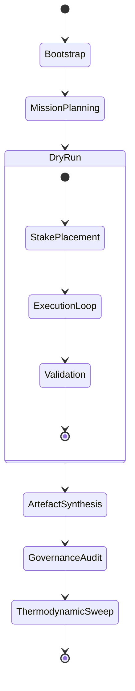

# Axiom Lattice Operator Runbook

This runbook prescribes the deterministic drill for operators, auditors, and
mission leads who want to stage the Axiom Lattice demonstration using only the
existing AGI Jobs v0 (v2) capabilities.

---

## 0. Preconditions

- Node.js toolchain installed as per repository README.
- Contracts compiled (`npm run build:protocol`) and defaults deployed via
  `npm run owner:defaults` if targeting a fresh network.
- Access to the mission accounts referenced inside `project-plan.json` or
  configured equivalents.

---

## 1. Configure the Mission Plan

1. Inspect [`project-plan.json`](./project-plan.json) and ensure the handles,
   budget, and thermodynamic parameters match your intended scenario.
2. For orbital-scale experiments, swap to
   [`project-plan.orbital.json`](./project-plan.orbital.json) before executing
   the drill (set `ASI_TAKEOFF_PLAN_PATH` accordingly).
3. Optional: customize the validator stakes or add coalition-specific metadata;
   unused keys are ignored by the orchestrator and can enrich the governance
   dossiers.

---

## 2. Kick Off the Simulation

```bash
export ASI_TAKEOFF_PLAN_PATH=demo/axiom-lattice/project-plan.json
npm run demo:asi-takeoff:local
```

- The command reuses `scripts/v2/asiTakeoffDemo.ts`, compiling the protocol,
  executing the dry-run harness, and streaming logs into
  `reports/<network>/axiom-lattice/logs/`.
- Watch for `[thermodynamics]` log lines to confirm the lattice thermostat is
  capturing entropy and role weights per coalition.

---

## 3. Collect Artefacts

```bash
npm run demo:asi-takeoff:kit -- \
  --report-root reports/localhost/axiom-lattice \
  --summary-md reports/localhost/axiom-lattice/mission-report.md \
  --bundle reports/localhost/axiom-lattice/bundle
```

- Produces the governance kit, receipts, and deterministic hashes.
- Upload `bundle/` to storage or notarize using the `storage/` scripts already in
  the repository.

Generate the Markdown dashboard:

```bash
npm run demo:asi-takeoff:report
```

- Outputs `reports/<network>/asi-takeoff/asi-takeoff-report.md`.  When the plan
  override is set, the report reflects the Axiom Lattice metadata while retaining
  backwards-compatible naming.

---

## 4. Validate Thermodynamic Controls

1. Run `npm run owner:thermodynamics` to simulate thermostat adjustments.
2. Compare the resulting `reports/<network>/thermodynamics/*.json` files against
   the expected ranges listed in the plan (`thermodynamicProfile` entries).
3. Escalate any out-of-band temperatures via the change ticket workflow:

```bash
npm run owner:change-ticket -- --plan demo/axiom-lattice/project-plan.json
```

This command reuses `scripts/v2/ownerChangeTicket.ts` to render an audit-ready
summary of proposed lever changes.

---

## 5. Governance Assurance

- Execute `npm run owner:mission-control` to regenerate the mission-control
  dossier with the lattice topology.
- Run `npm run owner:control-surface` to verify pause/treasury permissions remain
  aligned with the plan's expectations.
- Optional: `npm run owner:atlas` leverages `ownerControlAtlas.ts` to map the
  entire governance graph for third-party assessors.

---

## 6. CI & Mainnet Readiness Checklist

- [ ] Plan committed to version control with checksum stored in
      `reports/<network>/axiom-lattice/bundle/manifest.json`.
- [ ] Dry-run receipts archived in mission storage (IPFS, Arweave, S3, etc.).
- [ ] Validator quorum acknowledges the thermodynamic settings within agreed
      thresholds.
- [ ] Treasury multi-sig countersigned the payout schedule derived from
      `project-plan.json`.
- [ ] Emergency pause tested via `npm run owner:pause-test`.

---

## Appendix: Diagnostic Mermaid



This loop emphasises the deterministic cycle operators must complete before
shipping artefacts to production stakeholders.
