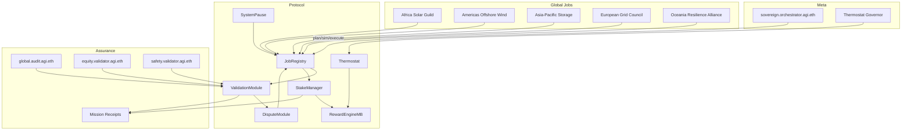

# Global Autonomous Economic Orchestrator Demonstration

This package extends the AGI Jobs v2 ASI take-off playbook to a **planetary-scale renewable energy coordination drill**. It
reuses the existing mission-control toolchain to simulate an Artificial Superintelligence orchestrating national and
transnational stakeholders with on-chain guarantees, validator oversight, and thermodynamic incentive steering.

The scenario coordinates a multi-continent renewable expansion plan while maintaining audit-grade owner control and pause
capabilities. The mission is intentionally designed to run entirely on top of the repository's existing automation primitives –
no contract changes or bespoke executors are required.

## Quickstart

Local (Anvil / Hardhat):

```bash
cp demo/global-orchestrator/env.example .env
npm run demo:global-orchestrator:local
```

Generate the Markdown mission dossier:

```bash
npm run demo:global-orchestrator:report
```

Produce the deterministic CI artefact bundle:

```bash
npm run demo:global-orchestrator
```

Artefacts:

- `reports/<network>/global-orchestrator/receipts/mission.json`
- `reports/<network>/global-orchestrator/receipts/jobs/<slug>/*.json`
- `reports/<network>/global-orchestrator/receipts/governance.json`
- `reports/<network>/global-orchestrator/global-orchestrator-report.md`
- `reports/global-orchestrator/summary.md` (from the deterministic CI harness)

## System Overview



## Mission Lifecycle

1. **Mandate decomposition** – the sovereign orchestrator converts the global renewable mandate into policy-safe intents using
   `mission@v2.json` and the one-box planner/simulator pipeline.
2. **Continental execution** – regional agents claim work, post deliverables, and undergo commit–reveal validation with the
   configured stakes and escrow balances in `spec-*.json`.
3. **Thermodynamic steering** – operators may apply `global-orchestrator.thermostat@v2.json` via the existing update scripts to
   rebalance incentives when backlog or SLA metrics drift.
4. **Governance drills** – the runbook executes pause, thermostat, and reward-control rehearsals proving that owners retain
   deterministic authority through the timelock and multisig guardrails.
5. **Planetary audit** – the final job packages KPIs, thermodynamic telemetry, and treasury accounting into the validator-signed
   receipts stored under `reports/<network>/global-orchestrator/`.

See [`RUNBOOK.md`](./RUNBOOK.md) for operator drills, owner control verification, and reproducibility guidance.
