# Helios Economic Orchestration Matrix

Helios synchronises macroeconomic planning across continents by remixing the reward engine, thermostat policy, and treasury controls that already ship with AGI Jobs v0 (v2).

---

## Incentive Control Board

| Lever | Source Command | Effect on Mission | Audit Artefact |
| --- | --- | --- | --- |
| Thermostat target | `npx hardhat run scripts/v2/updateThermostat.ts --network <network>` | Adjusts Gibbs temperature `T` to widen or tighten reward spread between low-entropy and high-entropy labour. | `owner/thermodynamics.md`, governance kits.【F:README.md†L55-L83】【F:package.json†L118-L158】 |
| Reward engine parameters | `npx hardhat run scripts/v2/updateRewardEngine.ts --network <network>` | Updates energy weighting and epoch budgets driving per-role shares. | `owner/parameter-matrix.md`, mission control report.【F:README.md†L55-L83】【F:package.json†L118-L158】 |
| Treasury routing | `npm run owner:command-center -- --network <network>` | Confirms fee pool, job registry, and stake manager treasuries before rebalancing platform liquidity. | `owner/command-center-bundle/`, `asi-global/command-center.md`.【F:package.json†L18-L88】【F:docs/asi-global-orchestrator-demo.md†L20-L53】 |
| Thermodynamics manifest | `npx hardhat run --no-compile scripts/v2/thermodynamicsReport.ts --network <network>` | Captures pre/post-change entropy envelopes for compliance review. | `owner/thermodynamics.md`.【F:scripts/v2/thermodynamicsReport.ts†L120-L200】 |
| Identity access | `npm run identity:update -- --network <network>` | Aligns ENS registries with mission-critical actors to prevent ghost labour flows. | `reports/helios-omniversal-symphony/SHA256SUMS` (hash of config snapshots).【F:README.md†L8-L17】【F:package.json†L118-L142】 |

---

## Economic Sequencer

```mermaid
gantt
    title Helios Economic Sequencer
    dateFormat  X
    axisFormat  %L
    section Allocation Warmup
    Verify ENS & AGIALPHA        :a1, 0, 1
    Thermodynamics Baseline      :a2, 1, 1
    section Mission Execution
    Continental Job Simulation   :b1, 2, 2
    Planetary Dry-Run & Telemetry:b2, 4, 2
    section Governance
    Owner Mission Control        :c1, 6, 1
    Command Center Atlas         :c2, 7, 1
    Emergency Runbook Refresh    :c3, 8, 1
    section Audit
    Governance Kits & SHA Sums   :d1, 9, 1
```

The sequencer highlights how Helios binds economic telemetry to governance proofs—only after thermodynamic baselines are captured do planetary simulations and treasury attestations proceed.

---

## Cross-Domain Coordination

1. **Labour orchestration** – `npm run demo:asi-takeoff:local` simulates sectoral labour pipelines, proving the JobRegistry and ValidationModule remain in lockstep before tokens move.【F:demo/asi-takeoff/README.md†L1-L83】
2. **Planetary aggregation** – `npm run demo:asi-global` layers continental plans and global audits, ensuring Governance kits reflect both local and planetary economics.【F:docs/asi-global-orchestrator-demo.md†L1-L53】
3. **Capital bridges** – Optional `npm run alpha-bridge:start` test harness demonstrates asset flow readiness so labour allocation and treasury settlements stay synchronised.【F:package.json†L158-L178】
4. **Observability** – `npm run monitoring:validate` dumps Prometheus sentinel configs that can accompany the Helios kit for runtime oversight.【F:package.json†L70-L83】

By sequencing these levers, Helios enacts a demonstrably super-competent economic pilot without modifying the core contracts—every adjustment flows through audited CLIs and existing manifests.
