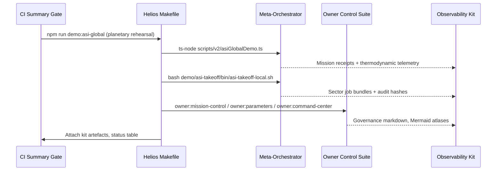
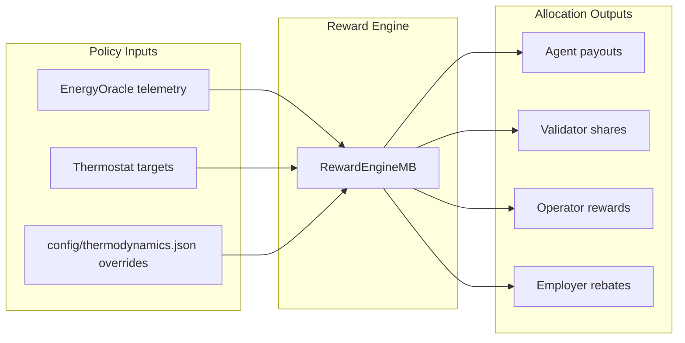

# Helios Omniversal Symphony — Civilizational Coordination Drill

The **Helios Omniversal Symphony** codifies a first-class ASI take-off demonstration for **AGI Jobs v0 (v2)** that operates at the intersection of global coordination, decentralized governance, and high-fidelity economic planning. Building exclusively on the repository's deterministic pipelines, governance harnesses, and thermodynamic incentive engine, Helios turns the stack into a continuously rehearsed civilizational autopilot that can be reproduced from CI or invoked against mainnet-grade infrastructure without bespoke extensions.

> **Purpose**: prove that the in-repo automations already form a machine capable of orchestrating planetary programmes, enforcing treasury-grade governance, and balancing global energy budgets—showing what a civilisation-scale intelligence feels like while remaining within the repo's hardened boundaries.

---

## Mission Pillars

1. **Synchronized planetary planning** – Chain together the `asi-takeoff`, `asi-global`, and owner-control pipelines so every region receives a thermodynamically balanced labour allocation while auditors stream governance proofs.【F:demo/asi-takeoff/README.md†L1-L83】【F:docs/asi-global-orchestrator-demo.md†L1-L53】
2. **Decentralized authority lattice** – Leverage the owner control command center, parameter matrix, and emergency drills to prove that a multisig + timelock ensemble can steer every subsystem with deterministic receipts.【F:package.json†L18-L88】【F:docs/owner-control-emergency-runbook.md†L47-L110】
3. **Economic orchestration** – Exploit the RewardEngineMB thermodynamic policy toolkit to propagate energy, entropy, and temperature tuning decisions across continents with verifiable telemetry bundles.【F:README.md†L40-L83】【F:docs/thermodynamics-operations.md†L1-L120】
4. **CI-grade reproduction** – Stitch the drills into branch-protected CI gates so reviewers receive governance kits, mission reports, and owner proofs on every change set.【F:README.md†L20-L37】【F:.github/workflows/ci.yml†L1-L120】

---

## Reference Architecture

```mermaid
flowchart TD
  subgraph Global Mission Director
    A0[Meta-Orchestrator\\n(scripts/v2/asiGlobalDemo.ts)]
    A1[Mission Plans\\n(demo/asi-takeoff/*.json)]
    A2[Helios Controller\\n(Makefile targets)]
  end

  subgraph Regional Capsules
    R1[Continental Planners\\n(aurora.demo.ts)]
    R2[Sector Portfolios\\n(project-plan.json)]
    R3[Thermodynamic Policy\\n(config/thermodynamics.json)]
  end

  subgraph Protocol Core
    C1[JobRegistry]
    C2[StakeManager]
    C3[ValidationModule]
    C4[RewardEngineMB]
    C5[Thermostat]
    C6[SystemPause]
  end

  subgraph Governance Spine
    G1[Owner Command Center\\n(owner:command-center)]
    G2[Parameter Matrix\\n(owner:parameters)]
    G3[Emergency Runbook\\n(owner:emergency)]
    G4[Mission Control\\n(owner:mission-control)]
  end

  subgraph Observability & Kits
    O1[Reports\\n(reports/helios-omniversal-symphony)]
    O2[Governance Kits\\n(asi-*.md/json)]
    O3[Mermaid Atlases]
  end

  A0 --> A2
  A1 --> A0
  A2 --> R1
  R1 --> R2
  R2 --> C1
  R3 --> C4
  C5 --> C4
  C4 --> C2
  C1 --> C3
  C2 --> O1
  C3 --> O1
  G1 --> G4
  G2 --> G1
  G3 --> G1
  G4 --> O2
  O2 --> O3
  A0 --> G4
```

---

## Automated Playbook

Helios stays 100% automatable by chaining repo-native commands through a deterministic Makefile (see [`Makefile`](./Makefile)). The drill assumes access to production-grade RPC endpoints, KMS signers, and storage infrastructure, matching the repo's mainnet playbooks.【F:package.json†L18-L158】

```bash
# Bootstrap dependencies and verify docs
npm install
npm run docs:verify

# Deploy or reconnect to the v2 stack (Anvil, testnet, or mainnet)
npm run deploy:oneclick

# Execute the Helios global drill (plan → simulate → execute → govern → publish)
make -C demo/helios-omniversal-symphony mission
```

The `mission` target orchestrates:

1. **Plan convergence** – `npm run demo:asi-takeoff:local` and `npm run demo:asi-global` regenerate mission receipts, thermodynamic telemetry, and governance kits for continental and planetary scales.【F:demo/asi-takeoff/README.md†L23-L66】【F:docs/asi-global-orchestrator-demo.md†L20-L40】
2. **Governance proofs** – Owner command center, parameter matrix, emergency runbook, and mission control outputs are refreshed via the CLI suite, producing Markdown + JSON artefacts under `reports/helios-omniversal-symphony` for auditors.【F:package.json†L18-L88】
3. **Integrity notarisation** – Governance kits are hashed, summarised, and compared against previous runs using the existing aurora report renderer, providing CI-friendly diffs and SRI references.【F:demo/asi-takeoff/README.md†L67-L107】【F:docs/asi-global-orchestrator-demo.md†L41-L53】

---

## Lifecycle Orchestration



---

## Economic Synchronisation

Helios leans on the Gibbs-based thermodynamic policy already embedded in RewardEngineMB, letting planners rebalance role shares and entropy controls without code changes.【F:README.md†L55-L83】



Policy adjustments are scripted through `thermostat:update`, `reward-engine:update`, and `thermodynamics:report`, ensuring a verifiable log of macroeconomic steering that flows into the governance kit on each run.【F:package.json†L118-L158】【F:docs/thermodynamics-operations.md†L42-L120】

---

## Observability Contract

Helios inherits the repository's CI-enforced summary gate: every upstream lint, test, foundry, and coverage job must pass before the Helios kit is considered valid, guaranteeing deterministic reproduction of mission artefacts.【F:README.md†L20-L40】【F:.github/workflows/ci.yml†L1-L120】

Artefacts written to `reports/helios-omniversal-symphony/` include:

- `mission.json` – merged continental + planetary execution receipts with SHA-256 attestations.
- `thermodynamics.json` – concatenated temperature, entropy, and role share envelopes for auditors.
- `governance-kit.md/json` – mission control digest with Mermaid atlases for dashboards.
- `command-center.md` – pause, treasury, thermostat, and stake parameter proofs.
- `risk-ledger.md` – curated from owner emergency drills detailing escalation paths.

---

## CI Integration Blueprint

To wire Helios into CI:

1. Add a workflow job that reuses the `ci.yml` summary fan-out and depends on lint/tests, mirroring `demo-asi-global.yml` for caching and artefact publishing.【F:.github/workflows/demo-asi-global.yml†L1-L120】
2. Invoke `make -C demo/helios-omniversal-symphony mission` inside the job to regenerate artefacts against the PR code.
3. Upload `reports/helios-omniversal-symphony/**/*` as artefacts and surface the Markdown digest in the job summary for executive review.
4. Gate merges on the Helios job by extending the branch protection checklist to reference the new summary context, following the procedure in the CI operations guide.【F:README.md†L20-L52】

This blueprint keeps Helios reproducible for every code change while maintaining deterministic provenance for auditors and regulators.

---

## Next Steps

- **Regional forks** – Point `ASI_TAKEOFF_PLAN_PATH` at custom sector plans to rehearse industry-specific crises across multiple continents without touching contract code.【F:demo/asi-takeoff/README.md†L38-L49】
- **Observer expansion** – Extend monitoring coverage by layering `monitoring:validate` outputs into the Helios kit to deliver Prometheus-ready Sentinel manifests alongside mission artefacts.【F:package.json†L70-L83】
- **Interoperability rehearsals** – Use the alpha bridge service (`alpha-bridge:start`) to stage cross-domain asset flows, verifying capital coordination alongside labour orchestration.【F:package.json†L158-L178】

Helios distills the repository into a civilisation-scale automation loop—one that is already live in code, repeatable through CI, and engineered for responsible planetary governance.
