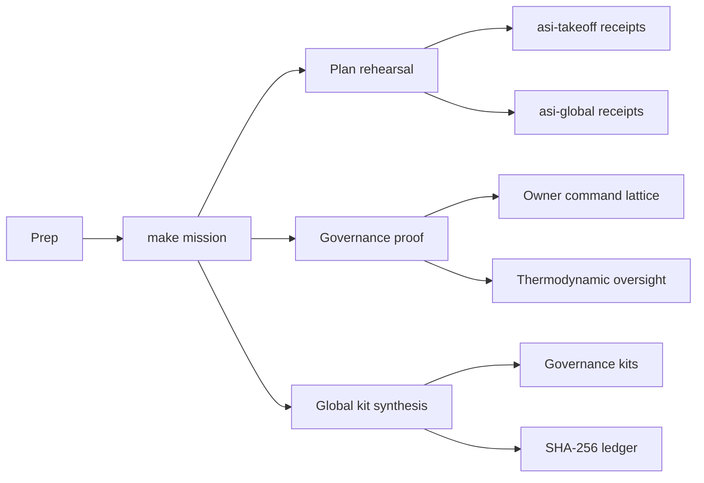

# Helios Omniversal Symphony — Operator Runbook

This runbook choreographs the Helios mission so operators, auditors, and regulators can reproduce the civilizational drill from laptop to mainnet without diverging from the repository's canonical tooling.

---

## 1. Pre-Flight Checklist

1. **Environment**
   - `nvm use` to pin Node.js 20.18.1 as required by the repository.【F:README.md†L18-L25】
   - Copy secrets: export RPC URLs, signer keys, and storage tokens expected by the existing demo pipelines (`asi-takeoff`, `asi-global`).【F:demo/asi-takeoff/README.md†L23-L49】【F:docs/asi-global-orchestrator-demo.md†L20-L40】
   - Verify Hardhat toolchain locks with `npm run ci:verify-toolchain` to pre-empt CI drift.【F:package.json†L52-L58】
2. **Identity posture**
   - Confirm ENS subdomains for every Helios actor are registered and pre-authorised (`*.agent.agi.eth`, `*.club.agi.eth`). Use `npm run identity:update -- --network <network>` if on-chain state has diverged.【F:README.md†L8-L17】【F:package.json†L118-L142】
3. **Token alignment**
   - Inspect `$AGIALPHA` metadata with `npm run verify:agialpha -- --rpc <RPC_URL>`; Helios runs hot only if decimals and symbol match the repo constants.【F:README.md†L26-L40】
4. **Thermodynamic baseline**
   - Snapshot the current policy envelope via `npx hardhat run --no-compile scripts/v2/thermodynamicsReport.ts --network <network> -- --out /tmp/thermo.md` and archive for post-run diffing.【F:package.json†L118-L158】【F:docs/thermodynamics-operations.md†L1-L120】

---

## 2. Launch Sequence

1. **Bootstrap** – `npm install && npm run docs:verify` to hydrate dependencies and ensure docs stay link-clean before the drill.【F:README.md†L18-L25】【F:package.json†L18-L64】
2. **Mission run** – `make -C demo/helios-omniversal-symphony mission NETWORK=<network>` executes plan, governance, kit, and digest phases in a single deterministic sweep (see [`Makefile`](./Makefile)).
3. **Artefact capture** – Inspect `reports/helios-omniversal-symphony/SHA256SUMS` to verify every emitted file matches its recorded hash before uploading to regulators or the CI artefact bucket.

---

## 3. Governance Proof Stack

1. `npm run owner:mission-control` renders the flight deck (control surface, plan, verification, dashboard) and bundles Markdown + JSON in `mission-control-bundle/` for auditors.【F:package.json†L18-L88】
2. `npm run owner:command-center` composes the multisig/timelock atlas, treasuries, thermostat controls, and risk annotations. The bundle is pushed into `owner/command-center-bundle/` for tamper-evident review.【F:package.json†L18-L88】
3. `npm run owner:parameters` exports the parameter matrix that maps every subsystem to the CLI commands capable of retuning it, anchoring Helios’ economic agility.【F:package.json†L18-L88】【F:scripts/v2/ownerParameterMatrix.ts†L288-L360】
4. `npm run owner:emergency` regenerates the emergency freeze/rotate runbook, keeping crisis controls laminated next to the mission artefacts.【F:docs/owner-control-emergency-runbook.md†L47-L167】
5. `npx hardhat run --no-compile scripts/v2/thermodynamicsReport.ts` archives the Gibbs envelope for agents, validators, operators, and employers, tying role-level economics to on-chain configuration.【F:README.md†L55-L83】【F:scripts/v2/thermodynamicsReport.ts†L120-L200】

All outputs land in `reports/helios-omniversal-symphony/owner/` for downstream notarisation.

---

## 4. Observability + Audit Trail

- **Mission Receipts** – `reports/helios-omniversal-symphony/asi-takeoff/` and `asi-global/` mirror the default demo layouts with raw receipts, logs, and governance kits, enabling long-horizon regression diffing.【F:demo/asi-takeoff/README.md†L67-L107】【F:docs/asi-global-orchestrator-demo.md†L20-L53】
- **Governance Digest** – `reports/helios-omniversal-symphony/owner/mission-control-bundle/manifest.json` lists every command invocation, log, checksum, and timestamp so CI can fail-fast when drift appears.
- **SHA-256 Ledger** – `reports/helios-omniversal-symphony/SHA256SUMS` is appended to the governance kit, giving reviewers a single file to re-hash when validating provenance.

---

## 5. Stress Tests & Recovery

1. **Pause drill** – Use `npm run owner:command-center -- --only pause` to rehearse a full SystemPause, then re-run `make ... mission` to confirm resumed operations regenerate identical artefacts except for timestamps.【F:package.json†L18-L88】【F:README.md†L40-L83】
2. **Thermostat swing** – Apply a temporary thermostat delta via `npx hardhat run scripts/v2/updateThermostat.ts --network <network>` and re-run the mission; diff `owner/thermodynamics.md` to ensure the change is captured end-to-end.【F:package.json†L118-L158】【F:docs/thermodynamics-operations.md†L42-L120】
3. **Identity recovery** – Simulate a lost ENS signer by temporarily removing it in `config/identity-registry.<network>.json`, running `npm run identity:update -- --network <network>`, and verifying the mission fails until the signer is restored, proving identity controls gate Helios execution.【F:README.md†L8-L17】【F:package.json†L118-L142】

---

## 6. CI Handoff

- Wire the `mission` target into a workflow job that depends on the existing `ci.yml` lint/test/foundry/coverage fan-out so Helios artefacts surface only after core checks pass.【F:README.md†L20-L37】【F:.github/workflows/ci.yml†L1-L120】
- Publish artefacts and SHA sums as job outputs; use branch protection to treat the Helios job as a required status, mirroring the CI v2 operations guide.【F:README.md†L20-L52】
- Encourage reviewers to load Mermaid diagrams directly from the Markdown bundles to validate governance wiring visually before sign-off.

Helios’ runbook keeps global coordination deterministic, reviewable, and ready for immediate redeployment.
