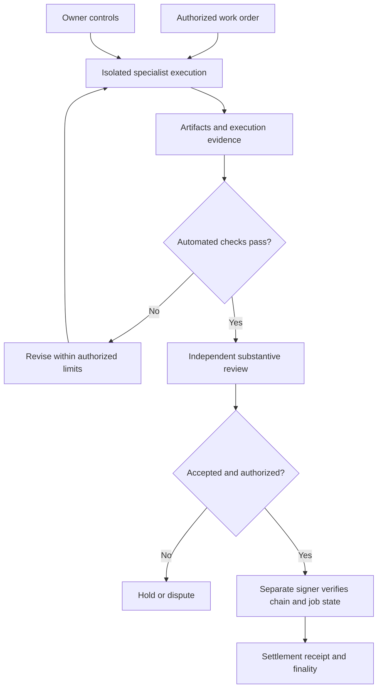

# Kardashev Business 3 — machine labor workbench

AGI Jobs is designed as a scalable machine labor layer for authorized, lawful screen-based work: specialized agents execute tasks, produce reviewable evidence, and support independent verification and settlement. This shared workbench connects all five Business 3 demos to that workflow while preserving their original simulation engines and diagrams.

**Start here:** [Open the website](https://montrealai.github.io/AGIJobsv0/experiments/kardashev-business/) after this change is deployed, or run the local command below. The website is an offline planner and artifact checker. It does not connect a wallet, dispatch a worker, or operate physical systems.

## Quick start

From the repository root with the repository-pinned Node version:

```sh
npm run demo:kardashev-business:serve
```

Open `http://127.0.0.1:4188`. Select one of ten workflows, download its work order, generate an energy-ledger example, or test a wrong answer. The local explorer and deterministic example require only Node's standard library. Stop the server with Ctrl+C. `PORT=4190` changes the viewer port; the synthetic tasks still carry the documented default origin and need no network access.

To produce and check actual local files:

```sh
mkdir -p reports/kardashev-business
npm run --silent demo:kardashev-business:plan -- task energy foundation > reports/kardashev-business/order.json
npm run --silent demo:kardashev-business:plan -- example foundation > reports/kardashev-business/evidence.json
npm run --silent demo:kardashev-business:plan -- review reports/kardashev-business/evidence.json foundation
```

The example produces `analysis.json` inside an evidence receipt. The checker verifies source/task/artifact hashes, exact byte counts, unique rows, all balances and the deficit set. It never grants production or settlement approval. A modified answer with a recalculated hash still fails arithmetic checking. A hash alone cannot authenticate the worker, reviewer, time of execution or economic provenance.

## Five preserved simulation engines

Use Python 3.12 from the repository root. Every command below is a bounded simulation; none invokes a live model or submits a transaction. Checkpoint and owner-control files belong to each engine. Prefer the isolated smoke command when comparing first runs without resuming old state.

| Engine | Launch | Focus |
| --- | --- | --- |
| Foundation | `python -m demo.kardashev_ii_omega_grade_alpha_agi_business_3 --max-cycles 3 --no-resume` | Resource ledger, recursive tasks |
| Business 3 | `python -m demo.kardashev_ii_omega_grade_alpha_agi_business_3_demo --cycles 3 --no-resume` | Integrity, worker health and validation windows |
| Omega | `python -m demo.kardashev_ii_omega_grade_alpha_agi_business_3_demo_omega --cycles 3 --duration 3` | Mission planning and operator graph |
| Supreme | `python -m demo.kardashev_ii_omega_grade_alpha_agi_business_3_demo_supreme --cycles 3 --no-resume --validator_commit_delay_seconds 1 --validator_reveal_delay_seconds 1` | Messaging, checkpointing and telemetry |
| Ultra | `python -m demo.kardashev_ii_omega_grade_alpha_agi_business_3_demo_ultra launch --cycles 3 --no-sim` | Mission archives and owner controls |

`npm run demo:kardashev-business:smoke` launches all five with temporary state and a per-process timeout. Foundation and Supreme now finish by default. Explicit zero-cycle options retain the documented indefinite mode; Omega also needs `--duration 0` to remove its time bound. Ultra's `--cycles 0` delegates to mission settings.

## Work that can be specified today

The ten templates cover performance optimization, software features, SDKs, test suites, AI evaluations, dashboards, product comparisons, technical documents, energy analysis and numerical reproduction. Each exports the existing `ComputerWorkTask` schema: exact inputs, a worker profile, an origin allowlist, acceptance criteria and named deliverables. All included exercises use synthetic, non-personal inputs. Authorized public or licensed inputs can be used in separately reviewed tasks.

These are reviewable task specifications, not proof that every model can complete every task. Text deliverables can contain source code and build instructions; this adapter currently accepts text, Markdown, CSV and JSON, not arbitrary Office binaries or screenshots. Store additional screen/action evidence separately under the deployment's access and retention controls, and bind it into the independent review record.

## Connect a qualified OpenClaw worker

Install repository dependencies using the pinned versions and lockfile before using the existing TypeScript adapter:

```sh
nvm install
nvm use
npm ci
npm run demo:kardashev-business:worker -- inspect energy foundation
```

For a downloaded or edited task file, use `npm run demo:kardashev-business:worker -- inspect-file /absolute/path/task.json`, then dispatch an independently admitted task with `npm run --silent demo:kardashev-business:worker -- run-file /absolute/path/task.json JOB_ID`. Editing any task field changes its admission digest. The included energy checker accepts only the exact bundled energy task; changed tasks need their own acceptance checks.

This inspection normalizes the task with `apps/orchestrator/computerWork.ts` and prints the exact digest. The workbench and adapter digest are cross-checked in tests for every template and family.

1. Provision an isolated worker environment and an OpenClaw agent named `kardashev-business`. Enable the documented Responses endpoint only after its authentication and network boundaries are configured. Use separate trust boundaries and credentials for unrelated operators. Do not put a signer or wallet seed in the worker.
2. Qualify required tools on that installation. OpenClaw browser automation, the OpenAI API computer-use loop and ChatGPT Work desktop Computer Use are distinct execution paths. A successful HTTP health check does not establish that a desktop session, app permission or browser action works. No direct ChatGPT Work bridge is implemented by this workbench.
3. Copy `worker-profiles.example.json` outside the public repository. Replace the deployment identifier with the selected chain/contract identity. Configure an absolute persistent journal directory and a bearer token in `COMPUTER_WORK_KARDASHEV_TOKEN`; the profile contains only the environment-variable name. Do not publish tokens or local profile files.
4. Configure runtime-enforced app/site/action allowlists, filesystem isolation, tool-step and wall-clock limits, provider budget limits, cancellation and consequential-action approvals. The task's origin list and instructions are not an OS sandbox. Adapter timeouts and output-token limits are not total-spend caps.
5. Admit the **actual job ID and exact normalized task digest** in the profile's `approvedJobs`. The shipped profile has an empty list and therefore cannot dispatch. Set `COMPUTER_WORK_PROFILES_FILE` to your private profile and `COMPUTER_WORK_STATE_DIR` to the persistent journal directory.
6. Run `npm run --silent demo:kardashev-business:worker -- run energy foundation JOB_ID` and save stdout as a private receipt. This is a real provider dispatch only when your admitted live profile is configured. It is not authorized by selecting a workflow on the website.
7. Check the energy receipt with the CLI or browser, then obtain independent substantive review. For other templates, implement and run task-specific checks and independent review; the energy checker deliberately rejects their receipts.

The shared adapter binds dispatch to job ID plus task hash, uses an exclusive persistent journal, enforces response/time limits, and returns `productionApproved: false` and `settlementApproved: false`. On timeout or interrupted execution, preserve the journal and reconcile with the worker. Do not delete replay records or blindly retry an outcome that is unknown. Stopping the client does not prove the remote worker stopped: use the worker's cancellation control and verify its state.

## Review and settlement boundary



The Python engines' synthetic token balances, simulated validators and toy planetary metrics remain simulation units. They are not live USDC flows. For real settlement, verify the actual deployed manager's chain, contract, token address/decimals, job state, acceptance rules and finality. No settlement adapter is added or silently enabled by this change.

## Vision and honest capacity accounting

The website connects verifiable digital production to potential reinvestment in research, tools, compute and energy infrastructure. Kardashev Type II is a long-term civilizational ambition, not an attained capability, a deployment certification or a prediction.

The **$40 trillion/year** screen-work market is a user-supplied scenario assumption. **$40 billion/year** is the first major volume milestone and equals **0.1%** of that assumption. Neither figure is validated revenue. The explorer uses:

- Worker capacity = agents × jobs/agent/day × useful-output fraction.
- Review capacity = reviewer hours/day × 60 ÷ minutes/job.
- Reviewable throughput = minimum of worker capacity, review capacity and the chosen market ceiling divided by assumed job value.
- Illustrative annual gross volume = throughput × 365 × average USDC value, assuming $1/USDC.

Costs, demand validation, retries, disputes, variable utilization and taxes are excluded. Physical deployment would require separate engineering, permissions, resources and real-world evidence.

## Qualification and verification

```sh
npm run demo:kardashev-business:test
npm run demo:kardashev-business:smoke
npm run demo:kardashev-business:qa
```

The last command requires the repository Playwright/axe dependencies and Chromium (`npx playwright install chromium`). It checks desktop/mobile layouts, keyboard access, task downloads, imported evidence, deliberate corruption and accessibility. The Pages pipeline publishes the same local assets at `experiments/kardashev-business/`.

Production operation additionally needs representative live-provider and desktop/browser commissioning, prompt-injection and permissions tests, independently reviewed paid pilots, durable recovery, monitoring, cancellation and a verified settlement integration. Passing local tests cannot establish those outcomes. No live provider, real Mac, unrelated reviewer or paid settlement is claimed by this suite.

## Current provider references

Documentation checked 2026-10-06:

- [ChatGPT Work Computer Use](https://learn.chatgpt.com/docs/computer-use): supported desktop app interaction and app permissions.
- [OpenAI API computer use](https://developers.openai.com/api/docs/guides/tools-computer-use): runtime execution, screenshots and bounded tool loops.
- [OpenClaw browser tools](https://docs.openclaw.ai/tools/browser), [OpenAI provider](https://docs.openclaw.ai/providers/openai), and [security](https://docs.openclaw.ai/gateway/security): verify installed capabilities, authentication and gateway trust boundaries.
