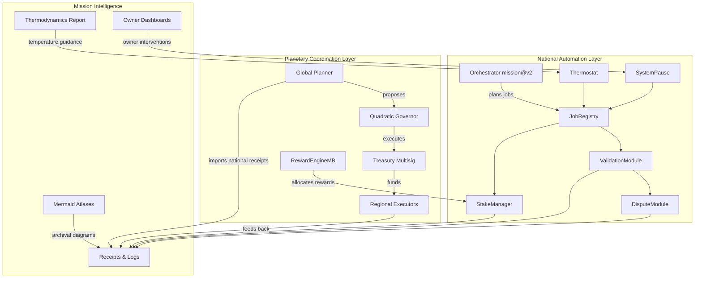
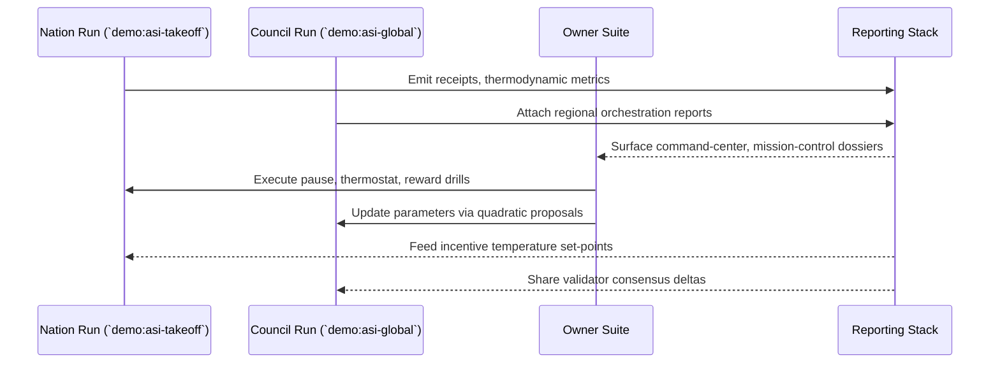

# OmniSovereign Coordination Demo

The **OmniSovereign** dossier shows how AGI Jobs v0 (v2) can be choreographed into a
borderless coordination system that interleaves national take-off drills, planetary
planning, and owner-grade controls without introducing any new code paths.  It stitches
together the deterministic tooling that already ships in this repository—`demo:asi-takeoff`,
`demo:asi-global`, the owner command suite, and the thermodynamic reporting stack—to
present a first-class, CI-ready showcase of a fully automatable economic nervous system.

Key capabilities:

- **Stacked orchestration.** Compose the national `asi-takeoff` drill with the planetary
  `asi-global` planner to render a single governance dossier covering cities, regions,
  and transnational logistics.
- **Owner primacy.** The entire workflow is anchored in the existing owner runbooks:
  Command Center, Mission Control, Parameter Matrix, Diagram Generator, and Pause tests.
- **Economic clarity.** Uses only the built-in thermodynamic and receipt exporters so
every role share, entropy change, and validator handshake is captured as reproducible
artefacts that auditors can re-run in CI.
- **Interoperable governance.** Demonstrates how quadratic voting outputs, thermostat
temperature shifts, and SystemPause drills are braided across jurisdictions while
staying within the repository's proven scripts.

---

## Quickstart

This demo deliberately reuses the official pipelines.  The commands below assume a local
Hardhat/Anvil environment; swap `--network` flags or RPC URLs as needed when running
against other supported chains.

1. **Bootstrap the sovereign substrate** — stand up the national automation loop and
   capture receipts:
   ```bash
   cp demo/asi-takeoff/env.example .env
   npm run demo:asi-takeoff:local
   ```
2. **Extend to planetary coordination** — execute the deterministic global drill to
   enrich the artefact set with regional orchestration signals:
   ```bash
   npm run demo:asi-global
   ```
3. **Regenerate composite governance kits** — package both runs into a unified dossier
   for publication or CI verification:
   ```bash
   npm run demo:asi-takeoff:kit -- \
     --report-root reports/localhost/asi-takeoff \
     --plan demo/omnisovereign/project-plan.omnisovereign.json \
     --summary-md reports/localhost/asi-takeoff/asi-takeoff-report.md \
     --bundle reports/localhost/asi-takeoff/receipts

   npm run demo:asi-global:kit -- \
     --report-root reports/asi-global \
     --plan demo/omnisovereign/project-plan.omnisovereign.json \
     --summary-md reports/asi-global/asi-global-report.md \
     --bundle reports/asi-global/receipts
   ```
4. **Render owner dashboards** — confirm control over the blended mission via the
   existing owner surface area:
   ```bash
   AURORA_DEPLOY_OUTPUT=reports/localhost/asi-takeoff/receipts/deploy.json \
   RPC_URL=http://127.0.0.1:8545 CHAIN_ID=31337 \
   npm run owner:command-center -- --network localhost --format markdown

   npm run owner:mission-control -- --network localhost --format markdown
   npm run owner:parameters -- --network localhost --format markdown
   npm run owner:diagram -- --network localhost --out reports/localhost/asi-takeoff/owner.mmd
   ```
5. **Thermodynamic synthesis** — align the incentive envelope across national and global
   layers:
   ```bash
   npm run thermodynamics:report -- --plan demo/omnisovereign/project-plan.omnisovereign.json \
     --report-root reports/localhost/asi-takeoff
   ```

Artefacts of interest:

- `reports/localhost/asi-takeoff/receipts/` — nation-scale job lifecycle, stakes,
  disputes, and governance drills.
- `reports/asi-global/receipts/` — regional expansion telemetry from the planetary run.
- `reports/localhost/asi-takeoff/owner.mmd` — deterministic owner wiring diagram.
- `reports/asi-global/governance-kit.{json,md}` — merged planetary mission dossier.
- `demo/omnisovereign/project-plan.omnisovereign.json` — shared plan of record binding
  both layers.

---

## System Constellation



---

## Lifecycle Narrative



---

## Operating Model

- **Single source plan.** The mission blueprint is captured in
  [`project-plan.omnisovereign.json`](./project-plan.omnisovereign.json), reusing the
  schema applied by `demo/asi-takeoff` and `demo/asi-global` while extending it to handle
  global-economic choreography.
- **Reproducibility.** Every command above already ships with the repository; CI can
  orchestrate them with zero bespoke glue code.
- **Owner guardrails.** All escalation paths (pause, thermostat, reward tuning, command
  center) are exercised using `npm run owner:*` scripts.
- **Audit posture.** Mission reports, kits, and Mermaid diagrams inherit SHA-256
  fingerprints from the existing demo scripts, making the composite dossier suitable for
  public attestations.

Consult [`RUNBOOK.md`](./RUNBOOK.md) for the deterministic drill, operator validation
steps, and governance escalation procedures.
