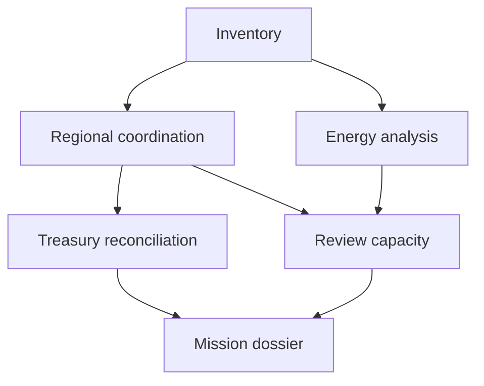
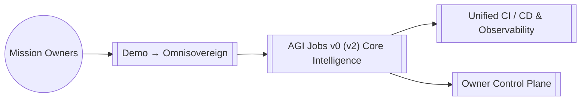

# OmniSovereign — verified coordination for useful machine labor

OmniSovereign coordinates authorized, lawful screen-based work across city, regional and planetary planning layers. The dedicated rehearsal now executes all **six original coordination stages**, writes concrete artifacts, and independently checks their contents. Its website connects useful digital work to the long-term engineering ambition of a Kardashev Type II civilization.

**Start here:** the offline rehearsal needs only the repository’s [pinned Node version](../../.nvmrc). It does not require dependency installation, a wallet, a model account or private inputs.

```bash
npm run demo:omnisovereign
npm run demo:omnisovereign:serve
```

Open **http://127.0.0.1:4190/** or the [published coordination console](https://montrealai.github.io/AGIJobsv0/experiments/omnisovereign/). Run the six-stage rehearsal, inspect artifacts, download work orders, import evidence, and test a wrong answer whose hash has been recalculated. The terminal writes a fresh directory beneath `reports/omnisovereign/`; it refuses to overwrite an existing run. Ctrl+C stops the local viewer.

## What runs, and what remains a scenario

| Surface | What it establishes |
| --- | --- |
| Dedicated rehearsal and browser console | Six actual deterministic coordination analyses over synthetic inputs, with exact arithmetic and an independently implemented checker |
| Six customer work briefs | Useful planned deliverables in software, dashboards, scientific reproduction, SDKs, agent evaluations and executable documentation; these underlying customer jobs are not executed by the rehearsal |
| Admitted OpenClaw worker | Existing Responses adapter, exact job/task admission, bounded text artifacts and persistent replay protection; live commissioning is separate |
| ChatGPT Work session | Operator-led computer work that can return candidate files; no remote ChatGPT Work dispatch API is assumed |
| National and planetary contract drills | Existing disposable local-chain job lifecycles and mock-token transactions; they do not execute this six-stage scenario or implement USDC settlement |
| Original project plan | Preserved conceptual AGIALPHA budget, identities, dependencies and governance vision; placeholder addresses and handles are not verified deployments |

No rehearsal output authorizes payment, establishes provider provenance, operates infrastructure, or asserts that all human computer work is reliably automated. The viewer contains no provider-dispatch or transaction-signing endpoint.

## Six stages, six reviewable artifacts

| Original stage | Concrete analysis | Artifact |
| --- | --- | --- |
| `SOV-INGEST-NATIONAL` | Complete work inventory and exact reward/cost totals | `national-inventory.json` |
| `SOV-CASCADE-REGIONAL` | Region coverage, planned rewards and reviewer shortfalls | `regional-allocation.json` |
| `SOV-HARMONISE-TREASURY` | Budget, unallocated reserve and reserve adequacy | `treasury-reconciliation.json` |
| `SOV-THERMO-ALIGN` | Generation, demand, energy balances and deficit regions | `energy-analysis.json` |
| `SOV-VALIDATOR-FUSION` | Region-specific greedy review admission in source order | `review-capacity.json` |
| `SOV-PUBLIC-DOSSIER` | Complete cross-stage coordination dossier | `mission-dossier.json` |

The original dependency graph is retained exactly. The synthetic [source](scenario.json) defines six planned work briefs, a **40,000 USDC** budget, **23,500 USDC** in planned rewards, **3,330 USDC** of estimated provider costs and a **16,500 USDC** unallocated reserve. Provider costs are shown separately; they are not added to employer reward obligations or described as paid revenue. Money uses integer millionths, with decimal-string inputs and six-place outputs.

The energy analysis identifies a **60 MWh deficit**. It assumes no transfer capacity and does not represent a physical grid. Regional review budgets total 80 minutes against 90 requested minutes. Because jobs are indivisible and each region has its own reviewer limit, the source-order policy admits three briefs using 47 minutes and defers three requiring 43 minutes. A different scheduling policy needs a separately defined acceptance contract.


```mermaid
flowchart TD
    I["Inventory"] --> C["Regional coordination"]
    I --> E["Energy analysis"]
    C --> T["Treasury reconciliation"]
    C --> V["Review capacity"]
    E --> V
    T --> D["Mission dossier"]
    V --> D
```

## Evidence, replay and independent review

Each run writes six candidate artifacts, six task files, `scenario.json`, `evidence.json`, `review.json` and `report.md`. The final evidence file is written last: a directory without it is incomplete. The CLI review compares the embedded artifact bytes with the bundled source and stage contracts; exported sibling files are convenience copies, not inputs to that bundle check.

```bash
node demo/omnisovereign/cli.mjs review /absolute/path/to/evidence.json
node demo/omnisovereign/cli.mjs inspect SOV-THERMO-ALIGN
npm run demo:omnisovereign:task -- SOV-THERMO-ALIGN > energy.task.json
```

Successful artifact checks return `accepted: true`, `productionApproved: false`, `settlementApproved: false`, and `providerExecution: "not assessed"`. The checker binds the source, task and dependency graph, validates exact artifact names, sizes and hashes, and independently recomputes contents. It rejects omitted jobs, changed budgets, false energy claims, altered review admission and payment claims even when an attacker recalculates hashes. The reviewer does not import the producer.

An unsigned JSON receipt can be fabricated. Hashes and deterministic arithmetic do not establish author identity, real application effects or independent human judgment. Use the protected dispatch journal, unrelated substantive review, contract lifecycle and finality evidence before accepting paid work. Input files are bounded to 1 MiB, must be regular UTF-8 JSON, and are never executed or extracted.

## Computer work using current tooling

Current capabilities were checked against primary documentation on **2026-10-06**:

- [OpenAI API computer use](https://developers.openai.com/api/docs/guides/tools-computer-use) supports a runtime-provided environment with observations and permitted UI actions. Its current guidance recommends code execution for GPT-6 Astra and retains the structured computer tool. Session isolation, action limits, actual outcome checks and approval rules belong in the runtime.
- [ChatGPT Work Computer Use](https://learn.chatgpt.com/docs/computer-use) can operate approved desktop apps on supported macOS and Windows installations. Availability and permissions depend on the environment. Use an operator-led session for this task and review returned artifacts.
- [OpenClaw computer use](https://docs.openclaw.ai/nodes/computer-use) exposes provider capabilities through its computer tool. Commission the actual host, permissions, tool policy and desktop observations; a running gateway alone does not prove usable desktop control.
- [OpenClaw OpenResponses](https://docs.openclaw.ai/gateway/openresponses-http-api) is the existing repository adapter route. Enable it deliberately, protect its bearer credential, and verify the selected agent. Apply [sandboxing and tool policy](https://docs.openclaw.ai/gateway/sandboxing) in the actual worker environment.

The supported inline deliverables here are JSON/text. Screenshots and binary Office documents require separately commissioned artifact storage and verification. The broad labor vision also includes research, documents, spreadsheets, software, testing and business-application work using public non-personal, appropriately licensed or synthetic inputs. Capability and reliability must be measured per workflow.

Follow the [operator runbook](RUNBOOK.md) for exact task admission, receipt checking, runtime limits, interruption handling, identity and signer separation. The shipped [worker profile](worker-profiles.example.json) admits **zero jobs**. No credential or live provider is needed to explore the demo.

## Economic and civilization-scale horizon

The website treats **$40 trillion/year** as the project’s market-planning assumption and **$40 billion/year** as its first major volume milestone (0.1% of that assumption). Neither is a verified TAM, forecast or measured adoption claim. The calculator limits potential accepted volume by useful worker output, independent reviewer capacity and the chosen market ceiling. It assumes 365 operating days and $1 per USDC; disputes, recovery, costs and customer acquisition are not modeled.

The practical sequence is useful digital deliverables, independently accepted economic outcomes, expanded research and engineering capability, and separately authorized investment in physical infrastructure. A Kardashev Type II civilization remains a long-term ambition. The software does not establish stellar-scale energy capture, institutional authority, physical execution or guaranteed wealth.

## Retained systems map


```mermaid
flowchart LR
    Operators((Mission Owners)) --> demo_omnisovereign[[Demo → Omnisovereign]]
    demo_omnisovereign --> Core[["AGI Jobs v0 (v2) Core Intelligence"]]
    Core --> Observability[[Unified CI / CD & Observability]]
    Core --> Governance[[Owner Control Plane]]
```

The [original plan](project-plan.omnisovereign.json), including all six stage identities and its three planning layers, remains unchanged. Its AGIALPHA amounts are not converted into the new USDC planning exercise. Its `deadlineDays`, thermodynamic parameters, governance labels and identity handles remain conceptual inputs, not runtime grants or performance evidence. The [runbook](RUNBOOK.md) preserves the national, planetary, owner-control, thermodynamics and validator pathways with corrected operating boundaries.

## Validation and production qualification

```bash
npm ci
npm run demo:omnisovereign:test
npx playwright install chromium
npm run demo:omnisovereign:qa
```

Tests cover the complete dependency graph, exact monetary boundaries, invalid inputs, wrong artifacts with repaired hashes, safe output handling, local-server restrictions, all six real-adapter task digests and admitted loopback fixture dispatches, receipt binding and replay rejection. Browser QA covers desktop/mobile, keyboard navigation, task/evidence downloads, imports, failure states and automated accessibility checks. All static assets are bundled for GitHub Pages.

Production qualification additionally requires recorded worker/tool/model versions, isolated accounts, actual action and spending limits, prompt-injection and stop/recovery exercises, protected journals, independent reviewers, verified identity/contract configuration and a separately authorized settlement signer. No live worker soak, unrelated reviewer acceptance, real payment, security audit or physical deployment is claimed by this release. Required CI must pass on the exact PR head before merge.
