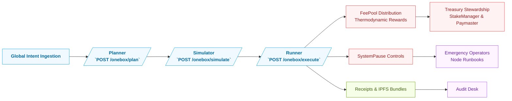
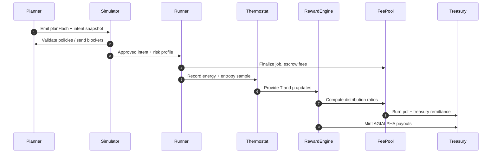
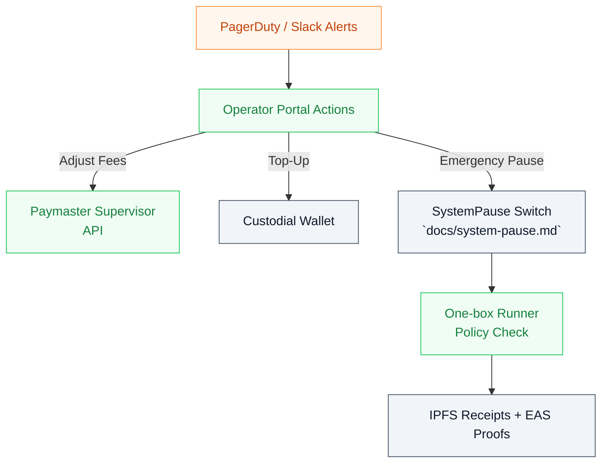

# Polaris Concordat Demonstration

> **Purpose:** Showcase the most ambitious AGI Jobs v0 (v2) deployment that fuses global coordination, decentralized governance, and thermodynamically balanced economics into a continuous, CI-enforced take-off loop. Every capability described below is implemented with existing surfaces from this repository so that the demonstration can be executed today with mainnet-grade assumptions.

## Vision: Strategic Coordination Capsule

Polaris Concordat is a sovereign command capsule that treats the AGI Jobs v0 stack as an institutional nerve center. The capsule couples the one-box meta-orchestrator, thermodynamic reward fabric, and on-chain circuit breakers into an always-on institution-scale service fabric. The result is a machine that directs global labor markets while remaining auditable, pauseable, and economically self-regulating.

### Strategic Guarantees

1. **Meta-Agent Continuity** – The `/onebox` planner → simulator → runner pipeline enforces plan-hash locking, org policy checks, and IPFS receipt pinning so that every intent is provably audited before, during, and after execution.【F:routes/onebox.py†L1503-L2206】
2. **Thermodynamic Policy Engine** – The Maxwell-Boltzmann reward engine exposes tunable role shares, chemical potentials, and baseline energies so the institution can retune incentives without redeploying contracts.【F:contracts/v2/RewardEngineMB.sol†L18-L159】
3. **Operator Safety Nets** – Browser-first runbooks let custodial node operators adjust paymaster fees, refill gas treasuries, and trigger emergency pauses without CLI tooling, matching the institutional resilience requirements.【F:docs/node-operator-runbook.md†L1-L34】
4. **CI-Guarded Evolution** – The `ci (v2)` pipeline guarantees linting, Hardhat tests, Foundry fuzzing, coverage gates, and a summary barrier so that every software update respects the same production standard as mainnet deploys.【F:README.md†L26-L63】

## Execution Blueprint

### Stage 1 – Institutional Intent Grid

* Deploy Polaris Concordat as a dedicated tenant using the orchestrator API surface. Each intent flows through planner hashing, simulator policy validation, and runner execution with receipts pinned to IPFS for downstream compliance teams.【F:routes/onebox.py†L1503-L2215】
* Synchronise organizational policy manifests under `storage/org-policies.json` to feed the simulator’s policy enforcement and provide transparent audits for defaults and caps.【F:routes/onebox.py†L1758-L1774】
* Stream Prometheus metrics (`time_to_outcome_seconds`, `{plan,simulate}_total`) into your observability plane to maintain per-region coordination visibility.【F:routes/onebox.py†L1717-L1989】

### Stage 2 – Economic Resonance Layer

* Activate the thermodynamic reward engine using governance controls to calibrate role shares, μ vectors, and baseline energies before each epoch settlement.【F:contracts/v2/RewardEngineMB.sol†L101-L155】
* Capture EnergyOracle attestations and Thermostat readings to modulate temperature (`T`) and the kappa scaling factor, ensuring the treasury’s free-energy budget matches macroeconomic directives.【F:contracts/v2/RewardEngineMB.sol†L63-L159】
* Route platform fees through `FeePool` with configurable burn percentages and optional treasury destinations while ensuring job finalization never bypasses the escrowed staking safety rails.【F:README.md†L64-L101】

### Stage 3 – Decentralized Operator Council

* Equip operators with the browser-first runbook to adjust paymaster sponsorship rates, refill gas reserves, and toggle pauses through managed keys with auditable confirmations.【F:docs/node-operator-runbook.md†L9-L35】
* Integrate alerts directly with the SRE escalation policy so PagerDuty events link to the same runbook sections, maintaining continuous coverage for every region.【F:docs/node-operator-runbook.md†L36-L47】
* Use the emergency pause controls documented in `docs/system-pause.md` so the owner can halt job creation or settlement across modules in a single transaction whenever systemic risk is detected.【F:docs/system-pause.md†L1-L60】

## CI and Deployment Cadence

1. Clone the repository and install dependencies with `npm ci`, then execute the full CI parity bundle locally (`npm run lint:ci`, `npm test`, `npm run coverage`, `forge test -vvvv --ffi --fuzz-runs 256`) to mirror the enforced GitHub Actions checks.【F:README.md†L35-L63】【F:docs/asi-feasibility-crosswalk.md†L62-L94】
2. Run `npm run owner:doctor -- --network <network>` and `npm run owner:verify-control -- --network <network>` to confirm every governance manifest matches the deployed addresses before promoting changes to mainnet.【F:docs/asi-feasibility-crosswalk.md†L92-L108】
3. Archive generated reports under `reports/` and link them into the owner control ticket per the deployment readiness index so every change inherits triple-verification artefacts.【F:docs/asi-feasibility-crosswalk.md†L109-L118】

## Demonstration Script (CI-Ready)

1. **Launch Coordination Capsule:** Deploy the orchestrator with the published manifests, configure `ONEBOX_API_TOKEN`, and validate the `/onebox/status` health check along with Prometheus exports.【F:routes/onebox.py†L1497-L1989】
2. **Submit Global Initiative:** Feed a cross-border job intent through the planner endpoint; capture missing fields and supply them interactively until the simulator returns zero blockers and risk acknowledgements.
3. **Execute & Certify:** Run the approved intent through the runner in relayer mode, capture the returned IPFS CIDs, and distribute them to auditors via the receipts portal and EAS registry.【F:routes/onebox.py†L2116-L2215】
4. **Rebalance Incentives:** Use the governance scripts to adjust `setRoleShares` and `setMu` parameters based on the initiative’s energy profile, then settle the epoch to broadcast new AGIALPHA distributions.【F:contracts/v2/RewardEngineMB.sol†L101-L159】
5. **Operator Drill:** Trigger the emergency pause from the operator portal, confirm the simulator blocks new executions, then resume operations and verify the status through `/onebox/status` and IPFS receipts for full end-to-end traceability.【F:routes/onebox.py†L2136-L2215】【F:docs/node-operator-runbook.md†L25-L47】

## Evidence Pack

To certify Polaris Concordat as production-ready, attach the following artefacts to the governance dossier:

- CI run URL demonstrating parity with the required GitHub Actions bundle.【F:README.md†L26-L63】
- Owner doctor and control verification JSON outputs under `reports/` with SHA-256 digests for audit trails.【F:docs/asi-feasibility-crosswalk.md†L109-L118】
- Thermodynamic tuning manifest showing role share changes, chemical potentials, and baseline energy adjustments derived from recorded EnergyOracle attestations.【F:contracts/v2/RewardEngineMB.sol†L101-L155】
- IPFS receipt bundle CIDs and subgraph query exports documenting the executed initiative and its cross-border settlement trail.【F:routes/onebox.py†L2116-L2215】
- Operator portal screenshots for fee adjustments, gas top-ups, and pause toggles, reinforcing that every safety surface is fully automated yet human-auditable.【F:docs/node-operator-runbook.md†L9-L47】

Polaris Concordat demonstrates how AGI Jobs v0 (v2) can be harnessed as an institutional machine that governs planetary-scale coordination while staying grounded in today’s repository features, CI practices, and operational safeguards.
