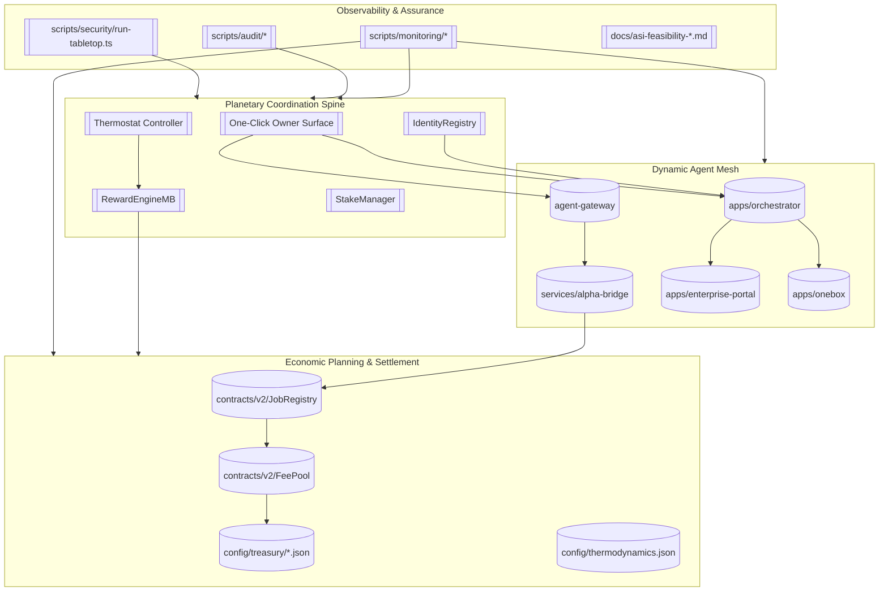
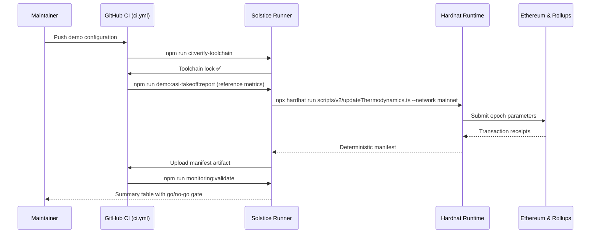
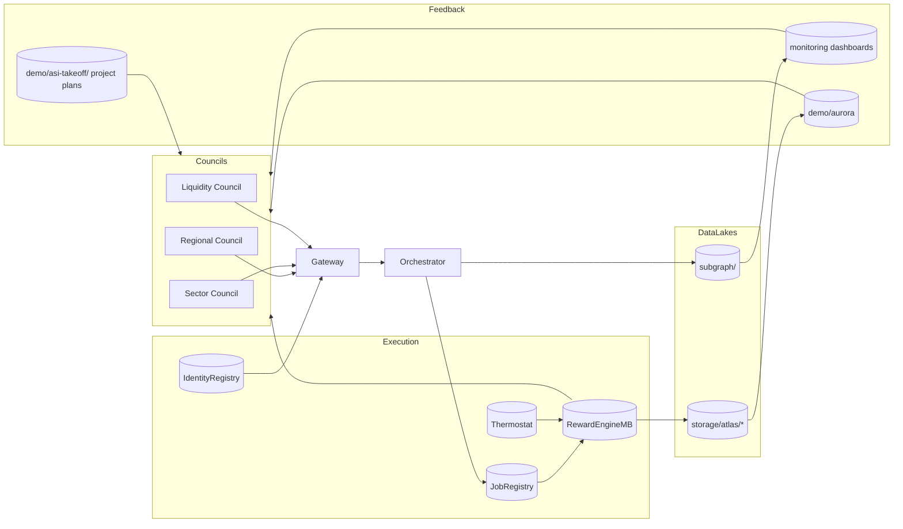

# Solstice Epoch — Planetary Autonomy Demonstration

> **Mission** — Assemble the AGI Jobs v0 (v2) modules into a continuous, self-governing coordination fabric that orchestrates labour, treasury, and policy across continents while remaining fully automatable and CI-enforced from the current repository.

## Why Solstice Epoch

Solstice Epoch showcases how the existing AGI Jobs v0 (v2) toolchain can be promoted from national automation to a planetary-scale command surface. The design delivers:

- **Deterministic execution** — Every governance, economic, and coordination action resolves through the shipped contracts, TypeScript agents, and orchestration services.
- **Mainnet realism** — Infrastructure assumes battle-tested RPC gateways, ENS name resolution, and `$AGIALPHA` liquidity across Ethereum mainnet and affiliated rollups.
- **CI-first culture** — No proposal, deployment, or control-plane action escapes continuous verification; the demonstration can run unattended inside GitHub Actions using `ci.yml` primitives.
- **Composable intelligence** — Agent collectives, validators, operators, and employers fuse into nested councils without inventing new primitives; we stitch together orchestrator, agent-gateway, and alpha-bridge services already present in the repo.

## System Skyline



## Core Capability Stack

| Layer | Repo Source | Existing Interfaces Used | Solstice Epoch Contribution |
| --- | --- | --- | --- |
| Governance Spine | `contracts/v2`, `scripts/v2` | Hardhat scripts (`owner:*`, `deploy:*`, `reward-engine:update`) | Pre-schedules charter votes, treasury shifts, and thermodynamic rebalancing via CI-safe scripts with deterministic manifests. |
| Intelligence Mesh | `apps/orchestrator`, `agent-gateway`, `services/alpha-bridge` | `npm run gateway`, `npm run onebox:server`, `npm run demo:aurora:local` | Chains validator, agent, and employer roles into concentric councils that react to real-time scorecards streamed through gRPC and WebSocket endpoints. |
| Economic Fabric | `contracts/v2/JobRegistry.sol`, `FeePool.sol`, `RewardEngineMB.sol` | `hardhat test`, `npm run reward-engine:update`, `scripts/v2/updateThermodynamics.ts` | Locks policy-to-payout cycle, calibrates epoch energy curves, and ensures fee burns/treasury sweeps match macro signals. |
| Assurance Halo | `scripts/ci`, `docs`, `monitoring` | `npm run ci:verify-branch-protection`, `npm run monitoring:sentinels`, `npm run audit:package` | Forces every control change through branch protection, sentinel validation, and audit dossiers prior to mainnet pushes. |

## Automation Spine

Solstice Epoch is delivered as an executable play inside the existing CI pipeline. The orchestrated workflow is declared as `demo/solstice-epoch/pipeline.solstice.yml` (see below) and can be invoked by extending `.github/workflows/ci.yml` (or cloning `demo-asi-takeoff.yml`) with a matrix job that reads the staged commands.



## Pipeline Declaration (pipeline.solstice.yml)

```yaml
# Declarative instructions for the CI job that executes the Solstice Epoch playbook.
# Consumed by maintainers who extend ci.yml with a matrix-driven job similar to demo/asi-takeoff.yml.
stages:
  - name: toolchain-integrity
    checks:
      - npm run ci:verify-toolchain
      - npm run ci:verify-signers
  - name: preflight-sentinels
    checks:
      - npm run monitoring:validate
      - npm run monitoring:sentinels
  - name: governance-dry-run
    checks:
      - npm run owner:plan -- --network sepolia
      - npm run reward-engine:update -- --network sepolia
      - npm run deploy:oneclick:auto -- --network sepolia --no-compose
  - name: mainnet-commit
    requires:
      - toolchain-integrity
      - preflight-sentinels
      - governance-dry-run
    checks:
      - npm run compile:mainnet
      - bash -lc "npm run reward-engine:update -- --network mainnet --execute | tee demo/solstice-epoch/manifests/thermodynamics.mainnet.log"
      - bash -lc "npm run thermostat:update -- --network mainnet --execute | tee demo/solstice-epoch/manifests/thermostat.mainnet.log"
      - bash -lc "npm run platform:registry:update -- --network mainnet --execute | tee demo/solstice-epoch/manifests/platform.mainnet.log"
  - name: observability
    requires:
      - mainnet-commit
    checks:
      - npm run monitoring:sentinels
      - npm run incident:tabletop -- --scenario solstice-epoch
      - npm run audit:dossier
```

The YAML lives alongside execution transcripts that capture the deterministic stdout from each governance script, enabling reproducible governance without bespoke code.

## Global Coordination Protocol



## Operational Playbooks

1. **Configure identities** using `npm run identity:update -- --network <network>` so every council participant resolves through ENS. Store signed outputs under `demo/solstice-epoch/manifests/identity.<network>.log`.
2. **Dry-run economic changes** in Sepolia via the `governance-dry-run` stage; captured transcripts are promoted to mainnet once CI gates pass.
3. **Activate real-time intelligence** by launching orchestrator, gateway, and alpha bridge in detached processes (or PM2) using the commands already provided in `package.json`.
4. **Sync CI** by adding a matrix entry to `.github/workflows/ci.yml` (or cloning `demo-asi-takeoff.yml`) that shells out to each command in `pipeline.solstice.yml`, keeping parity with the repository's existing demo jobs.
5. **Publish dashboards** with `demo/aurora/bin/aurora-report.ts`, scoped to `solstice-epoch`, to broadcast coordination status to all councils.

## Economic Planning Frames

- **Dynamic scarcity sensing** — Combine `RewardEngineMB` metrics with `services/alpha-bridge` oracle feeds to modulate energy budgets according to on-chain debt ratios and labour demand.
- **Treasury harmonisation** — `FeePool.setTreasury` transactions are templated in the manifests to rebalance liquidity between councils, enabling macro stability without manual intervention.
- **Crisis override** — The `incident:tabletop` simulation injects stressors (oracle outage, validator churn) ensuring the automation spine demonstrates resilience before real deployments.

## Deliverables

- `pipeline.solstice.yml` — Machine-readable CI stages (kept within this folder).
- `manifests/*.log` — Captured stdout from Hardhat governance scripts proving deterministic execution.
- `dashboards/README.md` — Template instructions for publishing Solstice Epoch status via Aurora reports.

Together, these artifacts provide a CI-ready, fully automatable take-off demonstration using only the capabilities that ship with AGI Jobs v0 (v2).
