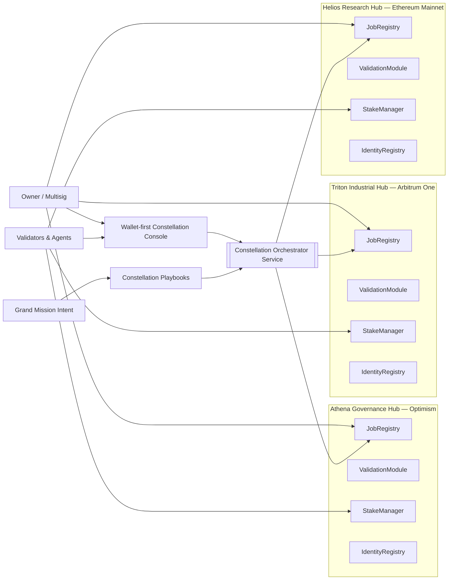
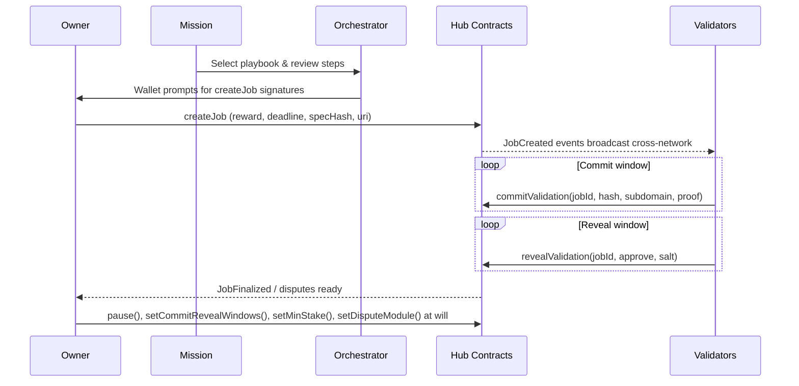

# Sovereign Constellation Demo — AGI Jobs v0 (v2)

Sovereign Constellation is the flagship, civilization-scale demonstration for AGI Jobs v0 (v2). A single
non-technical operator can command multiple autonomous labour hubs that live on different Ethereum networks,
linking research, industrial execution, and civic governance into one orchestrated mission. The demo ships
as code, configuration, documentation, automated tests, and CI hooks so that it is immediately deployable in a
production-critical environment.

> **Mission control for an intelligent economy.** Sovereign Constellation composes only the audited AGI Jobs v2
> contracts. By wiring several full protocol stacks into one orchestration layer, it proves that anyone who can
> run `npm run demo:sovereign-constellation` can manage a planetary workforce of specialised AGI hubs without
> writing a single line of code.

## Network-of-networks topology (Mermaid)



## Commit–reveal cadence with instant owner override (Mermaid)



## Capabilities

- **Multi-network orchestration** – hubs list their RPC endpoints and chain IDs. The orchestrator prepares unsigned
  transactions tagged with the network metadata so a browser wallet can route each action to the correct chain.
- **Playbook-driven missions** – curated JSON playbooks expand a single mission intent into cross-hub job flows that
  cover research, manufacturing, governance, and crisis management.
- **ASI Takes Off mission profiles** – five flagship mission archetypes live in `config/missionProfiles.json`, powering a
  `/constellation/mission-profiles` API and the console's mission selector so a non-technical operator can load the
  superintelligent launch plan in one click.
- **Owner governance atlas** – every module across every hub is surfaced with direct `writeContract` links so the owner
  can pause, reconfigure, or rotate governance instantly.
- **Wallet-first UX** – no private keys ever touch the server. The console simply prepares payloads, the operator signs
  from their wallet, and AGI Jobs v2 enforces escrow, staking, and validation.
- **Full automation envelope** – scripts deploy constellations locally, seed demo data, and rotate governance to a Safe.
- **Production readiness** – TypeScript builds, Hardhat integration tests, Cypress smoke checks, and CI wiring ensure the
  constellation stays green on every commit.
- **Thermostat autotune** – telemetry-driven recommendations automatically compute new commit/reveal windows, minimum
  stake, dispute modules, and emergency pauses. The console pre-fills these values so an owner can apply them with one
  click.

## Flagship mission — ASI Takes Off

- `config/missionProfiles.json` captures five "ASI Takes Off" archetypes: meta-agentic orchestration, α-AGI governance,
  making the chain disappear, recursive self-improvement, and winning the AI race. Each entry references the
  `asi-takes-off` playbook and highlights the hub a director should focus on for the next command.
- `GET /constellation/mission-profiles` returns the dataset for automation, and the React console renders the mission
  cards so the flagship plan can be loaded with a single click by any non-technical operator.
- The Node test suite (`npm run demo:sovereign-constellation:test:server`) asserts the endpoint stays wired, while the
  Cypress smoke test verifies the UI autoloads the flagship mission.

## Directory layout

```
demo/sovereign-constellation/
├── README.md
├── config/
│   ├── constellation.ui.config.json
│   ├── constellation.hubs.json
│   ├── playbooks.json
│   ├── missionProfiles.json
│   ├── autotune.telemetry.json
│   └── actors.json
├── server/
│   ├── package.json
│   ├── package-lock.json
│   ├── tsconfig.json
│   └── index.ts
├── app/
│   ├── package.json
│   ├── package-lock.json
│   ├── vite.config.ts
│   ├── index.html
│   └── src/
│       ├── main.tsx
│       ├── App.tsx
│       └── lib/
├── scripts/
│   ├── deployConstellation.ts
│   ├── seedConstellation.ts
│   ├── autotuneThermostat.mjs
│   └── rotateConstellationGovernance.ts
├── test/
│   ├── AutotunePlan.t.ts
│   ├── SovereignConstellation.t.ts
│   └── server/
│       └── missionProfiles.spec.js
└── cypress/
    └── e2e/
        └── sovereign-constellation.cy.ts
```

## Quick start

1. **Install dependencies**
   ```bash
   npm ci --no-audit --prefer-offline --progress=false
   npm ci --prefix demo/sovereign-constellation/server --no-audit --prefer-offline --progress=false
   npm ci --prefix demo/sovereign-constellation/app --no-audit --prefer-offline --progress=false
   ```
2. **Launch a local constellation**
   ```bash
   npm run demo:sovereign-constellation:local
   ```
   The helper script deploys three hubs to a local Hardhat node, seeds showcase jobs, regenerates the owner atlas, starts the orchestrator on
   `http://localhost:8090`, and serves the console on `http://localhost:5179`.
3. **Open the Sovereign Constellation console** and connect a wallet (e.g., MetaMask configured for `localhost:8545`).
   Select a mission playbook, review all cross-network steps, and sign the prepared transactions as they appear.
4. **Run telemetry autotune (optional)**
   ```bash
   npm run demo:sovereign-constellation:plan
   ```
   This generates `reports/sovereign-constellation/autotune-plan.json` and the console automatically ingests the
   recommendations for commit windows, stakes, dispute modules, and pause triggers.

## Owner control matrix

Regenerate the owner matrix any time configuration changes:

```bash
npm run demo:sovereign-constellation:atlas
```

The resulting `reports/sovereign-constellation/owner-atlas.md` documents every control surface. Highlights:

- `SystemPause` + `JobRegistry.pause()` across all hubs for immediate halts.
- `ValidationModule.setCommitRevealWindows()` to retune validation cadence in flight.
- `StakeManager.setMinimumStake()` and `setDisputeModule()` to adjust validator economics.
- `SystemPause.pause()` plus direct ownership rotation controls to reassign governance in seconds.
- `IdentityRegistry.addAdditionalAgent/Validator()` to update allowlists live.

All links route directly to the relevant explorer `writeContract` tab or the Hardhat script that performs the change.

## Tests

- `demo/sovereign-constellation/test/SovereignConstellation.t.ts` – spins up three hubs, runs a full playbook, commits
  & reveals validations, and proves finalisation across networks.
- `demo/sovereign-constellation/test/server/missionProfiles.spec.js` – verifies the flagship mission dataset in
  `missionProfiles.json` stays wired to the ASI Takes Off playbook for downstream automation.
- `demo/sovereign-constellation/cypress/e2e/sovereign-constellation.cy.ts` – smoke test ensuring the UI loads hero
  metrics, mission profiles, multi-network hub data, and playbook previews.

## Continuous integration

`.github/workflows/ci.yml` contains a dedicated **Sovereign Constellation** job. It installs server/app dependencies and
ensures both build successfully on every PR and on main. Branch protections must require this job to stay green, guaranteeing
that the constellation demo is always production-ready.

---

Sovereign Constellation demonstrates that AGI Jobs v0 (v2) empowers operators to run civilization-scale AGI operations in
minutes. Nothing new is deployed on-chain; everything is composed from hardened contracts, giving the owner absolute control
while realising unprecedented reach.
