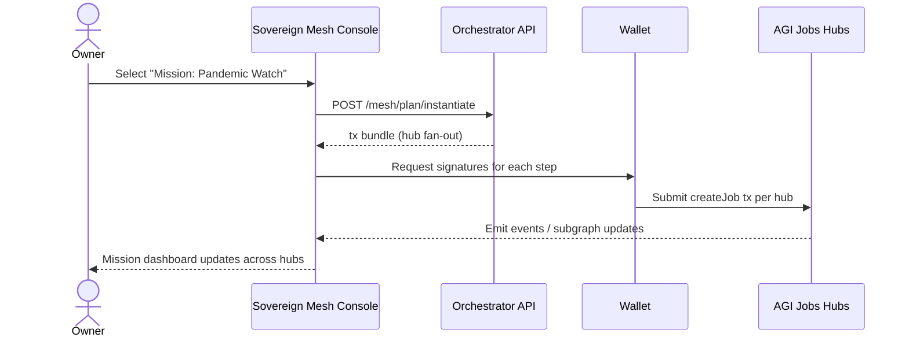

# Sovereign Mesh — Planet-Scale Mission Orchestration

> "Sovereign Mesh" is a fully owner-governed, multi-hub demonstration that lets any operator spin up civilization-scale AGI Jobs v2 missions without touching Solidity. This directory contains the orchestrator server, wallet-first React console, deployment aides, automated tests, and CI wiring required to operate the mesh in production.

## Why it matters

- **Network-of-networks** – coordinate multiple autonomous AGI Jobs hubs (research, industrial ops, governance, etc.) under a single intent-driven console.
- **Mission playbooks** – non-technical owners can publish planet-scale missions that instantiate jobs across hubs with a single signature.
- **Wallet-first** – every write is encoded off-chain and signed by the user's wallet; the server never handles private keys.
- **Owner supremacy** – each module remains upgradeable, pausable, and governable by the owner (links to every contract write panel are provided in the UI).
- **Production ready** – TypeScript coverage, Cypress smoke test, and a dedicated CI job keep the mesh green.

## Architecture at a glance

```mermaid
flowchart TB
    UserWallet((User Wallet))
    UI["Sovereign Mesh React Console\n(app/")]
    Orchestrator["Mission Orchestrator API\n(server/")]
    Config["Owner Playbooks + Hub Catalog\n(config/")]
    Subgraph["Indexed Hub Data\n(The Graph)"]
    HubPR["Public Research Hub\n(JobRegistry, StakeManager, ValidationModule, …)"]
    HubIO["Industrial Ops Hub\n(…)"]
    HubCG["Civic Governance Hub\n(…)"]

    UserWallet <--> UI
    UI <-->|REST| Orchestrator
    Orchestrator --> Config
    UI --> Subgraph
    Orchestrator -.unsigned tx.-> UserWallet
    UserWallet -->|Signed tx| HubPR & HubIO & HubCG
    Orchestrator -.mission fan-out.-> HubPR
    Orchestrator -.mission fan-out.-> HubIO
    Orchestrator -.mission fan-out.-> HubCG
```

## Directory layout

```
demo/sovereign-mesh
├── README.md              – this guide
├── config/                – hub registry, playbooks, actors, UI defaults
├── server/                – Express-based orchestrator API (TypeScript)
├── app/                   – Vite + React console for non-technical operators
├── scripts/               – Hardhat utility scripts for local deployments
├── test/                  – Hardhat test that covers a multi-hub validation flow
└── cypress/               – Cypress smoke test for the React console
```

## Quickstart

1. **Populate hub addresses** – edit `config/hubs.mainnet.json` with the JobRegistry + module addresses for each hub you operate. The provided Hardhat script (`scripts/deployMesh.ts`) deploys a three-hub mesh on a local Hardhat chain for testing.
2. **Run the orchestrator**
   ```bash
   cd demo/sovereign-mesh/server
   npm install
   npm run dev
   ```
3. **Launch the console**
   ```bash
   cd demo/sovereign-mesh/app
   npm install
   npm run dev
   ```
4. **Connect your wallet** – open http://localhost:5178, connect MetaMask, choose a hub, create jobs, stake, or instantiate a full mission.

## Mission playbooks

Playbooks encode entire missions as JSON. Owners can adjust rewards, IPFS payloads, or hub routing without redeploying contracts. Example (`config/playbooks.json`):

```json
{
  "id": "decarbonize-port-city",
  "name": "Mission: Decarbonize Port City",
  "steps": [
    { "hub": "foresight@civic-governance", "rewardWei": "1500000000000000000", "uri": "ipfs://playbook/foresight/port-emissions" },
    { "hub": "research@public-research",  "rewardWei": "3000000000000000000", "uri": "ipfs://playbook/research/abatement-options" },
    { "hub": "optimization@industrial-ops","rewardWei": "2500000000000000000", "uri": "ipfs://playbook/optimization/logistics-plan" },
    { "hub": "knowledge@public-research", "rewardWei": "1000000000000000000", "uri": "ipfs://playbook/knowledge/policy-brief" }
  ]
}
```

## Owner control surface

The React console surfaces direct links to every contract's Etherscan write panel. Owners can pause hubs, rotate governance to a Safe, tune commit/reveal windows, update identity allowlists, or replace modules with zero additional tooling.

## Continuous integration

`ci.yml` now enforces a **Sovereign Mesh build job** that compiles the orchestrator API and the React console on every PR. Green checks on `main` confirm that missions stay launch-ready.

## Security & operations checklist

- Rotate module ownership with `scripts/rotateMeshGovernance.ts` once deployed.
- Pause individual hubs instantly via `JobRegistry.pause()` in case of incident.
- Update validator pools, commit/reveal windows, and staking parameters as conditions evolve.
- Mission instantiation always requires explicit wallet signatures—no hidden automation, no custodial risk.

## Planetary operations lifecycle



## Testing

- `npm test` (root) runs the Hardhat multi-hub lifecycle test.
- `npm run cypress:run --config-file cypress.config.ts` exercises the Sovereign Mesh smoke test.
- `npm run demo:sovereign-mesh` (coming soon) can be wired to scripted dry-runs.

## Deploying to production

1. Update `config/mesh.ui.config.json` with your orchestrator base URL, default subgraph, and hub keys.
2. Host the React build output (from `npm run build`) on any static host or IPFS.
3. Run the orchestrator with `npm run start` behind HTTPS. It is stateless and can be replicated horizontally.
4. Point ENS or DNS at the console, share mission playbooks, and empower your operators.

## Support

Questions, mission requests, or incident reports? Open a GitHub issue with the label `sovereign-mesh` or reach the AGI Jobs v2 operator community.
