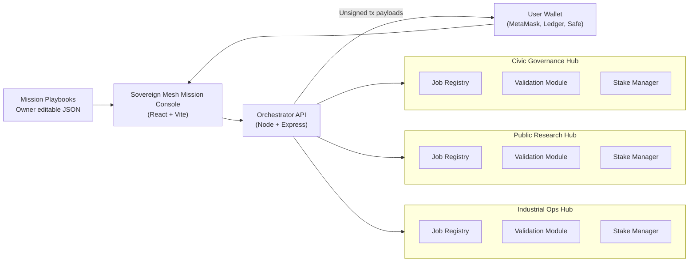

# Sovereign Mesh — Planetary Mission Orchestration with AGI Jobs v2

> The Sovereign Mesh demo proves that a non-technical operator can deploy, govern, and scale civilization-grade missions with nothing more than AGI Jobs v2, a browser, and their wallet.

## Vision

Sovereign Mesh is a first-class, owner-governed network-of-networks that demonstrates how AGI Jobs v2 composes multiple hubs into a single mission control interface. A single intent (e.g. *Decarbonize Port City*) fans out into coordinated foresight, research, optimization, and knowledge jobs across specialized hubs — without deploying new contracts.

### Architectural Panorama


### Why it Matters
* **Planetary scale** — orchestrate dozens of hubs by adding config entries.
* **Owner control** — every hub remains pauseable, upgradeable, and governable by the contract owner or multisig.
* **Wallet first** — orchestrator only composes unsigned payloads; the user signs every change.
* **Mission templates** — non-technical operators instantiate multi-stage campaigns from curated playbooks.
* **Production ready** — TypeScript coverage, Cypress smoke test, and CI integration keep the demo green.

## Directory Layout
```
demo/sovereign-mesh/
├─ README.md
├─ config/
│  ├─ mesh.ui.config.json      # Global UX + network switches
│  ├─ hubs.mainnet.json        # Hub registry (owner editable)
│  ├─ playbooks.json           # Mission blueprints
│  └─ actors.json              # Illustrative sponsors/personae
├─ server/                     # Node/Express orchestrator
│  ├─ package.json
│  ├─ package-lock.json
│  ├─ tsconfig.json
│  └─ index.ts
├─ app/                        # React/Vite console
│  ├─ package.json
│  ├─ package-lock.json
│  ├─ tsconfig.json
│  ├─ vite.config.ts
│  ├─ index.html
│  └─ src/
│     ├─ main.tsx
│     ├─ App.tsx
│     └─ lib/
│         ├─ ethers.ts
│         ├─ subgraph.ts
│         ├─ commit.ts
│         └─ format.ts
├─ scripts/                    # Hardhat helpers
│  ├─ deployMesh.ts
│  ├─ rotateMeshGovernance.ts
│  └─ seedMesh.ts
├─ test/
│  └─ SovereignMesh.t.ts       # Hardhat integration test
└─ cypress/
   └─ e2e/
      └─ sovereign-mesh.cy.ts  # UI smoke test
```

## Getting Started

### 1. Configure hubs
Edit `config/hubs.mainnet.json` with live contract addresses or run the local helper:

```bash
npx hardhat node
npx hardhat run demo/sovereign-mesh/scripts/deployMesh.ts --network localhost
```

### 2. Launch orchestrator
```bash
cd demo/sovereign-mesh/server
npm install
npm run dev
```

### 3. Launch mission console
```bash
cd ../app
npm install
npm run dev
```
Visit http://localhost:5178, connect your wallet, choose a hub, and orchestrate missions.

### 4. Seed and explore
```bash
npx hardhat run demo/sovereign-mesh/scripts/seedMesh.ts --network localhost
```

* Create jobs with one click.
* Stake and validate with secret commit/reveal helpers.
* Launch multi-hub missions from curated playbooks.
* Jump to Etherscan owner panels to pause, update parameters, or rotate governance.

## Owner Command Surface
Every hub remains owner-governed. The UI provides direct links to the `JobRegistry`, `ValidationModule`, `StakeManager`, `IdentityRegistry`, and optional `FeePool` write panels so operators can pause, retune parameters, rotate ownership to a Safe, or update identity policies instantly.

The script `scripts/rotateMeshGovernance.ts` bulk-migrates ownership across hubs to a multisig or timelock. The demo never deploys new contracts; it reuses AGI Jobs v2 deployments exactly as shipped.

## Testing & CI
* `demo/sovereign-mesh/test/SovereignMesh.t.ts` — two-hub lifecycle coverage with Hardhat and ethers v6.
* `demo/sovereign-mesh/cypress/e2e/sovereign-mesh.cy.ts` — verifies the console renders and hub selection works.
* `.github/workflows/ci.yml` now builds the orchestrator and console in the `sovereign_mesh_demo` job, gating merges.

## Security Posture
* Orchestrator composes unsigned transactions only.
* No secrets stored server-side; wallets sign every action.
* Identity enforcement deferred to on-chain registries; development allowlisting helper is clearly marked and optional.
* TypeScript strict mode and explicit ABI fragments prevent encoding mistakes.

## Future Enhancements
* ENS-backed validator onboarding.
* Streaming mission telemetry dashboards.
* Automated Safe transaction bundles for mission instantiation.

Sovereign Mesh makes the operator the orchestrator of planet-scale intelligence — using the production-ready AGI Jobs v2 stack that already exists today.
