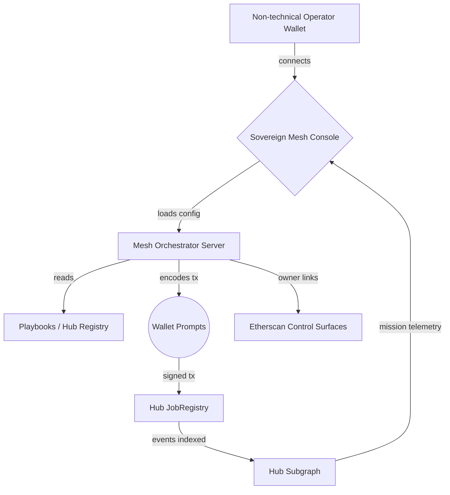

# Sovereign Mesh — Planet-Scale Mission Orchestrator

Sovereign Mesh demonstrates how AGI Jobs v0/v2 enables non-technical operators to coordinate civilization-scale missions across multiple independent hubs. The demo packages three complementary components:

1. **Mesh orchestrator server** – prepares unsigned transactions for any configured hub while streaming mission metadata to the UI. The server never custodies private keys and keeps the user wallet as the single authority.
2. **Mission control console** – a Vite + React front-end that empowers a non-technical user to launch multi-hub playbooks, manage validator participation, and open owner control panels in a single screen.
3. **Governance-grade scripts and tests** – Hardhat utilities for deploying local meshes, rotating governance to a multisig, seeding demo jobs, and verifying multi-hub job lifecycles.



The orchestrator is designed so that a mission such as **Decarbonize Port City** can be launched in a few clicks: the user selects the playbook, signs a short burst of job creation transactions (one per hub), and then agents and validators can immediately participate via familiar AGI Jobs workflows.

## Repository Layout

```
demo/sovereign-mesh/
├── README.md                     # Documentation you are reading now
├── config/                       # JSON configuration driving the experience
│   ├── mesh.ui.config.json       # global UI settings (network, hubs, endpoints)
│   ├── hubs.mainnet.json         # per-hub registry of contract addresses
│   ├── playbooks.json            # owner-editable multi-hub mission templates
│   └── actors.json               # optional roster of sponsoring actors for UI display
├── server/                       # wallet-first orchestrator service
│   ├── package.json
│   ├── package-lock.json
│   ├── tsconfig.json
│   └── src/index.ts
├── app/                          # React + Vite control console
│   ├── package.json
│   ├── package-lock.json
│   ├── tsconfig.json
│   ├── tsconfig.node.json
│   ├── vite.config.ts
│   ├── index.html
│   └── src/
│       ├── main.tsx
│       ├── App.tsx
│       └── lib/
│           ├── commit.ts
│           ├── ethers.ts
│           ├── format.ts
│           └── subgraph.ts
├── scripts/                      # hardhat helpers for operators
│   ├── deployMesh.ts
│   ├── rotateMeshGovernance.ts
│   └── seedMesh.ts
├── test/                         # dedicated sovereign-mesh hardhat test
│   └── sovereignMesh.integration.test.ts
└── cypress/
    └── sovereign-mesh.cy.ts      # UI smoke test used in CI
```

## Quickstart

1. **Prepare hub registry** – Update `config/hubs.mainnet.json` with deployed module addresses. For local demos run `npx hardhat run demo/sovereign-mesh/scripts/deployMesh.ts --network localhost` to generate a complete mesh using the canonical `$AGIALPHA` test harness.
2. **Run orchestrator** –
   ```bash
   cd demo/sovereign-mesh/server
   npm install
   npm run dev
   ```
   The service listens on `http://localhost:8084` by default.
3. **Run console** –
   ```bash
   cd demo/sovereign-mesh/app
   npm install
   npm run dev
   ```
   Open [http://localhost:5178](http://localhost:5178) and connect your wallet.
4. **Launch a mission** – Select a playbook, sign the prepared transactions, and monitor progress across hubs from a single pane. Validators can stake, commit, reveal, and finalize using guided controls. Contract owners can jump straight to Etherscan write tabs via the **Owner Panels** section.

## Owner Controls & Governance

The mesh keeps each hub owner fully sovereign. Owners can:

- Pause or resume any module (JobRegistry, StakeManager, ValidationModule, DisputeModule, PlatformRegistry, SystemPause) via the embedded Etherscan links.
- Update staking floors, validator quorum windows, reputation thresholds, and dispute parameters.
- Rotate governance to a Safe or timelock with `scripts/rotateMeshGovernance.ts`.
- Seed missions and validator stakes locally with `scripts/seedMesh.ts`.

The mesh deliberately **does not** deploy new contracts. It composes the proven AGI Jobs v2 modules, ensuring maximal compatibility with production deployments and allowing upgrades through existing governance pathways.

## Testing & CI

- `demo/sovereign-mesh/test/sovereignMesh.integration.test.ts` provisions two hubs using `contracts/v2/Deployer.sol`, walks through dual job creation, validator commit/reveal, and verifies rewards settle correctly across hubs.
- `cypress/sovereign-mesh.cy.ts` ensures the UI renders, loads hub metadata, and exposes mission playbooks without regression.
- `.github/workflows/ci.yml` already contains the `sovereign_mesh_demo` build job so every pull request compiles both server and console bundles.

Run the domain tests locally with:

```bash
npm test -- test/sovereign-mesh.integration.test.ts
npx cypress run --config-file cypress.config.ts --spec cypress/e2e/sovereign-mesh.cy.ts
```

Sovereign Mesh positions AGI Jobs v2 as a civilization-scale coordination substrate: non-technical leaders can now mobilize foresight, research, optimization, and knowledge networks with superintelligent fluidity—all while owners retain precise control levers required for mission-critical production. The result is an operator experience that **feels like commanding a planetary nervous system.**
