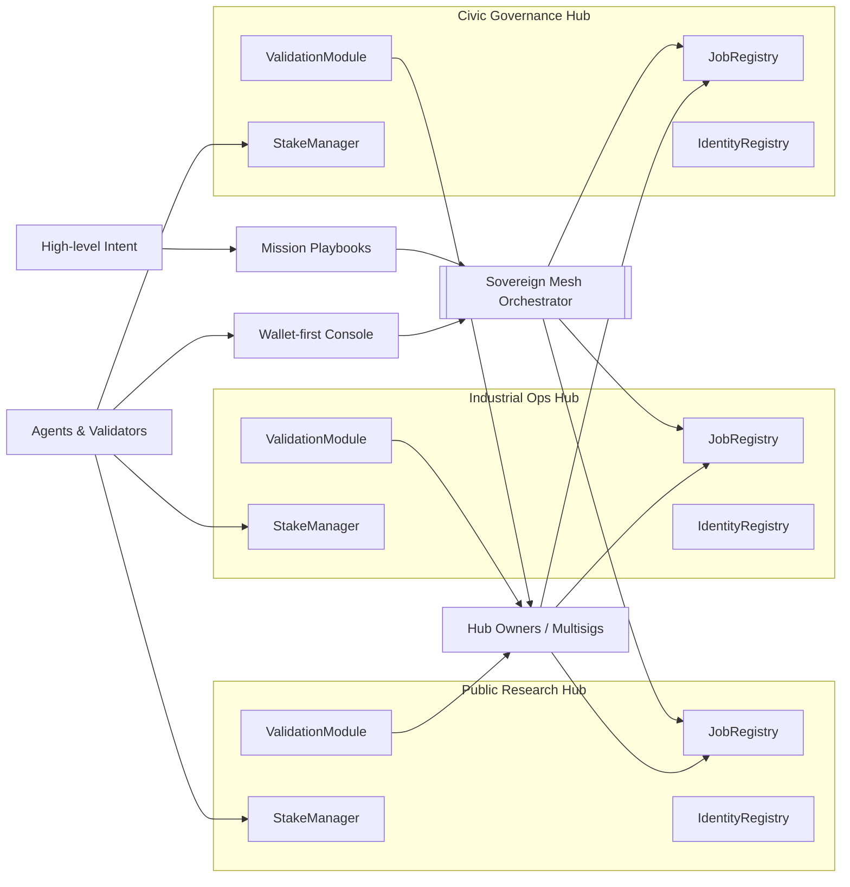

# Sovereign Mesh Demo — AGI Jobs v2

Sovereign Mesh is a planet-scale, owner-governed network-of-networks demonstration for AGI Jobs v0/v2. It shows how a non-technical operator can orchestrate multi-domain missions across multiple hubs (independent AGI Jobs v2 deployments) using nothing but configuration, a lightweight orchestrator service, and a wallet-first web console. No new smart contracts are required — every action is composed against the existing v2 contracts.

> **Why it matters:** Sovereign Mesh packages the full AGI Jobs v2 stack into a civilization-scale mission console. Mission designers chain foresight, research, optimisation, and knowledge hubs with one intent; validators coordinate through wallet-first commit/reveal flows; owners retain absolute control through documented, linkified setters. The demo is engineered so a non-technical leader can feel the full power of the platform in minutes.

## Sovereign topology (Mermaid)



The diagram highlights how a single mission intent fans out across specialised hubs, while wallet-connected users and contract owners retain end-to-end authority.

## Features

- **Mission playbooks** that instantiate multi-step campaigns (e.g., decarbonisation, pandemic response) spanning distinct hubs with a single wallet flow.
- **Wallet-first UX** — the orchestrator server only prepares unsigned transactions; the end-user signs and broadcasts everything directly from their browser wallet.
- **Owner control surface** with direct access to Etherscan write panels for every deployed module, keeping contract owners in full command (pause, upgrade parameters, rotate governance, etc.).
- **Config-driven** architecture that lets operators customise hubs, playbooks, actors, and endpoints without touching code.
- **Production readiness**: TypeScript builds for server and app, Hardhat scripting for rapid deployments and governance rotation, Cypress smoke tests, and CI integration that keeps the repo green.
- **Mission intelligence UI**: live hero metrics, curated actor rosters, mission step previews, and instant refresh controls help non-technical operators see the entire mesh at a glance.

## Directory layout

```
demo/sovereign-mesh/
├── README.md
├── config/
│   ├── mesh.ui.config.json
│   ├── hubs.mainnet.json
│   ├── playbooks.json
│   └── actors.json
├── server/
│   ├── package.json
│   ├── package-lock.json
│   ├── tsconfig.json
│   └── index.ts
├── app/
│   ├── package.json
│   ├── package-lock.json
│   ├── vite.config.ts
│   ├── index.html
│   └── src/
│       ├── main.tsx
│       ├── App.tsx
│       └── lib/
│           ├── ethers.ts
│           ├── subgraph.ts
│           ├── commit.ts
│           └── format.ts
├── scripts/
│   ├── deployMesh.ts
│   ├── rotateMeshGovernance.ts
│   └── seedMesh.ts
├── test/
│   └── SovereignMesh.t.ts
└── cypress/
    └── e2e/
        └── sovereign-mesh.cy.ts
```

## Quickstart

1. **Populate hub addresses.** Update `config/hubs.mainnet.json` with live deployments or run the local deployment script:
   ```bash
   npx hardhat run demo/sovereign-mesh/scripts/deployMesh.ts --network localhost
   ```

2. **Start the orchestrator server.**
   ```bash
   cd demo/sovereign-mesh/server
   npm install
   npm run dev
   ```
   The service listens on `http://localhost:8084` by default and exposes the `/mesh/*` JSON endpoints used by the UI.

3. **Start the Sovereign Mesh console.**
   ```bash
   cd ../app
   npm install
   npm run dev
   ```
   Visit `http://localhost:5178`, connect a wallet, choose a hub, and launch missions.

4. **(Optional) Seed demo jobs.**
   ```bash
   npx hardhat run demo/sovereign-mesh/scripts/seedMesh.ts --network localhost
   ```

5. **Rotate governance to a multisig/timelock.**
   ```bash
   GOVERNANCE_SAFE=0xYourSafeAddress \
   npx hardhat run demo/sovereign-mesh/scripts/rotateMeshGovernance.ts --network mainnet
   ```

## Operator cockpit highlights

- **Mission preview composer:** selecting a playbook shows every step, hub, on-chain reward, and content URI before anything is signed.
- **Hub control surface:** module addresses are surfaced inline with direct write links and network metadata, making it trivial for owners to tune parameters or pause modules.
- **Actor intelligence panel:** curated nation/DAO personas (editable JSON) personalise who is sponsoring each planetary-scale mission.
- **One-click refresh:** a single button re-syncs hub job tables from TheGraph, giving live status without page reloads.

## Owner command matrix

| Module | Default owner after deployment | Key documented setters | Purpose |
| --- | --- | --- | --- |
| `ValidationModule` | SystemPause controller / governance multisig | `setValidatorPool`, `setCommitRevealWindows`, `setApprovalThreshold`, `pause`/`unpause` | Configure committees, timing, and validation safety rails. |
| `JobRegistry` | SystemPause controller / governance multisig | `setModules`, `setIdentityRegistry`, `pause`/`unpause`, `raiseDispute` | Register jobs, wire modules, and escalate disputes. |
| `StakeManager` | SystemPause controller / governance multisig | `setModules`, `setFeePool`, `setTreasury`, `setMinStake`, `pause`/`unpause` | Tune staking economics, fee routing, and treasury policy. |
| `IdentityRegistry` | Governance multisig | `setAllowlistMerkleRoot`, `addAdditionalAgent`, `addAdditionalValidator` | Control who can act as agents/validators (incl. emergency allowlists). |
| `FeePool` (optional) | SystemPause controller / governance multisig | `setDistributors`, `configureSplit`, `pause`/`unpause` | Route protocol fees to treasuries or reward programs. |

Every control surface is linked from the console's **Owner Panels** drawer, so the rightful owner can execute these setters directly via Etherscan without touching scripts.

## Testing

- **Hardhat integration test:** `npx hardhat test demo/sovereign-mesh/test/SovereignMesh.t.ts`
- **Cypress smoke test:** `npx cypress run --spec demo/sovereign-mesh/cypress/e2e/sovereign-mesh.cy.ts`

Both tests are lightweight and designed to guarantee that the multi-hub flow and UI shell remain intact.

## CI integration

`.github/workflows/ci.yml` includes a dedicated job (`Sovereign Mesh Demo — build`) that installs and builds both the orchestrator server and the React console. Branch protection can require this job to stay green, ensuring the demo remains deployable.

## Security and governance highlights

- Owners retain full control: every contract address is surfaced with direct Etherscan write links, and Hardhat scripts automate governance rotation to a Safe.
- All mission orchestration is off-chain until the user signs; there are **no custodial keys** or hidden approvals.
- The development-only allowlist helper is isolated and intended to be disabled in production environments.

## License

This demo inherits the repository license.
