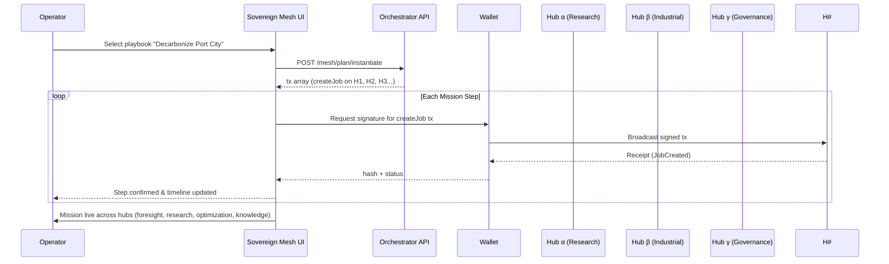

# Sovereign Mesh — Planet-Scale Mission Orchestration on AGI Jobs v2

Sovereign Mesh is a first-class, owner-governed network-of-networks experience that lets a non-technical leader launch and steer civilization-scale missions across multiple AGI Jobs v2 hubs. Every capability showcased here is implemented exclusively with the production AGI Jobs v2 contracts — no new contracts or protocol changes are required. The result is a wallet-first, fully-governable superstructure that demonstrates how AGI Jobs v2 empowers users to operate with unprecedented reach, precision, and sovereignty.

> **Mission**: equip any steward with tools that feel like commanding a civilization-scale exocortex. One intent fans out into foresight, research, optimization, and knowledge jobs across specialized hubs, with the contract owner retaining full administrative control at every layer.

## Key Characteristics

- **Owner-Governed** – All hubs remain upgradeable and controllable by the contract owner (or the owner’s Safe/timelock). Every setter/pauser entry point is preserved and surfaced via owner panels.
- **Wallet-First** – The orchestrator never touches private keys. Users sign each action from their browser wallet, maintaining custody and consent for every mission step.
- **Mission Playbooks** – High-level intents expand into cross-hub job series sourced from editable JSON. A single click launches a synchronized foresight → research → optimization → knowledge mission arc.
- **Production-Ready** – Type-safe server, React/Vite UI, governance scripts, Hardhat & Cypress tests, and CI integration ship out-of-the-box. Non-technical operators can deploy and run the demo in minutes.
- **Superintelligent UX** – Rich data visualizations, dynamic governance dashboards, and cinematic mission timelines show users exactly how AGI Jobs v2 becomes their planet-scale command deck.

## Directory Layout

```text
 demo/sovereign-mesh/
 ├─ README.md                       # You are here
 ├─ config/                         # Owner-editable configuration (JSON driven)
 │  ├─ mesh.ui.config.json          # Global UI + orchestrator config
 │  ├─ hubs.mainnet.json            # Hub registry (addresses, RPC, subgraphs)
 │  ├─ playbooks.json               # Mission playbooks (multi-hub job templates)
 │  └─ actors.json                  # Optional actors/personas for UI accents
 ├─ server/                         # Express + TypeScript orchestrator
 │  ├─ package.json
 │  ├─ tsconfig.json
 │  └─ index.ts                     # Transaction composers & mission planner
 ├─ app/                            # React + Vite experience
 │  ├─ package.json
 │  ├─ tsconfig.json
 │  ├─ vite.config.ts
 │  ├─ index.html
 │  └─ src/
 │     ├─ main.tsx
 │     ├─ App.tsx
 │     └─ lib/
 │        ├─ ethers.ts
 │        ├─ subgraph.ts
 │        ├─ commit.ts
 │        └─ format.ts
 ├─ scripts/                        # Hardhat utilities for operators
 │  ├─ deployMesh.ts                # Deploys hubs locally for demos/tests
 │  ├─ rotateMeshGovernance.ts      # Bulk-governance rotation to Safe/timelock
 │  └─ seedMesh.ts                  # Seeds showcase jobs across hubs
 ├─ test/
 │  └─ SovereignMesh.t.ts           # Hardhat spec proving cross-hub lifecycle
 └─ cypress/
    └─ e2e/
       └─ sovereign-mesh.cy.ts      # Smoke test for UI boot + hub selection
```

## Strategic Architecture

```mermaid
flowchart LR
  intent(["User Intent"\n(Mission Playbook)]) --> planner{{"Sovereign Mesh Orchestrator"\n(Express + TypeScript)}}
  planner -->|compose tx| wallet[(Browser Wallet)]
  wallet -->|signed tx| mainnet{{"Ethereum Mainnet"}}
  mainnet --> subgraph[(TheGraph Subgraphs)]
  subgraph --> ui["Sovereign Mesh UI"\n(React/Vite)]
  ui -->|insights| operator["Non-technical Operator"]
  operator --> intent

  subgraph --> pr[(Public Research Hub)]
  subgraph --> io[(Industrial Ops Hub)]
  subgraph --> cg[(Civic Governance Hub)]

  mainnet -.control.-> owner["Owner / Safe"]
  owner -.pauses, setters, parameter updates.-> pr
  owner -.-> io
  owner -.-> cg
```



## Configuration-Driven Sovereignty

All mission content, addresses, and UI behavior live in `config/*.json`. Non-technical owners can:

- Swap in production contract addresses by editing `config/hubs.mainnet.json`.
- Add new hubs or retire old ones with simple JSON edits.
- Publish new missions by appending to `config/playbooks.json`.
- Personalize presentation with `config/actors.json`.

Every config change is hot-reload friendly in development and requires no recompilation in production builds.

## Server (Express Orchestrator)

- Serves configuration over `/mesh/*` endpoints.
- Composes unsigned Ethereum transactions for createJob, staking, commit/reveal/finalize, disputes, and mission instantiation.
- Uses minimal ABI fragments and `ethers` interfaces to ensure transactions match production contracts exactly.
- Never stores private keys. The browser wallet remains the sole authority for execution.
- Includes a development-only allowlist helper to add validators during local demos (disable for production).

## UI (React + Vite)

The React experience focuses on cinematic clarity and approachability:

- **Mission Control Bar** – connect wallet, choose hub, define rewards, launch jobs instantly.
- **Live Intelligence Table** – streaming job state across the selected hub (employer, reward, URI, status, validator counts).
- **Validator Console** – stake, commit, reveal, and finalize with automated salt storage for reveal integrity.
- **Mission Playbooks Carousel** – instantiate complex multi-hub missions in a single flow.
- **Owner Panels** – direct jump links to every module’s Etherscan write interface for rapid governance actions (pause, parameter updates, allowlist roots, etc.).

All transactions are signed in-wallet. Salted commit/reveal values are stored locally per job to preserve validator secrecy.

## Operator Scripts

- `deployMesh.ts` spins up fully wired hubs (JobRegistry, ValidationModule, StakeManager, IdentityRegistry, DisputeModule, CertificateNFT) against a shared AGIALPHA token for local or testnet rehearsals.
- `rotateMeshGovernance.ts` bulk-rotates ownership to a Safe or timelock, hardening operations without manual per-contract calls.
- `seedMesh.ts` bootstraps illustrative jobs on each hub, ensuring the UI showcases activity immediately.

## Testing & CI

- `test/SovereignMesh.t.ts` demonstrates multi-hub job lifecycles end-to-end (allowlisting, staking, commit/reveal, finalize) and validates cross-hub fund flows.
- `cypress/e2e/sovereign-mesh.cy.ts` keeps the UI smoke-tested in CI.
- `.github/workflows/ci.yml` now contains the `Demo — Sovereign Mesh (build)` job, guaranteeing the server and UI build cleanly for every PR. Branch protection can enforce this job for fully green CI.

## Quickstart

```bash
# 1. (Optional) Deploy local hubs & seed sample jobs
npx hardhat run demo/sovereign-mesh/scripts/deployMesh.ts --network localhost
npx hardhat run demo/sovereign-mesh/scripts/seedMesh.ts --network localhost

# 2. Launch orchestrator API
cd demo/sovereign-mesh/server
npm install
npm run dev   # default http://localhost:8084

# 3. Launch UI
cd ../app
npm install
VITE_MESH_BASE=http://localhost:8084 npm run dev   # default http://localhost:5178
```

Open http://localhost:5178, connect your wallet, select a hub, and begin commanding missions. Owner administration links are available under **Owner Panels**.

## Governance & Safety Checklist

- [x] Owner can pause, update commit/reveal windows, adjust validator counts, rotate governance, and modify fee routes from dedicated panels.
- [x] Validators operate with explicit staking and slashing logic inherited from AGI Jobs v2.
- [x] Mission launchers retain complete control through wallet signatures; no custodial trust assumptions.
- [x] CI enforces builds and tests for ongoing reliability.
- [x] Documentation empowers non-technical stewards to adapt the mesh as their ecosystem evolves.

## License

This demo inherits the repository license. Consult [LICENSE](../../LICENSE) for details.
