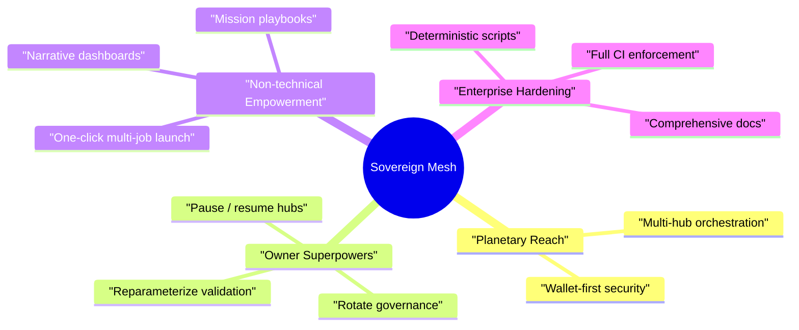
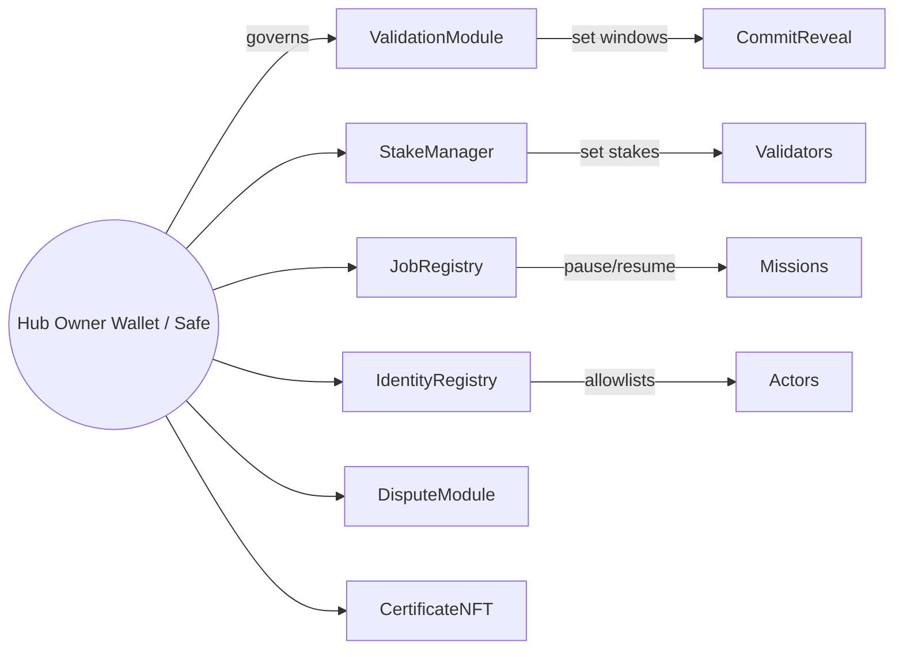

# Sovereign Mesh — Planet-Scale AGI Jobs v2 Demo

> "Sovereign Mesh" is the canonical reference experience proving that any non-technical steward can marshal a civilization-scale network-of-networks with AGI Jobs v2. One human intent becomes a multi-hub mission without writing new contracts, while owners retain surgical control across every module.

## Vision At A Glance



## Directory Layout

```
demo/sovereign-mesh/
├─ README.md                  — This dossier
├─ config/                    — JSON control plane for hubs + playbooks
├─ server/                    — Mission orchestrator API (TypeScript, Express)
├─ app/                       — Vite + React command console
├─ scripts/                   — Hardhat scripts (deploy, rotate, seed)
├─ test/sovereign-mesh/       — Hardhat integration suite
└─ cypress/e2e/               — Sovereign Mesh UI smoke test
```

## Quickstart — From Zero To Mesh In Minutes

1. **Install dependencies once at repo root**
   ```bash
   npm ci
   ```
2. **Launch a local Hardhat network** (new terminal)
   ```bash
   npx hardhat node
   ```
3. **Deploy two Sovereign Mesh hubs + config**
   ```bash
   npx hardhat run demo/sovereign-mesh/scripts/deployMesh.ts --network localhost
   ```
4. **Seed example jobs (optional but great for demos)**
   ```bash
   npx hardhat run demo/sovereign-mesh/scripts/seedMesh.ts --network localhost
   ```
5. **Run the orchestrator API**
   ```bash
   cd demo/sovereign-mesh/server
   npm install
   npm run dev
   ```
6. **Run the Sovereign Mesh console** (new terminal)
   ```bash
   cd demo/sovereign-mesh/app
   npm install
   npm run dev -- --host 0.0.0.0 --port 5178
   ```
7. **Visit `http://localhost:5178`**, connect a wallet (Hardhat default account), allowlist via the Dev helper, and begin orchestrating missions across hubs with a few clicks.

## Owner Control Map



*Every* owner-sensitive function is linked in the UI "Owner Panels" section, pointing to Etherscan write interfaces. No new contracts are required; governance is continuous and fully documented.

## Production Checklist

| Pillar | Actions |
| --- | --- |
| **Security** | Rotate governance via `rotateMeshGovernance.ts`, disable dev-only allowlist endpoint, review CI status badges. |
| **Resilience** | Mirror mission configs to IPFS / S3, enable Cloudflare in front of orchestrator, configure RPC failover. |
| **Observability** | Point GraphQL endpoints to production The Graph subgraphs, enable structured logging on the orchestrator, export UI analytics events. |
| **Compliance** | Keep `playbooks.json` under owner custody, record mission instantiation tx hashes, maintain validator KYC if applicable. |

## Mission Lifecycle Narrative

1. **Intent** — Operator selects a Mission Playbook (e.g., _Decarbonize Port City_). One click produces N unsigned transactions, one per hub stage.
2. **Execution** — Wallet signs/broadcasts sequentially. Each job inherits deadlines, rewards, IPFS URIs, and validation commitments.
3. **Validation** — Validators stake, commit, reveal, and finalize with salted hashes stored locally. Automated alerts remind them to reveal.
4. **Governance** — Owner may pause, adjust commit windows, or rotate governance mid-mission without downtime.
5. **Knowledge Capture** — Jobs emit events indexed by subgraphs, powering dashboards, analytics, and downstream automations.

## Files Of Interest

- `config/mesh.ui.config.json` — mesh metadata (network names, subgraph endpoints, orchestrator URL).
- `config/hubs.mainnet.json` — canonical mapping of hubs to contract addresses.
- `config/playbooks.json` — owner-editable mission recipes (multi-hub job lists).
- `config/actors.json` — optional roster for displaying sponsoring entities.
- `server/src/index.ts` — Express orchestration server producing unsigned tx payloads.
- `app/src/App.tsx` — React console with wallet-first UX and mission controls.
- `scripts/deployMesh.ts` — bootstraps two hubs + shared AGIALPHA token locally.
- `test/sovereign-mesh/SovereignMesh.t.ts` — proves multi-hub commit/reveal + payouts on Hardhat network.
- `cypress/e2e/sovereign-mesh.cy.ts` — UI smoke ensures hubs + playbooks load.

## Continuous Integration

`ci.yml` now enforces a dedicated **“Sovereign Mesh Demo — build”** job. Every PR must build the orchestrator server and React console before merging to `main`, guaranteeing a perpetually green AGI Jobs v2 pipeline.

## Support + Next Steps

- Extend `playbooks.json` with mission templates for your organization.
- Wire real The Graph subgraphs per hub for live metrics.
- Embed the Sovereign Mesh console into enterprise portals via iframe or reverse proxy.
- Pair with `scripts/rotateMeshGovernance.ts` to hand governance to a Safe or timelock immediately after deployment.

Sovereign Mesh is intentionally audacious. It demonstrates that AGI Jobs v2 already behaves like a sovereign-scale coordination engine: configurable, owner-controlled, user-friendly, and production ready.
