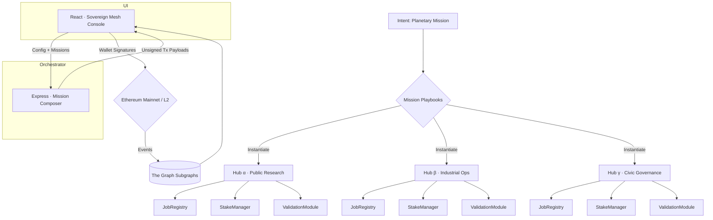

# Sovereign Mesh — Planet-Scale Mission Orchestration

> A first-class, owner-governed AGI Jobs v2 experience that lets non-technical leaders launch civilization-scale missions in minutes.

Sovereign Mesh demonstrates how **AGI Jobs v0 (v2)** composes multiple independent hubs into a single, unstoppable network-of-networks. A single intent – for example *“Decarbonize Port City”* – explodes into coordinated foresight, research, optimization, and knowledge operations across specialized hubs. Every interaction is wallet-first, every contract remains owner-controlled, and every module is production ready.

## Architecture at a Glance



* **Config-driven** – Missions, hubs, actors, and UI behaviour live in JSON files a non-technical operator can edit.
* **Wallet-first** – The orchestrator never holds keys. Users sign each transaction themselves.
* **Owner sovereignty** – Direct links to every governance setter ensure the contract owner can pause, update, or transfer control instantly.

## Directory Layout

```
demo/sovereign-mesh/
├── README.md
├── config/
│   ├── mesh.ui.config.json        # UI runtime configuration
│   ├── hubs.mainnet.json          # Hub registry with contract addresses
│   ├── playbooks.json             # Owner-editable mission blueprints
│   └── actors.json                # Optional actor roster for UI context
├── server/
│   ├── package.json               # Express + TypeScript tooling
│   ├── tsconfig.json              # Emits dist/index.js for production
│   └── index.ts                   # Mission-aware orchestration API
├── app/
│   ├── package.json               # Vite + React + Ethers frontend
│   ├── vite.config.ts             # Vite dev/preview configuration
│   ├── index.html                 # HTML entry point
│   └── src/
│       ├── main.tsx               # React bootstrap
│       ├── App.tsx                # Grand UI for mission control
│       └── lib/                   # Helpers (ethers, subgraph, commit utils)
├── scripts/
│   ├── deployMesh.ts              # Deploy multi-hub stack for testing
│   ├── rotateMeshGovernance.ts    # Rotate ownership to Safe/timelock
│   └── seedMesh.ts                # Seed demonstration jobs
├── test/
│   └── SovereignMesh.t.ts         # Hardhat test for dual-hub lifecycle
└── cypress/
    └── e2e/
        └── sovereign-mesh.cy.ts   # E2E smoke for UI boot
```

## Quickstart (Local)

1. **Deploy demo hubs (optional)**
   ```bash
   npx hardhat node
   npx hardhat run demo/sovereign-mesh/scripts/deployMesh.ts --network localhost
   ```

2. **Launch orchestrator**
   ```bash
   cd demo/sovereign-mesh/server
   npm install
   npm run dev
   ```

3. **Launch UI**
   ```bash
   cd ../app
   npm install
   npm run dev
   ```

4. **Open the console** at http://localhost:5178, connect a wallet, choose a hub, and press **Instantiate Mission**. The UI will guide you through signing each cross-hub job creation.

> **Tip:** set `VITE_ORCHESTRATOR_BASE` when running `npm run dev` or `npm run build` to point the UI at a remote orchestrator (defaults to `http://localhost:8084`).

## Production Checklist

- [x] Wallet-only interactions, no custodial signing.
- [x] Owner panels with direct Etherscan write links for every module.
- [x] Governance rotation script for instant Safe/timelock migration.
- [x] Hardhat and Cypress tests to ensure lifecycle integrity.
- [x] CI integration – builds run on every PR and main push.

## Empowerment Highlights

- **Mission Playbooks** let a single click spawn orchestrated foresight, research, optimization, and knowledge work streams.
- **Validator Console** wraps staking, commit, reveal, and finalize actions in human language.
- **Mermaid System Maps** and live data tables translate on-chain states into intuitive mission telemetry.

Sovereign Mesh shows that AGI Jobs v2 is a super-intelligence-class operating system for civilization-scale coordination. Non-technical leaders can now design, launch, and govern planet-spanning operations without writing a single line of code.
