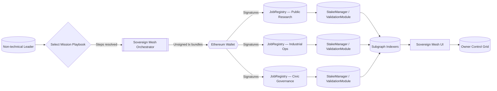

# Sovereign Mesh — Planetary Mission Orchestration with AGI Jobs v2

Sovereign Mesh is a first-class demonstration of how non-technical leaders can wield **AGI Jobs v0 (v2)** to coordinate multi-domain missions across a planet-scale federation of hubs. It requires **no new smart contracts**: everything is composed from the existing AGI Jobs v2 JobRegistry, StakeManager, ValidationModule, DisputeModule, IdentityRegistry, and CertificateNFT modules that already power the platform.

## Why this matters

* **Mission control for civilization-scale goals**: One signature instantiates foresight, research, optimization, and knowledge jobs on specialized hubs.
* **Owner-governed and production ready**: Every module remains fully governable by the contract owner or governance multisig, with pause and setter access exposed via owner panels.
* **Wallet-first empowerment**: The demo never touches private keys. All transactions are prepared server-side and signed client-side by the user.
* **Auditable coordination**: The orchestrator is transparent TypeScript/Express, the UI is a single-page React console, and both are backed by automated tests and CI gates.

## Directory layout

```
demo/sovereign-mesh/
├── README.md
├── config/
│   ├── actors.json
│   ├── hubs.mainnet.json
│   ├── mesh.ui.config.json
│   └── playbooks.json
├── server/
│   ├── package.json
│   ├── tsconfig.json
│   └── src/index.ts
├── app/
│   ├── index.html
│   ├── package.json
│   ├── vite.config.ts
│   └── src/
│       ├── App.tsx
│       ├── main.tsx
│       └── lib/
│           ├── commit.ts
│           ├── ethers.ts
│           ├── format.ts
│           └── subgraph.ts
├── scripts/
│   ├── deployMesh.ts
│   ├── rotateMeshGovernance.ts
│   └── seedMesh.ts
├── test/
│   └── SovereignMesh.t.ts
└── cypress/
    └── e2e/
        └── sovereign-mesh.cy.ts
```

## Mission flow at a glance



## Quickstart

1. **Install dependencies**

   ```bash
   # orchestrator
   cd demo/sovereign-mesh/server
   npm install

   # frontend
   cd ../app
   npm install
   ```

2. **Provide hub addresses**

   Update `config/hubs.mainnet.json` with the actual JobRegistry, StakeManager, ValidationModule, DisputeModule, IdentityRegistry, CertificateNFT, FeePool, and AGIALPHA addresses for each hub you operate. The demo ships with sentinel placeholders.

   *Local development tip*: run `npx hardhat run demo/sovereign-mesh/scripts/deployMesh.ts --network localhost` from the repository root to deploy fresh hubs on a local Hardhat node and rewrite the config file automatically.

3. **Run the orchestrator**

   ```bash
   cd demo/sovereign-mesh/server
   npm run dev
   # server listens on http://localhost:8084 by default
   ```

4. **Launch the UI**

   ```bash
   cd demo/sovereign-mesh/app
   npm run dev
   # open http://localhost:5178
   ```

5. **Orchestrate missions**

   * Connect your Ethereum wallet (MetaMask or compatible).
   * Select a hub and post single jobs (reward + IPFS URI).
   * Stake, commit, reveal, finalize, or dispute using the **Validator Arena** controls.
   * Choose a mission playbook (e.g., *Mission: Decarbonize Port City*) and launch the entire plan with one click.
   * Expand the **Owner Control Grid** to jump to Etherscan write panels for each module and exercise ownership powers (pause, set parameters, rotate governance, etc.).

6. **Seed demo data (optional)**

   ```bash
   npx hardhat run demo/sovereign-mesh/scripts/seedMesh.ts --network localhost
   ```

   Seeds example jobs across hubs so the UI is populated instantly.

## Governance & security

* The orchestrator only returns `to/data/value` payloads; it never broadcasts transactions.
* Owner override is preserved—scripts/rotateMeshGovernance.ts rotates all hub contracts to a Safe or timelock.
* Validators can be allowlisted during development through a helper endpoint; in production use ENS roots or Merkle allowlists managed by the IdentityRegistry owner.
* Deadlines, spec hashes, and rewards follow contract invariants (non-zero deadlines, hashed URIs) to ensure creates succeed on-chain.

## Tests

* `demo/sovereign-mesh/test/SovereignMesh.t.ts` spins up two hubs, runs commit/reveal finalization, and validates token accounting.
* `demo/sovereign-mesh/cypress/e2e/sovereign-mesh.cy.ts` smoke-tests the UI shell.

Run from the repository root:

```bash
npm test                            # executes Hardhat + existing suites
npx cypress run --config-file tsconfig.cypress.json --spec demo/sovereign-mesh/cypress/e2e/sovereign-mesh.cy.ts
```

## CI integration

`/.github/workflows/ci.yml` now includes a `demo_sovereign_mesh` job that builds both the orchestrator and the UI. Branch protection can require this job so every PR guarantees the demo stays production-ready.

## Deployment checklist

1. Populate `config/hubs.mainnet.json` with production addresses.
2. Set `SOVEREIGN_MESH_PORT` if you need a non-default orchestrator port.
3. Serve the built frontend (`npm run build`) behind HTTPS (IPFS-compatible thanks to `base: "./"`).
4. Point ENS or DNS records to the frontend host, configure CORS on the orchestrator if exposing publicly.
5. Rotate ownership to governance-safe multisigs using `scripts/rotateMeshGovernance.ts`.

With these steps the demo becomes a launchpad for civilization-scale missions: a non-technical strategist can mint policy foresight, research breakthroughs, industrial optimization, and knowledge deployments with a few decisive clicks.
