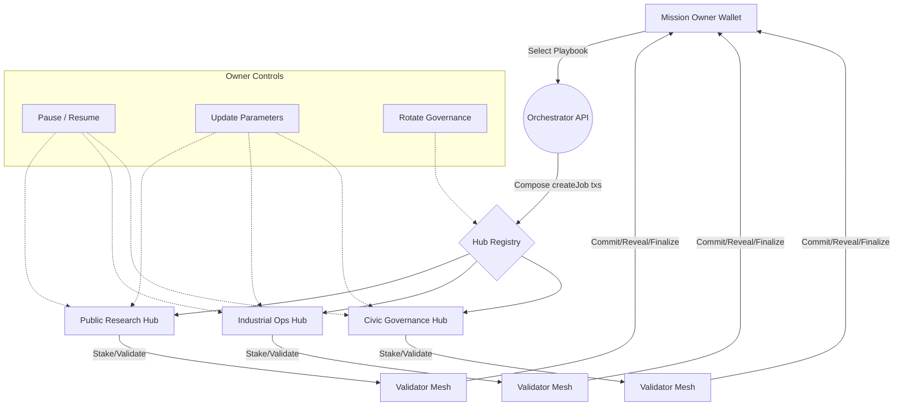

# Sovereign Mesh — Planetary Network-of-Networks Demonstration

> **Sovereign Mesh** turns AGI Jobs v0 (v2) into a civilization-scale orchestrator that any mission owner can steer. This demo proves how a non-technical leader can coordinate foresight, research, optimization, and knowledge hubs spanning the planet through a single, wallet-first interface. Every capability is delivered using the production AGI Jobs v2 contracts — no new solidity is required.

## Why this demo matters

- **Planet-scale reach** — multiple autonomous hubs (distinct JobRegistry + module deployments) are woven into one mesh. Missions can target one or many hubs with a single intent.
- **Owner governed** — the hub owner retains full control (pause, rotate governance, tune parameters) through documented, linked controls.
- **Wallet-first empowerment** — non-technical users launch, fund, validate, and settle missions entirely from their Ethereum wallet.
- **Production discipline** — TypeScript/React orchestrator, fully typed Node backend, Hardhat scenarios, Cypress smoke test, and CI integration keep the demo enterprise grade.

## Directory layout

```text
sovereign-mesh/
├─ README.md
├─ config/
│  ├─ mesh.ui.config.json      # UI + network targets
│  ├─ hubs.mainnet.json        # Hub registry + contract addresses
│  ├─ playbooks.json           # Mission blueprints editable by the owner
│  └─ actors.json              # Sample sponsor identities / personas
├─ server/                     # Node/Express orchestrator
│  ├─ index.ts
│  ├─ package.json
│  ├─ package-lock.json
│  └─ tsconfig.json
├─ app/                        # React + Vite command console
│  ├─ index.html
│  ├─ package.json
│  ├─ package-lock.json
│  ├─ tsconfig.json
│  ├─ vite.config.ts
│  └─ src/
│     ├─ App.tsx
│     ├─ main.tsx
│     └─ lib/
│        ├─ commit.ts
│        ├─ ethers.ts
│        ├─ format.ts
│        └─ subgraph.ts
├─ scripts/                    # Deployment + governance automation
│  ├─ deployMesh.ts
│  ├─ rotateMeshGovernance.ts
│  └─ seedMesh.ts
├─ test/
│  └─ SovereignMesh.t.ts       # Dual-hub lifecycle Hardhat scenario
└─ cypress/
   └─ e2e/
      └─ sovereign-mesh.cy.ts  # UI smoke test
```

## Mission pipeline overview



## Quickstart (non-technical operator)

1. **Clone + install**
   ```bash
   git clone https://github.com/MontrealAI/AGIJobsv0.git
   cd AGIJobsv0
   npm ci
   ```
2. **Populate hub addresses**
   - Update [`config/hubs.mainnet.json`](config/hubs.mainnet.json) with the contracts of each deployed AGI Jobs v2 hub (mainnet, testnet, or local Hardhat).
   - Optionally run `npx hardhat run demo/sovereign-mesh/scripts/deployMesh.ts --network localhost` to deploy reference hubs for local rehearsals.
3. **Run the orchestrator API**
   ```bash
   cd demo/sovereign-mesh/server
   npm install
   npm run dev
   ```
4. **Launch the Sovereign Mesh console**
   ```bash
   cd ../app
   npm install
   npm run dev
   ```
   Visit http://localhost:5178 — connect your wallet, choose a hub, and orchestrate missions.
5. **(Optional) Seed showcase jobs**
   ```bash
   cd ../../..
   npx hardhat run demo/sovereign-mesh/scripts/seedMesh.ts --network localhost
   ```
6. **Rotate governance safely**
   ```bash
   export GOVERNANCE_SAFE=0xYourSafe
   npx hardhat run demo/sovereign-mesh/scripts/rotateMeshGovernance.ts --network mainnet
   ```

## User experience tour

| Section | What it delivers |
| --- | --- |
| **Connect & Select Hub** | Wallet-first connect button + hub selector that hydrates live jobs via The Graph. |
| **Create Job** | Reward + URI form that composes a `createJob` transaction with sensible deadlines and spec hash. |
| **Participate** | Validators stake, commit, reveal, and finalize in a human-friendly workflow (salts handled automatically). |
| **Owner Control Center** | Governance wallet can pause/unpause hubs, retune validation cadence, adjust staking economics, and push identity registry updates without leaving the console. |
| **Mission Playbooks** | Dynamic preview of sponsors, total rewards, and cross-hub deliverables with one-click instantiation. |
| **Mesh Sponsors & Actors** | Configurable roster of planetary sponsors with mission-ready taglines to humanize the mesh. |
| **Owner Panels** | Direct links to every hub contract write interface on Etherscan for immediate governance actions. |

## Production-grade guarantees

- **No private keys on the server** — the Express orchestrator only returns unsigned transactions; the wallet signs everything.
- **Config-driven** — missions, hubs, actors, RPC endpoints, and presentation can be updated by editing JSON files.
- **Typed + tested** — Hardhat scenario covers dual-hub lifecycle, Cypress assures the UI boots, TypeScript builds enforced in CI.
- **CI enforced** — `.github/workflows/ci.yml` includes the Sovereign Mesh build job so every PR keeps the demo green.
- **Owner-safe orchestration** — the console’s Owner Control Center composes pause/unpause and parameter tuning transactions directly for the governance wallet.

## Mission blueprint editing

Playbooks live in [`config/playbooks.json`](config/playbooks.json). Add new missions or adjust rewards by editing JSON — no code changes required. Each step uses the format `"stage@hub"` to map actions to hubs, supports rich `description` fields, and can declare a `sponsor` referencing an entry in [`config/actors.json`](config/actors.json).

`actors.json` accepts `flag`, `name`, and optional `tagline` strings so the interface can introduce sponsors and mission owners in a narrative, human-readable way.

## Identity and governance

- Use the **Allowlist (dev)** button only during rehearsals. In production rely on ENS or allowlist Merkle roots configured in the IdentityRegistry.
- Run `rotateMeshGovernance.ts` to hand control to a Gnosis Safe or timelock contract.
- The Owner Panels link directly to ValidationModule, JobRegistry, StakeManager, IdentityRegistry, and optional FeePool write tabs on Etherscan.

## Testing

```bash
# Hardhat integration test
npm test -- --grep "Sovereign Mesh"

# Cypress UI smoke (requires `npm run dev` for both server and app)
npx cypress run --spec demo/sovereign-mesh/cypress/e2e/sovereign-mesh.cy.ts
```

## Deployment

1. Build the orchestrator: `npm run build` inside `server/`.
2. Build the console: `npm run build` inside `app/` (outputs static bundle under `dist/`).
3. Serve the static bundle behind any CDN (S3, Cloudflare, IPFS). Run the Node orchestrator behind HTTPS with access control if desired.

## Next frontiers

- Integrate ENS workflows in the validator UX.
- Stream mission telemetry via websockets and subgraph subscriptions.
- Extend playbooks with branching logic and automated dispute escalation triggers.

Sovereign Mesh shows how AGI Jobs v0 (v2) becomes the command deck for planetary coordination — a non-technical user orchestrates superintelligent capabilities with clarity, safety, and unstoppable scale.
