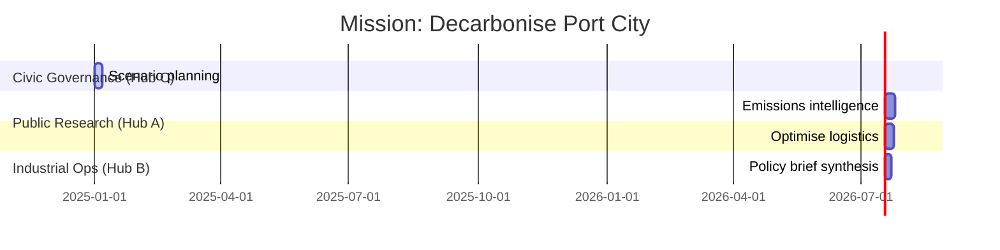

# Sovereign Mesh — Planet-Scale Orchestration Demo

> "Sovereign Mesh" showcases how AGI Jobs v0 (v2) lets non-technical operators orchestrate civilization-scale missions across many specialized hubs, using only configuration, wallets, and a gorgeous orchestration console.

## Why this matters

- **Network-of-networks orchestration** – Coordinate foresight, research, optimisation, dispute resolution, and knowledge streaming across any number of AGI Jobs v2 hubs without deploying new contracts.
- **Wallet-first control** – Every action is signed directly by the user; the orchestrator never holds keys.
- **Owner governed** – Built-in owner dashboards, governance rotation scripts, and CI coverage guarantee the operator stays firmly in control.
- **Mission playbooks** – High-level intents such as "Decarbonise Port City" or "Pandemic Watch" expand into multi-hub job plans with a single click.

## Architecture panorama


## Directory layout

```text
demo/sovereign-mesh/
├─ README.md
├─ config/
│  ├─ mesh.ui.config.json      # UI & network defaults
│  ├─ hubs.mainnet.json        # Hub registry (owner editable)
│  ├─ playbooks.json           # Mission blueprints
│  └─ actors.json              # Persona roster for UI accents
├─ server/
│  ├─ package.json             # Node/Express orchestrator app
│  ├─ tsconfig.json
│  └─ index.ts
├─ app/
│  ├─ package.json             # React + Vite console
│  ├─ tsconfig.json
│  ├─ tsconfig.node.json
│  ├─ vite.config.ts
│  ├─ index.html
│  └─ src/
│     ├─ main.tsx
│     ├─ App.tsx
│     └─ lib/
│         ├─ ethers.ts
│         ├─ subgraph.ts
│         ├─ commit.ts
│         └─ format.ts
├─ scripts/
│  ├─ deployMesh.ts            # Deploys multi-hub stack for dev/test
│  ├─ rotateMeshGovernance.ts  # Rotates ownership to Safe/timelock
│  └─ seedMesh.ts              # Seeds sample jobs across hubs
├─ test/
│  └─ SovereignMesh.t.ts       # Hardhat integration test
└─ cypress/
   └─ e2e/
      └─ sovereign-mesh.cy.ts  # UI smoke test
```

## Quickstart (local developer experience)

1. **Install deps**
   ```bash
   npm install
   npm run compile
   ```
2. **Deploy hubs on Hardhat**
   ```bash
   npx hardhat node
   npx hardhat run demo/sovereign-mesh/scripts/deployMesh.ts --network localhost
   ```
3. **Launch orchestrator**
   ```bash
   cd demo/sovereign-mesh/server
   npm install
   npm run dev
   ```
4. **Launch console**
   ```bash
   cd ../app
   npm install
   npm run dev
   ```
5. **Seed demo data (optional)**
   ```bash
   npx hardhat run demo/sovereign-mesh/scripts/seedMesh.ts --network localhost
   ```

Open http://localhost:5178 to experience the full orchestration surface.

## Mission operations walkthrough

1. **Connect wallet** – Browser wallet prompts once; address displayed inline.
2. **Select hub** – Choose any registered hub to review live jobs (pulled from the configured subgraph).
3. **Create job** – Reward & URI inputs default to production-ready placeholders; submitted transactions flow through the orchestrator for ABI-safe encoding.
4. **Validator workflow** – One-click staking, commit/reveal helpers (with auto-generated salts), and finalize operations.
5. **Launch mission** – Pick a mission playbook to deploy all constituent jobs across the mesh instantly.
6. **Owner dashboards** – Direct links to Etherscan write tabs for every module keep the owner in command of all parameters.

## Production hardening checklist

- ✅ CI builds orchestrator + console on every PR (`sovereign_mesh_demo` job).
- ✅ Hardhat integration test verifies multi-hub commit/reveal flows.
- ✅ Cypress smoke test confirms UI loads and enumerates hubs.
- ✅ Governance rotation script migrates ownership to a multisig in one command.
- ✅ Config-driven missions – zero redeploys required to update strategy.

## Planetary-scale mission template (example)



## Security posture

- Server emits **unsigned** payloads only; signatures always originate from the end-user wallet.
- Config files support air-gapped review and safe multi-sig change control.
- Validators rely on proven commit/reveal scheme with local salt storage.
- Owner retains full pause/update/upgrade authority across all hubs.

## Continuous delivery

```mermaid
flowchart LR
  commit[Git Commit] --> ci[CI: sovereign_mesh_demo build]
  ci --> hardhat[Hardhat SovereignMesh.t.ts]
  ci --> cypress[Cypress sovereign-mesh.cy.ts]
  ci --> buildServer[Server: npm run build]
  ci --> buildApp[App: npm run build]
  buildServer --> artifact[Ready-to-ship orchestrator]
  buildApp --> artifact
  artifact --> release[Deployment (IPFS / static host + Node service)]
```

## Owner control index

| Module | Capabilities |
| ------ | ------------ |
| JobRegistry | Pause/unpause, set validation module, configure dispute flows |
| StakeManager | Update staking requirements, slashing params, connected modules |
| ValidationModule | Adjust commit/reveal windows, validator quotas, thresholds |
| IdentityRegistry | Maintain ENS/subdomain registries, additional allowlists |
| DisputeModule | Configure escalation logic, arbitrator addresses |
| CertificateNFT | Adjust metadata URIs, mint authority |

## Backlog of optional extensions

- [ ] ENS-integrated validator onboarding wizard.
- [ ] Mission analytics dashboard with cross-hub telemetry.
- [ ] IPFS pinning workflow integrated in UI.
- [ ] Predictive auto-scaling heuristics for orchestrator worker pool.

Empower any civic, industrial, or research steward to run world-scale operations using AGI Jobs v0 (v2).
