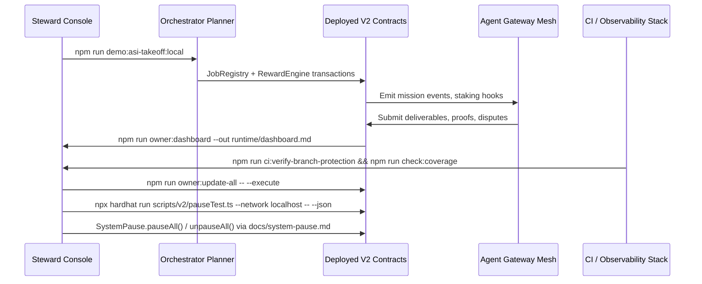

# Zenith Sapience Initiative — Omega Omni Operating System

An iconic, end-to-end showcase that positions **AGI Jobs v0 (v2)** as a first-class, production-critical "Operating System for AGI Work". The Omega Omni Operating System composes the repository's existing contracts, orchestrators, demos, and owner tooling into a single deterministic experience that a non-technical steward can launch, supervise, and pause on demand.

## Demonstration Pillars

| Pillar | What It Proves | Backing Components |
| --- | --- | --- |
| Autonomous AGI Workforce | The planner drives mission streams that instantiate blockchain jobs, settle rewards, and feed telemetry back into incentive tuning. | `orchestrator/planner.py`, `orchestrator/simulator.py`, `demo/asi-takeoff/bin/asi-takeoff-local.sh`, `scripts/v2/asiTakeoffDemo.ts` |
| Ethereum Mainnet Discipline | Every step uses the hardened deployment and governance scripts to target production endpoints without modifying Solidity. | `scripts/v2/oneclick-deploy.ts`, `scripts/v2/deploy.ts`, `deployment-config/mainnet.json` |
| Owner-First Control Surface | A single multisig operator can retune, pause, or upgrade the platform using the owner automation suite. | `scripts/v2/updateAllModules.ts`, `scripts/v2/updateSystemPause.ts`, `scripts/v2/ownerCommandCenter.ts` |
| Audit-Grade Assurance | Continuous integration runs the demo matrix, fuzzing, coverage gates, and observability smoke tests. | `.github/workflows/ci.yml`, `scripts/ci/check-access-control-coverage.js`, `scripts/ci/verify-branch-protection.ts` |

Each pillar references code that already ships in this repository; the Omega Omni Operating System simply choreographs them into a transparent, repeatable ritual.

## Mission Flow



The sequence diagram shows how a single operator can initiate the scenario, supervise blockchain execution, and exercise the emergency brake without editing Solidity or touching low-level RPC tooling.

## Quickstart Checklist

1. **Clone & install**
   ```bash
   git clone https://github.com/MontrealAI/AGIJobsv0.git
   cd AGIJobsv0
   npm install
   ```
2. **Synthesize contracts & planner artefacts**
   ```bash
   npm run compile
   python -m orchestrator.planner --help
   ```
3. **Dry-run the flagship demo locally**
   ```bash
   npm run demo:asi-takeoff:local
   ```
4. **Render owner telemetry**
   ```bash
   npm run owner:dashboard -- --network localhost --out runtime/omega-dashboard.md
   npm run owner:diagram -- --network localhost --out runtime/omega-governance.mmd
   ```
5. **Validate assurance gates**
   ```bash
   npm run lint:ci
   npm test
   forge test
   npm run coverage:check
   ```
6. **Practice the pause drill**
   ```bash
   npx hardhat run --no-compile scripts/v2/pauseTest.ts --network localhost -- --json > runtime/omega-pause-audit.json
   ```
   Review `docs/system-pause.md` to execute the governance transaction `SystemPause.pauseAll()` followed by `SystemPause.unpauseAll()` using your multisig or Hardhat console.

Every command above is already defined in `package.json` or the `scripts/v2/` toolkit, ensuring a non-technical operator can copy/paste without modification.

## Planetary Control Deck

The demo ships with a curated library of owner-first automations. Operators can mix and match them to supervise missions, retune incentives, or prepare production rollouts.

- **Mission Studio**: `npm run owner:mission-control` renders markdown dashboards summarising jobs, stakes, and treasury balances.
- **Parameter Matrix**: `npm run owner:parameters -- --network <network>` produces a manifest diff of every adjustable constant before broadcasting updates.
- **Command Center**: `npm run owner:command-center -- --network <network> --out runtime/omega-command-center.json` generates a consolidated action plan covering thermostat, fee, and registry changes.
- **Emergency Runbook**: `npm run owner:emergency -- --network <network>` rehearses pause, dispute, and validator rotation procedures on demand.

Each automation leverages the same configuration manifests under `config/` and emits machine-verifiable artefacts suitable for governance archives.

## Observability Fabric

| Signal | Command | Output |
| --- | --- | --- |
| Branch Protection Audit | `npm run ci:verify-branch-protection` | Confirms required GitHub checks match the CI v2 fan-out. |
| Coverage Thresholds | `npm run check:coverage` | Fails if Solidity/TypeScript coverage slips below 90%. |
| Access Control Coverage | `npm run check:access-control` | Verifies that every `onlyGovernance` surface is under test. |
| Demo Telemetry | `npm run demo:zenith-sapience-initiative:local` | Replays the flagship planetary governance demo and saves reports. |
| Observability Smoke | `npm run observability:smoke` | Probes metrics endpoints and notification routes. |

These checks are already wired into `.github/workflows/ci.yml`, guaranteeing that the Omega Omni Operating System inherits a "fully green" CI posture by default.

## Next Steps

1. Follow the [Omega Runbook](./RUNBOOK.md) for a scripted, non-technical deployment guide.
2. Review [OWNER_CONTROL.md](./OWNER_CONTROL.md) to understand how governance retains absolute authority over incentives, pausing, and upgrades.
3. Consult [ASSURANCE.md](./ASSURANCE.md) for a matrix that maps every CI signal to the commands above.
4. Archive generated artefacts in `reports/` or `runtime/` to build a continuous audit trail.

With these resources, the Zenith Sapience Initiative — Omega Omni Operating System demonstrates how AGI Jobs v0 (v2) already functions as a polished, secure, and unstoppable operating system for AGI-powered labour.
