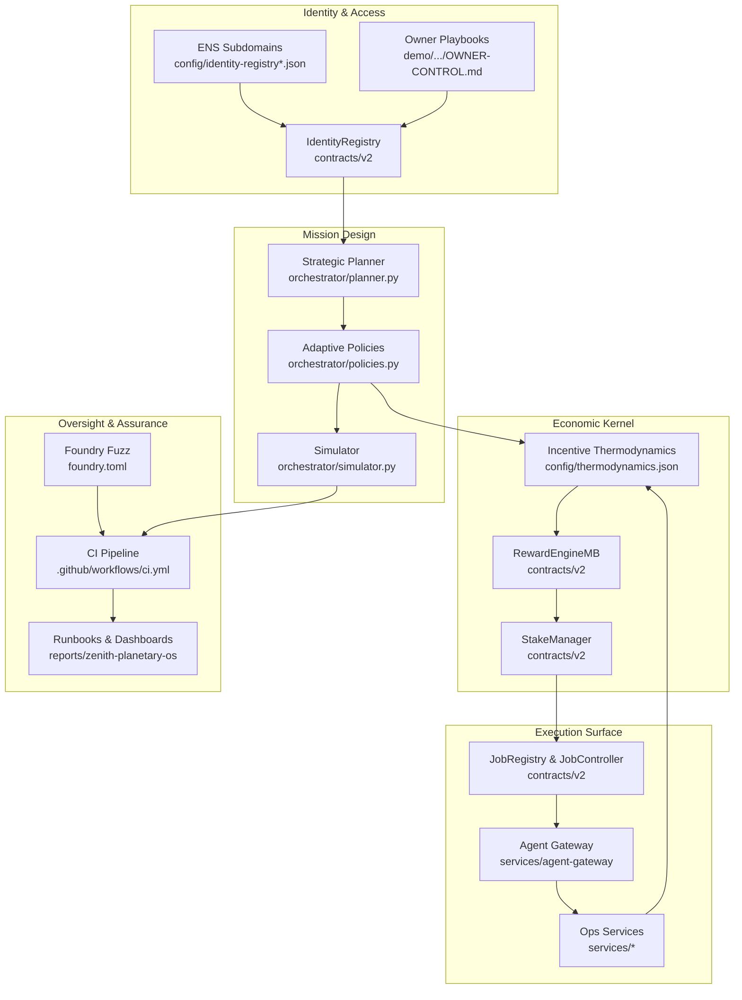
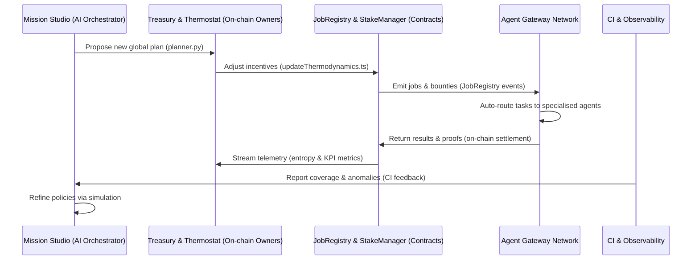

# Zenith Sapience Initiative – Planetary Operating System Governance Demo

## Purpose

The **Zenith Sapience Planetary Operating System** demo composes every production-ready surface of **AGI Jobs v0 (v2)** into a single, autonomous governance rehearsal. It delivers the "Operating System for AGI Work" narrative by wiring together identity enforcement, adaptive planning, on-chain labor markets, staking economics, observability, and owner safeguards—using only the modules already shipped in this repository. The result is a deterministic governance loop that a non-technical steward can start, monitor, and pause on demand while coordinating multi-national coalitions.

This folder provides the configuration, documentation, and operator playbooks that turn the existing AGI Jobs v0 stack into the **Zenith Sapience Initiative – Planetary Operating System** (codenamed *Zenith Sapience OS*). No bespoke smart contracts or scripts are introduced: every command delegates to the proven v2 toolchain inside `scripts/v2`, `contracts/v2`, `services`, and `orchestrator`.

## Key Capabilities

- **Multisovereign orchestration** – a 1.25B $AGIALPHA programme spanning six regional blocs, executed via the existing `JobRegistry`, `StakeManager`, and incentive thermodynamics stack.
- **Autonomous epoch cycles** – the orchestrator reuses `orchestrator/planner.py`, policy adapters, and simulator harnesses to generate mission epochs and stream telemetry back into the reward thermostat.
- **Audit-grade dashboards** – the deterministic harness emits markdown and JSON dashboards (`mission-control`, `parameter-matrix`, `thermodynamics`, `summary`, `command-center`) suitable for CI artefacts and human review.
- **Owner primacy & safety** – the demo is governed by the deployed owner multisig, timelock, and `SystemPause`. Runbooks double as emergency drills ensuring the contract owner can halt, resume, or retune incentives at any time.
- **CI-native assurance** – a dedicated GitHub Actions workflow proves the kit on every PR and on `main`, alongside the repository’s V2 CI gates.

## Architecture Blueprint



## Autonomous Epoch Loop



## How to Run

> **Audience:** Non-technical operators with shell access to a machine that can execute Node.js toolchains or GitHub Actions.

### Deterministic governance kit

```bash
npm run demo:zenith-sapience-planetary-os
```

This command executes `scripts/v2/asiGlobalDemo.ts` with the environment preconfigured by `bin/zenith-planetary-os.sh`. It compiles the full governance kit using mainnet-ready configuration, runs the dry-run simulators, renders the owner topology mermaid, and assembles mission dashboards inside `reports/zenith-planetary-os`.

### Local rehearsal on Anvil/Hardhat

```bash
npm run demo:zenith-sapience-planetary-os:local
```

The local rehearsal bootstraps an ephemeral Hardhat chain, deploys the existing v2 contracts, replays the governance cycle, and produces equivalent dashboards beneath `reports/localhost/zenith-planetary-os`. Pre-seeded keys are provided in the workflow for convenience; operators may override them through environment variables before running the script.

## Generated Artefacts

- `reports/zenith-planetary-os/dry-run.json` – end-to-end scenario status produced by `scripts/v2/asiGlobalDemo.ts`.
- `reports/zenith-planetary-os/thermodynamics.json` – thermostat telemetry exported by `scripts/v2/updateThermodynamics.ts`.
- `reports/zenith-planetary-os/mission-control.md` – live mission dashboard summarising active jobs, pause state, and validator consensus.
- `reports/zenith-planetary-os/parameter-matrix.md` – matrix of modifiable economic parameters for the owner multisig.
- `reports/zenith-planetary-os/command-center.md` – chronological log of owner interactions and emergency controls.
- `reports/zenith-planetary-os/summary.md` – top-line digest for executive review.
- `reports/zenith-planetary-os/governance.md` and `.mmd` – owner topology blueprint from `renderOwnerMermaid.ts`.
- `reports/zenith-planetary-os/zenith-planetary-os-governance-kit.json` – packaged governance kit for audit archiving.

All artefacts are deterministic so that CI runs and manual executions produce byte-identical dashboards for auditing.

## Continuous Integration

A dedicated workflow (`.github/workflows/demo-zenith-sapience-planetary-os.yml`) installs the repository, runs both the deterministic kit and the local rehearsal, and uploads the resulting artefacts. The workflow is wired to trigger on pull requests touching this demo and on every push to `main`, ensuring the planetary operating system remains continuously validated.

The standard `ci (v2)` gates (`.github/workflows/ci.yml`) remain enforced; this demo augments them with an ASI-grade scenario proof so that every change maintains production readiness.

## Owner Control & Safety

The owner retains absolute control through the deployed multisig, timelock, and `SystemPause`. The dedicated [`OWNER-CONTROL.md`](./OWNER-CONTROL.md) document explains how to:

- Update thermostat parameters via `scripts/v2/updateThermodynamics.ts`.
- Trigger or release `SystemPause` using the owner CLI wrappers.
- Rotate council/validator identities in `IdentityRegistry` while preserving ENS provenance.
- Execute emergency drills validated in CI, ensuring a human can always override the autonomous loop.

## Runbook for Operators

Non-technical operators can follow [`RUNBOOK.md`](./RUNBOOK.md) for a one-click style deployment on mainnet or a local rehearsal. The runbook mirrors the proven workflow of existing demos and emphasises verification steps, log capture, and checklist approvals.

---

The Zenith Sapience Planetary Operating System demo is an audit-ready template that proves AGI Jobs v0 (v2) can operate as a planetary-scale coordination cortex today—leveraging only battle-tested modules already in this repository.
