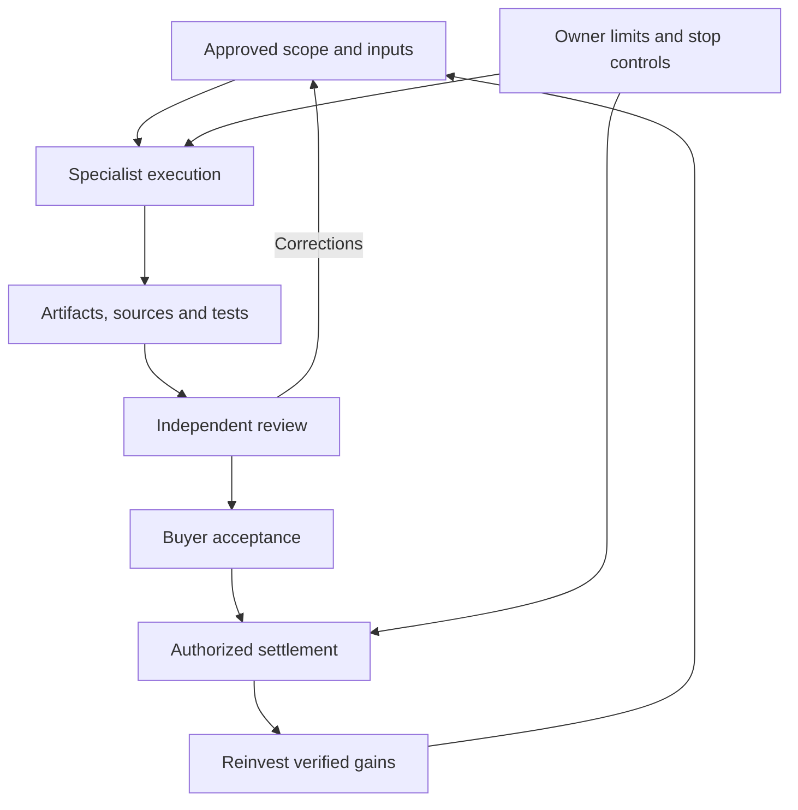

# Zenith Hypernova · AGI Jobs

**Authorized work. Reviewable evidence. Accountable scale.**

AGI Jobs is designed as a scalable machine labor layer for authorized, lawful screen-based work—coordinating specialized agents to execute tasks, produce reviewable evidence, and support independent verification and settlement across a broad range of computer-based workflows.

[Open the interactive workbench](https://montrealai.github.io/AGIJobsv0/experiments/zenith-hypernova/) · [Runbook](RUNBOOK.md) · [Owner controls](OWNER-CONTROL.md) · [Execution integration](INTEGRATION.md)

## Start in two minutes

The browser workbench needs no wallet, credentials or installation. Select **Analyze the mission**, inspect the calculations, then export the evidence, CSV and readable report. **Inspect the original defects** compares the preserved historical input. **Create a brief** exports one of ten computer-work proposals with explicit acceptance tests and an unfunded USDC reward ceiling.

For local operation, use the repository `.nvmrc` (Node 22.23.3):

```bash
npm run demo:zenith-hypernova:serve
# Open http://127.0.0.1:4178
npm run demo:zenith-hypernova:work
npm run demo:zenith-hypernova:task -- --type governance-audit --region EARTH
npm run demo:zenith-hypernova:test
```

The new analysis, server and unit tests use only Node built-ins. The preserved contract kit and browser QA require the root locked dependencies (`npm ci`). Run from the repository root. CLI output goes to a new directory under `reports/zenith-hypernova-work/`; `--out` selects a new destination and refuses to overwrite prior evidence.

## What is implemented

| Path | Actual behavior | Boundary |
| --- | --- | --- |
| Browser workbench / `:work` | Computes exact budgets and a dependency schedule; exports JSON, CSV, Markdown and byte-bound evidence | Synthetic plan analysis; no provider or chain calls |
| Work-order builder / `:task` | Ten templates, six research contexts, acceptance criteria, source hash and integer USDC ceiling | Proposal only; owner must approve sources, runtime, spending and reviewer |
| Evidence checker / `:review` | Recomputes arithmetic and scheduling using a separate implementation, checks every output and source hash | Content checks do not establish reviewer independence or buyer acceptance |
| Capacity model | Limits admitted work by demand, workers and reviewer hours; applies an acceptance-rate assumption | Illustrative throughput; excludes costs, rework, disputes and downtime |
| `demo:zenith-hypernova` | Preserved ASI Global governance-kit generator with Hypernova plan and report scope | Shared protocol rehearsal, not execution of the plan’s 11 physical projects |
| `demo:zenith-hypernova:local` | Isolated localhost production-contract lifecycle using the shared ASI Global mission specification | Local mock assets and receipts; not mainnet or paid customer work |

The $40T/year ceiling is a **user-supplied scenario assumption**, not an independently established market estimate, revenue forecast or guarantee of reachable demand. Scaling toward planetary and stellar infrastructure is a long-term ambition; the implemented entry point is useful, verifiable digital work.

## Corrected scenario, preserved history

All six regions, 11 jobs, dependencies, rewards, durations, participant roles and original Mermaid source remain. The original input is available byte-for-byte in [`fixtures/legacy-project-plan.json`](fixtures/legacy-project-plan.json).

The original plan allocated 1.173 billion of 1.25 billion scenario units. Regional rewards exceeded allocations by 7 million (Africa), 28 million (MENA) and 26 million (Earth). The correction assigns 61 million of the 77 million unallocated units to those regions and adds the remaining 16 million to the governance reserve. Total planned rewards remain 1.128 billion; remaining budget is 122 million. No job reward was changed.

`deadlineDays` now explicitly means **stage duration after all dependencies are accepted**. Under unlimited parallel resources, the critical path is 286 days. It is not an absolute due date or a real infrastructure-delivery prediction. AGIALPHA is retained as the legacy synthetic accounting unit. New work proposals use USDC; this demo does not implement or certify a USDC settlement contract.

## Systems map — original source preserved

```mermaid
flowchart LR
    Operators((Mission Owners)) --> demo_zenith_sapience_initiative_supra_sovereign_hypernova_governance[[Demo → Zenith Sapience Initiative Supra Sovereign Hypernova Governance]]
    demo_zenith_sapience_initiative_supra_sovereign_hypernova_governance --> Core[[AGI Jobs v0 (v2) Core Intelligence]]
    Core --> Observability[[Unified CI / CD & Observability]]
    Core --> Governance[[Owner Control Plane]]
```

## From work to accountable scale



Useful software, research, analysis and editable documents are the first layer. Reliable delivery can support energy and industrial research; proven improvements can finance more compute and productive capacity. Each stage needs its own evidence and authority.

## Verification and governance

Every change lands through a pull request. Required checks must pass before merge. The Hypernova workflow exercises the retained kit/local-chain paths and the new analysis tests; Pages checks the published browser experience, mobile layouts and accessibility. The [validation record](VALIDATION.md) states the executed scope and remaining live commissioning requirements.

Use [RUNBOOK.md](RUNBOOK.md) for exact commands, [OWNER-CONTROL.md](OWNER-CONTROL.md) for preview and signing boundaries, and [INTEGRATION.md](INTEGRATION.md) for current OpenClaw / OpenAI / ChatGPT Work handoff guidance. Secrets stay outside the repository and public evidence. Original governance kits, diagrams and local receipts remain inspectable.
