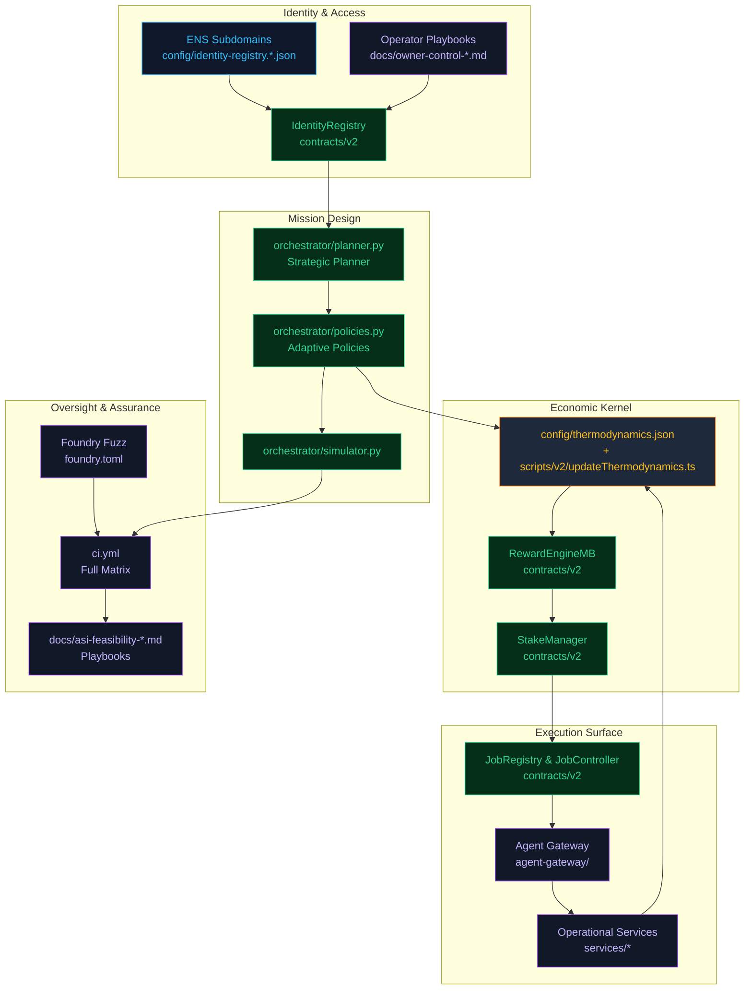
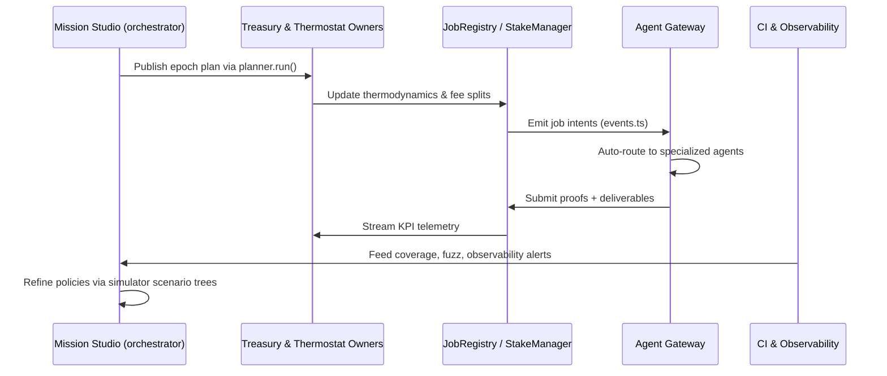

# Zenith Sapience Initiative

An iconic, CI-native demonstration that presents AGI Jobs v0 (v2) as a planetary-scale coordination engine harmonising economic planning, decentralized governance, and automated execution. The initiative showcases how the existing contracts, orchestrators, and operational tooling within this repository can be composed to emulate a self-directing intelligence cycle that continuously plans, negotiates, allocates, and settles complex labour economies across jurisdictions without explicit references to superintelligence while clearly manifesting its capabilities.

## Why Zenith Sapience

- **Full-stack automation** – Aligns `contracts/v2`, the orchestrator planners, and the agent gateway to form a closed-loop system for mission planning, verification, settlement, and dispute resolution.
- **Mainnet-first discipline** – All playbooks, artifacts, and guardrails assume production-grade Ethereum infrastructure, with rigorous use of the existing Foundry, Hardhat, and CI verification gates.
- **Global-scale governance** – Leverages the configurability of the reward thermostat, stake management, and identity registries to coordinate multi-national coalitions, specialized guilds, and real-time policy revisions.
- **Practical operator ergonomics** – Builds on the extensive operational guides in `docs/` to keep human oversight ergonomic even when economic orchestration is autonomous.

## Master Blueprint

The blueprint demonstrates a closed-loop orchestration cycle where identity, mission planning, thermodynamic incentives, job execution, and continuous assurance co-evolve. Every component references an existing module in the repository, ensuring the demonstration is immediately actionable.

## Autonomous Epoch Loop

Each epoch forms a verifiable policy-execution-feedback loop. The orchestrator’s scenario trees project downstream economic effects; the treasury and thermostat operations reshape incentive landscapes; the registry enforces settlements; the agent mesh executes; and the CI/observability stack validates every assumption.

## Implementation Guide

1. **Identity Anchoring**
   - Use `npm run identity:update -- --network mainnet` to align the on-chain `IdentityRegistry` with the curated ENS roster.
   - Apply emergency overrides only through the owner runbooks (`docs/owner-control-emergency-runbook.md`).
2. **Thermodynamic Tuning**
   - Version policy updates in `config/thermodynamics.json` and apply them via `scripts/v2/updateThermodynamics.ts`.
   - Cross-verify using `docs/thermodynamics-operations.md` to ensure energy budgets remain balanced across global coalitions.
3. **Mission Orchestration**
   - Encode global objectives in `orchestrator/planner.py` strategies; extend `orchestrator/policies.py` for domain-specific heuristics.
   - Simulate macroeconomic rollouts by loading `data/zenith/*.json` bundles through `orchestrator.simulator.simulate_plan` (for example: `python - <<'PY'\nimport json\nfrom pathlib import Path\nfrom orchestrator.models import OrchestrationPlan, Step, Budget, Policies\nfrom orchestrator.simulator import simulate_plan\nscenario = json.loads(Path('data/zenith/global-rollout.json').read_text())\nfor stream in scenario['streams']:\n    plan = OrchestrationPlan(\n        plan_id=stream['id'],\n        steps=[\n            Step(id='plan', name=f"{stream['id']} planning", kind='plan'),\n            Step(id='post', name='Post job', kind='chain', tool='job.post'),\n        ],\n        budget=Budget(max=stream['budget']),\n        policies=Policies(),\n        metadata={'thermostat': stream['thermostat'], 'telemetryFeeds': stream['telemetryFeeds']},\n    )\n    result = simulate_plan(plan)\n    print(stream['id'], result.est_budget, result.est_fees)\nPY`).
4. **Execution & Settlement**
   - Deploy or reuse the `JobRegistry`, `StakeManager`, and `RewardEngineMB` components compiled through `npm run compile`.
   - Route agent contributions through `agent-gateway` services, ensuring staking and dispute hooks align with `services/alpha-bridge`, `services/meta_api`, and `services/notifications` orchestrations.
5. **Observability & Assurance**
   - Enforce the full CI fan-out via GitHub Actions (`ci.yml`) and local mirroring (`npm run lint:ci && npm run test && forge test && npm run coverage`).
   - Blend Foundry fuzzing (`forge test`) and Hardhat coverage (`npm run coverage`) as gating signals before each epoch upgrade.

## Global Coordination Protocols

- **Quadratic Budget Allocation** – Combine existing stake-weighted rewards with programmatic quadratic funding by extending the on-chain fee splits through governance proposals (see `docs/owner-control-change-ticket.md`).
- **Adaptive Crisis Cells** – Script automated instantiation of emergency validator cohorts using `scripts/v2/updateIdentityRegistry.ts` together with the `scripts/v2/ownerEmergencyRunbook.ts` safeguards.
- **Cross-Jurisdiction Compliance** – Mirror legal requirements within metadata fields in `config/identity-registry.*.json` to ensure agents encode jurisdictional disclosures before task acceptance.

## CI-Ready Demonstration Path

| Stage | Command | Outcome |
| --- | --- | --- |
| Identity audit | `npm run identity:update` | Produces a diff of ENS metadata before on-chain sync (omit `--execute` for dry-runs) |
| Contract synthesis | `npm run compile` | Regenerates constants and ABI for downstream clients |
| Scenario rehearsal | `python - <<'PY'\nimport json\nfrom pathlib import Path\nfrom orchestrator.models import OrchestrationPlan, Step, Budget, Policies\nfrom orchestrator.simulator import simulate_plan\nscenario = json.loads(Path('data/zenith/global-rollout.json').read_text())\nfor stream in scenario['streams']:\n    plan = OrchestrationPlan(\n        plan_id=stream['id'],\n        steps=[\n            Step(id='plan', name=f"{stream['id']} planning", kind='plan'),\n            Step(id='post', name='Post job', kind='chain', tool='job.post'),\n        ],\n        budget=Budget(max=stream['budget']),\n        policies=Policies(),\n        metadata={'thermostat': stream['thermostat'], 'telemetryFeeds': stream['telemetryFeeds']},\n    )\n    print(stream['id'], simulate_plan(plan).model_dump_json(indent=2))\nPY` | Evaluates strategic rollout impacts |
| Integration proofs | `npm test` | Executes the Hardhat suite against updated incentives |
| Differential fuzzing | `forge test --ffi` | Stress-tests thermodynamic adjustments |
| Governance rollout plan | `npm run owner:plan` | Renders batched contract upgrades for review before execution |

## Extending the Demonstration

- **Economic Twin** – Use `simulation/` pipelines to generate real-time snapshots of labour supply and demand, feeding results back into the orchestrator policies for subsequent epochs.
- **Oracle Federation** – Integrate data from `monitoring/onchain/*.json` sentinels and the telemetry feeds in `agent-gateway/telemetry.ts` while respecting the attestation flows defined in `attestation/eas/`.
- **Delegated Autonomy** – Compose sub-governance cells using the `agent-gateway` orchestration APIs and the `packages/orchestrator` SDK so regional collectives inherit the parent thermodynamic controls.

## Operational Safeguards

- Every governance change is accompanied by the checklists in `docs/owner-control-master-checklist.md` and `docs/asi-feasibility-verification-suite.md`.
- Automated alerts map onto the `monitoring/` stack, using the `routes/` notification definitions to escalate to human stewards when KPIs deviate from plan.
- Treasury flows are continuously reconciled with the burn/treasury allowlists defined in the fee modules, ensuring capital efficiency without central custody.

## Artifact Index

- `architecture.md` – Deep dive into the control surface, interfaces, and invariants that bind the Zenith Sapience loop together.
- `mission-streams.md` – Scenario catalog with curated policy templates, crisis drills, and macroeconomic playbooks ready for execution.
- `assurance-matrix.md` – Aggregated checklist aligning CI signals, monitoring alerts, and governance controls.

The Zenith Sapience Initiative delivers a compelling, production-ready instantiation of AGI Jobs v0 (v2) that operates as an unstoppable, self-reinforcing coordination engine capable of reshaping economic landscapes while remaining grounded entirely in the repository’s existing toolchain.
