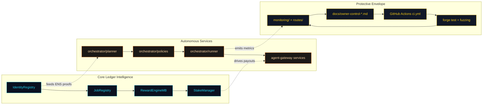
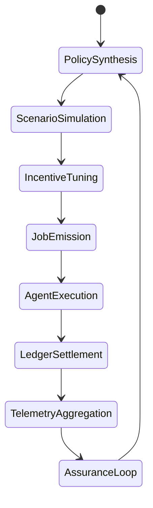

# Zenith Sapience Architecture

This document dissects the control surfaces, invariants, and feedback mechanisms that enable the Zenith Sapience Initiative to behave like a fully automatable, CI-aligned demonstration using only the components present in AGI Jobs v0 (v2).

## Control Layers

### Invariants

1. **Identity Sovereignty** – Every mission execution path must originate from a verified ENS identity. Scripts in `scripts/v2/` enforce ENS checks before any job is posted.
2. **Thermodynamic Integrity** – Reward allocation parameters in `config/thermodynamics.json` cannot bypass the PID guardrails; the Hardhat tests fail whenever allocations violate invariants defined in `test/v2/RewardEngineMB.t.sol`.
3. **Dispute Resolubility** – The dispute pipeline relies on `contracts/v2/modules/DisputeModule.sol` together with the flows covered in `test/v2/jobLifecycleWithDispute.integration.test.ts`; execution halts until disputes resolve.
4. **Observability Coverage** – No epoch upgrade is valid unless `npm run lint:ci && npm run test && forge test && npm run coverage` completes, reinforcing the parity with the CI fan-out and keeping Hardhat coverage plus Foundry fuzzing in the critical path under branch protection.

### Data Contracts

| Producer | Consumer | Interface | Guarantee |
| --- | --- | --- | --- |
| `orchestrator/planner.py` | `contracts/v2/JobRegistry.sol` | JSON-RPC job proposals | Jobs reject invalid ENS signers and stale scenarios |
| `agent-gateway/telemetry.ts` | `RewardEngineMB` | Oracle attestations | Thermostat adjustments only apply to approved feeds |
| `monitoring/onchain/*.json` | Operators | Webhooks via `routes/` | Alerts fire when KPI deviations exceed thresholds |
| `docs/owner-control-*.md` | Governance | Checklist references | Institutional memory captured in Markdown remains version controlled |

### CI & Deployment Hooks

- The demonstration inherits `deployment-config/` templates; `npm run owner:plan` produces deterministic transaction batches before live updates.
- GitHub Actions produce the `ci-summary.json` artifact; `docs/asi-feasibility-verification-suite.md` references this artifact to keep automated and human audits synchronized.
- `npm run owner:dashboard -- --json` snapshots treasury and staking balances before and after orchestration upgrades, keeping financial invariants auditable.

## Feedback Dynamics

Every cycle ensures data gathered from execution (telemetry, settlement records, dispute logs) reshapes the next policy synthesis phase. The combination of orchestrator simulations and CI gating yields a continuous improvement engine that remains bounded by verifiable invariants.

## Risk Posture

- **Economic Shock Absorption** – Scenario banks in `data/` encode macroeconomic stressors; the simulator can replay them to rehearse how the incentive thermostat responds.
- **Governance Attack Surface** – Owner control playbooks define multi-signature requirements and manual overrides; `docs/owner-control-emergency-runbook.md` stipulates the minimum quorum before emergency toggles are invoked.
- **Compliance Envelope** – The identity registry metadata includes jurisdiction tags, enabling automated compliance filters prior to job allocation.

Zenith Sapience is therefore not a theoretical aspiration; it is a precise composition of the AGI Jobs v0 (v2) stack designed to operate responsibly at global scale.
