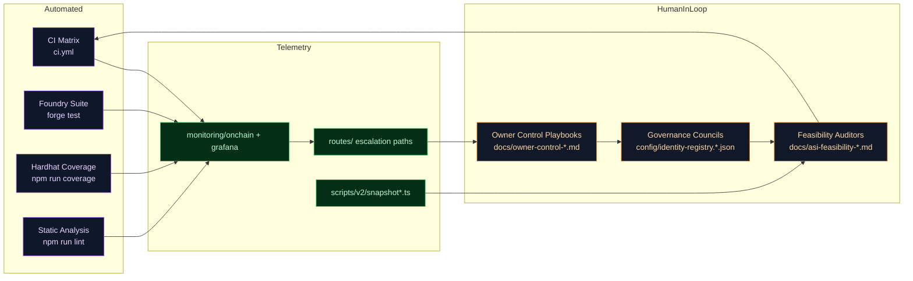

# Assurance Matrix

The assurance matrix weaves together automated checks, human playbooks, and telemetry observability to guarantee Zenith Sapience remains verifiable, resilient, and governance-aligned.

## Assurance Overview

## Verification Grid

| Domain | Automated Signal | Human Oversight | Evidence Artifact |
| --- | --- | --- | --- |
| Identity Integrity | `npm run identity:update` (without `--execute`) | ENS council review (`docs/owner-control-identity.md`) | Console diff + `docs/owner-control-identity.md` annotations |
| Incentive Thermodynamics | `forge test --match-test RewardEngineMB` | Treasury board sign-off (`docs/thermodynamics-operations.md`) | Fuzz logs + `docs/thermodynamics-operations.md` notes |
| Job Lifecycle | `npm test -- test/v2/jobLifecycle.test.ts` | Operations review (`docs/owner-control-operations.md`) | Test reports + `reports/` audit bundles |
| Treasury Flow | `npm run owner:dashboard -- --json` | Finance council checklist (`docs/owner-control-treasury.md`) | JSON snapshot exported to `reports/` |
| Disputes | `npx hardhat test --no-compile test/v2/jobLifecycleWithDispute.integration.test.ts` | Arbitration guild manual (`docs/owner-control-disputes.md`) | Test transcripts stored with post-mortems |
| Monitoring & Alerts | `npm run monitoring:validate` | Reliability guild watch rotation (`monitoring/rotation.md`) | `monitoring/onchain/*.json` status exports |

## Escalation Ladder

1. **Automated Detection** – CI, fuzzing, coverage, and monitoring jobs emit alerts into `routes/` webhooks.
2. **Operator Verification** – On-call operators consult `docs/owner-control-emergency-runbook.md` to classify severity.
3. **Council Deliberation** – Governance councils instantiated via ENS rosters convene using multi-sig confirmations.
4. **Remediation Execution** – Scripts under `scripts/v2/` execute deterministic fixes (stake rebalancing, thermostat adjustments).
5. **Post-Mortem Capture** – Findings logged into `reports/` and referenced by `docs/owner-control-audit.md` to enrich institutional knowledge.

## Continuous Evidence Trails

- CI artifacts (coverage reports, fuzz logs) are exported to `reports/` and cross-linked in `docs/asi-feasibility-verification-suite.md`.
- Treasury snapshots are hashed and notarized through existing `deploy` scripts to provide tamper-evident history.
- `simulation/` results feed the assurance matrix by demonstrating expected vs. actual outcomes across mission streams.

With this assurance matrix, Zenith Sapience offers verifiable guarantees to stakeholders while sustaining autonomous execution loops.
