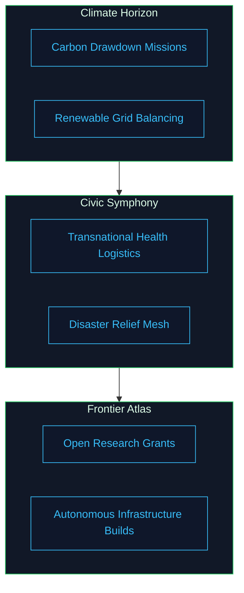

# Mission Streams Catalogue

The mission streams organize planetary-scale objectives into reusable templates. Each stream aligns orchestrator policies, contract operations, and operational safeguards using components already housed in AGI Jobs v0 (v2).

## Stream Topology



Each mission stream is catalogued below with its configuration primitives.

### Climate Horizon

- **Carbon Drawdown Missions**
  - **Objective**: Incentivize verifiable carbon sequestration projects.
  - **Policy Modules**: `orchestrator/policies.py` → extend the carbon-focused heuristics alongside the existing strategy classes.
  - **Telemetry Inputs**: `monitoring/onchain/parameter-change-sentinel.json` and `agent-gateway/telemetry.ts` to observe energy budgets.
  - **Settlement Hooks**: `contracts/v2/JobRegistry.sol` dispute handlers and `test/v2/RewardEngineMB.metrics.test.js` to validate sequestration incentives.
- **Renewable Grid Balancing**
  - **Objective**: Allocate rapid-response maintenance jobs to renewable energy operators.
  - **Policy Modules**: `orchestrator/planner.py` scenario graphs keyed to regional load forecasts.
  - **Telemetry Inputs**: Grafana dashboards in `monitoring/grafana/dashboard-agi-ops.json` for grid stress indicators.
  - **Settlement Hooks**: `contracts/v2/modules/DisputeModule.sol` flows exercised in `test/v2/jobLifecycleWithDispute.integration.test.ts` to capture downtime penalties.

### Civic Symphony

- **Transnational Health Logistics**
  - **Objective**: Coordinate vaccine and medical supply routing across jurisdictions.
  - **Policy Modules**: `orchestrator/policies.py` `LogisticsPriorityPolicy` referencing allocations curated in `data/zenith/` bundles.
  - **Telemetry Inputs**: Attestation schemas in `attestation/eas/` for verifiable delivery proofs.
  - **Settlement Hooks**: Multi-sig verification orchestrated via `scripts/v2/updateIdentityRegistry.ts` to spin up oversight councils.
- **Disaster Relief Mesh**
  - **Objective**: Launch rapid humanitarian response teams with dynamic funding envelopes.
  - **Policy Modules**: `orchestrator/runner.py` streaming updates from the persistence layer in `packages/orchestrator` connectors.
  - **Telemetry Inputs**: `monitoring/onchain/pause-governance-sentinel.json` for hazard detection triggers.
  - **Settlement Hooks**: Escrow checks in `contracts/v2/FeePool.sol` verified by `test/v2/JobRegistryTreasury.test.js` to guarantee funds reach relief workers.

### Frontier Atlas

- **Open Research Grants**
  - **Objective**: Fund high-impact research missions with milestone-based payouts.
  - **Policy Modules**: `orchestrator/planner.py` milestone DAGs using existing scheduling primitives.
  - **Telemetry Inputs**: Research attestations anchored through the `attestation/eas/` toolchain.
  - **Settlement Hooks**: Staking requirements managed by `StakeManager` and validated through `test/v2/StakeManagerAutoTune.test.js`.
- **Autonomous Infrastructure Builds**
  - **Objective**: Coordinate robotics fleets for infrastructure deployment in remote regions.
  - **Policy Modules**: `orchestrator/simulator.py` scenario sets combining supply chain and weather data.
  - **Telemetry Inputs**: Streaming telemetry captured in `agent-gateway/telemetry.ts`.
  - **Settlement Hooks**: Identity gating via `config/identity-registry.*.json` ensuring compliance with local regulators.

## Scenario Bundle Format

Mission simulations consume JSON bundles stored under `data/zenith/`. Each bundle follows the schema already used in `orchestrator/simulator.py`:

```json
{
  "name": "global-rollout",
  "epochs": 12,
  "streams": [
    {
      "id": "climate-carbon",
      "policy": "CarbonDrawdownPolicy",
      "budget": "2500000",
      "thermostat": {
        "temperature": "0.82",
        "entropyGuard": "balanced"
      },
        "telemetryFeeds": [
          "monitoring/onchain/parameter-change-sentinel.json",
          "agent-gateway/telemetry.ts"
        ]
    }
  ]
}
```

This schema is already supported by the simulator; adding Zenith-specific scenarios simply extends the dataset without requiring code changes.

## Governance Patterns

- **Epochal Budget Signals** – Use `docs/owner-control-parameter-playbook.md` to issue multi-stream parameter updates signed by the governance council.
- **Emergency Halts** – Each stream maps to a dedicated pause guardian using `contracts/v2/JobRegistry.sol` owner functions; the emergency runbook documents the call order.
- **Stake Redistribution** – Use `scripts/v2/ownerControlSurface.ts` combined with `npm run owner:plan` to dynamically shift stake across streams when telemetry detects saturation.

## Verification Checklist

| Verification Step | Tooling | Frequency |
| --- | --- | --- |
| Scenario validation | `python - <<'PY'\nimport json\nfrom pathlib import Path\nfrom orchestrator.models import OrchestrationPlan, Step, Budget, Policies\nfrom orchestrator.simulator import simulate_plan\nfor path in Path('data/zenith').glob('*.json'):\n    scenario = json.loads(path.read_text())\n    for stream in scenario['streams']:\n        plan = OrchestrationPlan(\n            plan_id=stream['id'],\n            steps=[\n                Step(id='plan', name=f"{stream['id']} planning", kind='plan'),\n                Step(id='post', name='Post job', kind='chain', tool='job.post'),\n            ],\n            budget=Budget(max=stream['budget']),\n            policies=Policies(),\n            metadata={'thermostat': stream['thermostat'], 'telemetryFeeds': stream['telemetryFeeds']},\n        )\n        summary = simulate_plan(plan)\n        print(path.name, stream['id'], summary.est_budget, summary.est_fees)\nPY` | On commit |
| Policy linting | `npm run lint:ci` | On merge request |
| Oracle sanity checks | `npm run monitoring:validate` | Daily |
| Stake drift analysis | `npm run owner:dashboard` | Weekly |

By curating mission streams in this way, Zenith Sapience delivers a catalog of immediately executable societal-scale programs.
