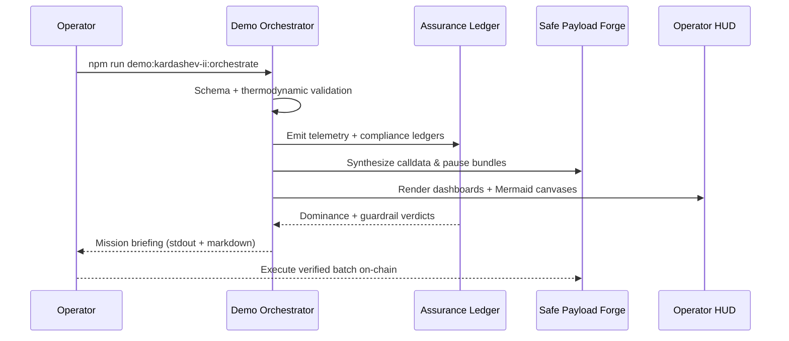

# AGI Operator Quickstart — AGI Jobs v0 (v2)

> Steward AGI Jobs v0 (v2) — the production-hardened superintelligent lattice that compounds value, autonomy, and governance the moment it boots — from a pristine checkout through the flagship demos, dashboards, and CI guardians. Every instruction below works for a non-technical operator while preserving enterprise-grade safety.

---

## 🌠 Strategic Briefing
- **Prime directive:** Operate, audit, and extend the lattice with zero downtime and zero regressions.
- **Success criteria:** Demos render cinematic artefacts, governance levers remain reversible, PRs stay all-green under the v2 CI shield, and dashboards deliver decision-ready evidence.
- **Reliability pledge:** All commands align with the live repository (see [`package.json`](../package.json) and workflow manifests under [`.github/workflows/`](../.github/workflows/)).

```mermaid
flowchart LR
  classDef nexus fill:#0f172a,stroke:#38bdf8,color:#e0f2fe,font-weight:bold;
  classDef demos fill:#052e16,stroke:#22c55e,color:#ecfdf5,font-weight:bold;
  classDef surfaces fill:#4c0519,stroke:#fb7185,color:#ffe4e6,font-weight:bold;
  classDef ci fill:#111827,stroke:#a855f7,color:#ede9fe,font-weight:bold;

  Nexus[(AGI Jobs v0 (v2))]:::nexus --> Protocol[contracts/\nattestation/\npaymaster/\nsubgraph/]:::nexus
  Nexus --> Intelligence[backend/\norchestrator/\nservices/\nagent-gateway/]:::nexus
  Nexus --> Surfaces[apps/operator\napps/console\napps/mission-control\napps/onebox]:::surfaces
  Nexus --> DemoVerse[demo/ + kardashev_*\n+ simulation/ + examples/]:::demos
  Nexus --> Reliability[ci/\nscripts/\ntests/\nRUNBOOK.md]:::ci

  DemoVerse --> DayOne[AGIJobs Day-One Utility]
  DemoVerse --> Kardashev[Kardashev-II Command Deck]
  DemoVerse --> EconCore[Trustless Economic Core]
  DemoVerse --> AlphaNode[AGI Alpha Node]
  DemoVerse --> MetaAgentic[Meta-Agentic Expeditions]
  DemoVerse --> Validator[Validator Constellation]
  Reliability --> Actions[GitHub Actions — v2 CI]
```

---

## 🧭 Fast Navigation
1. [Choose your environment](#-choose-your-environment)
2. [Prime the lattice](#-prime-the-lattice)
3. [Mission map](#-mission-map)
4. [Launch the demos](#-launch-the-demos)
5. [Activate operator surfaces](#-activate-operator-surfaces)
6. [Owner controls & governance](#-owner-controls--governance)
7. [Artefact logistics](#-artefact-logistics)
8. [Keep CI all-green](#-keep-ci-all-green)
9. [Daily flight plan](#-daily-flight-plan)
10. [Troubleshooting beacons](#-troubleshooting-beacons)
11. [Repository atlas](#-repository-atlas)

---

## 🛰️ Choose your environment

### Option A — GitHub Codespaces *(zero install)*
1. Visit <https://github.com/MontrealAI/AGIJobsv0> and click **Code → Codespaces → Create codespace on main**.
2. The devcontainer provisions Node.js 20.18.1, Python 3.12, Foundry, Docker CLI, and make.
3. You land inside VS Code for Web with Docker-in-Docker, cached dependencies, and CI helpers baked in.
4. Stop or delete idle workspaces to manage usage.

### Option B — Local workstation *(macOS/Linux/WSL)*
1. Install **Git**, **Docker Desktop** (or compatible), **Node.js 20.18.1** (`nvm install 20.18.1`), **Python 3.12+**, **Foundry** (`curl -L https://foundry.paradigm.xyz | bash` then `foundryup`), and optional **Git LFS** for large datasets.
2. Clone the repository:
   ```bash
   git clone https://github.com/MontrealAI/AGIJobsv0
   cd AGIJobsv0
   ```
3. Install shared dependencies once:
   ```bash
   nvm use || nvm install
   npm ci
   python -m pip install --upgrade pip
   python -m pip install -r requirements-python.txt
   python -m pip install -r requirements-agent.txt
   ```
4. Optional extras: `forge install`, `forge fmt`, or `docker compose version` for parity with CI.

---

## ⚙️ Prime the lattice

> Commands are copy–paste ready. Run them from the repository root.

1. **Compile & bundle everything** — builds TypeScript packages, compiles contracts, and ensures shared clients are ready:
   ```bash
   npm run build
   ```
2. **Install Foundry toolchain** *(if not already cached)*:
   ```bash
   foundryup
   forge build
   ```
3. **Warm the deterministic stack** (optional, but mirrors demo execution flows):
   ```bash
   # Terminal A — local chain
   anvil --chain-id 31337 --block-time 2

   # Terminal B — deploy v2 protocol modules
   npx hardhat run --network localhost scripts/v2/deploy.ts

   # Terminal C — agent gateway & core services
   npm run agent:gateway
   python -m uvicorn services.meta_api.app.main:app --reload --port 8000

   # Terminal D — operator HUDs
   npm --prefix apps/operator run dev
   npm --prefix apps/console run dev
   ```
4. **Production-parity stack (Docker Compose)** — seeds end-to-end observability and mission services:
   ```bash
   cp deployment-config/oneclick.env.example deployment-config/oneclick.env
   # populate RPC URLs, Safe keys, telemetry tokens
   docker compose up --build
   ```

---

## 🗺️ Mission map

```mermaid
gantt
  title AGI Jobs v0 (v2) Operator Constellation
  dateFormat  HH:mm
  axisFormat  %H:%M
  section Bootstrap
  Checkout & dependency install      :done, 00:00, 00:05
  Build lattice & compile contracts  :done, 00:05, 00:07
  Launch deterministic stack          :active, 00:07, 00:12
  section Demo Wave
  Day-One Utility Benchmark          :crit, 00:12, 00:20
  Kardashev-II Command Deck          :crit, 00:20, 00:32
  Validator Constellation            :crit, 00:32, 00:42
  AGI Alpha Node                     :crit, 00:42, 00:55
  Meta-Agentic Expeditions           :crit, 00:55, 01:10
  section Assurance
  Owner control sweep                :milestone, 01:10, 00:00
  CI verification                    :crit, 01:10, 01:20
  Artefact archival                  :after owner control sweep, 00:10
```



---

## 🎞️ Launch the demos

| Demo | Path | Primary command | Key artefacts |
| --- | --- | --- | --- |
| **AGIJobs Day-One Utility Benchmark** | [`demo/AGIJobs-Day-One-Utility-Benchmark`](../demo/AGIJobs-Day-One-Utility-Benchmark) | `make e2e` (after `make deps`) | HTML dashboards (`out/dashboard_*.html`), PNG scorecards, JSON telemetry, owner snapshots. |
| **Kardashev-II Command Deck** | [`demo/AGI-Jobs-Platform-at-Kardashev-II-Scale`](../demo/AGI-Jobs-Platform-at-Kardashev-II-Scale) | `npm run demo:kardashev-ii:orchestrate` | Safe calldata bundles, Dyson telemetry, Mermaid schematics, operator briefings under `output/`. |
| **Trustless Economic Core** | [`demo/Trustless-Economic-Core-v0`](../demo/Trustless-Economic-Core-v0) | `npm run run:trustless-core` *(pair with `npm run demo:economic-power` for blended scenarios)* | Hardhat-driven settlement drills, governance proofs, compliance ledgers in `demo/Trustless-Economic-Core-v0/output/`. |
| **Economic Power Vanguard** | [`demo/Economic-Power-v0`](../demo/Economic-Power-v0) | `npm run demo:economic-power` / `npm run demo:economic-power:ci` | Treasury posture reports, mission manifests, replay logs under `demo/Economic-Power-v0/output/`. |
| **Validator Constellation** | [`demo/Validator-Constellation-v0`](../demo/Validator-Constellation-v0) | `npm run demo:validator-constellation` | VRF committee tours, sentinel guardrails, compliance ledgers in `output/`. |
| **AGI Alpha Node** | [`demo/AGI-Alpha-Node-v0`](../demo/AGI-Alpha-Node-v0) | `npm run demo:agi-alpha-node` *(requires `ALPHA_NODE_PRIVATE_KEY`)* | Live dashboard (`http://localhost:<port>`), Prometheus metrics, staking and identity reports. |
| **Meta-Agentic ALPHA Expedition** | [`demo/Meta-Agentic-ALPHA-AGI-Jobs-v0`](../demo/Meta-Agentic-ALPHA-AGI-Jobs-v0) | `npm run demo:meta-agentic-alpha` | Multi-agent synthesis logs, empowerment matrices, cinematic markdown briefs. |
| **AGI Governance Alpha Series** | [`demo/agi-governance`](../demo/agi-governance) | `npm run demo:agi-governance` *(variant: `:alpha-v17`, `:full`, `:owner-diagnostics`)* | Regulatory drill transcripts, Safe payloads, attestation ledgers. |
| **Era of Experience** | [`demo/Era-Of-Experience-v0`](../demo/Era-Of-Experience-v0) | `npm run demo:era-of-experience` | Narrative exports, audit reporters, and verification logs (`reports/`). |
| **Culture-v0 Arena** | [`demo/CULTURE-v0`](../demo/CULTURE-v0) | `npm run culture:bootstrap` / `npm run culture:analytics` / `npm run culture:smoke` | Multimedia decks, timeline manifests, analytics packets. |
| **One-Box Mission Runner** | [`demo/One-Box`](../demo/One-Box) | `node --test demo/One-Box/test/diagnostics.test.cjs` *(smoke)* / `npm run demo:onebox:launch` | Deterministic orchestration, RPC drills, operator diagnostics. |

### Tactical amplifiers
- **Day-One Utility Benchmark** — explore `make alphaevolve`, `make hgm`, `make trm`, `make omni`, and `make scoreboard` for complete strategy coverage. `make ci` reproduces the GitHub workflow end-to-end.
- **Kardashev-II Sovereign Lattice** — execute `npm run demo:kardashev-ii-lattice:orchestrate` for the `stellar-civilization-lattice` profile or `npm run demo:kardashev-ii:orchestrate -- --profile stellar-civilization-lattice` to switch on the fly. Use `npm run demo:kardashev-ii:ci` or `npm run demo:kardashev-ii-lattice:ci` for CI fidelity.
- **Trustless Economic Core** — `npm run demo:economic-power:dominion` drills the mainnet dominion scenario; `npm run demo:economic-power:ci` is wired into `.github/workflows/demo-economic-power.yml`.
- **AGI Alpha Node** — pass `--config demo/AGI-Alpha-Node-v0/config/testnet.json` for dry runs, or `npm run demo:agi-alpha-node -- heartbeat --config ...` to capture planner telemetry without launching the dashboard. Use `npm run demo:agi-alpha-node:prod` to build the TypeScript bundle first.
- **Validator Constellation** — `npm run demo:validator-constellation:scenario` replays predefined VRF tours; `npm run demo:validator-constellation:operator-console` prints mission controls for regulators. `npm run demo:validator-constellation:ci` mirrors the workflow `demo-validator-constellation.yml`.
- **Meta-Agentic Expeditions** — combine with `npm run test:meta-agentic-alpha` and `npm run demo:meta-agentic-alpha -- --interactive --scenario demo/Meta-Agentic-ALPHA-AGI-Jobs-v0/scenario/baseline.json` to explore hybrid orchestration logs (duplicate `baseline.json` to craft bespoke sovereign meshes).



---

## 🖥️ Activate operator surfaces

| Surface | Path | Start command | Notes |
| --- | --- | --- | --- |
| **Operator Console** | [`apps/operator`](../apps/operator) | `npm --prefix apps/operator run dev` | Next.js HUD for mission scheduling, integrates Kardashev & Day-One artefacts. |
| **Console (analytics)** | [`apps/console`](../apps/console) | `npm --prefix apps/console run dev` | Visual analytics, scoreboard overlays, and governance monitors. |
| **Mission Control** | [`apps/mission-control`](../apps/mission-control) | `npm --prefix apps/mission-control run dev` | Executive overview combining telemetry, CI, and owner controls. |
| **OneBox UI** | [`apps/onebox`](../apps/onebox) | `npm --prefix apps/onebox run dev` | Mission runner for deterministic rehearsals; integrates with One-Box demo tests. |
| **Validator UI** | [`apps/validator-ui`](../apps/validator-ui) | `npm --prefix apps/validator-ui run dev` | Visualises Validator Constellation scenarios; includes VRF dashboards. |
| **Enterprise Portal** | [`apps/enterprise-portal`](../apps/enterprise-portal) | `npm --prefix apps/enterprise-portal run dev` | Contract deliverable verification for stakeholders; wired into CI smoke tests. |

All surfaces honour `.env.example` files inside each application folder. Copy and customise them before `npm run dev` when connecting to external RPC endpoints.

---

## 🛡️ Owner controls & governance

### Day-One Utility owner macros
```bash
cd demo/AGIJobs-Day-One-Utility-Benchmark
make deps
make owner-show
make owner-set KEY=platform_fee_bps VALUE=220
make owner-toggle
make owner-reset
```
These mutate `config/owner_controls.yaml`, validate schemas, and mirror [`contracts/v2/modules/DayOneUtilityController.sol`](../contracts/v2/modules/DayOneUtilityController.sol).

### Repository-wide owner suites
From the root:
```bash
npm run owner:dashboard
npm run owner:mission-control
npm run owner:snapshot
npm run owner:doctor
npm run owner:guide
npm run owner:plan:safe
```
Each script inspects on-chain parameters, renders Safe bundles, and exports audit artefacts under `reports/` or `out/`. Combine `npm run owner:upgrade-status`, `npm run owner:command-center`, and `npm run owner:emergency` to prepare upgrade, pause, and incident responses with deterministic JSON proof.

---

## 📦 Artefact logistics
- **Telemetry** — JSON ledgers in `out/`, `output/`, or `reports/` record mission metrics (GMV, utility, Dyson coverage, sentinel uptime, treasury state).
- **Dashboards** — HTML hyperdashboards with embedded Mermaid diagrams are saved alongside PNG snapshots for executive briefings.
- **Safe payloads** — JSON batches (e.g., `kardashev-safe-transaction-batch.json`) are ready for <https://app.safe.global> import.
- **Compliance bundles** — Markdown/JSON packages for regulators live under each demo’s `output/` directory.

Serve dashboards instantly:
```bash
python3 -m http.server --directory demo/AGIJobs-Day-One-Utility-Benchmark/out 9000
open http://localhost:9000/dashboard_e2e.html  # macOS
# xdg-open http://localhost:9000/dashboard_e2e.html  # Linux
```
Archive artefacts daily for governance sign-off and investor briefings.

---

## ✅ Keep CI all-green

AGI Jobs v0 (v2) enforces fully visible, blocking CI on every PR via branch protection. Key workflows under [`.github/workflows/`](../.github/workflows/) include:
- `ci.yml` — monorepo linting, typechecking, Jest/Playwright suites, Foundry tests, pytest, SBOM generation, dependency audits, and bespoke `ci:verify-*` scripts.
- `contracts.yml` & `containers.yml` — solidity static analysis, gas sizing, container security scans.
- Demo pipelines such as `demo-day-one-utility-benchmark.yml`, `demo-kardashev-ii.yml`, `demo-agi-alpha-node.yml`, `demo-economic-power.yml`, `demo-validator-constellation.yml`, and the Kardashev Omega upgrade series.
- Frontier checks (`demo-meta-agentic-alpha-agi-jobs.yml`, `demo-agi-governance.yml`, `demo-zenith-*.yml`) that replay cinematic missions to guarantee parity.
- Surface coverage: `webapp.yml`, `apps-images.yml`, `orchestrator-ci.yml`, `e2e.yml`, and `fuzz.yml` for generative assurance.

Before opening a PR, mirror the high-value subset locally:
```bash
npm run lint
npm run typecheck
npm test
pytest
forge test
npm run demo:kardashev-ii:ci
make -C demo/AGIJobs-Day-One-Utility-Benchmark ci
npm run demo:validator-constellation:ci
npm run demo:economic-power:ci
npm run demo:agi-governance:ci
npm run demo:meta-agentic-alpha
```
Confirm GitHub Actions shows every required check green, export dashboards where applicable, and attach artefacts to the PR description. The lattice remains flawless when these guardrails stay unbroken.

---

## 🗓️ Daily flight plan
1. **Morning diagnostic** — run `make e2e` inside Day-One Utility, review the generated dashboard, and circulate the PNG snapshot.
2. **Strategy sweep** — execute `make alphaevolve`, `make hgm`, `make trm`, `make omni`, then `make scoreboard` to refresh comparative analytics.
3. **Sovereign tuning** — adjust owner controls (`npm run owner:wizard`), regenerate Kardashev or Economic Power artefacts, and archive the updated compliance pack.
4. **CI pulse** — open GitHub → Actions, ensure `ci`, demo, and security workflows are green. If any fail, rerun the paired local command, correct drift, and push a fix.
5. **Frontier expansion** — stage a Kardashev, Meta-Agentic, or Governance mission, publish the holographic dashboard, and brief stakeholders using the generated reports.

Repeat daily; the superintelligent lattice compounds intelligence, capital efficiency, and governance fidelity in lockstep.

---

## 🛠️ Troubleshooting beacons

| Symptom | Remedy |
| --- | --- |
| `make: command not found` (Windows) | Install `make` (`choco install make`) or use the Python/TypeScript entrypoints (`python run_demo.py simulate`, `npm run demo:...`). |
| Missing Python modules | `python -m pip install -r requirements.txt` inside the demo or `pip install -r requirements-python.txt` at the repo root. |
| HTML dashboard blank | Serve the generated file from `out/` or `output/` via `python -m http.server` and open in the browser. |
| Guardrail ❌ banner | Expected safety halt. Inspect `config/owner_controls.yaml` or `config/rules.yaml`, adjust thresholds, rerun the demo, and document the override. |
| Foundry/Hardhat mismatch | Run `foundryup`, `forge --version`, `npx hardhat --version`, and ensure `nvm use 20.18.1`. |
| Docker Compose fails | Verify `deployment-config/oneclick.env`, free ports `8545`, `8000`, `3000`, then `docker compose up --build`. |
| Git hooks block commit | Run `npm run lint` / `npm test` to resolve; as last resort set `HUSKY=0` temporarily (CI will revalidate). |
| Branch protection rejects merge | Visit GitHub Actions, rerun failed workflows, or reproduce locally with the commands above until every required check is green. |

---

## 🗂️ Repository atlas

| Domain | Paths | Highlights |
| --- | --- | --- |
| Protocol & Chain Control | [`contracts/`](../contracts), [`attestation/`](../attestation), [`paymaster/`](../paymaster), [`subgraph/`](../subgraph), [`migrations/`](../migrations) | Upgradeable Solidity modules, attestations, paymasters, and indexers wired into demos and CI. |
| Agentic Intelligence Fabric | [`orchestrator/`](../orchestrator), [`backend/`](../backend), [`agent-gateway/`](../agent-gateway), [`services/`](../services), [`routes/`](../routes), [`packages/`](../packages), [`shared/`](../shared) | Mission planners, analytics pipelines, SDKs, shared domain models. |
| Mission Consoles & HUDs | [`apps/console`](../apps/console), [`apps/operator`](../apps/operator), [`apps/mission-control`](../apps/mission-control), [`apps/orchestrator`](../apps/orchestrator), [`apps/onebox`](../apps/onebox), [`apps/validator-ui`](../apps/validator-ui), [`apps/enterprise-portal`](../apps/enterprise-portal), [`apps/onebox-static`](../apps/onebox-static) | Next.js/React command decks, mission runners, validator interfaces. |
| Demo & Simulation Multiverse | [`demo/`](../demo), `kardashev_*`, `*.demo_*`, [`examples/`](../examples), [`simulation/`](../simulation), [`data/`](../data), [`storage/`](../storage) | Cinematic expeditions, omega upgrades, Monte Carlo labs, telemetry vaults. |
| Reliability & Assurance | [`.github/workflows/`](../.github/workflows), [`ci/`](../ci), [`scripts/`](../scripts), [`tests/`](../tests), [`test/`](../test), [`RUNBOOK.md`](../RUNBOOK.md), [`monitoring/`](../monitoring) | GitHub Actions, local harnesses, pytest/Cypress reporters, observability dashboards. |
| Documentation Signals | [`docs/`](../docs), [`internal_docs/`](../internal_docs), [`README.md`](../README.md), [`MIGRATION.md`](../MIGRATION.md), [`CHANGELOG.md`](../CHANGELOG.md), [`SECURITY.md`](../SECURITY.md) | Deep dives, migration paths, governance notes, security posture. |

---

**You now command AGI Jobs v0 (v2)** — a superintelligent, production-ready lattice whose demos, dashboards, and CI guardians are instantly operable. Execute the missions, archive the evidence, and let the all-green pipelines confirm every decision.
