# AGI Operator Quickstart — AGI Jobs v0 (v2)

> **Mission Directive:** You are standing at the flight deck of AGI Jobs v0 (v2), the production-grade superintelligent machine engineered to generate sovereign-scale wealth, intelligence, and leverage the instant it powers on. This quickstart arms non-technical owners and elite operators alike with everything required to boot the lattice, command the demos, and keep the v2 CI wall permanently green.

---

## 🧭 Grand Navigation Chart
1. [Constellation overview](#-constellation-overview)
2. [Rapid response checklist](#-rapid-response-checklist)
3. [Choose your environment](#-choose-your-environment)
4. [Prime the lattice](#-prime-the-lattice)
5. [Bring the machine online](#-bring-the-machine-online)
6. [Operator & owner surfaces](#-operator--owner-surfaces)
7. [Demo launchpad](#-demo-launchpad)
8. [Artefact logistics](#-artefact-logistics)
9. [Keep CI fully green](#-keep-ci-fully-green)
10. [Daily flight plan](#-daily-flight-plan)
11. [Troubleshooting beacons](#-troubleshooting-beacons)
12. [Repository atlas](#-repository-atlas)

---

## 🌌 Constellation overview
```mermaid
flowchart TD
  classDef nexus fill:#020617,stroke:#22d3ee,color:#e0f2fe,font-weight:bold,font-size:16px;
  classDef proto fill:#0b1120,stroke:#6366f1,color:#ede9fe,font-weight:bold;
  classDef cortex fill:#041c32,stroke:#38bdf8,color:#f0f9ff,font-weight:bold;
  classDef surfaces fill:#052e16,stroke:#4ade80,color:#f0fdf4,font-weight:bold;
  classDef demos fill:#2e1065,stroke:#a855f7,color:#f5f3ff,font-weight:bold;
  classDef ops fill:#3f0f1f,stroke:#f472b6,color:#fff0f6,font-weight:bold;
  classDef ci fill:#0f172a,stroke:#facc15,color:#fef9c3,font-weight:bold;

  Nexus[(AGI Jobs v0 (v2))]:::nexus --> Protocols[[contracts/\nattestation/\npaymaster/\nsubgraph/\nechidna/]]:::proto
  Nexus --> Cortex[[backend/\norchestrator/\nservices/\nroutes/\nagent-gateway/\npackages/]]:::cortex
  Nexus --> Surfaces[[apps/operator\napps/console\napps/mission-control\napps/orchestrator\napps/validator\napps/validator-ui\napps/enterprise-portal\napps/onebox(\-static)]]:::surfaces
  Nexus --> DemoVerse[[demo/\nkardashev_*\nzenith_*\ncosmic_*\nalpha-*\nvalidator_constellation_v0/]]:::demos
  Nexus --> Operations[[deploy/\ndeployment-config/\nmonitoring/\nRUNBOOK.md\nscripts/]]:::ops
  Nexus --> Assurance[[ci/\n.github/workflows/\nreports/\ntests/\nscorecard/]]:::ci

  DemoVerse --> Flagship[Day-One Utility\nEconomic Power\nTrustless Core\nNational Supply Chain]:::demos
  DemoVerse --> Kardashev[Kardashev II\nOmega K2\nOmega Ultra\nOmega Upgrade Matrix]:::demos
  DemoVerse --> Sovereign[Sovereign Constellation\nMeta-Agentic Alpha\nPlanetary Orchestrator\nZenith Hypernova]:::demos
  DemoVerse --> Frontier[AGI Alpha Node\nEra of Experience\nMuZero Style\nAbsolute Zero Reasoner]:::demos
  Assurance --> CIWall[GitHub Actions — enforced v2 matrix]:::ci
```

---

## 🚀 Rapid response checklist
| Objective | Command | Duration | Notes |
| --- | --- | --- | --- |
| Bootstrap toolchains | `nvm install && nvm use && npm ci` | 6–8 min | Respects `.nvmrc`, installs shared TypeScript deps. |
| Install Python agents | `python -m pip install --upgrade pip`<br>`python -m pip install -r requirements-python.txt`<br>`python -m pip install -r requirements-agent.txt` | 4–6 min | Required for demos, FastAPI services, and guardian suites. |
| Integrity build | `npm run build` | 2–3 min | Compiles packages, shared clients, and schema artefacts. |
| Deterministic chain | `anvil --chain-id 31337 --block-time 2` | Continuous | Provides reproducible EVM for demos & tests. |
| Deploy v2 lattice | `npx hardhat run --network localhost scripts/v2/deploy.ts` | 1–2 min | Ships contracts, registries, paymasters, owner controls. |
| Agent stack | `npm run agent:gateway`<br>`npm run agent:validator` | Continuous | Activates bidirectional command spine. |
| Mission HUDs | `npm --prefix apps/operator run dev`<br>`npm --prefix apps/console run dev` | Continuous | Operator dashboards (3000+) & enterprise consoles. |
| Compose parity | `docker compose --profile core up --build` | 3–5 min | Spins full mission-control cluster using `deployment-config/oneclick.env`. |
| Guardian sweep | `npm run owner:dashboard`<br>`npm run owner:doctor`<br>`make -C demo/AGIJobs-Day-One-Utility-Benchmark scoreboard` | 3–8 min | Validates owner sovereignty, treasury guardrails, and scorecards. |

---

## 🛰️ Choose your environment

### Option A — GitHub Codespaces *(zero install, production parity)*
1. Visit <https://github.com/MontrealAI/AGIJobsv0> → **Code → Codespaces → Create codespace on main**.
2. The devcontainer provides Node.js 20.18.1, npm 10, Foundry (`forge`, `anvil`), Python 3.12, Docker CLI (DinD), and cached npm/pip layers matching CI.
3. Open the integrated terminal — you are in `/workspaces/AGIJobsv0` with GitHub CLI, `make`, and VS Code extensions preconfigured.
4. Stop idle spaces to save credits; artefacts persist in GitHub Actions storage and Codespaces secrets remain scoped to your account.

### Option B — Local workstation *(macOS, Linux, or WSL2)*
1. Install prerequisites:
   - **Git**
   - **Docker Desktop** or **Podman** (compose v2 compatible)
   - **Node.js 20.18.1** (`nvm install 20.18.1 && nvm alias default 20.18.1`)
   - **Python 3.12+** with `pip`
   - **Foundry** (`curl -L https://foundry.paradigm.xyz | bash` then `foundryup`)
   - Optional: **Git LFS** for cinematic artefacts.
2. Clone the repository:
   ```bash
   git clone https://github.com/MontrealAI/AGIJobsv0
   cd AGIJobsv0
   ```
3. Install shared tooling:
   ```bash
   nvm install && nvm use
   npm ci
   python -m pip install --upgrade pip
   python -m pip install -r requirements-python.txt
   python -m pip install -r requirements-agent.txt
   ```
4. Verify parity:
   ```bash
   node --version
   npm --version
   forge --version
   anvil --version
   docker compose version
   ```

### Option C — Hardened cloud enclave *(air-gapped or minimal network)*
1. Provision an Ubuntu 22.04+ VM with ≥8 vCPU, 32 GB RAM, Docker Engine, and outbound access to GitHub + npm.
2. Mirror npm packages with `npm config set registry https://registry.npmjs.org` and prefetch using `npm ci --ignore-scripts` (optional).
3. Mirror pip packages: `pip download -r requirements-python.txt -d wheelhouse` and install with `pip install --no-index --find-links=wheelhouse -r requirements-python.txt`.
4. Store sensitive RPC URLs and Safe keys inside `deployment-config/*.env` files encrypted via your KMS; the runtime respects standard dotenv semantics.

---

## ⚙️ Prime the lattice
> All commands execute from the repository root unless noted otherwise.

### 1. Monorepo build & lint warmup
```bash
npm run build
npm run lint || true           # Optional preview — CI enforces linting per domain
npm run webapp:typecheck       # Validates Next.js mission surfaces
npm run lint:planetary-orchestrator-fabric
```

### 2. Solidity, Foundry, and Hardhat alignment
```bash
foundryup
forge build
npx hardhat compile
npx hardhat test --no-compile   # Smoke contract tests against cached build
```

### 3. Python orchestration readiness
```bash
python -m pip install -r demo/AGIJobs-Day-One-Utility-Benchmark/requirements.txt
python -m pip install -r demo/Huxley-Godel-Machine-v0/requirements.txt
python -m pip install -r demo/Meta-Agentic-ALPHA-AGI-Jobs-v0/requirements.txt || true
```

### 4. Deterministic devnet stack
```bash
# Terminal A — reproducible EVM
anvil --chain-id 31337 --block-time 2

# Terminal B — deploy contracts & registries
npx hardhat run --network localhost scripts/v2/deploy.ts

# Terminal C — activate intelligence services
npm run agent:gateway
npm run agent:validator
uvicorn services.meta_api.app.main:app --reload --port 8000

# Terminal D — mission HUDs
npm --prefix apps/operator run dev
npm --prefix apps/console run dev
npm --prefix apps/mission-control run dev
npm --prefix apps/orchestrator run dev
```

### 5. One-click production parity via Docker Compose
```bash
cp deployment-config/oneclick.env.example deployment-config/oneclick.env
# Populate Safe owner keys, RPC URLs, telemetry tokens, observability endpoints.
docker compose --profile core up --build
# Optional profiles: --profile observability, --profile demos, --profile validator
```

### 6. Guardian & owner command sweeps
```bash
npm run owner:dashboard          # Real-time owner control matrix
npm run owner:doctor             # Automated guardian diagnostics
npm run owner:command-center     # Mermaid+Markdown command atlas
npm run owner:verify-control     # Confirms guardian + quorum invariants
make -C demo/AGIJobs-Day-One-Utility-Benchmark scoreboard
make -C demo/AGIJobs-Day-One-Utility-Benchmark ci
```

---

## 🛰️ Bring the machine online

### Manual bring-up timeline

```mermaid
gantt
  dateFormat  HH:mm
  axisFormat  %H:%M
  title AGI Jobs v0 (v2) Operator Expedition
  section Bootstrap
  Clone & dependencies               :done,    00:00, 00:05
  Build + contract compile           :done,    00:05, 00:08
  Launch deterministic devnet        :active,  00:08, 00:18
  Deploy v2 lattice + services       :crit,    00:18, 00:28
  section Demo Wave I — Economic Flagship
  Day-One Utility Benchmark          :crit,    00:28, 00:44
  Economic Power Vanguard            :crit,    00:44, 00:58
  Trustless Economic Core            :crit,    00:58, 01:14
  section Demo Wave II — Kardashev & Omega
  Kardashev-II Command Deck          :crit,    01:14, 01:34
  Omega Upgrade Matrix               :crit,    01:34, 01:54
  Omega Ultra Sovereign              :crit,    01:54, 02:14
  section Demo Wave III — Sovereign & Frontier
  Meta-Agentic Alpha Expedition      :crit,    02:14, 02:38
  Planetary Orchestrator Fabric      :crit,    02:38, 03:00
  Zenith Hypernova Array             :crit,    03:00, 03:24
  section Assurance
  Owner control sweep                :milestone, 03:24, 00:00
  CI verification                    :crit,       03:24, 03:58
  Artefact archival                  :after owner control sweep, 00:20
```


### Service waypoints
| Component | Local entry point | Purpose |
| --- | --- | --- |
| Meta API (FastAPI) | `http://localhost:8000/docs` | Intelligence orchestration schema & live try-outs. |
| Agent Gateway | `ws://localhost:8787` | Bidirectional control plane for validators, demos, and surfaces. |
| Operator HUD | `http://localhost:3000` | Mission-critical console for non-technical crews. |
| Mission Control | `http://localhost:3010` | Enterprise & treasury management portal. |
| Validator Console | `http://localhost:3020` | Staking, attestation, and validator runway. |
| OneBox Static | `http://localhost:3030` | Portable command capsule for offline rehearsals. |
| Monitoring suite | `http://localhost:9090` (Prometheus)<br>`http://localhost:16686` (Jaeger) | Observability overlay when compose `--profile observability` is active. |
| Story dashboards | `apps/console/.next` (build output)<br>`demo/**/reports/**` | Generated artefacts for cinematic narratives & audits. |

---

## 🕹️ Operator & owner surfaces
| Surface | Launch command | Notes |
| --- | --- | --- |
| Operator deck | `npm --prefix apps/operator run dev` | React/Next.js HUD with live owner guardrails, job telemetry, and wizard flows. |
| Mission Control | `npm --prefix apps/mission-control run dev` | Enterprise orchestration, budgeting matrices, compliance overlays. |
| Console HUD | `npm --prefix apps/console run dev` | Public/operator narrative portal linking to live demos. |
| Orchestrator console | `npm --prefix apps/orchestrator run dev` | Visualises orchestrator flows, service health, job pipeline. |
| Enterprise portal | `npm --prefix apps/enterprise-portal run dev` | Client delivery + signature validation (see `apps/enterprise-portal/README.md`). |
| Validator UI | `npm --prefix apps/validator run dev` & `npm --prefix apps/validator-ui run dev` | Combined CLI + UI flows for validator onboarding. |
| OneBox | `npm --prefix apps/onebox run dev` | Local command capsule mirroring CI scenario tests. |
| OneBox Static | `npm --prefix apps/onebox-static run dev` | Static export for offline ops; pair with `apps/onebox` diagnostics. |

Owner-focused scripts live under [`scripts/v2`](../scripts/v2) and are exposed through npm:
```bash
npm run owner:dashboard
npm run owner:mission-control
npm run owner:quickstart
npm run owner:upgrade
npm run owner:emergency
```
Each command prints Markdown + Mermaid artefacts in `reports/owner/` and JSON payloads ready for Safe execution.

---

## 🎞️ Demo launchpad
Every demo ships deterministic seeds, guided scripts, and CI workflows. Artefacts land inside the referenced `reports/`, `out/`, or `storage/` directories.

### Economic flagships
| Demo | Path | Launch | Artefacts | CI workflow |
| --- | --- | --- | --- | --- |
| **AGIJobs Day-One Utility Benchmark** | [`demo/AGIJobs-Day-One-Utility-Benchmark`](../demo/AGIJobs-Day-One-Utility-Benchmark) | `make -C demo/AGIJobs-Day-One-Utility-Benchmark deps e2e` | `out/dashboard_*.html`, `out/report_*.json`, PNG scorecards, owner control snapshots. | [`demo-day-one-utility-benchmark.yml`](../.github/workflows/demo-day-one-utility-benchmark.yml) |
| **Scoreboard Accelerator** | [`demo/AGIJobs-Day-One-Utility-Benchmark`](../demo/AGIJobs-Day-One-Utility-Benchmark) | `make -C demo/AGIJobs-Day-One-Utility-Benchmark scoreboard` | `out/scoreboard.html`, JSON verdicts for compliance archives. | [`scorecard.yml`](../.github/workflows/scorecard.yml) |
| **Economic Power Vanguard** | [`demo/Economic-Power-v0`](../demo/Economic-Power-v0) | `npm run demo:economic-power` *(use `-- --scenario mainnet-dominion` for alternates)* | Treasury manifests in `reports/`, ledgers in `output/`. | [`demo-economic-power.yml`](../.github/workflows/demo-economic-power.yml) |
| **Trustless Economic Core** | [`demo/Trustless-Economic-Core-v0`](../demo/Trustless-Economic-Core-v0) | `npm run run:trustless-core` | Hardhat drill transcripts in `reports/`, settlement proofs, compliance payloads. | [`demo-trustless-economic-core.yml`](../.github/workflows/demo-trustless-economic-core.yml) |
| **National Supply Chain** | [`demo/National-Supply-Chain-v0`](../demo/National-Supply-Chain-v0) | `python demo/National-Supply-Chain-v0/run.py` | Logistics matrices & guardrail audits in `demo/National-Supply-Chain-v0/reports/`. | [`demo-national-supply-chain.yml`](../.github/workflows/demo-national-supply-chain.yml) |

### Kardashev, Omega, and upgrade odysseys
| Demo | Path | Launch | Artefacts | CI workflow |
| --- | --- | --- | --- | --- |
| **Kardashev-II Command Deck** | [`demo/Kardashev-II Omega-Grade-α-AGI Business-3`](../demo/Kardashev-II%20Omega-Grade-%CE%B1-AGI%20Business-3) | `demo/Kardashev-II\ Omega-Grade-α-AGI\ Business-3/bin/run.sh --cycles 200 --config demo/Kardashev-II\ Omega-Grade-α-AGI\ Business-3/config/default.json` | Sovereign mission logs under `demo/Kardashev-II Omega-Grade-α-AGI Business-3/logs/`. | [`demo-kardashev-ii.yml`](../.github/workflows/demo-kardashev-ii.yml) |
| **Omega Upgrade Matrix (K2)** | [`demo/Kardashev-II Omega-Grade-α-AGI Business-3/kardashev_ii_omega_grade_alpha_agi_business_3_demo_k2`](../demo/Kardashev-II%20Omega-Grade-%CE%B1-AGI%20Business-3/kardashev_ii_omega_grade_alpha_agi_business_3_demo_k2) | `python -m demo.kardashev_ii_omega_grade_alpha_agi_business_3_demo_k2 launch --fast --run-dir reports/k2-local` | Mission plans + checkpoint bundles in `reports/k2-local/`. | [`demo-kardashev-ii-omega-k2.yml`](../.github/workflows/demo-kardashev-ii-omega-k2.yml) |
| **Omega Ultra Sovereign** | [`demo/Kardashev-II Omega-Grade-α-AGI Business-3/kardashev_ii_omega_grade_alpha_agi_business_3_demo_ultra`](../demo/Kardashev-II%20Omega-Grade-%CE%B1-AGI%20Business-3/kardashev_ii_omega_grade_alpha_agi_business_3_demo_ultra) | `python -m demo.kardashev_ii_omega_grade_alpha_agi_business_3_demo_ultra launch --config demo/Kardashev-II\ Omega-Grade-α-AGI\ Business-3/kardashev_ii_omega_grade_alpha_agi_business_3_demo_ultra/config/mission.json` | Ultra-grade governance dossiers in `reports/zenith-ultra/`. | [`demo-kardashev-ii-omega-ultra.yml`](../.github/workflows/demo-kardashev-ii-omega-ultra.yml) |
| **Kardashev Upgrade Matrix v5** | [`demo/Kardashev-II Omega-Grade-α-AGI Business-3/kardashev_ii_omega_grade_upgrade_for_alpha_agi_business_3_demo_v5`](../demo/Kardashev-II%20Omega-Grade-%CE%B1-AGI%20Business-3/kardashev_ii_omega_grade_upgrade_for_alpha_agi_business_3_demo_v5) | `demo/Kardashev-II\ Omega-Grade-α-AGI\ Business-3/kardashev_ii_omega_grade_upgrade_for_alpha_agi_business_3_demo_v5/bin/launch.sh --fast` | JSON mission ledgers, storyboard HTML in `reports/omega-upgrade-v5/`. | [`demo-kardashev-ii-omega-upgrade-v5.yml`](../.github/workflows/demo-kardashev-ii-omega-upgrade-v5.yml) |
| **Cosmic Flagship** | [`demo/cosmic-omni-sovereign-symphony`](../demo/cosmic-omni-sovereign-symphony) | `demo/cosmic-omni-sovereign-symphony/bin/orchestrate.sh` | Symphony dashboards, governance ledgers, and UI bundles in `demo/cosmic-omni-sovereign-symphony/logs/`. | [`demo-cosmic-flagship.yml`](../.github/workflows/demo-cosmic-flagship.yml) |

### Sovereign constellations & frontier intelligence
| Demo | Path | Launch | Artefacts | CI workflow |
| --- | --- | --- | --- | --- |
| **Meta-Agentic α-AGI Jobs** | [`demo/Meta-Agentic-ALPHA-AGI-Jobs-v0`](../demo/Meta-Agentic-ALPHA-AGI-Jobs-v0) | `npm run demo:meta-agentic-alpha` *(Python CLI variants `meta_agentic_demo_v*.py`)* | `storage/ui/` dashboards, Markdown alpha decks, JSON mission ledgers. | [`demo-meta-agentic-alpha-agi-jobs.yml`](../.github/workflows/demo-meta-agentic-alpha-agi-jobs.yml) |
| **AGI Alpha Node** | [`demo/AGI-Alpha-Node-v0`](../demo/AGI-Alpha-Node-v0) | `npm run demo:agi-alpha-node` *(production build: `npm run demo:agi-alpha-node:prod`)* | `dist/run-output.json`, Mermaid architecture diagrams. | [`demo-agi-alpha-node.yml`](../.github/workflows/demo-agi-alpha-node.yml) |
| **Planetary Orchestrator Fabric** | [`demo/Planetary-Orchestrator-Fabric-v0`](../demo/Planetary-Orchestrator-Fabric-v0) | `npm run demo:planetary-orchestrator-fabric` *(CI: `npm run demo:planetary-orchestrator-fabric:ci`)* | `reports/<label>/dashboard.html`, ledger CSVs, owner command logs. | [`demo-planetary-orchestrator-fabric.yml`](../.github/workflows/demo-planetary-orchestrator-fabric.yml) |
| **Era of Experience** | [`demo/Era-Of-Experience-v0`](../demo/Era-Of-Experience-v0) | `npm run demo:era-of-experience` | UX timelogs in `reports/`, accessibility audits via `demo:era-of-experience:audit`. | [`demo-asi-takeoff.yml`](../.github/workflows/demo-asi-takeoff.yml) |
| **Validator Constellation** | [`demo/Validator-Constellation-v0`](../demo/Validator-Constellation-v0) | `npm run demo:validator-constellation` | Validator rosters, compliance manifests, operator console transcripts. | [`demo-validator-constellation.yml`](../.github/workflows/demo-validator-constellation.yml) |
| **Zenith Hypernova** | [`demo/zenith-sapience-initiative-supra-sovereign-hypernova-governance`](../demo/zenith-sapience-initiative-supra-sovereign-hypernova-governance) | `demo/zenith-sapience-initiative-supra-sovereign-hypernova-governance/bin/zenith-hypernova.sh` | Hypernova governance kits in `reports/zenith-hypernova/` plus owner-control dossiers. | [`demo-zenith-hypernova.yml`](../.github/workflows/demo-zenith-hypernova.yml) |

### Cognitive laboratories & assurance suites
| Demo | Path | Launch | Artefacts | CI workflow |
| --- | --- | --- | --- | --- |
| **Huxley–Gödel Machine** | [`demo/Huxley-Godel-Machine-v0`](../demo/Huxley-Godel-Machine-v0) | `make demo-hgm` *(manual: `python -m demo.huxley_godel_machine_v0.simulator`)* | Guided reports in `reports/guided/`, UI assets in `web/`. | [`demo-huxley-godel-machine.yml`](../.github/workflows/demo-huxley-godel-machine.yml) |
| **MuZero-Style Reinforcement** | [`demo/MuZero-style-v0`](../demo/MuZero-style-v0) | `python demo/MuZero-style-v0/run_demo.py` | Reinforcement traces & heatmaps in `reports/`. | [`demo-muzero-style.yml`](../.github/workflows/demo-muzero-style.yml) |
| **Absolute Zero Reasoner** | [`demo/Absolute-Zero-Reasoner-v0`](../demo/Absolute-Zero-Reasoner-v0) | `python demo/Absolute-Zero-Reasoner-v0/run_demo.py` | Rationality ledgers, invariants, JSON transcripts. | [`demo-zenith-sapience-planetary-os.yml`](../.github/workflows/demo-zenith-sapience-planetary-os.yml) |
| **Validator Assurance Audit** | [`demo/Validator-Constellation-v0`](../demo/Validator-Constellation-v0) | `npm run demo:validator-constellation:audit-report` | Audit PDFs, JSON invariants in `reports/audit/`. | [`validator-constellation-demo.yml`](../.github/workflows/validator-constellation-demo.yml) |
| **Thermodynamics Report** | [`scripts/v2`](../scripts/v2) | `npm run thermodynamics:report` | Energy governance dashboards under `reports/thermostat/`. | [`demo-agi-labor-market.yml`](../.github/workflows/demo-agi-labor-market.yml) |

> 📌 **Tip:** Each demo README elaborates scenario flags, pacing variables, and environment overrides. Run `rg --files -g"README.md" demo/<name>` to jump straight to the narrative.

---

## 📦 Artefact logistics
| Location | Contents |
| --- | --- |
| `reports/` | Composite CI artefacts, release manifests, thermodynamic audits, owner command logs. |
| `demo/**/reports/` | Demo-specific dossiers, dashboards, scorecards, compliance ledgers. |
| `demo/**/storage/` | Checkpoints, resumable states, JSON caches for UI dashboards. |
| `out/` | Generated HTML scoreboards and PNG snapshots from utility benchmarks. |
| `apps/**/.next/` | Built Next.js apps (run `npm --prefix apps/<app> run build`). |
| `gas-snapshots/` | Latest gas analytics from `forge test` / `hardhat-gas-reporter`. |
| `ci/artifacts/` | Scripts consumed by GitHub Actions; safe to inspect but do not edit without updating CI manifests. |

Archive runs using `tar -czf reports/<label>.tar.gz reports/<label>` or sync to S3 with your preferred tooling. All generated files are Git-ignored for cleanliness.

---

## ✅ Keep CI fully green

### Local preflight commands
| Command | Purpose | Mirrors workflow |
| --- | --- | --- |
| `npm test` | Hardhat contract suite | [`ci.yml`](../.github/workflows/ci.yml) |
| `npm run lint` | TypeScript/ESLint | [`static-analysis.yml`](../.github/workflows/static-analysis.yml) |
| `npm run webapp:lint`<br>`npm run webapp:typecheck` | Console HUD lint + TS check | [`webapp.yml`](../.github/workflows/webapp.yml) |
| `npm run security:audit` | `audit-ci` dependency scan | [`ci.yml`](../.github/workflows/ci.yml) |
| `npm run sbom:generate` | CycloneDX SBOM | [`ci.yml`](../.github/workflows/ci.yml) |
| `npm run wire:verify` | Wire-format verification for jobs registry | [`orchestrator-ci.yml`](../.github/workflows/orchestrator-ci.yml) |
| `npm run subgraph:e2e` | Subgraph integration run | [`e2e.yml`](../.github/workflows/e2e.yml) |
| `npm run demo:economic-power:ci` | Economic Power CI variant | [`demo-economic-power.yml`](../.github/workflows/demo-economic-power.yml) |
| `npm run demo:planetary-orchestrator-fabric:ci` | Planetary orchestrator acceptance | [`demo-planetary-orchestrator-fabric.yml`](../.github/workflows/demo-planetary-orchestrator-fabric.yml) |
| `make demo-hgm` | Huxley–Gödel machine regression | [`demo-huxley-godel-machine.yml`](../.github/workflows/demo-huxley-godel-machine.yml) |
| `make -C demo/AGIJobs-Day-One-Utility-Benchmark ci` | Utility benchmark CI mirror | [`demo-day-one-utility-benchmark.yml`](../.github/workflows/demo-day-one-utility-benchmark.yml) |

### Branch protection & visibility checklist
- Enable **required status checks** for every workflow listed in `.github/workflows/*.yml` (CI, demos, security, containers, webapp, orchestrator, e2e, fuzz, scorecard).
- Require **pull request reviews** with code owners (see `CODEOWNERS` if present) and disallow bypassing via direct pushes to `main`.
- Enforce **signed commits** or GitHub’s verified web UI as mandated by your governance policy.
- Activate **branch rules** for release branches mirroring `main` to ensure backports respect the same CI matrix.
- Surface CI dashboards under **Projects → Actions** to stakeholders; pin the `ci.yml` workflow to the Actions sidebar for quick visibility.

### Release & compliance rituals
```bash
npm run release:manifest:validate
npm run release:manifest:summary
npm run reward-engine:report
npm run owner:verify-control
npm run thermodynamics:report
```
These commands produce Markdown reports, JSON manifests, and Mermaid diagrams packaged under `reports/` for regulatory and treasury sign-off.

---

## 📅 Daily flight plan
1. **Morning sweep:**
   - Pull latest `main`, run `npm ci --prefer-offline`, `npm run build`, and `npm test`.
   - Execute `npm run owner:pulse` to confirm guardian heartbeat.
   - Review `reports/scorecard.html` for overnight drift.
2. **Pre-merge ritual:**
   - Re-run the impacted demo using its CLI (`npm run demo:<name>:ci` or `make` target).
   - Capture artefacts (`reports/<label>/`) and attach to the PR description.
   - Tag the relevant owners per `docs/GOVERNANCE.md` (if present) and link dashboards.
3. **Post-merge deploy:**
   - `docker compose pull && docker compose up --profile core -d` on staging/production.
   - Run `npm run owner:upgrade-status` and `npm run owner:verify-control` to certify unstoppable owner sovereignty.
   - Update observability dashboards (Grafana, Jaeger) with the new build tag.

---

## 🆘 Troubleshooting beacons
| Symptom | Diagnostic | Remedy |
| --- | --- | --- |
| Build failure on TypeScript packages | `npm run lint` / `npm run build --workspaces` | Clear `node_modules`, rerun `npm ci`; ensure Node 20.18.1 active. |
| Hardhat deployment hangs | Check Anvil logs for `eth_sendRawTransaction` errors | Reset chain (`Ctrl+C`, rerun `anvil`), regenerate accounts, verify env variables. |
| Demo missing artefacts | `ls demo/<name>/reports` | Ensure write permissions; some demos expect `PYTHONPATH` set to repo root. |
| Docker compose container flaps | `docker compose logs -f <service>` | Inspect `.env` secrets; missing RPC/SAFE keys trigger retries. |
| Owner scripts fail on imports | `nvm use` before running commands | Align Node version; reinstall dependencies if lockfile changed. |
| CI workflow red | Visit the specific workflow URL (see tables above) | Reproduce locally using the paired command; attach artefacts and logs to PR before rerunning CI. |

---

## 🗺️ Repository atlas
| Domain | Primary paths | Highlights |
| --- | --- | --- |
| Protocol & Chain Control | [`contracts/`](../contracts/), [`attestation/`](../attestation/), [`paymaster/`](../paymaster/), [`migrations/`](../migrations/), [`subgraph/`](../subgraph/), [`echidna/`](../echidna/) | Upgradeable Solidity stack, attestations, paymaster relays, fuzzing harnesses. |
| Agent Intelligence Fabric | [`backend/`](../backend/), [`orchestrator/`](../orchestrator/), [`services/`](../services/), [`routes/`](../routes/), [`agent-gateway/`](../agent-gateway/), [`packages/`](../packages/), [`shared/`](../shared/), [`simulation/`](../simulation/), [`storage/`](../storage/) | FastAPI + Node microservices, orchestrator kernels, reinforcement loops. |
| Mission Surfaces | [`apps/`](../apps/) | Operator, enterprise, validator, and narrative HUDs (Next.js, React, Tailwind). |
| Demo Multiverse | [`demo/`](../demo/), [`kardashev_*`](../), [`zenith-*`](../), [`cosmic-*`](../), [`alpha-*`](../) | Cinematic demos, sovereign rehearsals, unstoppable upgrade matrices. |
| Operations & Assurance | [`ci/`](../ci/), [`scripts/`](../scripts/), [`deploy/`](../deploy/), [`deployment-config/`](../deployment-config/), [`monitoring/`](../monitoring/), [`RUNBOOK.md`](../RUNBOOK.md) | CI pipeline, release automation, observability, incident playbooks. |
| Knowledge Vault | [`docs/`](../docs/), [`internal_docs/`](../internal_docs/), [`OperatorRunbook.md`](../OperatorRunbook.md), [`SECURITY.md`](../SECURITY.md), [`MIGRATION.md`](../MIGRATION.md), [`CHANGELOG.md`](../CHANGELOG.md) | Formal briefings, architecture diagrams, compliance dossiers.

> **Remember:** AGI Jobs v0 (v2) is calibrated so a non-technical owner can operate a sovereign-grade superintelligent machine without writing code. Follow this quickstart and every deployment, demo, and governance action will remain flawless, unstoppable, and production-safe.
