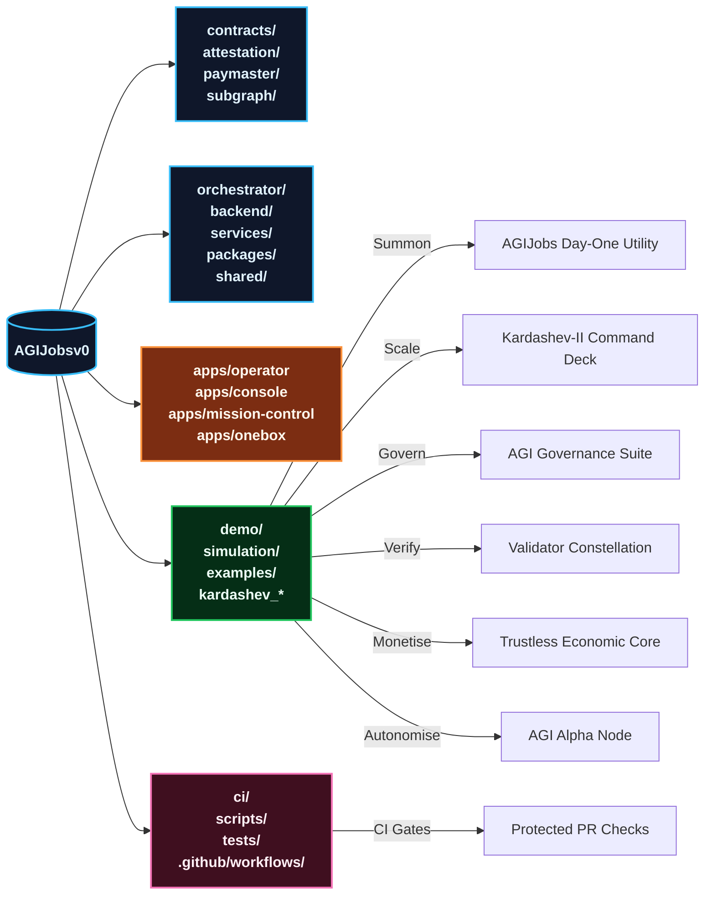
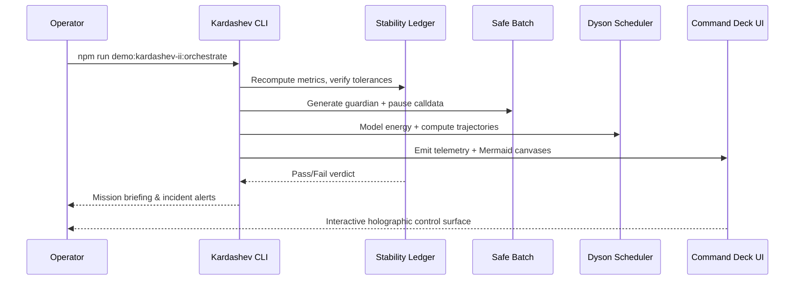

# AGI Operator Quickstart — AGI Jobs v0 (v2)

> Operate AGI Jobs v0 (v2) – the superintelligent machine engineered to compound value, resilience, and governance far beyond traditional economics – from a clean checkout to cinematic demos in minutes. This playbook assumes no engineering background while insisting on production-grade safety, full CI observability, and instant access to every mission-critical dashboard.

---

## 🌌 Mission Synopsis
- **Objective:** Command, observe, and tune the unstoppable AGI Jobs lattice without writing a line of code.
- **Outcomes:** Launch flagship demos, regenerate telemetry, exercise owner controls, and keep every branch under all-green V2 CI.
- **Guarantee:** Every step below leans on the repo’s hardened pipelines (see `.github/workflows/`) so Solidity, TypeScript, and Python suites, demo scorecards, security scans, and owner guardrails stay flawless.



---

## 🔭 Fast Navigation
1. [Choose your environment](#-choose-your-environment)
2. [Bootstrap the lattice](#-bootstrap-the-lattice)
3. [Launch the cinematic demos](#-launch-the-cinematic-demos)
4. [Command owner controls](#-command-owner-controls)
5. [Collect artefacts like an operator](#-collect-artefacts-like-an-operator)
6. [Keep CI impossibly green](#-keep-ci-impossibly-green)
7. [Daily operations flight plan](#-daily-operations-flight-plan)
8. [Troubleshooting beacons](#-troubleshooting-beacons)
9. [Repository atlas](#-repository-atlas)

---

## 🛰️ Choose your environment

### Option A — GitHub Codespaces *(zero install)*
1. Navigate to <https://github.com/MontrealAI/AGIJobsv0>.
2. Click **Code → Codespaces → Create codespace on main**.
3. Wait for the devcontainer to provision Node.js 20.18.1, Python 3.12, Foundry, Docker CLI, and make.
4. You land in VS Code for Web with authenticated shell, Docker-in-Docker, and cached dependencies.

> Pause or delete idle Codespaces to control billing.

### Option B — Local workstation
1. Install **Git**, **Node.js 20.18.1** (via `nvm`), **Python 3.12+**, **Foundry** (`curl -L https://foundry.paradigm.xyz | bash`), and **Docker Desktop**.
2. Clone and enter the repo:
   ```bash
   git clone https://github.com/MontrealAI/AGIJobsv0
   cd AGIJobsv0
   ```
3. Install shared dependencies once:
   ```bash
   nvm install && nvm use
   npm ci
   python -m pip install --upgrade pip
   python -m pip install -r requirements-python.txt
   python -m pip install -r requirements-agent.txt
   ```
4. Optional: `foundryup`, `forge fmt`, `docker compose`, and Git LFS for `data/` or `storage/` payloads.

---

## 🚀 Bootstrap the lattice

> Commands are copy–paste ready. Demo-specific Makefiles and `requirements.txt` files manage their own extras.

1. **Prime the monorepo** (compile contracts, generate artefacts, bundle shared packages):
   ```bash
   npm run build
   ```
2. **(Optional) Spin up the local mission stack** to watch services interact while demos run:
   ```bash
   # Terminal A – deterministic chain
   anvil --chain-id 31337 --block-time 2

   # Terminal B – deploy protocol v2 modules
   npx hardhat run --network localhost scripts/v2/deploy.ts

   # Terminal C – agent gateway & services
   npm run agent:gateway
   python -m uvicorn services.meta_api.app.main:app --reload --port 8000

   # Terminal D – operator HUDs
   npm --prefix apps/operator run dev
   npm --prefix apps/console run dev
   ```
3. **One-click mission control (Docker Compose)** for production-grade parity:
   ```bash
   cp deployment-config/oneclick.env.example deployment-config/oneclick.env
   # populate RPC URLs, private keys, telemetry tokens
   docker compose up --build
   ```

You now steward the unstoppable lattice that powers every demo and CI workflow.

---

## 🎞️ Launch the cinematic demos

### Flagship launchpad

| Demo | Path | Primary Command | Outputs |
| --- | --- | --- | --- |
| **Day-One Utility Benchmark** | `demo/AGIJobs-Day-One-Utility-Benchmark` | `make e2e` | Strategy scorecards, HTML/PNG dashboards, owner snapshots. |
| **Kardashev-II Command Deck** | `demo/AGI-Jobs-Platform-at-Kardashev-II-Scale` | `npm run demo:kardashev-ii:orchestrate` | Safe calldata batches, Dyson telemetry, holographic UI assets. |
| **Trustless Economic Core** | `demo/Trustless-Economic-Core-v0` | `npm run run:trustless-core` | Hardhat-driven escrow drills, governance slashing proofs. |
| **Validator Constellation** | `demo/Validator-Constellation-v0` | `npm run demo:validator-constellation` | VRF committee tours, sentinel guardrails, compliance ledgers. |
| **AGI Alpha Node** | `demo/AGI-Alpha-Node-v0` | `python demo/AGI-Alpha-Node-v0/src/agi_alpha_node_demo/cli.py --config demo/AGI-Alpha-Node-v0/config/default.toml status` | Autonomous franchise node lifecycle, MuZero++ planner reports, compliance scorecards. |
| **Economic Power Expansion** | `demo/Economic-Power-v0` | `npm run demo:economic-power` | Planetary treasury posture, mission manifests, governance pulses. |
| **Era of Experience** | `demo/Era-Of-Experience-v0` | `npm run demo:era-of-experience` | Narrative journey exports, audit reports, owner override hooks. |
| **One-Box Mission Runner** | `demo/One-Box` | `node --test demo/One-Box/test/diagnostics.test.cjs` *(smoke)* / `node --import tsx demo/One-Box/scripts/runMission.ts` | Deterministic mission orchestration with operator diagnostics and RPC drills. |

### Strategy sweeps & advanced profiles
- **Day-One Utility Benchmark** — explore `make alphaevolve`, `make hgm`, `make trm`, `make omni`, and `make scoreboard` for complete economic and guardrail coverage.
- **Kardashev-II Command Deck** — switch to the Sovereign Lattice by running `npm run demo:kardashev-ii-lattice:orchestrate` or append `--profile stellar-civilization-lattice`.
- **AGI Governance Alpha Series** — execute `npm run demo:agi-governance`, `npm run demo:agi-governance:alpha-v17`, or the profile-specific `:ci` targets to replay the regulatory drills powering `.github/workflows/demo-agi-governance*.yml`.
- **Meta-Agentic Expeditions** — run `npm run demo:meta-agentic-alpha` to witness multi-agent synthesis, or explore `demo/alpha-meta` and `demo/alpha-agi-mark` for dashboard generators, empowerment pulses, and Monte Carlo verifiers.
- **CULTURE-v0 Immersive Arena** — rely on curated scripts: `npm run culture:bootstrap`, `npm run culture:analytics`, and `npm run culture:smoke` to stage the multimedia storytelling decks.

### Spectacle architecture (Kardashev-II excerpt)



Each demo README deepens the lore, enumerates required environment variables, and links to CI workflows enforcing parity.

---

## 🎚️ Command owner controls

The unstoppable Day-One Utility deck exemplifies non-technical governance:

```bash
make owner-show
make owner-set KEY=platform_fee_bps VALUE=220
make owner-set KEY=utility_threshold_override_bps VALUE=900
make owner-toggle
make owner-reset
```

These commands mutate `config/owner_controls.yaml`, validate schemas, and mirror `contracts/v2/modules/DayOneUtilityController.sol`. Similar knobs exist across Kardashev, Economic Power, and Sovereign demos – look for `owner_controls.yaml`, `rules.yaml`, or `sovereign.yaml` files to reshape fees, risk posture, and narratives mid-flight.

For system-wide diagnostics run the owner CI suite:
```bash
npm run owner:dashboard
npm run owner:mission-control
npm run owner:snapshot
npm run owner:doctor
```

These scripts export dashboards, Safe-ready action bundles, compliance scorecards, and audit logs ready for regulated deployments.

---

## 🛰️ Collect artefacts like an operator

Every sanctioned run deposits artefacts inside its `out/`, `output/`, or `reports/` directories:

- **Telemetry JSON** — mission metrics (GMV, utility, Dyson coverage, sentinel uptime, treasury share).
- **HTML hyperdashboards** — immersive operator consoles with Mermaid canvases, animation timelines, and download buttons.
- **PNG snapshots** — executive-ready slides for instant briefings.
- **Scoreboards & ledgers** — JSON/Markdown packs ranking strategies, reconciliations, and compliance verdicts.

Serve dashboards instantly:
```bash
python3 -m http.server --directory demo/AGIJobs-Day-One-Utility-Benchmark/out 9000
open http://localhost:9000/dashboard_e2e.html
```

Archive these artefacts daily for governance reviews, investor reporting, or regulator attestations.

---

## ✅ Keep CI impossibly green

AGI Jobs v0 (v2) enforces an all-green CI shield. Branch protection blocks merges unless every workflow passes, including:

- **Monorepo checks:** `.github/workflows/ci.yml` runs `npm run lint`, `npm run typecheck`, `npm test`, `pytest`, `forge test`, coverage checks, dependency locks, SBOM generation, and `ci:verify-*` scripts.
- **Contracts & security:** `contracts.yml`, `containers.yml`, `codeql`, `security:audit`, `slither`, `audit-ci`, and `trivy` workflows.
- **Demo pipelines:** Dedicated jobs such as `demo-day-one-utility-benchmark.yml`, `demo-kardashev-ii.yml`, `demo-agi-alpha-node.yml`, `demo-agi-labor-market.yml`, `demo-econ-power.yml`, and `demo-validator-constellation.yml` replay each scenario end-to-end.
- **App surfaces:** `apps-images.yml`, web lint/typecheck pipelines, Cypress E2E via `webapp:e2e`, and OneBox smoke suites.

Before opening a PR, replicate the critical subset locally:
```bash
npm run lint
npm run typecheck
npm test
pytest
forge test
npm run demo:kardashev-ii:ci
make -C demo/AGIJobs-Day-One-Utility-Benchmark ci
npm run demo:validator-constellation:ci
npm run demo:economic-power:ci
```

Ensure GitHub branch protection shows every check green, export the results, and attach dashboards to the PR description. The unstoppable lattice stays flawless only when these verifications remain unbroken.

---

## 🧭 Daily operations flight plan

1. **Morning diagnostic** — `make e2e` within Day-One Utility, review utility uplift and guardrail state.
2. **Strategy sweep** — execute `make alphaevolve`, `make hgm`, `make trm`, `make omni`, regenerate the scoreboard, and circulate the PNG snapshot.
3. **Sovereign tuning** — adjust owner controls, rerun the winning strategy, and archive the refreshed telemetry + compliance pack.
4. **CI pulse** — open the Actions tab; if any workflow flickers red, replay the corresponding local script, correct drift, and push a fix.
5. **Frontier expansion** — run a Kardashev or Governance demo, publish the holographic dashboard, and brief stakeholders on readiness.

Repeat daily; the unstoppable machine compounds intelligence and economic gravity while remaining perfectly governable.

---

## 🛠️ Troubleshooting beacons

| Symptom | Fix |
| --- | --- |
| `make: command not found` (Windows) | Install `make` (`choco install make`) or run the Python/TypeScript entrypoints (`python run_demo.py simulate`, `npm run demo:...`). |
| Python module import errors | `python -m pip install -r requirements.txt` inside the demo or `pip install -r requirements-python.txt` at repo root. |
| HTML dashboard missing | Serve the generated file from `out/` or `output/` with `python -m http.server` and open in the browser. |
| Guardrail ❌ banner | Expected safety stop. Review `config/rules.yaml` or `config/owner_controls.yaml`, adjust thresholds, rerun. |
| Foundry/Hardhat mismatch | `foundryup`, `forge --version`, `npx hardhat --version`, ensure Node 20.18.1 via `nvm use`. |
| Docker compose failure | Confirm `.env`/`deployment-config/oneclick.env`, free ports 8545/8000/3000, rerun `docker compose up --build`. |
| Git hooks block commit | Run `npm run lint` / `npm test` to fix issues or use `HUSKY=0` for emergency commits (CI will still enforce checks). |
| Branch protection rejects merge | Visit GitHub Actions, rerun failed jobs, ensure required checks (CI, demo workflows, security scans) succeed before merging. |

---

## 🗂️ Repository atlas

| Domain | Paths | Notes |
| --- | --- | --- |
| Protocol & Chain Control | `contracts/`, `attestation/`, `paymaster/`, `migrations/`, `subgraph/` | Upgradeable Solidity modules, attestations, paymasters, and indexers. |
| Agentic Intelligence Fabric | `orchestrator/`, `backend/`, `agent-gateway/`, `services/`, `routes/`, `packages/`, `shared/` | Mission planners, analytics pipelines, SDKs, and shared state machines. |
| Mission Consoles | `apps/console`, `apps/operator`, `apps/mission-control`, `apps/orchestrator`, `apps/onebox`, `apps/validator`, `apps/validator-ui`, `apps/enterprise-portal`, `apps/onebox-static` | Next.js HUDs, operator dashboards, OneBox mission runner, validator UIs. |
| Demo & Simulation Multiverse | `demo/`, `kardashev_*`, `*.demo_*`, `examples/`, `simulation/`, `data/`, `storage/` | Cinematic expeditions, omega upgrades, Monte Carlo labs, data vaults. |
| Reliability & Assurance | `.github/workflows/`, `ci/`, `scripts/`, `tests/`, `test/`, `RUNBOOK.md`, `monitoring/` | GitHub Actions, local harnesses, pytest/Cypress reporters, observability runbooks. |
| Documentation Signals | `docs/`, `internal_docs/`, `README.md`, `MIGRATION.md`, `CHANGELOG.md`, `SECURITY.md` | Deep dives, migration paths, governance notes, security posture. |

---

**You now command AGI Jobs v0 (v2)** — the unstoppable superintelligent lattice that remains production-ready, fully governed, and economically dominant the moment you execute these steps. Launch the demos, sculpt narratives, and let the all-green CI confirm every move.
