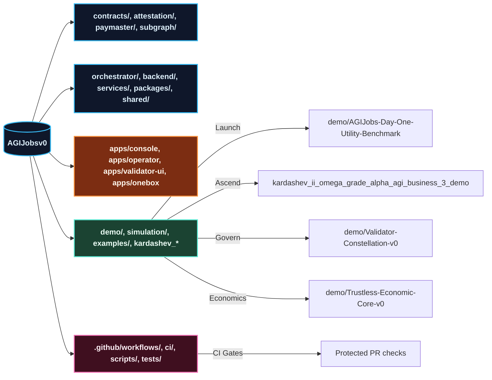
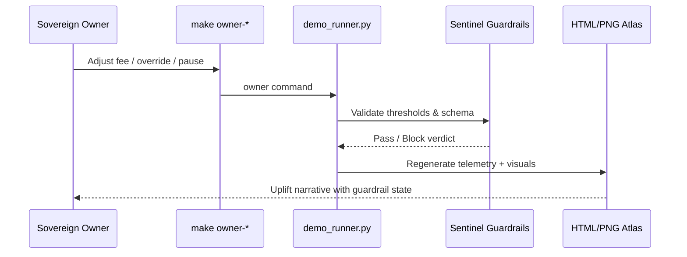

# AGI Operator Quickstart — AGI Jobs v0 (v2)

> Operate the sovereign AGI Jobs lattice — the superintelligent machine that compounds value beyond traditional economics — from a clean checkout to cinematic demos in minutes. Every instruction below is curated for non-technical operators who demand production-grade safety, immaculate CI, and instant storytelling dashboards.

---

## 🌌 Mission Synopsis
- **Objective:** Launch, observe, and govern AGI Jobs v0 (v2) without writing code.
- **Outcome:** Run the flagship demos, validate guardrails, emit dashboards, and leave CI entirely green on every branch.
- **Assurance:** All paths below lean on the repo’s hardened V2 pipeline (`.github/workflows/ci.yml`, demo-specific workflows, scorecards, fuzzing, and release gates) so nothing ships without passing contract tests, TypeScript linting, Python suites, and guardrail verifications.



---

## 🔭 Fast Navigation
1. [Choose your environment](#-choose-your-environment)
2. [Bootstrap the lattice](#-bootstrap-the-lattice)
3. [Fire the cinematic demos](#-fire-the-cinematic-demos)
4. [Tune owner controls live](#-tune-owner-controls-live)
5. [Review artefacts like an operator](#-review-artefacts-like-an-operator)
6. [Keep CI impossibly green](#-keep-ci-impossibly-green)
7. [Daily operations flight plan](#-daily-operations-flight-plan)
8. [Troubleshooting beacons](#-troubleshooting-beacons)
9. [Repository atlas](#-repository-atlas)

---

## 🛰️ Choose your environment

### Option A — GitHub Codespaces *(zero install, billed per minute)*
1. Visit <https://github.com/MontrealAI/AGIJobsv0>.
2. Click **Code → Codespaces → Create codespace on main**.
3. Wait for the devcontainer to finish provisioning (Node 20.18.1, Python 3.12, Foundry, Docker CLI, make).
4. You land in VS Code for Web with a terminal already authenticated.

> Pausing a Codespace halts billing. Delete unused spaces to reclaim storage.

### Option B — Local workstation
1. Install **Git**, **Node.js 20.18.1** (`nvm install && nvm use`), **Python 3.12+**, **Foundry** (`curl -L https://foundry.paradigm.xyz | bash`), and **Docker Desktop**.
2. Clone and enter the repo:
   ```bash
   git clone https://github.com/MontrealAI/AGIJobsv0
   cd AGIJobsv0
   ```
3. Install shared dependencies:
   ```bash
   nvm install && nvm use
   npm ci
   python -m pip install --upgrade pip
   python -m pip install -r requirements-python.txt
   python -m pip install -r requirements-agent.txt
   ```
4. Optional extras: Foundry (`foundryup`), `forge fmt`, `docker compose`, and Git LFS if you’ll sync `data/` or `storage/` payloads.

---

## 🚀 Bootstrap the lattice

> Every command is copy–paste friendly. When a demo needs extra packages it will self-install via its Makefile or `requirements.txt`.

1. **Build the monorepo once** (generates TypeScript artefacts, compiles Solidity, bundles shared packages):
   ```bash
   npm run build
   ```
2. **(Optional) Launch the mission stack locally** if you want to see services interact while demos run:
   ```bash
   # Terminal A – local chain
   anvil --chain-id 31337 --block-time 2

   # Terminal B – deploy protocol v2 modules
   npx hardhat run --network localhost scripts/v2/deploy.ts

   # Terminal C – agent gateway & services
   npm run agent:gateway
   python -m uvicorn services.meta_api.app.main:app --reload --port 8000

   # Terminal D – operator HUDs (Next.js)
   npm --prefix apps/operator run dev
   npm --prefix apps/console run dev
   ```
3. **One-click mission control (Docker Compose)**:
   ```bash
   cp deployment-config/oneclick.env.example deployment-config/oneclick.env
   # populate RPC URLs, private keys, telemetry tokens
   docker compose up --build
   ```

You now have a sovereign-grade lattice ready for demo orchestration and CI.

---

## 🎞️ Fire the cinematic demos

| Demo | Path | Primary Command | Highlights |
| --- | --- | --- | --- |
| **Day-One Utility Benchmark** | `demo/AGIJobs-Day-One-Utility-Benchmark` | `make e2e` | Launch-day uplift, owner controls, HTML dashboard, PNG snapshot. |
| **Kardashev-II Command Deck** | `demo/AGI-Jobs-Platform-at-Kardashev-II-Scale` | `npm run demo:kardashev-ii:orchestrate` | Civilisation-scale orchestration, Safe calldata, Dyson telemetry, holographic UI. |
| **Trustless Economic Core** | `demo/Trustless-Economic-Core-v0` | `npm run run:trustless-core` | Hardhat-driven escrow, slashing, ENS identity proofs, governance drills. |
| **Validator Constellation** | `demo/Validator-Constellation-v0` | `python -m demo.validator_constellation_v0.tour` | VRF committees, ZK batching, sentinel guardrails, ENS governance. |
| **AGI Alpha Node** | `demo/AGI-Alpha-Node-v0` | `python demo/AGI-Alpha-Node-v0/src/agi_alpha_node_demo/cli.py --config demo/AGI-Alpha-Node-v0/config/default.toml status` | Autonomous franchise node spin-up, MuZero++ planner, compliance dashboards. |
| **MuZero-style Intelligence Lab** | `demo/MuZero-style-v0` | `python demo/MuZero-style-v0/scripts/run_demo.py` | Reinforcement learning sandbox showcasing adaptive strategy evolution. |

Each demo ships a README with extended lore, targets, and optional environments. Use Codespaces or local shell, then run:

```bash
cd demo/AGIJobs-Day-One-Utility-Benchmark
make e2e            # baseline cinematic run
make alphaevolve    # AI-improved heuristic
make hgm            # governance-first profile
make trm            # revenue maximiser
make omni           # orchestrated symphony
make scoreboard     # generate omni scoreboard HTML + JSON
```

Most demos support the same ergonomics: `make` targets for non-technical operators, `python run_demo.py <strategy>` for CLI purists, and HTML dashboards in `out/`. Guardrail failures display a red ❌ banner and keep the lattice safe until you adjust inputs.

For demos in sibling folders (`kardashev_*`, `*.demo_*`), run `ls` followed by `make help` to reveal curated narratives such as `make ultra`, `make ascension`, or `make sovereign`.

---

## 🎚️ Tune owner controls live

The flagship Day-One Utility deck showcases how a non-technical owner governs the unstoppable machine:

```bash
make owner-show    # prints current sovereign snapshot
make owner-set KEY=platform_fee_bps VALUE=220
make owner-set KEY=utility_threshold_override_bps VALUE=900
make owner-toggle  # instant pause/resume
make owner-reset   # revert to canonical defaults
```

Every mutation writes back to `config/owner_controls.yaml`, validates against schemas, and is mirrored by `contracts/v2/modules/DayOneUtilityController.sol`. The same motifs appear across Kardashev and Sovereign demos — look for `owner_controls.yaml`, `rules.yaml`, or `sovereign.yaml` in each scenario to reshape fees, narratives, and risk postures mid-flight.



---

## 🛰️ Review artefacts like an operator

Every sanctioned run emits a structured bundle inside the demo folder’s `out/` directory:

- **Telemetry JSON** – `out/report_<strategy>.json` (GMV, Cost, Utility, guardrails, latency deltas, treasury share).
- **HTML Hyperdashboard** – `out/dashboard_<strategy>.html` with mermaid canvases, narrative overlays, and downloadable charts.
- **PNG Snapshot** – `out/snapshot_<strategy>.png` for quick executive briefings.
- **Scoreboards** – `out/scoreboard.json` and `out/scoreboard.html` ranking strategies by utility, treasury, risk, and reliability.

To serve dashboards instantly:
```bash
python3 -m http.server --directory out 9000
open http://localhost:9000/dashboard_e2e.html
```

Archive these artefacts for daily governance reviews or to share with stakeholders.

---

## ✅ Keep CI impossibly green

AGI Jobs v0 (v2) enforces a fortress CI that mirrors production. Every PR and push to `main` runs the following (see `.github/workflows/ci.yml`, demo workflows, `static-analysis.yml`, `contracts.yml`, `webapp.yml`, `scorecard.yml`, and more):

- **Static checks:** `npm run lint`, `npm run typecheck`, `npm run webapp:e2e`, `pnpm --filter apps/* lint`, `forge fmt --check`, `solhint`.
- **Tests:** `npm test`, `pytest`, `forge test`, demo-specific suites (`tests/test_demo_runner.py`).
- **Security:** `audit-ci`, `slither`, `trivy` (via dedicated workflows).
- **Demos:** Each major demo has its own workflow (for example `demo-day-one-utility-benchmark.yml`, `demo-kardashev-ii.yml`, `demo-trustless-economic-core.yml`) guaranteeing that cinematic scenarios stay runnable.

Run the critical subset locally before committing:
```bash
npm run lint
npm test
pytest
forge test
```

The CI badge in the root README stays green only when every gate passes. Branch protection keeps the unstoppable lattice flawless, robust, and ready for high-stakes deployment by any operator.

---

## 🧭 Daily operations flight plan

1. **Morning diagnostic** — `make e2e` in the Day-One Utility demo, confirm Utility uplift and green guardrails.
2. **Strategy sweep** — Run `make alphaevolve`, `make hgm`, `make trm`, `make omni` and open the latest scoreboard.
3. **Sovereign tuning** — Adjust owner controls (fees, guardrails, narratives), rerun the winning strategy, verify uplift.
4. **CI pulse** — Check GitHub Actions (CI, demo workflows, scorecard). If any job blinks red, rerun locally, fix, and push.
5. **Expedition expansion** — Launch a Kardashev or Trustless demo, capture HTML dashboards, brief stakeholders.

Repeat daily; the unstoppable machine compounds value while remaining transparent and governable.

---

## 🛠️ Troubleshooting beacons

| Symptom | Fix |
| --- | --- |
| `make: command not found` (Windows) | Install `make` via `choco install make` or run the Python entrypoints (`python run_demo.py e2e`). |
| Python module import errors | Run `python -m pip install -r requirements.txt` inside the demo or `pip install -r requirements-python.txt` at repo root. |
| HTML dashboard missing | Some demos emit HTML only; open the generated file from `out/` or serve via `python -m http.server`. |
| Guardrail ❌ banner | Expected safety stop. Review `config/rules.yaml` or `config/owner_controls.yaml`, adjust thresholds, rerun. |
| Foundry/Hardhat mismatch | Execute `foundryup`, `forge --version`, `npx hardhat --version`; ensure Node 20.18.1 via `nvm use`. |
| Docker compose fails | Confirm `.env`/`deployment-config/oneclick.env` values, free ports 8545/8000/3000, rerun `docker compose up --build`. |

---

## 🗂️ Repository atlas

| Domain | Paths | Notes |
| --- | --- | --- |
| Protocol & Chain Control | `contracts/`, `attestation/`, `paymaster/`, `migrations/`, `subgraph/` | Upgradeable Solidity modules, attestations, paymasters, subgraph indexer. |
| Agentic Intelligence Fabric | `orchestrator/`, `backend/`, `agent-gateway/`, `services/`, `routes/`, `packages/`, `shared/` | Mission planners, analytics pipelines, SDKs, shared state machines. |
| Mission Consoles | `apps/console`, `apps/operator`, `apps/validator`, `apps/validator-ui`, `apps/enterprise-portal`, `apps/mission-control`, `apps/orchestrator`, `apps/onebox`, `apps/onebox-static` | Next.js HUDs, OneBox mission runner, validator dashboards. |
| Demo & Simulation Multiverse | `demo/`, `kardashev_*`, `*.demo_*`, `examples/`, `simulation/`, `data/`, `storage/` | Cinematic expeditions, omega upgrades, Monte Carlo labs, data vaults. |
| Reliability & Assurance | `.github/workflows/`, `ci/`, `scripts/`, `tests/`, `test/`, `RUNBOOK.md`, `monitoring/` | GitHub Actions suite, shell harnesses, pytest/cypress reporters, observability runbooks. |
| Documentation Signals | `docs/`, `internal_docs/`, `README.md`, `MIGRATION.md`, `CHANGELOG.md`, `SECURITY.md` | Deep dives, upgrade paths, governance, security posture. |

---

**You now command AGI Jobs v0 (v2)** — the superintelligent production lattice delivering unstoppable economic gravity with cinematic clarity. Launch demos, sculpt narratives, and let the all-green CI confirm every move.
