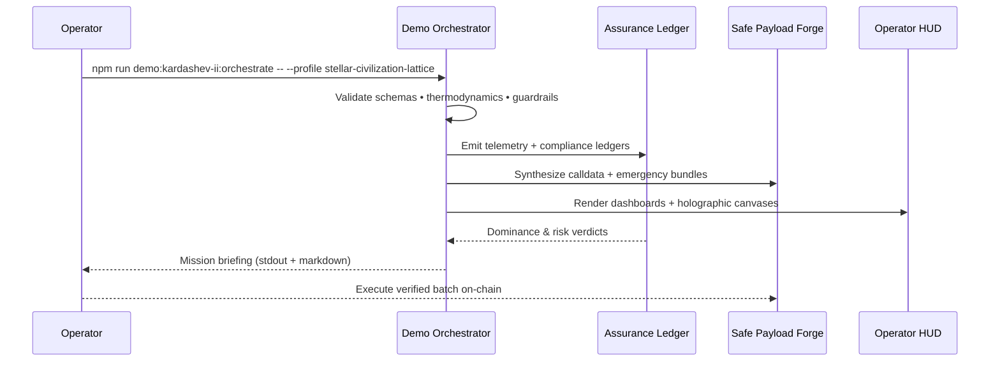

# AGI Operator Quickstart — AGI Jobs v0 (v2)

> You are assuming command of AGI Jobs v0 (v2) — the production-hardened superintelligent machine that compounds intelligence, capital efficiency, and governance supremacy the instant it boots. Every directive below lets a non-technical operator light up the lattice, orchestrate the cinematic demos, and keep the v2 CI force-field fully green without compromising safety or scope.

---

## 🌌 Strategic Situation
- **Prime directive:** Sustain uninterrupted operations, demonstrations, and governance while the lattice expands autonomously across finance, culture, and planetary infrastructure.
- **Operator promise:** Every command mirrors the live repository (see [`package.json`](../package.json), [`Makefile`](../Makefile), and workflows under [`.github/workflows/`](../.github/workflows)).
- **Assurance:** Artefacts generated locally (dashboards, Safe payloads, compliance packs) remain deterministic with the CI guardians.

```mermaid
flowchart LR
  classDef nexus fill:#020617,stroke:#0ea5e9,color:#e0f2fe,font-weight:bold;
  classDef demos fill:#0f172a,stroke:#4ade80,color:#ecfdf5,font-weight:bold;
  classDef surfaces fill:#1f2937,stroke:#f97316,color:#ffedd5,font-weight:bold;
  classDef ci fill:#111827,stroke:#a855f7,color:#ede9fe,font-weight:bold;
  classDef ops fill:#1e1b4b,stroke:#facc15,color:#fef3c7,font-weight:bold;

  Nexus[(AGI Jobs v0 (v2))]:::nexus --> Protocols[contracts/\nattestation/\npaymaster/\nsubgraph]:::ops
  Nexus --> Intelligence[backend/\norchestrator/\nservices/\nagent-gateway]:::ops
  Nexus --> DemoVerse[demo/\nkardashev_*\nzenith_*\nsovereign_constellation]:::demos
  Nexus --> Surfaces[apps/operator\napps/mission-control\napps/console\napps/onebox]:::surfaces
  Nexus --> Reliability[ci/\nscripts/\ntests/\nRUNBOOK.md]:::ci

  DemoVerse --> Flagship[Day-One Utility\nKardashev-II\nTrustless Core]:::demos
  DemoVerse --> Sovereign[Kardashev Ω Upgrades\nSovereign Constellation\nZenith Hypernovas]:::demos
  DemoVerse --> Frontier[Meta-Agentic\nAlpha Mark\nASI Take-Off]:::demos
  Reliability --> Actions[GitHub Actions — v2 CI wall]:::ci
```

---

## 🧭 Rapid Navigation
1. [Choose your environment](#-choose-your-environment)
2. [Prime the lattice](#-prime-the-lattice)
3. [Mission timeline](#-mission-timeline)
4. [Launch the demos](#-launch-the-demos)
5. [Activate operator surfaces](#-activate-operator-surfaces)
6. [Owner controls & governance](#-owner-controls--governance)
7. [Artefact logistics](#-artefact-logistics)
8. [Keep CI all-green](#-keep-ci-all-green)
9. [Daily flight plan](#-daily-flight-plan)
10. [Troubleshooting beacons](#-troubleshooting-beacons)
11. [Repository atlas](#-repository-atlas)

---

## 🛰️ Choose your environment

### Option A — GitHub Codespaces *(zero install)*
1. Visit <https://github.com/MontrealAI/AGIJobsv0> and click **Code → Codespaces → Create codespace on main**.
2. The devcontainer provisions Node.js 20.18.1, pnpm/npm toolchain, Foundry, Python 3.12, Docker CLI, and `make`.
3. You land inside VS Code for Web with Docker-in-Docker, cached dependencies, and CI helpers.
4. Stop or delete idle workspaces to release resources.

### Option B — Local workstation *(macOS/Linux/WSL)*
1. Install **Git**, **Docker Desktop** (or Podman), **Node.js 20.18.1** (`nvm install 20.18.1`), **Python 3.12+**, **Foundry** (`curl -L https://foundry.paradigm.xyz | bash` then `foundryup`), and optional **Git LFS**.
2. Clone the repository:
   ```bash
   git clone https://github.com/MontrealAI/AGIJobsv0
   cd AGIJobsv0
   ```
3. Install shared dependencies once:
   ```bash
   nvm use || nvm install
   npm ci
   python -m pip install --upgrade pip
   python -m pip install -r requirements-python.txt
   python -m pip install -r requirements-agent.txt
   ```
4. Optional parity checks: `forge install`, `forge fmt`, `docker compose version`, `pre-commit --version` (if you enable hooks).

---

## ⚙️ Prime the lattice
> Run commands from the repository root unless a section specifies otherwise.

1. **Monorepo build** — compile TypeScript packages, bundle shared clients, and ensure workspace integrity:
   ```bash
   npm run build
   ```
2. **Foundry toolchain** *(once per machine)*:
   ```bash
   foundryup
   forge build
   ```
3. **Deterministic mission stack** *(mirrors flagship demos)*:
   ```bash
   # Terminal A — local chain
   anvil --chain-id 31337 --block-time 2

   # Terminal B — deploy v2 protocol modules
   npx hardhat run --network localhost scripts/v2/deploy.ts

   # Terminal C — intelligence layer
   npm run agent:gateway
   python -m uvicorn services.meta_api.app.main:app --reload --port 8000

   # Terminal D — operator HUDs
   npm --prefix apps/operator run dev
   npm --prefix apps/console run dev
   ```
4. **Production-parity (Docker Compose)** — enables one-click launch with telemetry, orchestrator, and dashboards:
   ```bash
   cp deployment-config/oneclick.env.example deployment-config/oneclick.env
   # populate RPC URLs, Safe keys, telemetry tokens, observability endpoints
   docker compose up --build
   ```

---

## 🗺️ Mission timeline

```mermaid
gantt
  dateFormat  HH:mm
  axisFormat  %H:%M
  title AGI Jobs v0 (v2) Operator Expedition
  section Bootstrap
  Checkout & dependency install      :done,    00:00, 00:05
  Monorepo build & contract compile  :done,    00:05, 00:07
  Launch deterministic stack         :active,  00:07, 00:15
  section Demo Wave I — Flagship
  Day-One Utility Benchmark          :crit,    00:15, 00:25
  Kardashev-II Command Deck          :crit,    00:25, 00:37
  Trustless Economic Core            :crit,    00:37, 00:47
  section Demo Wave II — Sovereign Upgrades
  Kardashev Ω Upgrades               :crit,    00:47, 01:05
  Sovereign Constellation            :crit,    01:05, 01:20
  Zenith Hypernova Missions          :crit,    01:20, 01:35
  section Demo Wave III — Frontier Intelligence
  AGI Alpha Node                     :crit,    01:35, 01:50
  Meta-Agentic Alpha Expedition      :crit,    01:50, 02:05
  ASI Take-Off                       :crit,    02:05, 02:20
  section Assurance
  Owner control sweep                :milestone, 02:20, 00:00
  CI verification                    :crit,       02:20, 02:40
  Artefact archival                  :after owner control sweep, 00:15
```


---

## 🎞️ Launch the demos

### Flagship economic lattice
| Demo | Path | Primary command | Core artefacts | CI workflow |
| --- | --- | --- | --- | --- |
| **AGIJobs Day-One Utility Benchmark** | [`demo/AGIJobs-Day-One-Utility-Benchmark`](../demo/AGIJobs-Day-One-Utility-Benchmark) | `make e2e` *(after `make deps`)* | HTML dashboards in `out/`, PNG scorecards, JSON telemetry, owner snapshots. | [`demo-day-one-utility-benchmark.yml`](../.github/workflows/demo-day-one-utility-benchmark.yml) |
| **Trustless Economic Core v0** | [`demo/Trustless-Economic-Core-v0`](../demo/Trustless-Economic-Core-v0) | `npm run run:trustless-core` *(pair with `npm run demo:economic-power`)* | Hardhat settlement drills, governance proofs, compliance ledgers in `output/`. | [`demo-economic-power.yml`](../.github/workflows/demo-economic-power.yml) |
| **Economic Power Vanguard** | [`demo/Economic-Power-v0`](../demo/Economic-Power-v0) | `npm run demo:economic-power` / `npm run demo:economic-power:ci` | Treasury posture reports, mission manifests, replay logs. | [`demo-economic-power.yml`](../.github/workflows/demo-economic-power.yml) |
| **AGI Labor Market Grand Demo** | [`demo/agi-labor-market-grand-demo`](../demo/agi-labor-market-grand-demo) | `npm run demo:agi-labor-market` | Operator briefings, contract payloads, market transcripts in `ui/export/`. | [`demo-agi-labor-market.yml`](../.github/workflows/demo-agi-labor-market.yml) |

### Kardashev expansion & sovereign upgrades
| Demo | Path | Primary command | Core artefacts | CI workflow |
| --- | --- | --- | --- | --- |
| **Kardashev-II Command Deck** | [`demo/AGI-Jobs-Platform-at-Kardashev-II-Scale`](../demo/AGI-Jobs-Platform-at-Kardashev-II-Scale) | `npm run demo:kardashev-ii:orchestrate` | Safe calldata bundles, Dyson telemetry, operator briefings under `output/`. | [`demo-kardashev-ii.yml`](../.github/workflows/demo-kardashev-ii.yml) |
| **Kardashev Stellar Civilization Lattice** | [`demo/AGI-Jobs-Platform-at-Kardashev-II-Scale/stellar-civilization-lattice`](../demo/AGI-Jobs-Platform-at-Kardashev-II-Scale/stellar-civilization-lattice) | `npm run demo:kardashev-ii-lattice:orchestrate` | Stellar lattice schematics, risk matrices, scoreboard snapshots. | [`demo-kardashev-ii.yml`](../.github/workflows/demo-kardashev-ii.yml) |
| **Kardashev Ω Upgrade Series** | [`demo/Kardashev-II Omega-Grade-α-AGI Business-3`](../demo/Kardashev-II%20Omega-Grade-%CE%B1-AGI%20Business-3) + [`kardashev_ii_omega_grade_upgrade_for_alpha_agi_business_3_demo_*`](../kardashev_ii_omega_grade_upgrade_for_alpha_agi_business_3_demo) | `npm run demo:kardashev-ii-omega-upgrade` *(variants `...-v2`, `...-v3`, `...-v4`, `...-v5`)* | Mission JSON, owner diagnostics, compliance ledgers, upgrade telemetry. | [`demo-kardashev-ii-omega.yml`](../.github/workflows/demo-kardashev-ii-omega.yml) |
| **Sovereign Constellation** | [`demo/sovereign-constellation`](../demo/sovereign-constellation) | `npm run demo:sovereign-constellation:asi-takes-off` *(full kit: run `npm run demo:sovereign-constellation:ci`)* | Flight plans, VRF proofs, mission manifests, superintelligence briefs. | [`demo-sovereign-constellation.yml`](../.github/workflows/demo-sovereign-constellation.yml) |

### Frontier intelligence & governance arcs
| Demo | Path | Primary command | Core artefacts | CI workflow |
| --- | --- | --- | --- | --- |
| **AGI Alpha Node** | [`demo/AGI-Alpha-Node-v0`](../demo/AGI-Alpha-Node-v0) | `npm run demo:agi-alpha-node` *(dry-run with `--config .../config/testnet.json`)* | Live dashboard (`http://localhost:<port>`), Prometheus metrics, staking + identity reports. | [`demo-agi-alpha-node.yml`](../.github/workflows/demo-agi-alpha-node.yml) |
| **Meta-Agentic ALPHA Expedition** | [`demo/Meta-Agentic-ALPHA-AGI-Jobs-v0`](../demo/Meta-Agentic-ALPHA-AGI-Jobs-v0) | `npm run demo:meta-agentic-alpha` | Multi-agent synthesis logs, empowerment matrices, cinematic markdown briefs. | [`demo-meta-agentic-alpha-agi-jobs.yml`](../.github/workflows/demo-meta-agentic-alpha-agi-jobs.yml) |
| **Alpha AGI Mark & Insight Series** | [`demo/alpha-agi-mark`](../demo/alpha-agi-mark), [`demo/alpha-agi-insight-mark`](../demo/alpha-agi-insight-mark) | `npm run demo:alpha-agi-mark`, `npm run demo:alpha-agi-insight-mark` | Empowerment pulse reports, integrity dossiers, owner matrices. | [`demo-alpha-agi-mark.yml`](../.github/workflows/demo-alpha-agi-mark.yml), [`demo-alpha-agi-insight-mark.yml`](../.github/workflows/demo-alpha-agi-insight-mark.yml) |
| **Alpha Meta Sovereign Missions** | [`demo/alpha-meta`](../demo/alpha-meta) | `npm run demo:alpha-meta:full` | Mission oracles, sovereign analytics, Monte Carlo verifiers. | [`ci.yml`](../.github/workflows/ci.yml) *(alpha-meta matrix)* |
| **ASI Global & Take-Off** | [`demo/asi-global`](../demo/asi-global), [`demo/asi-takeoff`](../demo/asi-takeoff) | `npm run demo:asi-global`, `npm run demo:asi-takeoff` | Planetary operating plans, launch manifests, Aurora reports. | [`demo-asi-global.yml`](../.github/workflows/demo-asi-global.yml), [`demo-asi-takeoff.yml`](../.github/workflows/demo-asi-takeoff.yml) |
| **Zenith Sapience Initiative** | [`demo/zenith-sapience-initiative-*`](../demo) | `npm run demo:zenith-hypernova`, `npm run demo:zenith-sapience-initiative`, etc. | Hypernova governance decks, omnidominion ledgers, planetary OS manifests. | Zenith suite — [`demo-zenith-hypernova.yml`](../.github/workflows/demo-zenith-hypernova.yml), [`demo-zenith-sapience-initiative.yml`](../.github/workflows/demo-zenith-sapience-initiative.yml), [`demo-zenith-sapience-celestial-archon.yml`](../.github/workflows/demo-zenith-sapience-celestial-archon.yml), [`demo-zenith-sapience-omnidominion.yml`](../.github/workflows/demo-zenith-sapience-omnidominion.yml), [`demo-zenith-sapience-planetary-os.yml`](../.github/workflows/demo-zenith-sapience-planetary-os.yml) |
| **Era of Experience** | [`demo/Era-Of-Experience-v0`](../demo/Era-Of-Experience-v0) | `npm run demo:era-of-experience` | Narrative exports, audit reporters, verification logs under `reports/`. | [`ci.yml`](../.github/workflows/ci.yml) *(demo pretest job)* |
| **Validator Constellation** | [`demo/Validator-Constellation-v0`](../demo/Validator-Constellation-v0) | `npm run demo:validator-constellation` | VRF committee tours, sentinel guardrails, compliance ledgers. | [`demo-validator-constellation.yml`](../.github/workflows/demo-validator-constellation.yml) |
| **One-Box Mission Runner** | [`demo/One-Box`](../demo/One-Box) | `node --test demo/One-Box/test/diagnostics.test.cjs` *(smoke)*, `npm run demo:onebox:launch` | Deterministic orchestration, RPC diagnostics, mission rehearsal logs. | [`ci.yml`](../.github/workflows/ci.yml) *(pretest suite)* |

### Tactical amplifiers
- **Day-One Utility Benchmark** — explore `make alphaevolve`, `make hgm`, `make trm`, `make omni`, `make scoreboard`, and `make ci` for the full strategy sweep.
- **Economic Power & Trustless Core** — `npm run demo:economic-power:dominion` drills the mainnet dominion scenario; `npm run demo:economic-power:ci` mirrors CI.
- **Kardashev expansions** — run `npm run demo:kardashev-ii:ci`, `npm run demo:kardashev-ii-lattice:ci`, or `npm run demo:kardashev-ii-omega-upgrade:ci` to reproduce GitHub workflows; owner dashboards live under `output/`.
- **Sovereign Constellation** — `npm run demo:sovereign-constellation:plan` auto-tunes mission thermostats; `npm run demo:sovereign-constellation:owner` exports owner matrices.
- **Alpha / Meta arcs** — `npm run demo:alpha-meta:owner`, `npm run demo:alpha-meta:triangulate`, `npm run demo:alpha-agi-mark:full`, and `npm run demo:alpha-agi-insight-mark:ci` provide audit-ready packages.
- **ASI take-off** — `npm run demo:asi-takeoff:report` emits Aurora mission reports with cinematic telemetry.



---

## 🖥️ Activate operator surfaces
| Surface | Path | Start command | Notes |
| --- | --- | --- | --- |
| **Operator Console** | [`apps/operator`](../apps/operator) | `npm --prefix apps/operator run dev` | Next.js HUD for mission scheduling; ingests Kardashev & Day-One artefacts. |
| **Console (analytics)** | [`apps/console`](../apps/console) | `npm --prefix apps/console run dev` | Visual analytics, scoreboard overlays, governance monitors. |
| **Mission Control** | [`apps/mission-control`](../apps/mission-control) | `npm --prefix apps/mission-control run dev` | Executive overview combining telemetry, CI, and owner controls. |
| **OneBox UI** | [`apps/onebox`](../apps/onebox) | `npm --prefix apps/onebox run dev` | Deterministic mission runner; pairs with One-Box demo tests. |
| **Validator UI** | [`apps/validator-ui`](../apps/validator-ui) | `npm --prefix apps/validator-ui run dev` | Visualises Validator Constellation VRF dashboards. |
| **Enterprise Portal** | [`apps/enterprise-portal`](../apps/enterprise-portal) | `npm --prefix apps/enterprise-portal run dev` | Stakeholder deliverable verification; wired into CI smoke tests. |
| **Operator Orchestrator Surface** | [`apps/orchestrator`](../apps/orchestrator) | `npm --prefix apps/orchestrator run dev` | Mission scripting interface for orchestration pipelines. |

Each surface provides an `.env.example`; copy it to `.env.local` (or `.env`) before connecting to external RPC endpoints or telemetry backends.

---

## 🛡️ Owner controls & governance

### Day-One Utility owner macros
```bash
cd demo/AGIJobs-Day-One-Utility-Benchmark
make deps
make owner-show
make owner-set KEY=platform_fee_bps VALUE=220
make owner-toggle
make owner-reset
```
These commands mutate `config/owner_controls.yaml`, validate schemas, and mirror [`contracts/v2/modules/DayOneUtilityController.sol`](../contracts/v2/modules/DayOneUtilityController.sol).

### Repository-wide owner suites
From the repository root:
```bash
npm run owner:dashboard
npm run owner:mission-control
npm run owner:snapshot
npm run owner:doctor
npm run owner:guide
npm run owner:plan:safe
npm run owner:command-center
npm run owner:upgrade-status
npm run owner:emergency
```
Each script inspects on-chain parameters, renders Safe bundles, and exports audit artefacts under `reports/` or `out/`. Pair with demo-specific owner tooling such as `npm run demo:alpha-meta:owner`, `npm run demo:sovereign-constellation:owner`, and `npm run demo:kardashev-ii-omega-upgrade-v3:owner` for scenario-specific controls.

---

## 📦 Artefact logistics
- **Telemetry** — JSON ledgers in `out/`, `output/`, or `reports/` capture GMV, Dyson coverage, sentinel uptime, treasury state, and empowerment scores.
- **Dashboards** — HTML hyperdashboards with embedded Mermaid diagrams live alongside PNG snapshots for executive briefings.
- **Safe payloads** — JSON batches (e.g., `kardashev-safe-transaction-batch.json`) import directly into <https://app.safe.global>.
- **Compliance bundles** — Markdown/JSON dossiers reside under each demo’s `output/` directory.

Serve dashboards instantly:
```bash
python3 -m http.server --directory demo/AGIJobs-Day-One-Utility-Benchmark/out 9000
open http://localhost:9000/dashboard_e2e.html  # macOS
# xdg-open http://localhost:9000/dashboard_e2e.html  # Linux
```
Archive artefacts daily for governance sign-off, investor briefings, and regulatory evidence.

---

## ✅ Keep CI all-green
AGI Jobs v0 (v2) enforces fully visible, blocking CI on every PR via branch protection. Core workflows under [`.github/workflows/`](../.github/workflows) include:
- `ci.yml` — monorepo linting, typechecking, Jest/Playwright suites, Foundry tests, pytest, SBOM generation, dependency audits, bespoke `ci:verify-*` scripts.
- `contracts.yml` & `containers.yml` — Solidity static analysis, gas sizing, container security scans, provenance attestations.
- Demo guardians such as `demo-day-one-utility-benchmark.yml`, `demo-kardashev-ii.yml`, `demo-agi-alpha-node.yml`, `demo-agi-labor-market.yml`, `demo-economic-power.yml`, `demo-validator-constellation.yml`, `demo-meta-agentic-alpha-agi-jobs.yml`, `demo-agi-governance.yml`, and the Kardashev Ω upgrade matrix.
- Frontier and surface coverage: `webapp.yml`, `apps-images.yml`, `orchestrator-ci.yml`, `culture-ci.yml`, `fuzz.yml`, `e2e.yml`, and the Zenith suite (`demo-zenith-hypernova.yml`, `demo-zenith-sapience-initiative.yml`, `demo-zenith-sapience-celestial-archon.yml`, `demo-zenith-sapience-omnidominion.yml`, `demo-zenith-sapience-planetary-os.yml`).

Before opening a PR, reproduce the high-value subset locally:
```bash
npm run lint
npm run typecheck
npm test
pytest
forge test
make -C demo/AGIJobs-Day-One-Utility-Benchmark ci
npm run demo:kardashev-ii:ci
npm run demo:kardashev-ii-lattice:ci
npm run demo:kardashev-ii-omega-upgrade:ci
npm run demo:validator-constellation:ci
npm run demo:economic-power:ci
npm run demo:agi-governance:ci
npm run demo:agi-alpha-node -- heartbeat --config demo/AGI-Alpha-Node-v0/config/testnet.json
npm run demo:meta-agentic-alpha
npm run demo:sovereign-constellation:ci
```
Confirm GitHub Actions shows every required check green, attach dashboards and payloads to the PR description, and ensure branch protection gates remain satisfied.

---

## 🗓️ Daily flight plan
1. **Morning diagnostic** — run `make e2e` inside Day-One Utility, review the generated dashboard, and circulate the PNG snapshot.
2. **Strategy sweep** — execute `make alphaevolve`, `make hgm`, `make trm`, `make omni`, and `make scoreboard` to refresh comparative analytics.
3. **Sovereign tuning** — adjust owner controls (`npm run owner:wizard`, `npm run owner:command-center`), regenerate Kardashev, Economic Power, or Sovereign Constellation artefacts, and archive the compliance pack.
4. **CI pulse** — open GitHub → Actions, ensure `ci`, demo, and security workflows are green. If any fail, rerun the paired local command, correct drift, and push a fix.
5. **Frontier expansion** — stage a Kardashev, Meta-Agentic, Alpha Mark, or Zenith mission, publish the holographic dashboard, and brief stakeholders using the generated reports.

Repeat daily; the lattice keeps compounding intelligence, wealth, and governance supremacy in lockstep.

---

## 🛠️ Troubleshooting beacons
| Symptom | Remedy |
| --- | --- |
| `make: command not found` (Windows) | Install `make` (`choco install make`) or use the Python/TypeScript entrypoints (`python run_demo.py simulate`, `npm run demo:...`). |
| Missing Python modules | `python -m pip install -r requirements.txt` inside the demo or `pip install -r requirements-python.txt` at the repo root. |
| HTML dashboard blank | Serve the generated file from `out/` or `output/` via `python -m http.server` and open in the browser. |
| Guardrail ❌ banner | Expected safety halt. Inspect `config/owner_controls.yaml` or `config/rules.yaml`, adjust thresholds, rerun the demo, and document the override. |
| Foundry/Hardhat mismatch | Run `foundryup`, `forge --version`, `npx hardhat --version`, and ensure `nvm use 20.18.1`. |
| Docker Compose fails | Verify `deployment-config/oneclick.env`, free ports `8545`, `8000`, `3000`, then `docker compose up --build`. |
| Git hooks block commit | Run `npm run lint` / `npm test` to resolve; as last resort set `HUSKY=0` temporarily (CI will revalidate). |
| Branch protection rejects merge | Visit GitHub Actions, rerun failed workflows, or reproduce locally with the commands above until every required check is green. |

---

## 🗂️ Repository atlas
| Domain | Paths | Highlights |
| --- | --- | --- |
| Protocol & Chain Control | [`contracts/`](../contracts), [`attestation/`](../attestation), [`paymaster/`](../paymaster), [`subgraph/`](../subgraph), [`migrations/`](../migrations) | Upgradeable Solidity modules, attestations, paymasters, indexers tied to demos & CI. |
| Agentic Intelligence Fabric | [`orchestrator/`](../orchestrator), [`backend/`](../backend), [`agent-gateway/`](../agent-gateway), [`services/`](../services), [`routes/`](../routes), [`packages/`](../packages), [`shared/`](../shared) | Mission planners, analytics pipelines, SDKs, shared domain models. |
| Mission Consoles & HUDs | [`apps/console`](../apps/console), [`apps/operator`](../apps/operator), [`apps/mission-control`](../apps/mission-control), [`apps/orchestrator`](../apps/orchestrator), [`apps/onebox`](../apps/onebox), [`apps/validator-ui`](../apps/validator-ui), [`apps/enterprise-portal`](../apps/enterprise-portal), [`apps/onebox-static`](../apps/onebox-static) | Next.js/React command decks, mission runners, validator interfaces. |
| Demo & Simulation Multiverse | [`demo/`](../demo), `kardashev_*`, `kardashev_ii_omega_grade_*`, [`examples/`](../examples), [`simulation/`](../simulation), [`data/`](../data), [`storage/`](../storage) | Cinematic expeditions, omega upgrades, Monte Carlo labs, telemetry vaults. |
| Reliability & Assurance | [`.github/workflows/`](../.github/workflows), [`ci/`](../ci), [`scripts/`](../scripts), [`tests/`](../tests), [`test/`](../test), [`RUNBOOK.md`](../RUNBOOK.md), [`monitoring/`](../monitoring) | GitHub Actions guardians, local harnesses, pytest/Cypress reporters, observability dashboards. |
| Documentation Signals | [`docs/`](../docs), [`internal_docs/`](../internal_docs), [`README.md`](../README.md), [`MIGRATION.md`](../MIGRATION.md), [`CHANGELOG.md`](../CHANGELOG.md), [`SECURITY.md`](../SECURITY.md) | Deep dives, migration paths, governance notes, security posture. |

---

**You now command AGI Jobs v0 (v2)** — the superintelligent, production-ready lattice whose demos, dashboards, and CI guardians are instantly operable. Launch the missions, archive the evidence, and let the all-green pipelines certify every decision.
