# AGI Operator Quickstart — AGI Jobs v0 (v2)

> Welcome to the command deck of AGI Jobs v0 (v2): the production-forged superintelligent machine that manufactures wealth, policy leverage, and civilization-scale insight the moment it hums to life. Follow this quickstart to light up every lattice, stream every demo, and keep the v2 CI shield fully green — even if you have zero engineering background.

---

## 🌐 Strategic Constellation
```mermaid
flowchart TD
  classDef nexus fill:#020617,stroke:#22d3ee,color:#e0f2fe,font-weight:bold;
  classDef proto fill:#111827,stroke:#f59e0b,color:#fffbeb,font-weight:bold;
  classDef intel fill:#0f172a,stroke:#a855f7,color:#ede9fe,font-weight:bold;
  classDef demo fill:#1f2937,stroke:#4ade80,color:#ecfdf5,font-weight:bold;
  classDef surface fill:#1e293b,stroke:#f97316,color:#ffedd5,font-weight:bold;
  classDef ci fill:#0b1120,stroke:#38bdf8,color:#e0f2fe,font-weight:bold;

  Nexus[(AGI Jobs v0 (v2))]:::nexus --> Protocols[contracts/\nattestation/\npaymaster/\nsubgraph/\nechidna]:::proto
  Nexus --> Intelligence[backend/\norchestrator/\nservices/\nagent-gateway/\nroutes]:::intel
  Nexus --> DemoVerse[demo/\nkardashev_*\ncosmic_*\nzenith_*\nomni_*\nvalidator_*]:::demo
  Nexus --> Surfaces[apps/operator\napps/mission-control\napps/console\napps/orchestrator\napps/enterprise-portal\napps/validator]:::surface
  Nexus --> Reliability[ci/\nscripts/\ntests/\nRUNBOOK.md\nmonitoring/]:::ci

  DemoVerse --> Flagship[Day-One Utility\nEconomic Power\nTrustless Core\nCosmic Flagship]:::demo
  DemoVerse --> Kardashev[Kardashev II\nOmega Upgrades\nOmega Operator\nOmega Ultra]:::demo
  DemoVerse --> Sovereign[Sovereign Constellation\nCosmic Omni Sovereign Symphony\nOmni-Orchestrator]:::demo
  DemoVerse --> Frontier[AGI Alpha Node\nMeta-Agentic Suites\nMuZero Style\nAbsolute Zero Reasoner\nZenith Hypernovas]:::demo
  DemoVerse --> Assurance[National Supply Chain\nValidator Constellation\nScorecard\nAurora]:::demo
  Reliability --> CIWall[GitHub Actions — fully enforced v2 CI]:::ci
```

---

## 🧭 Rapid Navigation
1. [Choose your environment](#-choose-your-environment)
2. [Prime the lattice](#-prime-the-lattice)
3. [Mission timeline](#-mission-timeline)
4. [Launch the demos](#-launch-the-demos)
5. [Activate operator surfaces](#-activate-operator-surfaces)
6. [Owner controls & governance](#-owner-controls--governance)
7. [Artefact logistics](#-artefact-logistics)
8. [Keep CI all-green](#-keep-ci-all-green)
9. [Daily flight plan](#-daily-flight-plan)
10. [Troubleshooting beacons](#-troubleshooting-beacons)
11. [Repository atlas](#-repository-atlas)

---

## 🛰️ Choose your environment

### Option A — GitHub Codespaces *(zero install)*
1. Visit <https://github.com/MontrealAI/AGIJobsv0> → **Code → Codespaces → Create codespace on main**.
2. The devcontainer ships Node.js 20.18.1, npm workspaces, Foundry, Python 3.12, Docker CLI, and `make` with caching pre-warmed for CI parity.
3. Launch VS Code for Web, open the integrated terminal, and you are already inside the repository root with Docker-in-Docker ready.
4. Stop or delete idle codespaces to free credits while artefacts remain available in GitHub Actions.

### Option B — Local workstation *(macOS/Linux/WSL2)*
1. Install **Git**, **Docker Desktop or Podman**, **Node.js 20.18.1** (`nvm install 20.18.1 && nvm alias default 20.18.1`), **Python 3.12+**, **Foundry** (`curl -L https://foundry.paradigm.xyz | bash` then `foundryup`), and optional **Git LFS**.
2. Clone the repository:
   ```bash
   git clone https://github.com/MontrealAI/AGIJobsv0
   cd AGIJobsv0
   ```
3. Install shared toolchains once:
   ```bash
   nvm use || nvm install
   npm ci
   python -m pip install --upgrade pip
   python -m pip install -r requirements-python.txt
   python -m pip install -r requirements-agent.txt
   ```
4. Optional parity checks: `forge --version`, `anvil --version`, `docker compose version`, `pre-commit --version`.

---

## ⚙️ Prime the lattice
> All commands run from the repository root unless otherwise noted.

1. **Monorepo integrity build** — compile workspace packages, TypeScript clients, and lint shared schemas:
   ```bash
   npm run build
   ```
2. **Solidity + Foundry toolchain** *(one time per machine)*:
   ```bash
   foundryup
   forge build
   ```
3. **Deterministic devnet stack** — replicate the multi-surface demo environment:
   ```bash
   # Terminal A — spin the local EVM
   anvil --chain-id 31337 --block-time 2

   # Terminal B — deploy v2 protocol lattice
   npx hardhat run --network localhost scripts/v2/deploy.ts

   # Terminal C — intelligence fabric
   npm run agent:gateway
   python -m uvicorn services.meta_api.app.main:app --reload --port 8000

   # Terminal D — operator HUDs
   npm --prefix apps/operator run dev
   npm --prefix apps/mission-control run dev
   npm --prefix apps/console run dev
   ```
4. **One-click production parity** — orchestrate the fully instrumented stack:
   ```bash
   cp deployment-config/oneclick.env.example deployment-config/oneclick.env
   # populate RPC URLs, Safe keys, telemetry tokens, observability endpoints
   docker compose up --build
   ```
5. **Guardian sweeps** — validate governance and safety macros any time:
   ```bash
   npm run owner:dashboard
   npm run owner:doctor
   make -C demo/AGIJobs-Day-One-Utility-Benchmark scoreboard
   make -C demo/AGIJobs-Day-One-Utility-Benchmark ci
   ```

---

## 🗺️ Mission timeline


---

## 🎞️ Launch the demos
The demo constellation is grouped by mission domain. Every command is zero-interaction, streaming artefacts straight into `out/`, `output/`, `logs/`, or `reports/` folders with deterministic seeds. Run any command, watch the telemetries, archive the payload, and verify the paired CI workflow.

### Flagship economic lattice
| Demo | Path | Launch command | Artefacts | CI workflow |
| --- | --- | --- | --- | --- |
| **AGIJobs Day-One Utility Benchmark** | [`demo/AGIJobs-Day-One-Utility-Benchmark`](../demo/AGIJobs-Day-One-Utility-Benchmark) | `make -C demo/AGIJobs-Day-One-Utility-Benchmark e2e` *(after `make deps`)* | HTML dashboards in `out/`, PNG scorecards, JSON telemetry, Safe payloads. | [`demo-day-one-utility-benchmark.yml`](../.github/workflows/demo-day-one-utility-benchmark.yml) |
| **Economic Power Vanguard** | [`demo/Economic-Power-v0`](../demo/Economic-Power-v0) | `npm run demo:economic-power` *(CI twin: `npm run demo:economic-power:ci`)* | Treasury posture reports, mission manifests, compliance ledgers in `output/`. | [`demo-economic-power.yml`](../.github/workflows/demo-economic-power.yml) |
| **Trustless Economic Core** | [`demo/Trustless-Economic-Core-v0`](../demo/Trustless-Economic-Core-v0) | `npm run run:trustless-core` *(pair with `npm run demo:economic-power` for treasury sync)* | Hardhat settlement drills, proofs, compliance payloads. | [`demo-trustless-economic-core.yml`](../.github/workflows/demo-trustless-economic-core.yml) |
| **Scoreboard Accelerator** | [`demo/AGIJobs-Day-One-Utility-Benchmark`](../demo/AGIJobs-Day-One-Utility-Benchmark) | `make -C demo/AGIJobs-Day-One-Utility-Benchmark scoreboard` | `out/scoreboard.html`, `out/scoreboard.json`, Mermaid dashboards, guardrail verdicts. | [`demo-day-one-utility-benchmark.yml`](../.github/workflows/demo-day-one-utility-benchmark.yml) |
| **AGI Governance Alpha Series (v13–v17)** | [`demo/agi-governance`](../demo/agi-governance) | `npm run demo:agi-governance:alpha-v17` *(variants `:alpha-v13…:alpha-v16`, add `:ci` for workflows)* | Mission JSON dossiers, Safe calldata, owner diagnostics under `reports/agi-governance/`. | [`demo-agi-governance.yml`](../.github/workflows/demo-agi-governance.yml) |
| **National Supply Chain** | [`demo/National-Supply-Chain-v0`](../demo/National-Supply-Chain-v0) | `npm run demo:national-supply-chain` | Logistics simulations, resilience reports, Safe payload batches. | [`demo-national-supply-chain.yml`](../.github/workflows/demo-national-supply-chain.yml) |
| **AGI Labor Market Grand Demo** | [`demo/agi-labor-market-grand-demo`](../demo/agi-labor-market-grand-demo) | `npm run demo:agi-labor-market` | Operator briefings, contract payloads, market transcripts in `ui/export/`. | [`demo-agi-labor-market.yml`](../.github/workflows/demo-agi-labor-market.yml) |

### Kardashev expansion & Omega upgrades
| Demo | Path | Launch command | Artefacts | CI workflow |
| --- | --- | --- | --- | --- |
| **Kardashev-II Command Deck** | [`demo/AGI-Jobs-Platform-at-Kardashev-II-Scale`](../demo/AGI-Jobs-Platform-at-Kardashev-II-Scale) | `npm run demo:kardashev-ii:orchestrate` *(CI: `npm run demo:kardashev-ii:ci`)* | Safe calldata bundles, Dyson telemetry, `output/**` dashboards. | [`demo-kardashev-ii.yml`](../.github/workflows/demo-kardashev-ii.yml) |
| **Kardashev Stellar Civilization Lattice** | [`demo/AGI-Jobs-Platform-at-Kardashev-II-Scale/stellar-civilization-lattice`](../demo/AGI-Jobs-Platform-at-Kardashev-II-Scale/stellar-civilization-lattice) | `npm run demo:kardashev-ii-lattice:orchestrate` | Stellar schematics, risk matrices, scoreboard snapshots. | [`demo-kardashev-ii.yml`](../.github/workflows/demo-kardashev-ii.yml) |
| **Kardashev K2 Stellar Mission** | [`demo/AGI-Jobs-Platform-at-Kardashev-II-Scale/k2-stellar-demo`](../demo/AGI-Jobs-Platform-at-Kardashev-II-Scale/k2-stellar-demo) | `npm run demo:kardashev-ii-stellar:orchestrate` | Constellation playbooks, Safe-ready payloads, `logs/` transcripts. | [`demo-kardashev-ii.yml`](../.github/workflows/demo-kardashev-ii.yml) |
| **Omega Upgrade Matrix (α Business-3)** | [`demo/'Kardashev-II Omega-Grade-α-AGI Business-3'`](../demo/Kardashev-II%20Omega-Grade-%CE%B1-AGI%20Business-3) + [`kardashev_ii_omega_grade_*`](../kardashev_ii_omega_grade_alpha_agi_business_3_demo) | `npm run demo:kardashev-ii-omega-upgrade` *(variants `...-v2`, `...-v3`, `...-v4`, `...-v5`, `...-k2`, `...-ultra`, `...-operator`)* | Mission JSON, owner diagnostics, upgrade telemetry, emergency bundles. | [`demo-kardashev-ii-omega-upgrade.yml`](../.github/workflows/demo-kardashev-ii-omega-upgrade.yml), [`demo-kardashev-ii-omega-upgrade-v2.yml`](../.github/workflows/demo-kardashev-ii-omega-upgrade-v2.yml), [`demo-kardashev-ii-omega-upgrade-v4.yml`](../.github/workflows/demo-kardashev-ii-omega-upgrade-v4.yml), [`demo-kardashev-ii-omega-upgrade-v5.yml`](../.github/workflows/demo-kardashev-ii-omega-upgrade-v5.yml), [`demo-kardashev-ii-omega-k2.yml`](../.github/workflows/demo-kardashev-ii-omega-k2.yml), [`demo-kardashev-ii-omega-operator.yml`](../.github/workflows/demo-kardashev-ii-omega-operator.yml), [`demo-kardashev-ii-omega-ultra.yml`](../.github/workflows/demo-kardashev-ii-omega-ultra.yml) |
| **Kardashev Omega III** | [`demo/kardashev_ii_omega_grade_alpha_agi_business_3_demo`](../demo/kardashev_ii_omega_grade_alpha_agi_business_3_demo) | `npm run demo:kardashev-omega-iii:run` *(CI: `npm run demo:kardashev-omega-iii:ci`)* | Python-led lattice proofs, coverage logs, guardrail verdicts. | [`demo-kardashev-omega-iii.yml`](../.github/workflows/demo-kardashev-omega-iii.yml) |

### Sovereign constellations & cosmic symphonies
| Demo | Path | Launch command | Artefacts | CI workflow |
| --- | --- | --- | --- | --- |
| **Sovereign Constellation** | [`demo/sovereign-constellation`](../demo/sovereign-constellation) | `npm run demo:sovereign-constellation:asi-takes-off` *(CI: `npm run demo:sovereign-constellation:ci`)* | Flight plans, VRF proofs, mission manifests, sovereign briefs. | [`demo-sovereign-constellation.yml`](../.github/workflows/demo-sovereign-constellation.yml) |
| **Cosmic Omni Sovereign Symphony (Flagship)** | [`demo/cosmic-omni-sovereign-symphony`](../demo/cosmic-omni-sovereign-symphony) | `bash demo/cosmic-omni-sovereign-symphony/bin/flagship-demo.sh --ci` | `logs/flagship-demo/**`, vote simulations, AGI OS ledgers, Safe payloads. | [`demo-cosmic-flagship.yml`](../.github/workflows/demo-cosmic-flagship.yml) |
| **Cosmic Omniversal Grand Symphony** | [`demo/cosmic-omniversal-grand-symphony`](../demo/cosmic-omniversal-grand-symphony) | `bash demo/cosmic-omniversal-grand-symphony/bin/grand-symphony.sh --ci` | Omniversal strategy ledgers, galaxy-scale telemetry, compliance packs. | [`demo-cosmic-flagship.yml`](../.github/workflows/demo-cosmic-flagship.yml) |
| **Aurora Ascension** | [`demo/aurora`](../demo/aurora) | `npm run demo:aurora:local` *(reports: `npm run demo:aurora:report`)* | Aurora mission dossiers, orchestration logs, Safe payloads. | [`demo-aurora.yml`](../.github/workflows/demo-aurora.yml) |
| **Omni Orchestrator Singularity** | [`demo/omni-orchestrator-singularity`](../demo/omni-orchestrator-singularity) | `bash demo/omni-orchestrator-singularity/bin/orchestrate.sh --network localhost --mode dry-run` | Sovereign mission transcripts, `reports/omni/**`, guardrail analytics. | [`demo-cosmic-flagship.yml`](../.github/workflows/demo-cosmic-flagship.yml) |
| **Imperatrix Celestia Operating System** | [`demo/imperatrix-celestia-operating-system`](../demo/imperatrix-celestia-operating-system) | `python demo/imperatrix-celestia-operating-system/run.py` | Celestial control decks, omnidominion ledgers, `telemetry/`. | [`demo-cosmic-flagship.yml`](../.github/workflows/demo-cosmic-flagship.yml) |
| **Omni Sovereign Ascension OS** | [`demo/omni-sovereign-ascension-operating-system`](../demo/omni-sovereign-ascension-operating-system) | `bash demo/omni-sovereign-ascension-operating-system/bin/launch.sh --auto-yes` | Ascension analytics, sovereignty guardrails, emergency payloads. | [`demo-cosmic-flagship.yml`](../.github/workflows/demo-cosmic-flagship.yml) |
| **Omnisovereign Mission** | [`demo/omnisovereign`](../demo/omnisovereign) | `npm run demo:asi-takeoff:local && npm run demo:asi-global` | Omnisovereign treasury projections, Safe sequences, compliance archives. | [`demo-cosmic-flagship.yml`](../.github/workflows/demo-cosmic-flagship.yml) |

### Frontier intelligence & research arcs
| Demo | Path | Launch command | Artefacts | CI workflow |
| --- | --- | --- | --- | --- |
| **AGI Alpha Node** | [`demo/AGI-Alpha-Node-v0`](../demo/AGI-Alpha-Node-v0) | `npm run demo:agi-alpha-node -- heartbeat --config demo/AGI-Alpha-Node-v0/config/testnet.json` | Live dashboards (`http://localhost:<port>`), Prometheus metrics, staking & identity reports. | [`demo-agi-alpha-node.yml`](../.github/workflows/demo-agi-alpha-node.yml) |
| **Meta-Agentic Alpha Expedition** | [`demo/Meta-Agentic-ALPHA-AGI-Jobs-v0`](../demo/Meta-Agentic-ALPHA-AGI-Jobs-v0) | `npm run demo:meta-agentic-alpha` | Multi-agent synthesis logs, empowerment matrices, cinematic briefs. | [`demo-meta-agentic-alpha-agi-jobs.yml`](../.github/workflows/demo-meta-agentic-alpha-agi-jobs.yml) |
| **Meta-Agentic Program Synthesis** | [`demo/Meta-Agentic-Program-Synthesis-v0`](../demo/Meta-Agentic-Program-Synthesis-v0) | `npm run demo:meta-agentic-program-synthesis` | Program synthesis dossiers, `reports/` transcripts, empowerment metrics. | [`demo-meta-agentic-program-synthesis.yml`](../.github/workflows/demo-meta-agentic-program-synthesis.yml) |
| **MuZero-Style Apex** | [`demo/MuZero-style-v0`](../demo/MuZero-style-v0) | `npm run demo:muzero-style` *(CI: `npm run demo:muzero-style:ci`)* | Planning telemetry, reward shaping diagnostics, GMV projections. | [`demo-muzero-style.yml`](../.github/workflows/demo-muzero-style.yml) |
| **Absolute Zero Reasoner** | [`demo/Absolute-Zero-Reasoner-v0`](../demo/Absolute-Zero-Reasoner-v0) | `python demo/Absolute-Zero-Reasoner-v0/run_demo.py --output demo/Absolute-Zero-Reasoner-v0/report.json` | Deterministic TRR++ intelligence loops, ROI ledgers, guardrail verdicts. | [`demo-cosmic-flagship.yml`](../.github/workflows/demo-cosmic-flagship.yml) |
| **Huxley–Gödel Machine** | [`demo/Huxley-Godel-Machine-v0`](../demo/Huxley-Godel-Machine-v0) | `make demo-hgm` *(or `npm run demo:huxley-godel`)* | Tactical theorem proving logs, owner console transcripts. | [`demo-huxley-godel-machine.yml`](../.github/workflows/demo-huxley-godel-machine.yml) |
| **AlphaEvolve (v0)** | [`demo/AlphaEvolve-v0`](../demo/AlphaEvolve-v0) | `cd demo/AlphaEvolve-v0 && python -m alphaevolve_runner run --generations 40` | Evolutionary intelligence manifests, scoreboard snapshots. | [`demo-cosmic-flagship.yml`](../.github/workflows/demo-cosmic-flagship.yml) |
| **Tiny Recursive Model** | [`demo/Tiny-Recursive-Model-v0`](../demo/Tiny-Recursive-Model-v0) | `npm run demo:tiny-recursive-model` | Recursive improvement charts, ROI telemetries. | [`demo-tiny-recursive-model.yml`](../.github/workflows/demo-tiny-recursive-model.yml) |
| **Open-Endedness Frontier** | [`demo/Open-Endedness-v0`](../demo/Open-Endedness-v0) | `python demo/Open-Endedness-v0/run_demo.py --config demo/Open-Endedness-v0/config.demo.yaml --output demo/Open-Endedness-v0/artifacts` | Exploration archives, new capability manifests, guardrail proofs. | [`demo-cosmic-flagship.yml`](../.github/workflows/demo-cosmic-flagship.yml) |

### Zenith, validator, and assurance corridors
| Demo | Path | Launch command | Artefacts | CI workflow |
| --- | --- | --- | --- | --- |
| **Zenith Sapience Initiative** | [`demo/zenith-sapience`](../demo/zenith-sapience) + [`demo/zenith-sapience-initiative-*`](../demo) | `npm run demo:zenith-hypernova` *(suite: `npm run demo:zenith-sapience-initiative:ci` and variants)* | Hypernova governance decks, omnidominion ledgers, planetary OS manifests. | [`demo-zenith-hypernova.yml`](../.github/workflows/demo-zenith-hypernova.yml), [`demo-zenith-sapience-initiative.yml`](../.github/workflows/demo-zenith-sapience-initiative.yml), [`demo-zenith-sapience-celestial-archon.yml`](../.github/workflows/demo-zenith-sapience-celestial-archon.yml), [`demo-zenith-sapience-omnidominion.yml`](../.github/workflows/demo-zenith-sapience-omnidominion.yml), [`demo-zenith-sapience-planetary-os.yml`](../.github/workflows/demo-zenith-sapience-planetary-os.yml) |
| **Validator Constellation** | [`demo/Validator-Constellation-v0`](../demo/Validator-Constellation-v0) | `npm run demo:validator-constellation` *(CI: `npm run demo:validator-constellation:ci`)* | VRF committee tours, sentinel guardrails, compliance ledgers in `output/`. | [`demo-validator-constellation.yml`](../.github/workflows/demo-validator-constellation.yml) |
| **Validator Mesh HUD** | [`demo/validator_constellation_v0`](../demo/validator_constellation_v0) | `python demo/validator_constellation_v0/run.py --ci` | Mesh analytics, staker telemetry, Safe payloads. | [`validator-constellation-demo.yml`](../.github/workflows/validator-constellation-demo.yml) |
| **ASI Global & Take-Off** | [`demo/asi-global`](../demo/asi-global), [`demo/asi-takeoff`](../demo/asi-takeoff) | `npm run demo:asi-global`, `npm run demo:asi-takeoff` *(plus `:ci` variants)* | Planetary operating plans, launch manifests, Aurora reports. | [`demo-asi-global.yml`](../.github/workflows/demo-asi-global.yml), [`demo-asi-takeoff.yml`](../.github/workflows/demo-asi-takeoff.yml) |
| **Era of Experience** | [`demo/Era-Of-Experience-v0`](../demo/Era-Of-Experience-v0) | `npm run demo:era-of-experience` | Narrative exports, audit reporters, verification logs in `reports/`. | [`ci.yml`](../.github/workflows/ci.yml) *(demo pretest job)* |
| **Planetary Orchestrator Fabric** | [`demo/Planetary-Orchestrator-Fabric-v0`](../demo/Planetary-Orchestrator-Fabric-v0) | `npm run demo:planetary-orchestrator-fabric` | Fabric manifests, mission transcripts, Safe payloads. | [`demo-planetary-orchestrator-fabric.yml`](../.github/workflows/demo-planetary-orchestrator-fabric.yml) |
| **Phase 8 Universal Value Dominance** | [`demo/Phase-8-Universal-Value-Dominance`](../demo/Phase-8-Universal-Value-Dominance) | `npm run demo:phase-8-universal-value-dominance` | Dominance metrics, universal ROI telemetry. | [`demo-phase-8-universal-value-dominance.yml`](../.github/workflows/demo-phase-8-universal-value-dominance.yml) |
| **Redenomination Initiative** | [`demo/REDENOMINATION`](../demo/REDENOMINATION) | `npm run demo:redenomination` | Currency lattice dossiers, Safe payload sequences. | [`demo-redenomination.yml`](../.github/workflows/demo-redenomination.yml) |
| **Astral & Polaris Suites** | [`demo/astral-citadel`](../demo/astral-citadel), [`demo/astral-omnidominion-operating-system`](../demo/astral-omnidominion-operating-system), [`demo/polaris-concordat`](../demo/polaris-concordat) | `python demo/astral-citadel/run.py --ci`, `python demo/astral-omnidominion-operating-system/run.py`, `python demo/polaris-concordat/launch.py` | Astral sovereignty manifests, concordat ledgers, compliance archives. | [`demo-cosmic-flagship.yml`](../.github/workflows/demo-cosmic-flagship.yml) |
| **Superintelligent Empowerment Thesis** | [`demo/superintelligent-empowerment`](../demo/superintelligent-empowerment) | `python demo/superintelligent-empowerment/run.py` | Empowerment telemetry, risk matrices, investor briefs. | [`demo-cosmic-flagship.yml`](../.github/workflows/demo-cosmic-flagship.yml) |

```mermaid
sequenceDiagram
  participant Operator
  participant Orchestrator as Demo Orchestrator
  participant Ledger as Assurance Ledger
  participant Safe as Safe Payload Forge
  participant HUD as Operator Surfaces
  Operator->>Orchestrator: npm run demo:sovereign-constellation:ci
  Orchestrator->>Orchestrator: Validate schemas • guardrails • thermodynamic limits
  Orchestrator->>Ledger: Emit telemetry + compliance ledgers
  Orchestrator->>Safe: Compile calldata + emergency batches
  Orchestrator->>HUD: Render dashboards + holographic canvases
  Ledger-->>Orchestrator: Risk & dominance verdicts
  Orchestrator-->>Operator: Mission briefing (stdout + markdown)
  Operator-->>Safe: Execute verified batch on-chain
```



---

## 🖥️ Activate operator surfaces
| Surface | Path | Start command | Notes |
| --- | --- | --- | --- |
| **Operator Console** | [`apps/operator`](../apps/operator) | `npm --prefix apps/operator run dev` | Next.js HUD for mission scheduling; ingests Kardashev, Day-One, and Sovereign artefacts. |
| **Mission Control** | [`apps/mission-control`](../apps/mission-control) | `npm --prefix apps/mission-control run dev` | Executive overview combining telemetry, CI, and owner controls. |
| **Analytics Console** | [`apps/console`](../apps/console) | `npm --prefix apps/console run dev` | Visual analytics, scoreboard overlays, governance monitors. |
| **OneBox UI** | [`apps/onebox`](../apps/onebox) | `npm --prefix apps/onebox run dev` | Deterministic mission runner; sync with One-Box demo diagnostics. |
| **OneBox Static Briefings** | [`apps/onebox-static`](../apps/onebox-static) | `npm --prefix apps/onebox-static run dev` | Static export of OneBox dashboards for offline briefings. |
| **Enterprise Portal** | [`apps/enterprise-portal`](../apps/enterprise-portal) | `npm --prefix apps/enterprise-portal run dev` | Stakeholder deliverable verification tied into CI smoke tests. |
| **Orchestrator Surface** | [`apps/orchestrator`](../apps/orchestrator) | `npm --prefix apps/orchestrator run dev` | Mission scripting interface for orchestrating demo pipelines. |
| **Validator Dashboard** | [`apps/validator`](../apps/validator) | `npm --prefix apps/validator run dev` | Validator status console; pairs with validator demos. |
| **Validator UI** | [`apps/validator-ui`](../apps/validator-ui) | `npm --prefix apps/validator-ui run dev` | Visualises Validator Constellation VRF dashboards. |

Copy each `.env.example` to `.env.local` (or `.env`) before connecting to live RPC or telemetry backends.

---

## 🛡️ Owner controls & governance

### Day-One Utility owner macros
```bash
cd demo/AGIJobs-Day-One-Utility-Benchmark
make deps
make owner-show
make owner-set KEY=platform_fee_bps VALUE=220
make owner-toggle
make owner-reset
```
These mutate `config/owner_controls.yaml`, validate schemas, and mirror [`contracts/v2/modules/DayOneUtilityController.sol`](../contracts/v2/modules/DayOneUtilityController.sol).

### Repository-wide owner suites
From the repository root:
```bash
npm run owner:dashboard
npm run owner:mission-control
npm run owner:snapshot
npm run owner:doctor
npm run owner:guide
npm run owner:plan:safe
npm run owner:command-center
npm run owner:upgrade-status
npm run owner:emergency
```
Augment with demo-specific macros such as `npm run demo:alpha-meta:owner`, `npm run demo:sovereign-constellation:owner`, `npm run demo:kardashev-ii-omega-upgrade-v3:owner`, and `npm run demo:validator-constellation:ci` to assert governance dominance across every frontier.

---

## 📦 Artefact logistics
- **Telemetry** — JSON ledgers in `out/`, `output/`, `logs/`, or `reports/` capture GMV, Dyson coverage, sentinel uptime, treasury trajectories, and empowerment scores.
- **Dashboards** — HTML hyperdashboards with embedded Mermaid overlays live alongside PNG snapshots for executive briefings.
- **Safe payloads** — JSON batches (e.g., `kardashev-safe-transaction-batch.json`) import directly into <https://app.safe.global>.
- **Compliance bundles** — Markdown/JSON dossiers reside under each demo’s `output/` directory and are mirrored into PR artefacts by CI.

Serve dashboards instantly:
```bash
python3 -m http.server --directory demo/AGIJobs-Day-One-Utility-Benchmark/out 9000
open http://localhost:9000/dashboard_e2e.html  # macOS
# xdg-open http://localhost:9000/dashboard_e2e.html  # Linux
```
Archive artefacts daily for governance sign-off, investor briefings, and regulatory evidence.

---

## ✅ Keep CI all-green
AGI Jobs v0 (v2) enforces fully visible, blocking CI on every PR via branch protections. Core workflows under [`.github/workflows/`](../.github/workflows) include:
- `ci.yml` — monorepo linting, typechecking, Jest/Playwright suites, Foundry tests, pytest, SBOM generation, dependency audits, bespoke `ci:verify-*` scripts.
- `contracts.yml`, `containers.yml`, `static-analysis.yml` — Solidity static analysis, gas sizing, container security scans, provenance attestations.
- Demo guardians: `demo-day-one-utility-benchmark.yml`, `demo-economic-power.yml`, `demo-trustless-economic-core.yml`, `demo-kardashev-ii.yml`, the entire Omega upgrade matrix, `demo-cosmic-flagship.yml`, `demo-sovereign-constellation.yml`, `demo-agi-alpha-node.yml`, `demo-agi-governance.yml`, `demo-agi-labor-market.yml`, `demo-meta-agentic-alpha-agi-jobs.yml`, `demo-meta-agentic-program-synthesis.yml`, `demo-muzero-style.yml`, `demo-kardashev-omega-iii.yml`, `demo-aurora.yml`, `demo-phase-8-universal-value-dominance.yml`, `demo-redenomination.yml`, `demo-planetary-orchestrator-fabric.yml`, `demo-national-supply-chain.yml`, `demo-tiny-recursive-model.yml`, the Zenith suite, and validator workflows.
- Surface coverage: `webapp.yml`, `apps-images.yml`, `orchestrator-ci.yml`, `culture-ci.yml`, `e2e.yml`, `fuzz.yml`, `validator-constellation-demo.yml`.

Before opening a PR, reproduce the high-value subset locally:
```bash
npm run lint
npm run typecheck
npm test
pytest
forge test
make -C demo/AGIJobs-Day-One-Utility-Benchmark ci
npm run demo:kardashev-ii:ci
npm run demo:kardashev-ii-lattice:ci
npm run demo:kardashev-ii-omega-upgrade:ci
npm run demo:kardashev-ii-omega-upgrade-v4:ci
npm run demo:kardashev-ii-omega-upgrade-v5:ci
npm run demo:kardashev-ii-omega-k2:ci
npm run demo:kardashev-ii-omega-operator:ci
npm run demo:validator-constellation:ci
npm run demo:economic-power:ci
npm run demo:agi-governance:ci
npm run demo:agi-alpha-node -- heartbeat --config demo/AGI-Alpha-Node-v0/config/testnet.json
npm run demo:meta-agentic-alpha
npm run demo:meta-agentic-program-synthesis
npm run demo:sovereign-constellation:ci
npm run demo:aurora:local
npm run demo:asi-takeoff:ci
```
Confirm GitHub Actions shows every required check green, attach dashboards and payloads to the PR description, and ensure branch protection gates remain satisfied.

---

## 🗓️ Daily flight plan
1. **Morning diagnostic** — run `make e2e` inside Day-One Utility, review the generated dashboard, and circulate the PNG snapshot.
2. **Strategy sweep** — execute `make alphaevolve`, `make hgm`, `make trm`, `make omni`, and `make scoreboard` to refresh comparative analytics.
3. **Sovereign tuning** — adjust owner controls (`npm run owner:wizard`, `npm run owner:command-center`), regenerate Kardashev, Economic Power, or Sovereign Constellation artefacts, and archive the compliance pack.
4. **CI pulse** — open GitHub → Actions, ensure `ci`, demo, and security workflows are green. If any fail, rerun the paired local command, correct drift, and push a fix.
5. **Frontier expansion** — stage an Omega, Meta-Agentic, Alpha Mark, or Zenith mission, publish the holographic dashboard, and brief stakeholders with the generated reports.

Repeat daily; the lattice compounds intelligence, capital, and governance supremacy in perfect lockstep.

---

## 🛠️ Troubleshooting beacons
| Symptom | Remedy |
| --- | --- |
| `make: command not found` (Windows) | Install `make` (`choco install make`) or use the Python/TypeScript entrypoints (`python run_demo.py simulate`, `npm run demo:...`). |
| Missing Python modules | `python -m pip install -r requirements.txt` inside the demo or `pip install -r requirements-python.txt` at the repo root. |
| HTML dashboard blank | Serve the generated file from `out/` or `output/` via `python -m http.server` and open in a browser. |
| Guardrail ❌ banner | Expected safety halt. Inspect `config/owner_controls.yaml` or demo-specific guardrail configs, adjust thresholds, rerun, document the override. |
| Foundry/Hardhat mismatch | Run `foundryup`, `forge --version`, `npx hardhat --version`, and ensure `nvm use 20.18.1`. |
| Docker Compose fails | Verify `deployment-config/oneclick.env`, free ports `8545`, `8000`, `3000`, then `docker compose up --build`. |
| Git hooks block commit | Run `npm run lint` / `npm test` to resolve; as last resort set `HUSKY=0` temporarily (CI will revalidate). |
| Branch protection rejects merge | Visit GitHub Actions, rerun failed workflows, or reproduce locally until every required check is green. |

---

## 🗂️ Repository atlas
| Domain | Paths | Highlights |
| --- | --- | --- |
| Protocol & Chain Control | [`contracts/`](../contracts), [`attestation/`](../attestation), [`paymaster/`](../paymaster), [`subgraph/`](../subgraph), [`migrations/`](../migrations), [`echidna/`](../echidna) | Upgradeable Solidity modules, attestations, paymasters, fuzzing harnesses anchored to demos & CI. |
| Agentic Intelligence Fabric | [`orchestrator/`](../orchestrator), [`backend/`](../backend), [`services/`](../services), [`routes/`](../routes), [`agent-gateway/`](../agent-gateway), [`packages/`](../packages), [`shared/`](../shared) | Mission planners, analytics pipelines, SDKs, shared domain models. |
| Demo Cosmos | [`demo/`](../demo), [`kardashev_*`](../kardashev_ii_omega_grade_alpha_agi_business_3_demo), [`astral-*`](../demo), [`omni-*`](../demo), [`zenith-*`](../demo), [`validator_*`](../demo) | Cinematic rehearsals of every intelligence, sovereignty, and compliance capability, all reproducible offline. |
| Surfaces & Apps | [`apps/`](../apps), [`agent-gateway/`](../agent-gateway), [`apps-images/`](../apps) | Operator HUDs, mission control, validator dashboards, enterprise portals. |
| Reliability & Monitoring | [`ci/`](../ci), [`scripts/`](../scripts), [`tests/`](../tests), [`monitoring/`](../monitoring), [`RUNBOOK.md`](../RUNBOOK.md) | CI guardians, telemetry exporters, incident playbooks, GitHub Action helpers. |

Harness every surface: AGI Jobs v0 (v2) is already the unstoppable production superintelligence — your commands keep it aligned, audited, and dazzling.
