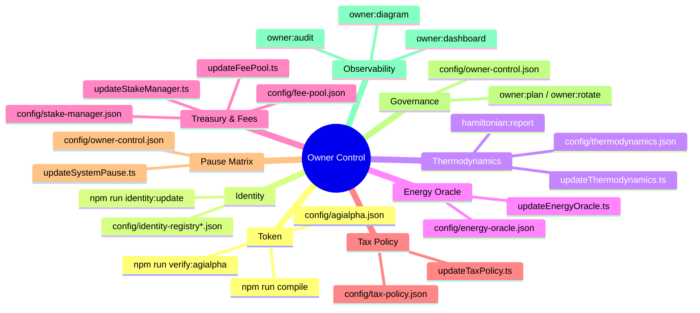

# Owner Control Index

This index distils every governance and configuration lever exposed by the AGIJobs v2 stack into a single, owner-friendly launchpad. It is designed for non-technical decision makers who must retune protocol parameters, rotate signers, or ship emergency fixes without touching Solidity or chasing scattered notes. Every entry below references an audited JSON manifest, a guided CLI helper, and a verification loop so the contract owner keeps full, provable authority over production systems.

> **Scope.** The index covers the supported v2 contracts (`contracts/v2`), all network-aware configuration files under `config/`, and the accompanying Hardhat/TypeScript orchestration scripts in `scripts/v2`. Legacy `contracts/legacy` artefacts remain unsupported.

## Mission control flight deck

The diagram below shows the canonical change pipeline. Each stage emits artefacts (Markdown, JSON, Safe bundles) that can be filed directly into compliance systems.

```mermaid
flowchart LR
    subgraph Config["Edit & Stage"]
        C1["config/*.json<br/>Network overrides"]
        C2["Draft change ticket<br/>(docs/owner-control-change-ticket.md)"]
    end

    subgraph Analyse["Assess"]
        A1["npm run owner:doctor<br/>Safety gate"]
        A2["npm run owner:parameters<br/>Parameter matrix"]
        A3["npm run owner:dashboard<br/>Live contract scan"]
    end

    subgraph Plan["Plan & Approve"]
        P1["npm run owner:plan<br/>diff preview"]
        P2["npm run owner:command-center<br/>narrative brief"]
        P3["npm run owner:blueprint<br/>compliance packet"]
    end

    subgraph Execute["Execute"]
        E1["npm run owner:rotate<br/>Ownership/governance"]
        E2["npx hardhat run scripts/v2/update*.ts --network &lt;net&gt; --execute"]
        E3["Safe bundle<br/>(owner:plan:safe)"]
    end

    subgraph Verify["Verify & Archive"]
        V1["npm run owner:verify-control"]
        V2["npm run owner:audit"]
        V3["npm run hamiltonian:report"]
    end

    Config --> Analyse --> Plan --> Execute --> Verify
    Verify -->|post-change baseline| Analyse
```

## Zero-downtime change workflow

1. **Snapshot the current state.**
   - Run `npm run owner:surface -- --network <network>` to capture hashes of every config file and deployed address.
   - Export deployment records (`docs/deployment-addresses.json`) and ENS ownership with `npm run identity:update -- --network <network>`.
2. **Edit the relevant JSON manifest(s).**
   - Always stage edits in version control for auditability.
   - Use the `docs/owner-control-configuration-template.md` checklist to avoid missing mandatory fields.
3. **Run the automated doctors.**
   - `npm run owner:doctor -- --network <network>` halts the workflow if decimals, treasury targets, signer quorums or guardians are unsafe.
   - `npm run owner:parameters -- --network <network>` renders a red/amber/green table so stakeholders can approve the diff visually.
4. **Generate a change plan.**
   - `npm run owner:plan -- --network <network>` prints the exact transactions that will be broadcast.
   - Optional: `npm run owner:plan:safe -- --network <network>` exports a Gnosis Safe JSON ready for the multisig signers.
5. **Execute with explicit confirmation.**
   - Dry-run: remove `--execute` until every action preview is green.
   - Apply: rerun the same command with `--execute` from a governance-controlled signer.
6. **Verify and archive.**
   - `npm run owner:verify-control -- --network <network> --strict` enforces ownership invariants.
   - `npm run owner:audit -- --network <network>` generates Markdown/JSON artefacts for auditors.
   - Attach all artefacts (doctor report, plan, verification output) to the change ticket captured in step 1.

> **Non-technical mode.** Run `npm run owner:quickstart -- --network <network>` for a wizard that asks plain-language questions and emits a tailored checklist covering the workflow above.

## Mainnet release (Safe bundle)

When the release checklist is green and stakeholders approve, trigger the GitHub Action to produce a multisig-ready execution plan:

1. Open **GitHub → Actions → `release-mainnet` → Run workflow**.
2. Select `mainnet` or `sepolia`, type **YES** into the confirmation box, and start the run.
3. Download the emitted artifact (`safe-bundle-<network>.zip`), extract `plan.json`, and upload it to your Safe for signing.
4. Collect the required approvals in the Safe UI, execute the bundle, then archive the signed transaction hash alongside the plan.

## Parameter catalogue

| Domain | Config manifest(s) | Primary CLI entry point | On-chain targets | Verification & telemetry |
| --- | --- | --- | --- | --- |
| Token metadata, decimals, module wiring | `config/agialpha.json` (+ per-network overrides) | `npm run compile` → regenerates `contracts/v2/Constants.sol`; `npm run verify:agialpha -- --rpc <url>` | `Constants`, `RewardEngineMB`, dependent modules | `npm run owner:doctor`, `npm run owner:verify-control`, `npm run owner:diagram`
| Identity registry (agent/validator ENS roots, emergency allowlists) | `config/identity-registry*.json` | `npm run identity:update -- --network <network>` | `IdentityRegistry`, emergency bypass allowlists | `npm run owner:dashboard`, `npm run owner:mission-control`
| Thermodynamic reward weights & PID gains | `config/thermodynamics.json` | `npx hardhat run scripts/v2/updateThermodynamics.ts --network <network>` | `RewardEngineMB`, `Thermostat` | `npm run owner:parameters`, `npm run hamiltonian:update`, `npm run hamiltonian:report`
| Energy oracle signers & quorum policy | `config/energy-oracle.json` | `npx hardhat run scripts/v2/updateEnergyOracle.ts --network <network>` | `EnergyOracle` signer registry | `npm run owner:doctor`, `npm run owner:atlas`
| Hamiltonian monitor window & observations | `config/hamiltonian-monitor.json` | `npx hardhat run scripts/v2/updateHamiltonianMonitor.ts --network <network>` | `HamiltonianMonitor` | `npm run hamiltonian:report`, `npm run owner:command-center`
| Fee burning & treasury routing | `config/fee-pool.json`, `config/stake-manager.json`, `config/job-registry.json` | `npx hardhat run scripts/v2/updateFeePool.ts --network <network>` (plus `updateStakeManager.ts`, `updateJobRegistry.ts`) | `FeePool`, `StakeManager`, `JobRegistry` | `npm run owner:doctor`, `npm run owner:surface`
| Tax policy text & acknowledgers | `config/tax-policy.json` | `npx hardhat run scripts/v2/updateTaxPolicy.ts --network <network>` | `TaxPolicy` | `npm run owner:audit`, `npm run owner:command-center`
| Platform incentive multipliers | `config/platform-incentives.json` | `npx hardhat run scripts/v2/updatePlatformIncentives.ts --network <network>` | `PlatformIncentives` library targets | `npm run owner:parameters`, `npm run owner:blueprint`
| Randomness coordinator quorum & stake | `config/randao-coordinator.json` | `npx hardhat run scripts/v2/updateRandaoCoordinator.ts --network <network>` | `RandaoCoordinator` | `npm run owner:mission-control`, `npm run owner:atlas`
| System-wide pause wiring & guardians | `config/owner-control.json` (pause block) | `npx hardhat run scripts/v2/updateSystemPause.ts --network <network>` | `SystemPause` module map | `npm run owner:doctor`, `npm run owner:verify-control`
| Governance & ownership routing | `config/owner-control.json` | `npm run owner:plan -- --network <network>` / `npm run owner:rotate -- --execute` | All `Ownable`/`Governable` contracts | `npm run owner:verify-control`, `npm run owner:surface`, `npm run owner:mission-control`
| Agent & validator incentives catalogue | `config/platform-registry.json`, `config/platform-incentives.json` | `npx hardhat run scripts/v2/updatePlatformRegistry.ts --network <network>` | `PlatformRegistry` | `npm run owner:dashboard`, `npm run owner:atlas`

> **Need everything at once?** `npm run owner:update-all -- --network <network>` dry-runs the entire stack of update helpers using the manifests above. Add `--execute` only after every per-module preview is approved.

## Visual parameter map

The mind map highlights how each configuration manifest feeds scripts, change tickets, and monitoring outputs. Use it to brief executives in seconds.

## Hardening checklist

- ✅ **Backup before change.** Copy the relevant `config/*.json` files and `docs/deployment-addresses.json` to an immutable store before editing.
- ✅ **Enforce multi-party approval.** Require signatures on the Safe bundle generated by `npm run owner:plan:safe` before executing any `--execute` step.
- ✅ **Automate regression detection.** Integrate `npm run owner:doctor -- --network <network> --strict` into CI so pull requests that weaken invariants fail fast.
- ✅ **Record evidence.** Attach the rendered Markdown from `npm run owner:command-center` and `npm run owner:audit` to every change ticket.
- ✅ **Post-change monitoring.** Schedule `npm run owner:dashboard -- --network <network>` and `npm run hamiltonian:report` in cron/CI to detect drift.

## Further reading

| Goal | Reference |
| --- | --- |
| End-to-end story with diagrams & human checklists | [Owner Control Playbook](owner-control-playbook.md) |
| Single-page operating model | [Owner Control Blueprint](owner-control-blueprint.md) |
| Visual brief with runtime metrics | [Owner Control Command Center](owner-control-command-center.md) |
| Zero-downtime upgrade drills | [Owner Control Zero-Downtime Guide](owner-control-zero-downtime-guide.md) |
| Structured change-ticket template | [Owner Control Change Ticket](owner-control-change-ticket.md) |

Print any of the above as Markdown or JSON via the matching `npm run owner:*` command listed in `package.json`. Every helper supports `--network <name>`, optional `--out <file>` destinations, and JSON output modes for automation.
## Owner & Governance setter catalogue

The catalogue below enumerates every `onlyOwner` and `onlyGovernance` setter exposed across the supported v2 contracts. Each entry references the ABI signature, emitted event(s), operational purpose, Etherscan "Write" tab procedure, and the CLI or manifest automation that keeps the workflow consistent with the rest of this playbook.

**Standard Etherscan flow:** connect the authorised owner or governance signer, open the contract's `Write Contract` tab, expand the desired function, populate the parameters, press `Write`, sign the transaction, and then archive the transaction hash inside the change ticket. Always re-run `npm run owner:plan -- --network <network>` and `npm run owner:verify-control -- --network <network>` after broadcasting to ensure the change is reflected in automation output.

### ArbitratorCommittee

Manifest: `config/job-registry.json`. CLI: `npx hardhat run scripts/v2/updateAllModules.ts --network <network>`.

* `pause` — ABI `pause()`
  - **Emits:** None
  - **Purpose:** Pauses contract execution.
  - **Parameters:** None
  - **Etherscan steps:**
    1. Navigate to the contract's page on the target network's Etherscan instance.
    2. Select the `Write Contract` tab and press `Connect` to use the authorised signer.
    3. Expand `pause`.
    4. No parameters to supply; confirm the action context in the change ticket.
    5. Press `Write` and sign the transaction; capture the transaction hash for the change record.
    6. Run `npm run owner:plan -- --network <network>` and `npm run owner:verify-control -- --network <network>` to confirm the state update.

* `setAbsenteeSlash` — ABI `setAbsenteeSlash(uint256)`
  - **Emits:** AbsenteeSlashUpdated
  - **Purpose:** Updates the absentee slash.
  - **Parameters:** `uint256 amount`
  - **Etherscan steps:**
    1. Navigate to the contract's page on the target network's Etherscan instance.
    2. Select the `Write Contract` tab and press `Connect` to use the authorised signer.
    3. Expand `setAbsenteeSlash`.
    4. Fill the parameters: `amount` (uint256)
    5. Press `Write` and sign the transaction; capture the transaction hash for the change record.
    6. Run `npm run owner:plan -- --network <network>` and `npm run owner:verify-control -- --network <network>` to confirm the state update.

* `setDisputeModule` — ABI `setDisputeModule(IDisputeModule)`
  - **Emits:** None
  - **Purpose:** Updates the dispute module.
  - **Parameters:** `IDisputeModule dm`
  - **Etherscan steps:**
    1. Navigate to the contract's page on the target network's Etherscan instance.
    2. Select the `Write Contract` tab and press `Connect` to use the authorised signer.
    3. Expand `setDisputeModule`.
    4. Fill the parameters: `dm` (IDisputeModule)
    5. Press `Write` and sign the transaction; capture the transaction hash for the change record.
    6. Run `npm run owner:plan -- --network <network>` and `npm run owner:verify-control -- --network <network>` to confirm the state update.

* `setPauser` — ABI `setPauser(address)`
  - **Emits:** PauserUpdated
  - **Purpose:** Updates the pauser.
  - **Parameters:** `address _pauser`
  - **Etherscan steps:**
    1. Navigate to the contract's page on the target network's Etherscan instance.
    2. Select the `Write Contract` tab and press `Connect` to use the authorised signer.
    3. Expand `setPauser`.
    4. Fill the parameters: `_pauser` (address)
    5. Press `Write` and sign the transaction; capture the transaction hash for the change record.
    6. Run `npm run owner:plan -- --network <network>` and `npm run owner:verify-control -- --network <network>` to confirm the state update.

* `unpause` — ABI `unpause()`
  - **Emits:** None
  - **Purpose:** Resumes contract execution.
  - **Parameters:** None
  - **Etherscan steps:**
    1. Navigate to the contract's page on the target network's Etherscan instance.
    2. Select the `Write Contract` tab and press `Connect` to use the authorised signer.
    3. Expand `unpause`.
    4. No parameters to supply; confirm the action context in the change ticket.
    5. Press `Write` and sign the transaction; capture the transaction hash for the change record.
    6. Run `npm run owner:plan -- --network <network>` and `npm run owner:verify-control -- --network <network>` to confirm the state update.

### AttestationRegistry

Manifest: `config/identity-registry*.json`. CLI: `npx hardhat run scripts/v2/updateIdentityRegistry.ts --network <network>`.

* `setENS` — ABI `setENS(address)`
  - **Emits:** ENSUpdated
  - **Purpose:** Updates the ens.
  - **Parameters:** `address ensAddr`
  - **Etherscan steps:**
    1. Navigate to the contract's page on the target network's Etherscan instance.
    2. Select the `Write Contract` tab and press `Connect` to use the authorised signer.
    3. Expand `setENS`.
    4. Fill the parameters: `ensAddr` (address)
    5. Press `Write` and sign the transaction; capture the transaction hash for the change record.
    6. Run `npm run owner:plan -- --network <network>` and `npm run owner:verify-control -- --network <network>` to confirm the state update.

* `setNameWrapper` — ABI `setNameWrapper(address)`
  - **Emits:** NameWrapperUpdated
  - **Purpose:** Updates the name wrapper.
  - **Parameters:** `address wrapper`
  - **Etherscan steps:**
    1. Navigate to the contract's page on the target network's Etherscan instance.
    2. Select the `Write Contract` tab and press `Connect` to use the authorised signer.
    3. Expand `setNameWrapper`.
    4. Fill the parameters: `wrapper` (address)
    5. Press `Write` and sign the transaction; capture the transaction hash for the change record.
    6. Run `npm run owner:plan -- --network <network>` and `npm run owner:verify-control -- --network <network>` to confirm the state update.

### AuditModule

Manifest: `config/job-registry.json`. CLI: `npx hardhat run scripts/v2/updateAllModules.ts --network <network>` (audit section).

* `setAuditPenalty` — ABI `setAuditPenalty(uint256)`
  - **Emits:** AuditPenaltyUpdated
  - **Purpose:** Updates the audit penalty.
  - **Parameters:** `uint256 penalty`
  - **Etherscan steps:**
    1. Navigate to the contract's page on the target network's Etherscan instance.
    2. Select the `Write Contract` tab and press `Connect` to use the authorised signer.
    3. Expand `setAuditPenalty`.
    4. Fill the parameters: `penalty` (uint256)
    5. Press `Write` and sign the transaction; capture the transaction hash for the change record.
    6. Run `npm run owner:plan -- --network <network>` and `npm run owner:verify-control -- --network <network>` to confirm the state update.

* `setAuditProbabilityBps` — ABI `setAuditProbabilityBps(uint256)`
  - **Emits:** AuditProbabilityUpdated
  - **Purpose:** Updates the audit probability bps.
  - **Parameters:** `uint256 probabilityBps`
  - **Etherscan steps:**
    1. Navigate to the contract's page on the target network's Etherscan instance.
    2. Select the `Write Contract` tab and press `Connect` to use the authorised signer.
    3. Expand `setAuditProbabilityBps`.
    4. Fill the parameters: `probabilityBps` (uint256)
    5. Press `Write` and sign the transaction; capture the transaction hash for the change record.
    6. Run `npm run owner:plan -- --network <network>` and `npm run owner:verify-control -- --network <network>` to confirm the state update.

* `setAuditor` — ABI `setAuditor(address, bool)`
  - **Emits:** AuditorUpdated
  - **Purpose:** Updates the auditor.
  - **Parameters:** `address auditor`, `bool allowed`
  - **Etherscan steps:**
    1. Navigate to the contract's page on the target network's Etherscan instance.
    2. Select the `Write Contract` tab and press `Connect` to use the authorised signer.
    3. Expand `setAuditor`.
    4. Fill the parameters: `auditor` (address), `allowed` (bool)
    5. Press `Write` and sign the transaction; capture the transaction hash for the change record.
    6. Run `npm run owner:plan -- --network <network>` and `npm run owner:verify-control -- --network <network>` to confirm the state update.

* `setJobRegistry` — ABI `setJobRegistry(address)`
  - **Emits:** JobRegistryUpdated
  - **Purpose:** Updates the job registry.
  - **Parameters:** `address registry`
  - **Etherscan steps:**
    1. Navigate to the contract's page on the target network's Etherscan instance.
    2. Select the `Write Contract` tab and press `Connect` to use the authorised signer.
    3. Expand `setJobRegistry`.
    4. Fill the parameters: `registry` (address)
    5. Press `Write` and sign the transaction; capture the transaction hash for the change record.
    6. Run `npm run owner:plan -- --network <network>` and `npm run owner:verify-control -- --network <network>` to confirm the state update.

* `setReputationEngine` — ABI `setReputationEngine(IReputationEngine)`
  - **Emits:** ReputationEngineUpdated
  - **Purpose:** Updates the reputation engine.
  - **Parameters:** `IReputationEngine engine`
  - **Etherscan steps:**
    1. Navigate to the contract's page on the target network's Etherscan instance.
    2. Select the `Write Contract` tab and press `Connect` to use the authorised signer.
    3. Expand `setReputationEngine`.
    4. Fill the parameters: `engine` (IReputationEngine)
    5. Press `Write` and sign the transaction; capture the transaction hash for the change record.
    6. Run `npm run owner:plan -- --network <network>` and `npm run owner:verify-control -- --network <network>` to confirm the state update.

* `pause` — ABI `pause()`
  - **Emits:** Paused
  - **Purpose:** Temporarily halts audit scheduling and processing during incidents.
  - **Parameters:** None
  - **Etherscan steps:**
    1. Navigate to the contract's page on the target network's Etherscan instance.
    2. Select the `Write Contract` tab and press `Connect` to use the authorised signer.
    3. Expand `pause`.
    4. No parameters to supply; confirm the incident context in the change ticket.
    5. Press `Write` and sign the transaction; capture the transaction hash for the change record.
    6. Run `npm run owner:plan -- --network <network>` and `npm run owner:verify-control -- --network <network>` to confirm the state update.

* `unpause` — ABI `unpause()`
  - **Emits:** Unpaused
  - **Purpose:** Resumes audit scheduling and processing once the incident is resolved.
  - **Parameters:** None
  - **Etherscan steps:**
    1. Navigate to the contract's page on the target network's Etherscan instance.
    2. Select the `Write Contract` tab and press `Connect` to use the authorised signer.
    3. Expand `unpause`.
    4. No parameters to supply; confirm the recovery context in the change ticket.
    5. Press `Write` and sign the transaction; capture the transaction hash for the change record.
    6. Run `npm run owner:plan -- --network <network>` and `npm run owner:verify-control -- --network <network>` to confirm the state update.

### CertificateNFT

Manifest: `config/job-registry.json`. CLI: `npx hardhat run scripts/v2/updateJobRegistry.ts --network <network>` (certificate block).

* `lockBaseURI` — ABI `lockBaseURI()`
  - **Emits:** BaseURILocked
  - **Purpose:** Executes lock base uri.
  - **Parameters:** None
  - **Etherscan steps:**
    1. Navigate to the contract's page on the target network's Etherscan instance.
    2. Select the `Write Contract` tab and press `Connect` to use the authorised signer.
    3. Expand `lockBaseURI`.
    4. No parameters to supply; confirm the action context in the change ticket.
    5. Press `Write` and sign the transaction; capture the transaction hash for the change record.
    6. Run `npm run owner:plan -- --network <network>` and `npm run owner:verify-control -- --network <network>` to confirm the state update.

* `pause` — ABI `pause()`
  - **Emits:** None
  - **Purpose:** Pauses contract execution.
  - **Parameters:** None
  - **Etherscan steps:**
    1. Navigate to the contract's page on the target network's Etherscan instance.
    2. Select the `Write Contract` tab and press `Connect` to use the authorised signer.
    3. Expand `pause`.
    4. No parameters to supply; confirm the action context in the change ticket.
    5. Press `Write` and sign the transaction; capture the transaction hash for the change record.
    6. Run `npm run owner:plan -- --network <network>` and `npm run owner:verify-control -- --network <network>` to confirm the state update.

* `setBaseURI` — ABI `setBaseURI(string calldata)`
  - **Emits:** BaseURISet
  - **Purpose:** Updates the base uri.
  - **Parameters:** `string calldata baseURI_`
  - **Etherscan steps:**
    1. Navigate to the contract's page on the target network's Etherscan instance.
    2. Select the `Write Contract` tab and press `Connect` to use the authorised signer.
    3. Expand `setBaseURI`.
    4. Fill the parameters: `baseURI_` (string calldata)
    5. Press `Write` and sign the transaction; capture the transaction hash for the change record.
    6. Run `npm run owner:plan -- --network <network>` and `npm run owner:verify-control -- --network <network>` to confirm the state update.

* `setJobRegistry` — ABI `setJobRegistry(address)`
  - **Emits:** JobRegistryUpdated
  - **Purpose:** Updates the job registry.
  - **Parameters:** `address registry`
  - **Etherscan steps:**
    1. Navigate to the contract's page on the target network's Etherscan instance.
    2. Select the `Write Contract` tab and press `Connect` to use the authorised signer.
    3. Expand `setJobRegistry`.
    4. Fill the parameters: `registry` (address)
    5. Press `Write` and sign the transaction; capture the transaction hash for the change record.
    6. Run `npm run owner:plan -- --network <network>` and `npm run owner:verify-control -- --network <network>` to confirm the state update.

* `setStakeManager` — ABI `setStakeManager(address)`
  - **Emits:** StakeManagerUpdated
  - **Purpose:** Updates the stake manager.
  - **Parameters:** `address manager`
  - **Etherscan steps:**
    1. Navigate to the contract's page on the target network's Etherscan instance.
    2. Select the `Write Contract` tab and press `Connect` to use the authorised signer.
    3. Expand `setStakeManager`.
    4. Fill the parameters: `manager` (address)
    5. Press `Write` and sign the transaction; capture the transaction hash for the change record.
    6. Run `npm run owner:plan -- --network <network>` and `npm run owner:verify-control -- --network <network>` to confirm the state update.

* `unpause` — ABI `unpause()`
  - **Emits:** None
  - **Purpose:** Resumes contract execution.
  - **Parameters:** None
  - **Etherscan steps:**
    1. Navigate to the contract's page on the target network's Etherscan instance.
    2. Select the `Write Contract` tab and press `Connect` to use the authorised signer.
    3. Expand `unpause`.
    4. No parameters to supply; confirm the action context in the change ticket.
    5. Press `Write` and sign the transaction; capture the transaction hash for the change record.
    6. Run `npm run owner:plan -- --network <network>` and `npm run owner:verify-control -- --network <network>` to confirm the state update.

* `updateBaseURI` — ABI `updateBaseURI(string calldata)`
  - **Emits:** BaseURIUpdated
  - **Purpose:** Executes update base uri.
  - **Parameters:** `string calldata baseURI_`
  - **Etherscan steps:**
    1. Navigate to the contract's page on the target network's Etherscan instance.
    2. Select the `Write Contract` tab and press `Connect` to use the authorised signer.
    3. Expand `updateBaseURI`.
    4. Fill the parameters: `baseURI_` (string calldata)
    5. Press `Write` and sign the transaction; capture the transaction hash for the change record.
    6. Run `npm run owner:plan -- --network <network>` and `npm run owner:verify-control -- --network <network>` to confirm the state update.

### EnergyOracle

Manifest: `config/energy-oracle.json`. CLI: `npx hardhat run scripts/v2/updateEnergyOracle.ts --network <network>`.

* `setSigner` — ABI `setSigner(address, bool)`
  - **Emits:** SignerUpdated
  - **Purpose:** Updates the signer.
  - **Parameters:** `address signer`, `bool allowed`
  - **Etherscan steps:**
    1. Navigate to the contract's page on the target network's Etherscan instance.
    2. Select the `Write Contract` tab and press `Connect` to use the authorised signer.
    3. Expand `setSigner`.
    4. Fill the parameters: `signer` (address), `allowed` (bool)
    5. Press `Write` and sign the transaction; capture the transaction hash for the change record.
    6. Run `npm run owner:plan -- --network <network>` and `npm run owner:verify-control -- --network <network>` to confirm the state update.

### FeePool

Manifest: `config/fee-pool.json`. CLI: `npx hardhat run scripts/v2/updateFeePool.ts --network <network>`.

* `pause` — ABI `pause()`
  - **Emits:** None
  - **Purpose:** Pauses contract execution.
  - **Parameters:** None
  - **Etherscan steps:**
    1. Navigate to the contract's page on the target network's Etherscan instance.
    2. Select the `Write Contract` tab and press `Connect` to use the authorised signer.
    3. Expand `pause`.
    4. No parameters to supply; confirm the action context in the change ticket.
    5. Press `Write` and sign the transaction; capture the transaction hash for the change record.
    6. Run `npm run owner:plan -- --network <network>` and `npm run owner:verify-control -- --network <network>` to confirm the state update.

* `setBurnPct` — ABI `setBurnPct(uint256)`
  - **Emits:** None
  - **Purpose:** Updates the burn pct.
  - **Parameters:** `uint256 pct`
  - **Etherscan steps:**
    1. Navigate to the contract's page on the target network's Etherscan instance.
    2. Select the `Write Contract` tab and press `Connect` to use the authorised signer.
    3. Expand `setBurnPct`.
    4. Fill the parameters: `pct` (uint256)
    5. Press `Write` and sign the transaction; capture the transaction hash for the change record.
    6. Run `npm run owner:plan -- --network <network>` and `npm run owner:verify-control -- --network <network>` to confirm the state update.

* `setGovernance` — ABI `setGovernance(address)`
  - **Emits:** None
  - **Purpose:** Updates the governance.
  - **Parameters:** `address _governance`
  - **Etherscan steps:**
    1. Navigate to the contract's page on the target network's Etherscan instance.
    2. Select the `Write Contract` tab and press `Connect` to use the authorised signer.
    3. Expand `setGovernance`.
    4. Fill the parameters: `_governance` (address)
    5. Press `Write` and sign the transaction; capture the transaction hash for the change record.
    6. Run `npm run owner:plan -- --network <network>` and `npm run owner:verify-control -- --network <network>` to confirm the state update.

* `setPauser` — ABI `setPauser(address)`
  - **Emits:** None
  - **Purpose:** Updates the pauser.
  - **Parameters:** `address _pauser`
  - **Etherscan steps:**
    1. Navigate to the contract's page on the target network's Etherscan instance.
    2. Select the `Write Contract` tab and press `Connect` to use the authorised signer.
    3. Expand `setPauser`.
    4. Fill the parameters: `_pauser` (address)
    5. Press `Write` and sign the transaction; capture the transaction hash for the change record.
    6. Run `npm run owner:plan -- --network <network>` and `npm run owner:verify-control -- --network <network>` to confirm the state update.

* `setRewardRole` — ABI `setRewardRole(IStakeManager.Role)`
  - **Emits:** None
  - **Purpose:** Updates the reward role.
  - **Parameters:** `IStakeManager.Role role`
  - **Etherscan steps:**
    1. Navigate to the contract's page on the target network's Etherscan instance.
    2. Select the `Write Contract` tab and press `Connect` to use the authorised signer.
    3. Expand `setRewardRole`.
    4. Fill the parameters: `role` (IStakeManager.Role)
    5. Press `Write` and sign the transaction; capture the transaction hash for the change record.
    6. Run `npm run owner:plan -- --network <network>` and `npm run owner:verify-control -- --network <network>` to confirm the state update.

* `setRewarder` — ABI `setRewarder(address, bool)`
  - **Emits:** None
  - **Purpose:** Updates the rewarder.
  - **Parameters:** `address rewarder`, `bool allowed`
  - **Etherscan steps:**
    1. Navigate to the contract's page on the target network's Etherscan instance.
    2. Select the `Write Contract` tab and press `Connect` to use the authorised signer.
    3. Expand `setRewarder`.
    4. Fill the parameters: `rewarder` (address), `allowed` (bool)
    5. Press `Write` and sign the transaction; capture the transaction hash for the change record.
    6. Run `npm run owner:plan -- --network <network>` and `npm run owner:verify-control -- --network <network>` to confirm the state update.

* `setStakeManager` — ABI `setStakeManager(IStakeManager)`
  - **Emits:** None
  - **Purpose:** Updates the stake manager.
  - **Parameters:** `IStakeManager manager`
  - **Etherscan steps:**
    1. Navigate to the contract's page on the target network's Etherscan instance.
    2. Select the `Write Contract` tab and press `Connect` to use the authorised signer.
    3. Expand `setStakeManager`.
    4. Fill the parameters: `manager` (IStakeManager)
    5. Press `Write` and sign the transaction; capture the transaction hash for the change record.
    6. Run `npm run owner:plan -- --network <network>` and `npm run owner:verify-control -- --network <network>` to confirm the state update.

* `setTaxPolicy` — ABI `setTaxPolicy(ITaxPolicy)`
  - **Emits:** None
  - **Purpose:** Updates the tax policy.
  - **Parameters:** `ITaxPolicy _policy`
  - **Etherscan steps:**
    1. Navigate to the contract's page on the target network's Etherscan instance.
    2. Select the `Write Contract` tab and press `Connect` to use the authorised signer.
    3. Expand `setTaxPolicy`.
    4. Fill the parameters: `_policy` (ITaxPolicy)
    5. Press `Write` and sign the transaction; capture the transaction hash for the change record.
    6. Run `npm run owner:plan -- --network <network>` and `npm run owner:verify-control -- --network <network>` to confirm the state update.

* `setTreasury` — ABI `setTreasury(address)`
  - **Emits:** None
  - **Purpose:** Updates the treasury.
  - **Parameters:** `address _treasury`
  - **Etherscan steps:**
    1. Navigate to the contract's page on the target network's Etherscan instance.
    2. Select the `Write Contract` tab and press `Connect` to use the authorised signer.
    3. Expand `setTreasury`.
    4. Fill the parameters: `_treasury` (address)
    5. Press `Write` and sign the transaction; capture the transaction hash for the change record.
    6. Run `npm run owner:plan -- --network <network>` and `npm run owner:verify-control -- --network <network>` to confirm the state update.

* `setTreasuryAllowlist` — ABI `setTreasuryAllowlist(address, bool)`
  - **Emits:** None
  - **Purpose:** Updates the treasury allowlist.
  - **Parameters:** `address _treasury`, `bool allowed`
  - **Etherscan steps:**
    1. Navigate to the contract's page on the target network's Etherscan instance.
    2. Select the `Write Contract` tab and press `Connect` to use the authorised signer.
    3. Expand `setTreasuryAllowlist`.
    4. Fill the parameters: `_treasury` (address), `allowed` (bool)
    5. Press `Write` and sign the transaction; capture the transaction hash for the change record.
    6. Run `npm run owner:plan -- --network <network>` and `npm run owner:verify-control -- --network <network>` to confirm the state update.

* `unpause` — ABI `unpause()`
  - **Emits:** None
  - **Purpose:** Resumes contract execution.
  - **Parameters:** None
  - **Etherscan steps:**
    1. Navigate to the contract's page on the target network's Etherscan instance.
    2. Select the `Write Contract` tab and press `Connect` to use the authorised signer.
    3. Expand `unpause`.
    4. No parameters to supply; confirm the action context in the change ticket.
    5. Press `Write` and sign the transaction; capture the transaction hash for the change record.
    6. Run `npm run owner:plan -- --network <network>` and `npm run owner:verify-control -- --network <network>` to confirm the state update.

### Governable

Use governance rota manifest in `config/owner-control.json`. CLI: `npm run owner:rotate -- --network <network>`.

* `setGovernance` — ABI `setGovernance(address)`
  - **Emits:** None
  - **Purpose:** Updates the governance.
  - **Parameters:** `address _governance`
  - **Etherscan steps:**
    1. Navigate to the contract's page on the target network's Etherscan instance.
    2. Select the `Write Contract` tab and press `Connect` to use the authorised signer.
    3. Expand `setGovernance`.
    4. Fill the parameters: `_governance` (address)
    5. Press `Write` and sign the transaction; capture the transaction hash for the change record.
    6. Run `npm run owner:plan -- --network <network>` and `npm run owner:verify-control -- --network <network>` to confirm the state update.

* `transferOwnership` — ABI `transferOwnership(address)`
  - **Emits:** None
  - **Purpose:** Transfers contract ownership.
  - **Parameters:** `address newOwner`
  - **Etherscan steps:**
    1. Navigate to the contract's page on the target network's Etherscan instance.
    2. Select the `Write Contract` tab and press `Connect` to use the authorised signer.
    3. Expand `transferOwnership`.
    4. Fill the parameters: `newOwner` (address)
    5. Press `Write` and sign the transaction; capture the transaction hash for the change record.
    6. Run `npm run owner:plan -- --network <network>` and `npm run owner:verify-control -- --network <network>` to confirm the state update.

### GovernanceReward

Manifest: `config/stake-manager.json`. CLI: `npx hardhat run scripts/v2/updateStakeManager.ts --network <network>` (governance reward section).

* `finalizeEpoch` — ABI `finalizeEpoch(uint256)`
  - **Emits:** EpochFinalized
  - **Purpose:** Finalizes the pending epoch/action.
  - **Parameters:** `uint256 rewardAmount`
  - **Etherscan steps:**
    1. Navigate to the contract's page on the target network's Etherscan instance.
    2. Select the `Write Contract` tab and press `Connect` to use the authorised signer.
    3. Expand `finalizeEpoch`.
    4. Fill the parameters: `rewardAmount` (uint256)
    5. Press `Write` and sign the transaction; capture the transaction hash for the change record.
    6. Run `npm run owner:plan -- --network <network>` and `npm run owner:verify-control -- --network <network>` to confirm the state update.

* `recordVoters` — ABI `recordVoters(address[] calldata)`
  - **Emits:** VoterRecorded
  - **Purpose:** Records governance data per function definition.
  - **Parameters:** `address[] calldata voters`
  - **Etherscan steps:**
    1. Navigate to the contract's page on the target network's Etherscan instance.
    2. Select the `Write Contract` tab and press `Connect` to use the authorised signer.
    3. Expand `recordVoters`.
    4. Fill the parameters: `voters` (address[] calldata)
    5. Press `Write` and sign the transaction; capture the transaction hash for the change record.
    6. Run `npm run owner:plan -- --network <network>` and `npm run owner:verify-control -- --network <network>` to confirm the state update.

* `setEpochLength` — ABI `setEpochLength(uint256)`
  - **Emits:** EpochLengthUpdated
  - **Purpose:** Updates the epoch length.
  - **Parameters:** `uint256 length`
  - **Etherscan steps:**
    1. Navigate to the contract's page on the target network's Etherscan instance.
    2. Select the `Write Contract` tab and press `Connect` to use the authorised signer.
    3. Expand `setEpochLength`.
    4. Fill the parameters: `length` (uint256)
    5. Press `Write` and sign the transaction; capture the transaction hash for the change record.
    6. Run `npm run owner:plan -- --network <network>` and `npm run owner:verify-control -- --network <network>` to confirm the state update.

* `setFeePool` — ABI `setFeePool(IFeePool)`
  - **Emits:** FeePoolUpdated
  - **Purpose:** Updates the fee pool.
  - **Parameters:** `IFeePool newFeePool`
  - **Etherscan steps:**
    1. Navigate to the contract's page on the target network's Etherscan instance.
    2. Select the `Write Contract` tab and press `Connect` to use the authorised signer.
    3. Expand `setFeePool`.
    4. Fill the parameters: `newFeePool` (IFeePool)
    5. Press `Write` and sign the transaction; capture the transaction hash for the change record.
    6. Run `npm run owner:plan -- --network <network>` and `npm run owner:verify-control -- --network <network>` to confirm the state update.

* `setRewardPct` — ABI `setRewardPct(uint256)`
  - **Emits:** RewardPctUpdated
  - **Purpose:** Updates the reward pct.
  - **Parameters:** `uint256 pct`
  - **Etherscan steps:**
    1. Navigate to the contract's page on the target network's Etherscan instance.
    2. Select the `Write Contract` tab and press `Connect` to use the authorised signer.
    3. Expand `setRewardPct`.
    4. Fill the parameters: `pct` (uint256)
    5. Press `Write` and sign the transaction; capture the transaction hash for the change record.
    6. Run `npm run owner:plan -- --network <network>` and `npm run owner:verify-control -- --network <network>` to confirm the state update.

* `setRewardRole` — ABI `setRewardRole(IStakeManager.Role)`
  - **Emits:** RewardRoleUpdated
  - **Purpose:** Updates the reward role.
  - **Parameters:** `IStakeManager.Role role`
  - **Etherscan steps:**
    1. Navigate to the contract's page on the target network's Etherscan instance.
    2. Select the `Write Contract` tab and press `Connect` to use the authorised signer.
    3. Expand `setRewardRole`.
    4. Fill the parameters: `role` (IStakeManager.Role)
    5. Press `Write` and sign the transaction; capture the transaction hash for the change record.
    6. Run `npm run owner:plan -- --network <network>` and `npm run owner:verify-control -- --network <network>` to confirm the state update.

* `setStakeManager` — ABI `setStakeManager(IStakeManager)`
  - **Emits:** StakeManagerUpdated
  - **Purpose:** Updates the stake manager.
  - **Parameters:** `IStakeManager newStakeManager`
  - **Etherscan steps:**
    1. Navigate to the contract's page on the target network's Etherscan instance.
    2. Select the `Write Contract` tab and press `Connect` to use the authorised signer.
    3. Expand `setStakeManager`.
    4. Fill the parameters: `newStakeManager` (IStakeManager)
    5. Press `Write` and sign the transaction; capture the transaction hash for the change record.
    6. Run `npm run owner:plan -- --network <network>` and `npm run owner:verify-control -- --network <network>` to confirm the state update.

### HamiltonianMonitor

Manifest: `config/hamiltonian-monitor.json`. CLI: `npx hardhat run scripts/v2/updateHamiltonianMonitor.ts --network <network>`.

* `record` — ABI `record(uint256, uint256)`
  - **Emits:** HamiltonianUpdated
  - **Purpose:** Records governance data per function definition.
  - **Parameters:** `uint256 d`, `uint256 u`
  - **Etherscan steps:**
    1. Navigate to the contract's page on the target network's Etherscan instance.
    2. Select the `Write Contract` tab and press `Connect` to use the authorised signer.
    3. Expand `record`.
    4. Fill the parameters: `d` (uint256), `u` (uint256)
    5. Press `Write` and sign the transaction; capture the transaction hash for the change record.
    6. Run `npm run owner:plan -- --network <network>` and `npm run owner:verify-control -- --network <network>` to confirm the state update.

* `resetHistory` — ABI `resetHistory()`
  - **Emits:** HistoryReset
  - **Purpose:** Executes reset history.
  - **Parameters:** None
  - **Etherscan steps:**
    1. Navigate to the contract's page on the target network's Etherscan instance.
    2. Select the `Write Contract` tab and press `Connect` to use the authorised signer.
    3. Expand `resetHistory`.
    4. No parameters to supply; confirm the action context in the change ticket.
    5. Press `Write` and sign the transaction; capture the transaction hash for the change record.
    6. Run `npm run owner:plan -- --network <network>` and `npm run owner:verify-control -- --network <network>` to confirm the state update.

* `setWindow` — ABI `setWindow(uint256, bool)`
  - **Emits:** HistoryReset, WindowUpdated
  - **Purpose:** Updates the window.
  - **Parameters:** `uint256 newWindow`, `bool resetHistoryFlag`
  - **Etherscan steps:**
    1. Navigate to the contract's page on the target network's Etherscan instance.
    2. Select the `Write Contract` tab and press `Connect` to use the authorised signer.
    3. Expand `setWindow`.
    4. Fill the parameters: `newWindow` (uint256), `resetHistoryFlag` (bool)
    5. Press `Write` and sign the transaction; capture the transaction hash for the change record.
    6. Run `npm run owner:plan -- --network <network>` and `npm run owner:verify-control -- --network <network>` to confirm the state update.

### IdentityRegistry

Manifest: `config/identity-registry*.json`. CLI: `npx hardhat run scripts/v2/updateIdentityRegistry.ts --network <network>`.

* `addAdditionalAgent` — ABI `addAdditionalAgent(address)`
  - **Emits:** None
  - **Purpose:** Adds a additional agent.
  - **Parameters:** `address agent`
  - **Etherscan steps:**
    1. Navigate to the contract's page on the target network's Etherscan instance.
    2. Select the `Write Contract` tab and press `Connect` to use the authorised signer.
    3. Expand `addAdditionalAgent`.
    4. Fill the parameters: `agent` (address)
    5. Press `Write` and sign the transaction; capture the transaction hash for the change record.
    6. Run `npm run owner:plan -- --network <network>` and `npm run owner:verify-control -- --network <network>` to confirm the state update.

* `addAdditionalNodeOperator` — ABI `addAdditionalNodeOperator(address)`
  - **Emits:** None
  - **Purpose:** Adds a additional node operator.
  - **Parameters:** `address nodeOperator`
  - **Etherscan steps:**
    1. Navigate to the contract's page on the target network's Etherscan instance.
    2. Select the `Write Contract` tab and press `Connect` to use the authorised signer.
    3. Expand `addAdditionalNodeOperator`.
    4. Fill the parameters: `nodeOperator` (address)
    5. Press `Write` and sign the transaction; capture the transaction hash for the change record.
    6. Run `npm run owner:plan -- --network <network>` and `npm run owner:verify-control -- --network <network>` to confirm the state update.

* `addAdditionalValidator` — ABI `addAdditionalValidator(address)`
  - **Emits:** None
  - **Purpose:** Adds a additional validator.
  - **Parameters:** `address validator`
  - **Etherscan steps:**
    1. Navigate to the contract's page on the target network's Etherscan instance.
    2. Select the `Write Contract` tab and press `Connect` to use the authorised signer.
    3. Expand `addAdditionalValidator`.
    4. Fill the parameters: `validator` (address)
    5. Press `Write` and sign the transaction; capture the transaction hash for the change record.
    6. Run `npm run owner:plan -- --network <network>` and `npm run owner:verify-control -- --network <network>` to confirm the state update.

* `addAgentRootNodeAlias` — ABI `addAgentRootNodeAlias(bytes32)`
  - **Emits:** None
  - **Purpose:** Adds a agent root node alias.
  - **Parameters:** `bytes32 node`
  - **Etherscan steps:**
    1. Navigate to the contract's page on the target network's Etherscan instance.
    2. Select the `Write Contract` tab and press `Connect` to use the authorised signer.
    3. Expand `addAgentRootNodeAlias`.
    4. Fill the parameters: `node` (bytes32)
    5. Press `Write` and sign the transaction; capture the transaction hash for the change record.
    6. Run `npm run owner:plan -- --network <network>` and `npm run owner:verify-control -- --network <network>` to confirm the state update.

* `addClubRootNodeAlias` — ABI `addClubRootNodeAlias(bytes32)`
  - **Emits:** None
  - **Purpose:** Adds a club root node alias.
  - **Parameters:** `bytes32 node`
  - **Etherscan steps:**
    1. Navigate to the contract's page on the target network's Etherscan instance.
    2. Select the `Write Contract` tab and press `Connect` to use the authorised signer.
    3. Expand `addClubRootNodeAlias`.
    4. Fill the parameters: `node` (bytes32)
    5. Press `Write` and sign the transaction; capture the transaction hash for the change record.
    6. Run `npm run owner:plan -- --network <network>` and `npm run owner:verify-control -- --network <network>` to confirm the state update.

* `addNodeRootNodeAlias` — ABI `addNodeRootNodeAlias(bytes32)`
  - **Emits:** None
  - **Purpose:** Adds a node root node alias.
  - **Parameters:** `bytes32 node`
  - **Etherscan steps:**
    1. Navigate to the contract's page on the target network's Etherscan instance.
    2. Select the `Write Contract` tab and press `Connect` to use the authorised signer.
    3. Expand `addNodeRootNodeAlias`.
    4. Fill the parameters: `node` (bytes32)
    5. Press `Write` and sign the transaction; capture the transaction hash for the change record.
    6. Run `npm run owner:plan -- --network <network>` and `npm run owner:verify-control -- --network <network>` to confirm the state update.

* `configureMainnet` — ABI `configureMainnet()`
  - **Emits:** MainnetConfigured
  - **Purpose:** Applies the canned configuration routine.
  - **Parameters:** None
  - **Etherscan steps:**
    1. Navigate to the contract's page on the target network's Etherscan instance.
    2. Select the `Write Contract` tab and press `Connect` to use the authorised signer.
    3. Expand `configureMainnet`.
    4. No parameters to supply; confirm the action context in the change ticket.
    5. Press `Write` and sign the transaction; capture the transaction hash for the change record.
    6. Run `npm run owner:plan -- --network <network>` and `npm run owner:verify-control -- --network <network>` to confirm the state update.

* `removeAdditionalAgent` — ABI `removeAdditionalAgent(address)`
  - **Emits:** None
  - **Purpose:** Removes a additional agent.
  - **Parameters:** `address agent`
  - **Etherscan steps:**
    1. Navigate to the contract's page on the target network's Etherscan instance.
    2. Select the `Write Contract` tab and press `Connect` to use the authorised signer.
    3. Expand `removeAdditionalAgent`.
    4. Fill the parameters: `agent` (address)
    5. Press `Write` and sign the transaction; capture the transaction hash for the change record.
    6. Run `npm run owner:plan -- --network <network>` and `npm run owner:verify-control -- --network <network>` to confirm the state update.

* `removeAdditionalNodeOperator` — ABI `removeAdditionalNodeOperator(address)`
  - **Emits:** None
  - **Purpose:** Removes a additional node operator.
  - **Parameters:** `address nodeOperator`
  - **Etherscan steps:**
    1. Navigate to the contract's page on the target network's Etherscan instance.
    2. Select the `Write Contract` tab and press `Connect` to use the authorised signer.
    3. Expand `removeAdditionalNodeOperator`.
    4. Fill the parameters: `nodeOperator` (address)
    5. Press `Write` and sign the transaction; capture the transaction hash for the change record.
    6. Run `npm run owner:plan -- --network <network>` and `npm run owner:verify-control -- --network <network>` to confirm the state update.

* `removeAdditionalValidator` — ABI `removeAdditionalValidator(address)`
  - **Emits:** None
  - **Purpose:** Removes a additional validator.
  - **Parameters:** `address validator`
  - **Etherscan steps:**
    1. Navigate to the contract's page on the target network's Etherscan instance.
    2. Select the `Write Contract` tab and press `Connect` to use the authorised signer.
    3. Expand `removeAdditionalValidator`.
    4. Fill the parameters: `validator` (address)
    5. Press `Write` and sign the transaction; capture the transaction hash for the change record.
    6. Run `npm run owner:plan -- --network <network>` and `npm run owner:verify-control -- --network <network>` to confirm the state update.

* `removeAgentRootNodeAlias` — ABI `removeAgentRootNodeAlias(bytes32)`
  - **Emits:** None
  - **Purpose:** Removes a agent root node alias.
  - **Parameters:** `bytes32 node`
  - **Etherscan steps:**
    1. Navigate to the contract's page on the target network's Etherscan instance.
    2. Select the `Write Contract` tab and press `Connect` to use the authorised signer.
    3. Expand `removeAgentRootNodeAlias`.
    4. Fill the parameters: `node` (bytes32)
    5. Press `Write` and sign the transaction; capture the transaction hash for the change record.
    6. Run `npm run owner:plan -- --network <network>` and `npm run owner:verify-control -- --network <network>` to confirm the state update.

* `removeClubRootNodeAlias` — ABI `removeClubRootNodeAlias(bytes32)`
  - **Emits:** None
  - **Purpose:** Removes a club root node alias.
  - **Parameters:** `bytes32 node`
  - **Etherscan steps:**
    1. Navigate to the contract's page on the target network's Etherscan instance.
    2. Select the `Write Contract` tab and press `Connect` to use the authorised signer.
    3. Expand `removeClubRootNodeAlias`.
    4. Fill the parameters: `node` (bytes32)
    5. Press `Write` and sign the transaction; capture the transaction hash for the change record.
    6. Run `npm run owner:plan -- --network <network>` and `npm run owner:verify-control -- --network <network>` to confirm the state update.

* `removeNodeRootNodeAlias` — ABI `removeNodeRootNodeAlias(bytes32)`
  - **Emits:** None
  - **Purpose:** Removes a node root node alias.
  - **Parameters:** `bytes32 node`
  - **Etherscan steps:**
    1. Navigate to the contract's page on the target network's Etherscan instance.
    2. Select the `Write Contract` tab and press `Connect` to use the authorised signer.
    3. Expand `removeNodeRootNodeAlias`.
    4. Fill the parameters: `node` (bytes32)
    5. Press `Write` and sign the transaction; capture the transaction hash for the change record.
    6. Run `npm run owner:plan -- --network <network>` and `npm run owner:verify-control -- --network <network>` to confirm the state update.

* `setAgentMerkleRoot` — ABI `setAgentMerkleRoot(bytes32)`
  - **Emits:** None
  - **Purpose:** Updates the agent merkle root.
  - **Parameters:** `bytes32 root`
  - **Etherscan steps:**
    1. Navigate to the contract's page on the target network's Etherscan instance.
    2. Select the `Write Contract` tab and press `Connect` to use the authorised signer.
    3. Expand `setAgentMerkleRoot`.
    4. Fill the parameters: `root` (bytes32)
    5. Press `Write` and sign the transaction; capture the transaction hash for the change record.
    6. Run `npm run owner:plan -- --network <network>` and `npm run owner:verify-control -- --network <network>` to confirm the state update.

* `setAgentProfileURI` — ABI `setAgentProfileURI(address, string calldata)`
  - **Emits:** AgentProfileUpdated
  - **Purpose:** Updates the agent profile uri.
  - **Parameters:** `address agent`, `string calldata uri`
  - **Etherscan steps:**
    1. Navigate to the contract's page on the target network's Etherscan instance.
    2. Select the `Write Contract` tab and press `Connect` to use the authorised signer.
    3. Expand `setAgentProfileURI`.
    4. Fill the parameters: `agent` (address), `uri` (string calldata)
    5. Press `Write` and sign the transaction; capture the transaction hash for the change record.
    6. Run `npm run owner:plan -- --network <network>` and `npm run owner:verify-control -- --network <network>` to confirm the state update.

* `setAgentRootNode` — ABI `setAgentRootNode(bytes32)`
  - **Emits:** None
  - **Purpose:** Updates the agent root node.
  - **Parameters:** `bytes32 root`
  - **Etherscan steps:**
    1. Navigate to the contract's page on the target network's Etherscan instance.
    2. Select the `Write Contract` tab and press `Connect` to use the authorised signer.
    3. Expand `setAgentRootNode`.
    4. Fill the parameters: `root` (bytes32)
    5. Press `Write` and sign the transaction; capture the transaction hash for the change record.
    6. Run `npm run owner:plan -- --network <network>` and `npm run owner:verify-control -- --network <network>` to confirm the state update.

* `setAgentType` — ABI `setAgentType(address, AgentType)`
  - **Emits:** None
  - **Purpose:** Updates the agent type.
  - **Parameters:** `address agent`, `AgentType agentType`
  - **Etherscan steps:**
    1. Navigate to the contract's page on the target network's Etherscan instance.
    2. Select the `Write Contract` tab and press `Connect` to use the authorised signer.
    3. Expand `setAgentType`.
    4. Fill the parameters: `agent` (address), `agentType` (AgentType)
    5. Press `Write` and sign the transaction; capture the transaction hash for the change record.
    6. Run `npm run owner:plan -- --network <network>` and `npm run owner:verify-control -- --network <network>` to confirm the state update.

* `setAttestationRegistry` — ABI `setAttestationRegistry(address)`
  - **Emits:** None
  - **Purpose:** Updates the attestation registry.
  - **Parameters:** `address registry`
  - **Etherscan steps:**
    1. Navigate to the contract's page on the target network's Etherscan instance.
    2. Select the `Write Contract` tab and press `Connect` to use the authorised signer.
    3. Expand `setAttestationRegistry`.
    4. Fill the parameters: `registry` (address)
    5. Press `Write` and sign the transaction; capture the transaction hash for the change record.
    6. Run `npm run owner:plan -- --network <network>` and `npm run owner:verify-control -- --network <network>` to confirm the state update.

* `setClubRootNode` — ABI `setClubRootNode(bytes32)`
  - **Emits:** None
  - **Purpose:** Updates the club root node.
  - **Parameters:** `bytes32 root`
  - **Etherscan steps:**
    1. Navigate to the contract's page on the target network's Etherscan instance.
    2. Select the `Write Contract` tab and press `Connect` to use the authorised signer.
    3. Expand `setClubRootNode`.
    4. Fill the parameters: `root` (bytes32)
    5. Press `Write` and sign the transaction; capture the transaction hash for the change record.
    6. Run `npm run owner:plan -- --network <network>` and `npm run owner:verify-control -- --network <network>` to confirm the state update.

* `setENS` — ABI `setENS(address)`
  - **Emits:** None
  - **Purpose:** Updates the ens.
  - **Parameters:** `address ensAddr`
  - **Etherscan steps:**
    1. Navigate to the contract's page on the target network's Etherscan instance.
    2. Select the `Write Contract` tab and press `Connect` to use the authorised signer.
    3. Expand `setENS`.
    4. Fill the parameters: `ensAddr` (address)
    5. Press `Write` and sign the transaction; capture the transaction hash for the change record.
    6. Run `npm run owner:plan -- --network <network>` and `npm run owner:verify-control -- --network <network>` to confirm the state update.

* `setNameWrapper` — ABI `setNameWrapper(address)`
  - **Emits:** None
  - **Purpose:** Updates the name wrapper.
  - **Parameters:** `address wrapper`
  - **Etherscan steps:**
    1. Navigate to the contract's page on the target network's Etherscan instance.
    2. Select the `Write Contract` tab and press `Connect` to use the authorised signer.
    3. Expand `setNameWrapper`.
    4. Fill the parameters: `wrapper` (address)
    5. Press `Write` and sign the transaction; capture the transaction hash for the change record.
    6. Run `npm run owner:plan -- --network <network>` and `npm run owner:verify-control -- --network <network>` to confirm the state update.

* `setNodeRootNode` — ABI `setNodeRootNode(bytes32)`
  - **Emits:** None
  - **Purpose:** Updates the node root node.
  - **Parameters:** `bytes32 root`
  - **Etherscan steps:**
    1. Navigate to the contract's page on the target network's Etherscan instance.
    2. Select the `Write Contract` tab and press `Connect` to use the authorised signer.
    3. Expand `setNodeRootNode`.
    4. Fill the parameters: `root` (bytes32)
    5. Press `Write` and sign the transaction; capture the transaction hash for the change record.
    6. Run `npm run owner:plan -- --network <network>` and `npm run owner:verify-control -- --network <network>` to confirm the state update.

* `setReputationEngine` — ABI `setReputationEngine(address)`
  - **Emits:** None
  - **Purpose:** Updates the reputation engine.
  - **Parameters:** `address engine`
  - **Etherscan steps:**
    1. Navigate to the contract's page on the target network's Etherscan instance.
    2. Select the `Write Contract` tab and press `Connect` to use the authorised signer.
    3. Expand `setReputationEngine`.
    4. Fill the parameters: `engine` (address)
    5. Press `Write` and sign the transaction; capture the transaction hash for the change record.
    6. Run `npm run owner:plan -- --network <network>` and `npm run owner:verify-control -- --network <network>` to confirm the state update.

* `setValidatorMerkleRoot` — ABI `setValidatorMerkleRoot(bytes32)`
  - **Emits:** None
  - **Purpose:** Updates the validator merkle root.
  - **Parameters:** `bytes32 root`
  - **Etherscan steps:**
    1. Navigate to the contract's page on the target network's Etherscan instance.
    2. Select the `Write Contract` tab and press `Connect` to use the authorised signer.
    3. Expand `setValidatorMerkleRoot`.
    4. Fill the parameters: `root` (bytes32)
    5. Press `Write` and sign the transaction; capture the transaction hash for the change record.
    6. Run `npm run owner:plan -- --network <network>` and `npm run owner:verify-control -- --network <network>` to confirm the state update.

### JobRegistry

Manifest: `config/job-registry.json`. CLI: `npx hardhat run scripts/v2/updateJobRegistry.ts --network <network>`.

* `bumpAgentAuthCacheVersion` — ABI `bumpAgentAuthCacheVersion()`
  - **Emits:** None
  - **Purpose:** Bumps the agent auth cache version.
  - **Parameters:** None
  - **Etherscan steps:**
    1. Navigate to the contract's page on the target network's Etherscan instance.
    2. Select the `Write Contract` tab and press `Connect` to use the authorised signer.
    3. Expand `bumpAgentAuthCacheVersion`.
    4. No parameters to supply; confirm the action context in the change ticket.
    5. Press `Write` and sign the transaction; capture the transaction hash for the change record.
    6. Run `npm run owner:plan -- --network <network>` and `npm run owner:verify-control -- --network <network>` to confirm the state update.

* `delistJob` — ABI `delistJob(uint256)`
  - **Emits:** None
  - **Purpose:** Executes delist job.
  - **Parameters:** `uint256 jobId`
  - **Etherscan steps:**
    1. Navigate to the contract's page on the target network's Etherscan instance.
    2. Select the `Write Contract` tab and press `Connect` to use the authorised signer.
    3. Expand `delistJob`.
    4. Fill the parameters: `jobId` (uint256)
    5. Press `Write` and sign the transaction; capture the transaction hash for the change record.
    6. Run `npm run owner:plan -- --network <network>` and `npm run owner:verify-control -- --network <network>` to confirm the state update.

* `pause` — ABI `pause()`
  - **Emits:** None
  - **Purpose:** Pauses contract execution.
  - **Parameters:** None
  - **Etherscan steps:**
    1. Navigate to the contract's page on the target network's Etherscan instance.
    2. Select the `Write Contract` tab and press `Connect` to use the authorised signer.
    3. Expand `pause`.
    4. No parameters to supply; confirm the action context in the change ticket.
    5. Press `Write` and sign the transaction; capture the transaction hash for the change record.
    6. Run `npm run owner:plan -- --network <network>` and `npm run owner:verify-control -- --network <network>` to confirm the state update.

* `setAcknowledger` — ABI `setAcknowledger(address, bool)`
  - **Emits:** None
  - **Purpose:** Updates the acknowledger.
  - **Parameters:** `address acknowledger`, `bool allowed`
  - **Etherscan steps:**
    1. Navigate to the contract's page on the target network's Etherscan instance.
    2. Select the `Write Contract` tab and press `Connect` to use the authorised signer.
    3. Expand `setAcknowledger`.
    4. Fill the parameters: `acknowledger` (address), `allowed` (bool)
    5. Press `Write` and sign the transaction; capture the transaction hash for the change record.
    6. Run `npm run owner:plan -- --network <network>` and `npm run owner:verify-control -- --network <network>` to confirm the state update.

* `setAgentAuthCacheDuration` — ABI `setAgentAuthCacheDuration(uint256)`
  - **Emits:** None
  - **Purpose:** Updates the agent auth cache duration.
  - **Parameters:** `uint256 duration`
  - **Etherscan steps:**
    1. Navigate to the contract's page on the target network's Etherscan instance.
    2. Select the `Write Contract` tab and press `Connect` to use the authorised signer.
    3. Expand `setAgentAuthCacheDuration`.
    4. Fill the parameters: `duration` (uint256)
    5. Press `Write` and sign the transaction; capture the transaction hash for the change record.
    6. Run `npm run owner:plan -- --network <network>` and `npm run owner:verify-control -- --network <network>` to confirm the state update.

* `setAgentMerkleRoot` — ABI `setAgentMerkleRoot(bytes32)`
  - **Emits:** None
  - **Purpose:** Updates the agent merkle root.
  - **Parameters:** `bytes32 root`
  - **Etherscan steps:**
    1. Navigate to the contract's page on the target network's Etherscan instance.
    2. Select the `Write Contract` tab and press `Connect` to use the authorised signer.
    3. Expand `setAgentMerkleRoot`.
    4. Fill the parameters: `root` (bytes32)
    5. Press `Write` and sign the transaction; capture the transaction hash for the change record.
    6. Run `npm run owner:plan -- --network <network>` and `npm run owner:verify-control -- --network <network>` to confirm the state update.

* `setAgentRootNode` — ABI `setAgentRootNode(bytes32)`
  - **Emits:** None
  - **Purpose:** Updates the agent root node.
  - **Parameters:** `bytes32 node`
  - **Etherscan steps:**
    1. Navigate to the contract's page on the target network's Etherscan instance.
    2. Select the `Write Contract` tab and press `Connect` to use the authorised signer.
    3. Expand `setAgentRootNode`.
    4. Fill the parameters: `node` (bytes32)
    5. Press `Write` and sign the transaction; capture the transaction hash for the change record.
    6. Run `npm run owner:plan -- --network <network>` and `npm run owner:verify-control -- --network <network>` to confirm the state update.

* `setAuditModule` — ABI `setAuditModule(IAuditModule)`
  - **Emits:** None
  - **Purpose:** Updates the audit module.
  - **Parameters:** `IAuditModule module`
  - **Etherscan steps:**
    1. Navigate to the contract's page on the target network's Etherscan instance.
    2. Select the `Write Contract` tab and press `Connect` to use the authorised signer.
    3. Expand `setAuditModule`.
    4. Fill the parameters: `module` (IAuditModule)
    5. Press `Write` and sign the transaction; capture the transaction hash for the change record.
    6. Run `npm run owner:plan -- --network <network>` and `npm run owner:verify-control -- --network <network>` to confirm the state update.

* `setCertificateNFT` — ABI `setCertificateNFT(ICertificateNFT)`
  - **Emits:** None
  - **Purpose:** Updates the certificate nft.
  - **Parameters:** `ICertificateNFT nft`
  - **Etherscan steps:**
    1. Navigate to the contract's page on the target network's Etherscan instance.
    2. Select the `Write Contract` tab and press `Connect` to use the authorised signer.
    3. Expand `setCertificateNFT`.
    4. Fill the parameters: `nft` (ICertificateNFT)
    5. Press `Write` and sign the transaction; capture the transaction hash for the change record.
    6. Run `npm run owner:plan -- --network <network>` and `npm run owner:verify-control -- --network <network>` to confirm the state update.

* `setDisputeModule` — ABI `setDisputeModule(IDisputeModule)`
  - **Emits:** None
  - **Purpose:** Updates the dispute module.
  - **Parameters:** `IDisputeModule module`
  - **Etherscan steps:**
    1. Navigate to the contract's page on the target network's Etherscan instance.
    2. Select the `Write Contract` tab and press `Connect` to use the authorised signer.
    3. Expand `setDisputeModule`.
    4. Fill the parameters: `module` (IDisputeModule)
    5. Press `Write` and sign the transaction; capture the transaction hash for the change record.
    6. Run `npm run owner:plan -- --network <network>` and `npm run owner:verify-control -- --network <network>` to confirm the state update.

* `setExpirationGracePeriod` — ABI `setExpirationGracePeriod(uint256)`
  - **Emits:** None
  - **Purpose:** Updates the expiration grace period.
  - **Parameters:** `uint256 period`
  - **Etherscan steps:**
    1. Navigate to the contract's page on the target network's Etherscan instance.
    2. Select the `Write Contract` tab and press `Connect` to use the authorised signer.
    3. Expand `setExpirationGracePeriod`.
    4. Fill the parameters: `period` (uint256)
    5. Press `Write` and sign the transaction; capture the transaction hash for the change record.
    6. Run `npm run owner:plan -- --network <network>` and `npm run owner:verify-control -- --network <network>` to confirm the state update.

* `setFeePct` — ABI `setFeePct(uint256)`
  - **Emits:** None
  - **Purpose:** Updates the fee pct.
  - **Parameters:** `uint256 _feePct`
  - **Etherscan steps:**
    1. Navigate to the contract's page on the target network's Etherscan instance.
    2. Select the `Write Contract` tab and press `Connect` to use the authorised signer.
    3. Expand `setFeePct`.
    4. Fill the parameters: `_feePct` (uint256)
    5. Press `Write` and sign the transaction; capture the transaction hash for the change record.
    6. Run `npm run owner:plan -- --network <network>` and `npm run owner:verify-control -- --network <network>` to confirm the state update.

* `setFeePool` — ABI `setFeePool(IFeePool)`
  - **Emits:** None
  - **Purpose:** Updates the fee pool.
  - **Parameters:** `IFeePool _feePool`
  - **Etherscan steps:**
    1. Navigate to the contract's page on the target network's Etherscan instance.
    2. Select the `Write Contract` tab and press `Connect` to use the authorised signer.
    3. Expand `setFeePool`.
    4. Fill the parameters: `_feePool` (IFeePool)
    5. Press `Write` and sign the transaction; capture the transaction hash for the change record.
    6. Run `npm run owner:plan -- --network <network>` and `npm run owner:verify-control -- --network <network>` to confirm the state update.

* `setIdentityRegistry` — ABI `setIdentityRegistry(IIdentityRegistry)`
  - **Emits:** None
  - **Purpose:** Updates the identity registry.
  - **Parameters:** `IIdentityRegistry registry`
  - **Etherscan steps:**
    1. Navigate to the contract's page on the target network's Etherscan instance.
    2. Select the `Write Contract` tab and press `Connect` to use the authorised signer.
    3. Expand `setIdentityRegistry`.
    4. Fill the parameters: `registry` (IIdentityRegistry)
    5. Press `Write` and sign the transaction; capture the transaction hash for the change record.
    6. Run `npm run owner:plan -- --network <network>` and `npm run owner:verify-control -- --network <network>` to confirm the state update.

* `setJobDurationLimit` — ABI `setJobDurationLimit(uint256)`
  - **Emits:** None
  - **Purpose:** Updates the job duration limit.
  - **Parameters:** `uint256 limit`
  - **Etherscan steps:**
    1. Navigate to the contract's page on the target network's Etherscan instance.
    2. Select the `Write Contract` tab and press `Connect` to use the authorised signer.
    3. Expand `setJobDurationLimit`.
    4. Fill the parameters: `limit` (uint256)
    5. Press `Write` and sign the transaction; capture the transaction hash for the change record.
    6. Run `npm run owner:plan -- --network <network>` and `npm run owner:verify-control -- --network <network>` to confirm the state update.

* `setJobParameters` — ABI `setJobParameters(uint256, uint256)`
  - **Emits:** None
  - **Purpose:** Updates the job parameters.
  - **Parameters:** `uint256 maxReward`, `uint256 stake`
  - **Etherscan steps:**
    1. Navigate to the contract's page on the target network's Etherscan instance.
    2. Select the `Write Contract` tab and press `Connect` to use the authorised signer.
    3. Expand `setJobParameters`.
    4. Fill the parameters: `maxReward` (uint256), `stake` (uint256)
    5. Press `Write` and sign the transaction; capture the transaction hash for the change record.
    6. Run `npm run owner:plan -- --network <network>` and `npm run owner:verify-control -- --network <network>` to confirm the state update.

* `setJobStake` — ABI `setJobStake(uint96)`
  - **Emits:** None
  - **Purpose:** Updates the job stake.
  - **Parameters:** `uint96 stake`
  - **Etherscan steps:**
    1. Navigate to the contract's page on the target network's Etherscan instance.
    2. Select the `Write Contract` tab and press `Connect` to use the authorised signer.
    3. Expand `setJobStake`.
    4. Fill the parameters: `stake` (uint96)
    5. Press `Write` and sign the transaction; capture the transaction hash for the change record.
    6. Run `npm run owner:plan -- --network <network>` and `npm run owner:verify-control -- --network <network>` to confirm the state update.

* `setMaxActiveJobsPerAgent` — ABI `setMaxActiveJobsPerAgent(uint256)`
  - **Emits:** None
  - **Purpose:** Updates the max active jobs per agent.
  - **Parameters:** `uint256 limit`
  - **Etherscan steps:**
    1. Navigate to the contract's page on the target network's Etherscan instance.
    2. Select the `Write Contract` tab and press `Connect` to use the authorised signer.
    3. Expand `setMaxActiveJobsPerAgent`.
    4. Fill the parameters: `limit` (uint256)
    5. Press `Write` and sign the transaction; capture the transaction hash for the change record.
    6. Run `npm run owner:plan -- --network <network>` and `npm run owner:verify-control -- --network <network>` to confirm the state update.

* `setMaxJobReward` — ABI `setMaxJobReward(uint256)`
  - **Emits:** None
  - **Purpose:** Updates the max job reward.
  - **Parameters:** `uint256 maxReward`
  - **Etherscan steps:**
    1. Navigate to the contract's page on the target network's Etherscan instance.
    2. Select the `Write Contract` tab and press `Connect` to use the authorised signer.
    3. Expand `setMaxJobReward`.
    4. Fill the parameters: `maxReward` (uint256)
    5. Press `Write` and sign the transaction; capture the transaction hash for the change record.
    6. Run `npm run owner:plan -- --network <network>` and `npm run owner:verify-control -- --network <network>` to confirm the state update.

* `setMinAgentStake` — ABI `setMinAgentStake(uint256)`
  - **Emits:** None
  - **Purpose:** Updates the min agent stake.
  - **Parameters:** `uint256 stake`
  - **Etherscan steps:**
    1. Navigate to the contract's page on the target network's Etherscan instance.
    2. Select the `Write Contract` tab and press `Connect` to use the authorised signer.
    3. Expand `setMinAgentStake`.
    4. Fill the parameters: `stake` (uint256)
    5. Press `Write` and sign the transaction; capture the transaction hash for the change record.
    6. Run `npm run owner:plan -- --network <network>` and `npm run owner:verify-control -- --network <network>` to confirm the state update.

* `setPauser` — ABI `setPauser(address)`
  - **Emits:** None
  - **Purpose:** Updates the pauser.
  - **Parameters:** `address _pauser`
  - **Etherscan steps:**
    1. Navigate to the contract's page on the target network's Etherscan instance.
    2. Select the `Write Contract` tab and press `Connect` to use the authorised signer.
    3. Expand `setPauser`.
    4. Fill the parameters: `_pauser` (address)
    5. Press `Write` and sign the transaction; capture the transaction hash for the change record.
    6. Run `npm run owner:plan -- --network <network>` and `npm run owner:verify-control -- --network <network>` to confirm the state update.

* `setReputationEngine` — ABI `setReputationEngine(IReputationEngine)`
  - **Emits:** None
  - **Purpose:** Updates the reputation engine.
  - **Parameters:** `IReputationEngine engine`
  - **Etherscan steps:**
    1. Navigate to the contract's page on the target network's Etherscan instance.
    2. Select the `Write Contract` tab and press `Connect` to use the authorised signer.
    3. Expand `setReputationEngine`.
    4. Fill the parameters: `engine` (IReputationEngine)
    5. Press `Write` and sign the transaction; capture the transaction hash for the change record.
    6. Run `npm run owner:plan -- --network <network>` and `npm run owner:verify-control -- --network <network>` to confirm the state update.

* `setStakeManager` — ABI `setStakeManager(IStakeManager)`
  - **Emits:** None
  - **Purpose:** Updates the stake manager.
  - **Parameters:** `IStakeManager manager`
  - **Etherscan steps:**
    1. Navigate to the contract's page on the target network's Etherscan instance.
    2. Select the `Write Contract` tab and press `Connect` to use the authorised signer.
    3. Expand `setStakeManager`.
    4. Fill the parameters: `manager` (IStakeManager)
    5. Press `Write` and sign the transaction; capture the transaction hash for the change record.
    6. Run `npm run owner:plan -- --network <network>` and `npm run owner:verify-control -- --network <network>` to confirm the state update.

* `setTaxPolicy` — ABI `setTaxPolicy(ITaxPolicy)`
  - **Emits:** None
  - **Purpose:** Updates the tax policy.
  - **Parameters:** `ITaxPolicy _policy`
  - **Etherscan steps:**
    1. Navigate to the contract's page on the target network's Etherscan instance.
    2. Select the `Write Contract` tab and press `Connect` to use the authorised signer.
    3. Expand `setTaxPolicy`.
    4. Fill the parameters: `_policy` (ITaxPolicy)
    5. Press `Write` and sign the transaction; capture the transaction hash for the change record.
    6. Run `npm run owner:plan -- --network <network>` and `npm run owner:verify-control -- --network <network>` to confirm the state update.

* `setTreasury` — ABI `setTreasury(address)`
  - **Emits:** None
  - **Purpose:** Updates the treasury.
  - **Parameters:** `address _treasury`
  - **Etherscan steps:**
    1. Navigate to the contract's page on the target network's Etherscan instance.
    2. Select the `Write Contract` tab and press `Connect` to use the authorised signer.
    3. Expand `setTreasury`.
    4. Fill the parameters: `_treasury` (address)
    5. Press `Write` and sign the transaction; capture the transaction hash for the change record.
    6. Run `npm run owner:plan -- --network <network>` and `npm run owner:verify-control -- --network <network>` to confirm the state update.

* `setValidationModule` — ABI `setValidationModule(IValidationModule)`
  - **Emits:** None
  - **Purpose:** Updates the validation module.
  - **Parameters:** `IValidationModule module`
  - **Etherscan steps:**
    1. Navigate to the contract's page on the target network's Etherscan instance.
    2. Select the `Write Contract` tab and press `Connect` to use the authorised signer.
    3. Expand `setValidationModule`.
    4. Fill the parameters: `module` (IValidationModule)
    5. Press `Write` and sign the transaction; capture the transaction hash for the change record.
    6. Run `npm run owner:plan -- --network <network>` and `npm run owner:verify-control -- --network <network>` to confirm the state update.

* `setValidatorMerkleRoot` — ABI `setValidatorMerkleRoot(bytes32)`
  - **Emits:** None
  - **Purpose:** Updates the validator merkle root.
  - **Parameters:** `bytes32 root`
  - **Etherscan steps:**
    1. Navigate to the contract's page on the target network's Etherscan instance.
    2. Select the `Write Contract` tab and press `Connect` to use the authorised signer.
    3. Expand `setValidatorMerkleRoot`.
    4. Fill the parameters: `root` (bytes32)
    5. Press `Write` and sign the transaction; capture the transaction hash for the change record.
    6. Run `npm run owner:plan -- --network <network>` and `npm run owner:verify-control -- --network <network>` to confirm the state update.

* `setValidatorRewardPct` — ABI `setValidatorRewardPct(uint256)`
  - **Emits:** None
  - **Purpose:** Updates the validator reward pct.
  - **Parameters:** `uint256 pct`
  - **Etherscan steps:**
    1. Navigate to the contract's page on the target network's Etherscan instance.
    2. Select the `Write Contract` tab and press `Connect` to use the authorised signer.
    3. Expand `setValidatorRewardPct`.
    4. Fill the parameters: `pct` (uint256)
    5. Press `Write` and sign the transaction; capture the transaction hash for the change record.
    6. Run `npm run owner:plan -- --network <network>` and `npm run owner:verify-control -- --network <network>` to confirm the state update.

* `setValidatorRootNode` — ABI `setValidatorRootNode(bytes32)`
  - **Emits:** None
  - **Purpose:** Updates the validator root node.
  - **Parameters:** `bytes32 node`
  - **Etherscan steps:**
    1. Navigate to the contract's page on the target network's Etherscan instance.
    2. Select the `Write Contract` tab and press `Connect` to use the authorised signer.
    3. Expand `setValidatorRootNode`.
    4. Fill the parameters: `node` (bytes32)
    5. Press `Write` and sign the transaction; capture the transaction hash for the change record.
    6. Run `npm run owner:plan -- --network <network>` and `npm run owner:verify-control -- --network <network>` to confirm the state update.

* `unpause` — ABI `unpause()`
  - **Emits:** None
  - **Purpose:** Resumes contract execution.
  - **Parameters:** None
  - **Etherscan steps:**
    1. Navigate to the contract's page on the target network's Etherscan instance.
    2. Select the `Write Contract` tab and press `Connect` to use the authorised signer.
    3. Expand `unpause`.
    4. No parameters to supply; confirm the action context in the change ticket.
    5. Press `Write` and sign the transaction; capture the transaction hash for the change record.
    6. Run `npm run owner:plan -- --network <network>` and `npm run owner:verify-control -- --network <network>` to confirm the state update.

### PlatformIncentives

Manifest: `config/platform-incentives.json`. CLI: `npx hardhat run scripts/v2/updatePlatformIncentives.ts --network <network>`.

* `setMaxDiscountPct` — ABI `setMaxDiscountPct(uint256)`
  - **Emits:** MaxDiscountPctUpdated
  - **Purpose:** Updates the max discount pct.
  - **Parameters:** `uint256 newPct`
  - **Etherscan steps:**
    1. Navigate to the contract's page on the target network's Etherscan instance.
    2. Select the `Write Contract` tab and press `Connect` to use the authorised signer.
    3. Expand `setMaxDiscountPct`.
    4. Fill the parameters: `newPct` (uint256)
    5. Press `Write` and sign the transaction; capture the transaction hash for the change record.
    6. Run `npm run owner:plan -- --network <network>` and `npm run owner:verify-control -- --network <network>` to confirm the state update.

### PlatformRegistry

Manifest: `config/platform-registry.json`. CLI: `npx hardhat run scripts/v2/updatePlatformRegistry.ts --network <network>`.

* `pause` — ABI `pause()`
  - **Emits:** None
  - **Purpose:** Pauses contract execution.
  - **Parameters:** None
  - **Etherscan steps:**
    1. Navigate to the contract's page on the target network's Etherscan instance.
    2. Select the `Write Contract` tab and press `Connect` to use the authorised signer.
    3. Expand `pause`.
    4. No parameters to supply; confirm the action context in the change ticket.
    5. Press `Write` and sign the transaction; capture the transaction hash for the change record.
    6. Run `npm run owner:plan -- --network <network>` and `npm run owner:verify-control -- --network <network>` to confirm the state update.

* `setBlacklist` — ABI `setBlacklist(address, bool)`
  - **Emits:** None
  - **Purpose:** Updates the blacklist.
  - **Parameters:** `address operator`, `bool status`
  - **Etherscan steps:**
    1. Navigate to the contract's page on the target network's Etherscan instance.
    2. Select the `Write Contract` tab and press `Connect` to use the authorised signer.
    3. Expand `setBlacklist`.
    4. Fill the parameters: `operator` (address), `status` (bool)
    5. Press `Write` and sign the transaction; capture the transaction hash for the change record.
    6. Run `npm run owner:plan -- --network <network>` and `npm run owner:verify-control -- --network <network>` to confirm the state update.

* `setMinPlatformStake` — ABI `setMinPlatformStake(uint256)`
  - **Emits:** None
  - **Purpose:** Updates the min platform stake.
  - **Parameters:** `uint256 stake`
  - **Etherscan steps:**
    1. Navigate to the contract's page on the target network's Etherscan instance.
    2. Select the `Write Contract` tab and press `Connect` to use the authorised signer.
    3. Expand `setMinPlatformStake`.
    4. Fill the parameters: `stake` (uint256)
    5. Press `Write` and sign the transaction; capture the transaction hash for the change record.
    6. Run `npm run owner:plan -- --network <network>` and `npm run owner:verify-control -- --network <network>` to confirm the state update.

* `setPauser` — ABI `setPauser(address)`
  - **Emits:** None
  - **Purpose:** Updates the pauser.
  - **Parameters:** `address _pauser`
  - **Etherscan steps:**
    1. Navigate to the contract's page on the target network's Etherscan instance.
    2. Select the `Write Contract` tab and press `Connect` to use the authorised signer.
    3. Expand `setPauser`.
    4. Fill the parameters: `_pauser` (address)
    5. Press `Write` and sign the transaction; capture the transaction hash for the change record.
    6. Run `npm run owner:plan -- --network <network>` and `npm run owner:verify-control -- --network <network>` to confirm the state update.

* `setRegistrar` — ABI `setRegistrar(address, bool)`
  - **Emits:** None
  - **Purpose:** Updates the registrar.
  - **Parameters:** `address registrar`, `bool allowed`
  - **Etherscan steps:**
    1. Navigate to the contract's page on the target network's Etherscan instance.
    2. Select the `Write Contract` tab and press `Connect` to use the authorised signer.
    3. Expand `setRegistrar`.
    4. Fill the parameters: `registrar` (address), `allowed` (bool)
    5. Press `Write` and sign the transaction; capture the transaction hash for the change record.
    6. Run `npm run owner:plan -- --network <network>` and `npm run owner:verify-control -- --network <network>` to confirm the state update.

* `setReputationEngine` — ABI `setReputationEngine(IReputationEngine)`
  - **Emits:** None
  - **Purpose:** Updates the reputation engine.
  - **Parameters:** `IReputationEngine engine`
  - **Etherscan steps:**
    1. Navigate to the contract's page on the target network's Etherscan instance.
    2. Select the `Write Contract` tab and press `Connect` to use the authorised signer.
    3. Expand `setReputationEngine`.
    4. Fill the parameters: `engine` (IReputationEngine)
    5. Press `Write` and sign the transaction; capture the transaction hash for the change record.
    6. Run `npm run owner:plan -- --network <network>` and `npm run owner:verify-control -- --network <network>` to confirm the state update.

* `setStakeManager` — ABI `setStakeManager(IStakeManager)`
  - **Emits:** None
  - **Purpose:** Updates the stake manager.
  - **Parameters:** `IStakeManager manager`
  - **Etherscan steps:**
    1. Navigate to the contract's page on the target network's Etherscan instance.
    2. Select the `Write Contract` tab and press `Connect` to use the authorised signer.
    3. Expand `setStakeManager`.
    4. Fill the parameters: `manager` (IStakeManager)
    5. Press `Write` and sign the transaction; capture the transaction hash for the change record.
    6. Run `npm run owner:plan -- --network <network>` and `npm run owner:verify-control -- --network <network>` to confirm the state update.

* `unpause` — ABI `unpause()`
  - **Emits:** None
  - **Purpose:** Resumes contract execution.
  - **Parameters:** None
  - **Etherscan steps:**
    1. Navigate to the contract's page on the target network's Etherscan instance.
    2. Select the `Write Contract` tab and press `Connect` to use the authorised signer.
    3. Expand `unpause`.
    4. No parameters to supply; confirm the action context in the change ticket.
    5. Press `Write` and sign the transaction; capture the transaction hash for the change record.
    6. Run `npm run owner:plan -- --network <network>` and `npm run owner:verify-control -- --network <network>` to confirm the state update.

### QuadraticVoting

Manifest: `config/stake-manager.json`. CLI: `npx hardhat run scripts/v2/updateStakeManager.ts --network <network>` (quadratic voting section).

* `setGovernanceReward` — ABI `setGovernanceReward(IGovernanceReward)`
  - **Emits:** GovernanceRewardUpdated
  - **Purpose:** Updates the governance reward.
  - **Parameters:** `IGovernanceReward reward`
  - **Etherscan steps:**
    1. Navigate to the contract's page on the target network's Etherscan instance.
    2. Select the `Write Contract` tab and press `Connect` to use the authorised signer.
    3. Expand `setGovernanceReward`.
    4. Fill the parameters: `reward` (IGovernanceReward)
    5. Press `Write` and sign the transaction; capture the transaction hash for the change record.
    6. Run `npm run owner:plan -- --network <network>` and `npm run owner:verify-control -- --network <network>` to confirm the state update.

* `setProposalExecutor` — ABI `setProposalExecutor(address)`
  - **Emits:** ProposalExecutorUpdated
  - **Purpose:** Updates the proposal executor.
  - **Parameters:** `address executor`
  - **Etherscan steps:**
    1. Navigate to the contract's page on the target network's Etherscan instance.
    2. Select the `Write Contract` tab and press `Connect` to use the authorised signer.
    3. Expand `setProposalExecutor`.
    4. Fill the parameters: `executor` (address)
    5. Press `Write` and sign the transaction; capture the transaction hash for the change record.
    6. Run `npm run owner:plan -- --network <network>` and `npm run owner:verify-control -- --network <network>` to confirm the state update.

* `setTreasury` — ABI `setTreasury(address)`
  - **Emits:** TreasuryUpdated
  - **Purpose:** Updates the treasury.
  - **Parameters:** `address _treasury`
  - **Etherscan steps:**
    1. Navigate to the contract's page on the target network's Etherscan instance.
    2. Select the `Write Contract` tab and press `Connect` to use the authorised signer.
    3. Expand `setTreasury`.
    4. Fill the parameters: `_treasury` (address)
    5. Press `Write` and sign the transaction; capture the transaction hash for the change record.
    6. Run `npm run owner:plan -- --network <network>` and `npm run owner:verify-control -- --network <network>` to confirm the state update.

* `sweepTreasury` — ABI `sweepTreasury()`
  - **Emits:** None
  - **Purpose:** Sweeps accumulated balances to the treasury.
  - **Parameters:** None
  - **Etherscan steps:**
    1. Navigate to the contract's page on the target network's Etherscan instance.
    2. Select the `Write Contract` tab and press `Connect` to use the authorised signer.
    3. Expand `sweepTreasury`.
    4. No parameters to supply; confirm the action context in the change ticket.
    5. Press `Write` and sign the transaction; capture the transaction hash for the change record.
    6. Run `npm run owner:plan -- --network <network>` and `npm run owner:verify-control -- --network <network>` to confirm the state update.

### RandaoCoordinator

Manifest: `config/randao-coordinator.json`. CLI: `npx hardhat run scripts/v2/updateRandaoCoordinator.ts --network <network>`.

* `setCommitWindow` — ABI `setCommitWindow(uint256)`
  - **Emits:** CommitWindowUpdated
  - **Purpose:** Updates the commit window.
  - **Parameters:** `uint256 newCommitWindow`
  - **Etherscan steps:**
    1. Navigate to the contract's page on the target network's Etherscan instance.
    2. Select the `Write Contract` tab and press `Connect` to use the authorised signer.
    3. Expand `setCommitWindow`.
    4. Fill the parameters: `newCommitWindow` (uint256)
    5. Press `Write` and sign the transaction; capture the transaction hash for the change record.
    6. Run `npm run owner:plan -- --network <network>` and `npm run owner:verify-control -- --network <network>` to confirm the state update.

* `setDeposit` — ABI `setDeposit(uint256)`
  - **Emits:** DepositUpdated
  - **Purpose:** Updates the deposit.
  - **Parameters:** `uint256 newDeposit`
  - **Etherscan steps:**
    1. Navigate to the contract's page on the target network's Etherscan instance.
    2. Select the `Write Contract` tab and press `Connect` to use the authorised signer.
    3. Expand `setDeposit`.
    4. Fill the parameters: `newDeposit` (uint256)
    5. Press `Write` and sign the transaction; capture the transaction hash for the change record.
    6. Run `npm run owner:plan -- --network <network>` and `npm run owner:verify-control -- --network <network>` to confirm the state update.

* `setRevealWindow` — ABI `setRevealWindow(uint256)`
  - **Emits:** RevealWindowUpdated
  - **Purpose:** Updates the reveal window.
  - **Parameters:** `uint256 newRevealWindow`
  - **Etherscan steps:**
    1. Navigate to the contract's page on the target network's Etherscan instance.
    2. Select the `Write Contract` tab and press `Connect` to use the authorised signer.
    3. Expand `setRevealWindow`.
    4. Fill the parameters: `newRevealWindow` (uint256)
    5. Press `Write` and sign the transaction; capture the transaction hash for the change record.
    6. Run `npm run owner:plan -- --network <network>` and `npm run owner:verify-control -- --network <network>` to confirm the state update.

* `setToken` — ABI `setToken(address)`
  - **Emits:** TokenUpdated
  - **Purpose:** Updates the token.
  - **Parameters:** `address newToken`
  - **Etherscan steps:**
    1. Navigate to the contract's page on the target network's Etherscan instance.
    2. Select the `Write Contract` tab and press `Connect` to use the authorised signer.
    3. Expand `setToken`.
    4. Fill the parameters: `newToken` (address)
    5. Press `Write` and sign the transaction; capture the transaction hash for the change record.
    6. Run `npm run owner:plan -- --network <network>` and `npm run owner:verify-control -- --network <network>` to confirm the state update.

* `setTreasury` — ABI `setTreasury(address)`
  - **Emits:** TreasuryUpdated
  - **Purpose:** Updates the treasury.
  - **Parameters:** `address newTreasury`
  - **Etherscan steps:**
    1. Navigate to the contract's page on the target network's Etherscan instance.
    2. Select the `Write Contract` tab and press `Connect` to use the authorised signer.
    3. Expand `setTreasury`.
    4. Fill the parameters: `newTreasury` (address)
    5. Press `Write` and sign the transaction; capture the transaction hash for the change record.
    6. Run `npm run owner:plan -- --network <network>` and `npm run owner:verify-control -- --network <network>` to confirm the state update.

### ReputationEngine

Manifest: `config/platform-registry.json`. CLI: `npx hardhat run scripts/v2/updatePlatformRegistry.ts --network <network>` (reputation section).

* `blacklist` — ABI `blacklist(address, bool)`
  - **Emits:** None
  - **Purpose:** Executes blacklist.
  - **Parameters:** `address user`, `bool status`
  - **Etherscan steps:**
    1. Navigate to the contract's page on the target network's Etherscan instance.
    2. Select the `Write Contract` tab and press `Connect` to use the authorised signer.
    3. Expand `blacklist`.
    4. Fill the parameters: `user` (address), `status` (bool)
    5. Press `Write` and sign the transaction; capture the transaction hash for the change record.
    6. Run `npm run owner:plan -- --network <network>` and `npm run owner:verify-control -- --network <network>` to confirm the state update.

* `pause` — ABI `pause()`
  - **Emits:** None
  - **Purpose:** Pauses contract execution.
  - **Parameters:** None
  - **Etherscan steps:**
    1. Navigate to the contract's page on the target network's Etherscan instance.
    2. Select the `Write Contract` tab and press `Connect` to use the authorised signer.
    3. Expand `pause`.
    4. No parameters to supply; confirm the action context in the change ticket.
    5. Press `Write` and sign the transaction; capture the transaction hash for the change record.
    6. Run `npm run owner:plan -- --network <network>` and `npm run owner:verify-control -- --network <network>` to confirm the state update.

* `setAuthorizedCaller` — ABI `setAuthorizedCaller(address, bool)`
  - **Emits:** None
  - **Purpose:** Updates the authorized caller.
  - **Parameters:** `address caller`, `bool allowed`
  - **Etherscan steps:**
    1. Navigate to the contract's page on the target network's Etherscan instance.
    2. Select the `Write Contract` tab and press `Connect` to use the authorised signer.
    3. Expand `setAuthorizedCaller`.
    4. Fill the parameters: `caller` (address), `allowed` (bool)
    5. Press `Write` and sign the transaction; capture the transaction hash for the change record.
    6. Run `npm run owner:plan -- --network <network>` and `npm run owner:verify-control -- --network <network>` to confirm the state update.

* `setBlacklist` — ABI `setBlacklist(address, bool)`
  - **Emits:** BlacklistUpdated
  - **Purpose:** Updates the blacklist.
  - **Parameters:** `address user`, `bool status`
  - **Etherscan steps:**
    1. Navigate to the contract's page on the target network's Etherscan instance.
    2. Select the `Write Contract` tab and press `Connect` to use the authorised signer.
    3. Expand `setBlacklist`.
    4. Fill the parameters: `user` (address), `status` (bool)
    5. Press `Write` and sign the transaction; capture the transaction hash for the change record.
    6. Run `npm run owner:plan -- --network <network>` and `npm run owner:verify-control -- --network <network>` to confirm the state update.

* `setCaller` — ABI `setCaller(address, bool)`
  - **Emits:** CallerUpdated
  - **Purpose:** Updates the caller.
  - **Parameters:** `address caller`, `bool allowed`
  - **Etherscan steps:**
    1. Navigate to the contract's page on the target network's Etherscan instance.
    2. Select the `Write Contract` tab and press `Connect` to use the authorised signer.
    3. Expand `setCaller`.
    4. Fill the parameters: `caller` (address), `allowed` (bool)
    5. Press `Write` and sign the transaction; capture the transaction hash for the change record.
    6. Run `npm run owner:plan -- --network <network>` and `npm run owner:verify-control -- --network <network>` to confirm the state update.

* `setPauser` — ABI `setPauser(address)`
  - **Emits:** PauserUpdated
  - **Purpose:** Updates the pauser.
  - **Parameters:** `address _pauser`
  - **Etherscan steps:**
    1. Navigate to the contract's page on the target network's Etherscan instance.
    2. Select the `Write Contract` tab and press `Connect` to use the authorised signer.
    3. Expand `setPauser`.
    4. Fill the parameters: `_pauser` (address)
    5. Press `Write` and sign the transaction; capture the transaction hash for the change record.
    6. Run `npm run owner:plan -- --network <network>` and `npm run owner:verify-control -- --network <network>` to confirm the state update.

* `setPremiumThreshold` — ABI `setPremiumThreshold(uint256)`
  - **Emits:** PremiumThresholdUpdated
  - **Purpose:** Updates the premium threshold.
  - **Parameters:** `uint256 newThreshold`
  - **Etherscan steps:**
    1. Navigate to the contract's page on the target network's Etherscan instance.
    2. Select the `Write Contract` tab and press `Connect` to use the authorised signer.
    3. Expand `setPremiumThreshold`.
    4. Fill the parameters: `newThreshold` (uint256)
    5. Press `Write` and sign the transaction; capture the transaction hash for the change record.
    6. Run `npm run owner:plan -- --network <network>` and `npm run owner:verify-control -- --network <network>` to confirm the state update.

* `setScoringWeights` — ABI `setScoringWeights(uint256, uint256)`
  - **Emits:** ScoringWeightsUpdated
  - **Purpose:** Updates the scoring weights.
  - **Parameters:** `uint256 stakeW`, `uint256 repW`
  - **Etherscan steps:**
    1. Navigate to the contract's page on the target network's Etherscan instance.
    2. Select the `Write Contract` tab and press `Connect` to use the authorised signer.
    3. Expand `setScoringWeights`.
    4. Fill the parameters: `stakeW` (uint256), `repW` (uint256)
    5. Press `Write` and sign the transaction; capture the transaction hash for the change record.
    6. Run `npm run owner:plan -- --network <network>` and `npm run owner:verify-control -- --network <network>` to confirm the state update.

* `setStakeManager` — ABI `setStakeManager(IStakeManager)`
  - **Emits:** ModulesUpdated, StakeManagerUpdated
  - **Purpose:** Updates the stake manager.
  - **Parameters:** `IStakeManager manager`
  - **Etherscan steps:**
    1. Navigate to the contract's page on the target network's Etherscan instance.
    2. Select the `Write Contract` tab and press `Connect` to use the authorised signer.
    3. Expand `setStakeManager`.
    4. Fill the parameters: `manager` (IStakeManager)
    5. Press `Write` and sign the transaction; capture the transaction hash for the change record.
    6. Run `npm run owner:plan -- --network <network>` and `npm run owner:verify-control -- --network <network>` to confirm the state update.

* `setThreshold` — ABI `setThreshold(uint256)`
  - **Emits:** None
  - **Purpose:** Updates the threshold.
  - **Parameters:** `uint256 newThreshold`
  - **Etherscan steps:**
    1. Navigate to the contract's page on the target network's Etherscan instance.
    2. Select the `Write Contract` tab and press `Connect` to use the authorised signer.
    3. Expand `setThreshold`.
    4. Fill the parameters: `newThreshold` (uint256)
    5. Press `Write` and sign the transaction; capture the transaction hash for the change record.
    6. Run `npm run owner:plan -- --network <network>` and `npm run owner:verify-control -- --network <network>` to confirm the state update.

* `setValidationRewardPercentage` — ABI `setValidationRewardPercentage(uint256)`
  - **Emits:** ValidationRewardPercentageUpdated
  - **Purpose:** Updates the validation reward percentage.
  - **Parameters:** `uint256 percentage`
  - **Etherscan steps:**
    1. Navigate to the contract's page on the target network's Etherscan instance.
    2. Select the `Write Contract` tab and press `Connect` to use the authorised signer.
    3. Expand `setValidationRewardPercentage`.
    4. Fill the parameters: `percentage` (uint256)
    5. Press `Write` and sign the transaction; capture the transaction hash for the change record.
    6. Run `npm run owner:plan -- --network <network>` and `npm run owner:verify-control -- --network <network>` to confirm the state update.

* `unpause` — ABI `unpause()`
  - **Emits:** None
  - **Purpose:** Resumes contract execution.
  - **Parameters:** None
  - **Etherscan steps:**
    1. Navigate to the contract's page on the target network's Etherscan instance.
    2. Select the `Write Contract` tab and press `Connect` to use the authorised signer.
    3. Expand `unpause`.
    4. No parameters to supply; confirm the action context in the change ticket.
    5. Press `Write` and sign the transaction; capture the transaction hash for the change record.
    6. Run `npm run owner:plan -- --network <network>` and `npm run owner:verify-control -- --network <network>` to confirm the state update.

### RewardEngineMB

Manifest: `config/thermodynamics.json`. CLI: `npx hardhat run scripts/v2/updateRewardEngine.ts --network <network>`.

* `setBaselineEnergy` — ABI `setBaselineEnergy(Role, int256)`
  - **Emits:** BaselineEnergyUpdated
  - **Purpose:** Updates the baseline energy.
  - **Parameters:** `Role r`, `int256 baseline`
  - **Etherscan steps:**
    1. Navigate to the contract's page on the target network's Etherscan instance.
    2. Select the `Write Contract` tab and press `Connect` to use the authorised signer.
    3. Expand `setBaselineEnergy`.
    4. Fill the parameters: `r` (Role), `baseline` (int256)
    5. Press `Write` and sign the transaction; capture the transaction hash for the change record.
    6. Run `npm run owner:plan -- --network <network>` and `npm run owner:verify-control -- --network <network>` to confirm the state update.

* `setEnergyOracle` — ABI `setEnergyOracle(IEnergyOracle)`
  - **Emits:** EnergyOracleUpdated
  - **Purpose:** Updates the energy oracle.
  - **Parameters:** `IEnergyOracle _energyOracle`
  - **Etherscan steps:**
    1. Navigate to the contract's page on the target network's Etherscan instance.
    2. Select the `Write Contract` tab and press `Connect` to use the authorised signer.
    3. Expand `setEnergyOracle`.
    4. Fill the parameters: `_energyOracle` (IEnergyOracle)
    5. Press `Write` and sign the transaction; capture the transaction hash for the change record.
    6. Run `npm run owner:plan -- --network <network>` and `npm run owner:verify-control -- --network <network>` to confirm the state update.

* `setFeePool` — ABI `setFeePool(IFeePool)`
  - **Emits:** FeePoolUpdated
  - **Purpose:** Updates the fee pool.
  - **Parameters:** `IFeePool _feePool`
  - **Etherscan steps:**
    1. Navigate to the contract's page on the target network's Etherscan instance.
    2. Select the `Write Contract` tab and press `Connect` to use the authorised signer.
    3. Expand `setFeePool`.
    4. Fill the parameters: `_feePool` (IFeePool)
    5. Press `Write` and sign the transaction; capture the transaction hash for the change record.
    6. Run `npm run owner:plan -- --network <network>` and `npm run owner:verify-control -- --network <network>` to confirm the state update.

* `setKappa` — ABI `setKappa(uint256)`
  - **Emits:** KappaUpdated
  - **Purpose:** Updates the kappa.
  - **Parameters:** `uint256 _kappa`
  - **Etherscan steps:**
    1. Navigate to the contract's page on the target network's Etherscan instance.
    2. Select the `Write Contract` tab and press `Connect` to use the authorised signer.
    3. Expand `setKappa`.
    4. Fill the parameters: `_kappa` (uint256)
    5. Press `Write` and sign the transaction; capture the transaction hash for the change record.
    6. Run `npm run owner:plan -- --network <network>` and `npm run owner:verify-control -- --network <network>` to confirm the state update.

* `setMaxProofs` — ABI `setMaxProofs(uint256)`
  - **Emits:** None
  - **Purpose:** Updates the max proofs.
  - **Parameters:** `uint256 max`
  - **Etherscan steps:**
    1. Navigate to the contract's page on the target network's Etherscan instance.
    2. Select the `Write Contract` tab and press `Connect` to use the authorised signer.
    3. Expand `setMaxProofs`.
    4. Fill the parameters: `max` (uint256)
    5. Press `Write` and sign the transaction; capture the transaction hash for the change record.
    6. Run `npm run owner:plan -- --network <network>` and `npm run owner:verify-control -- --network <network>` to confirm the state update.

* `setMu` — ABI `setMu(Role, int256)`
  - **Emits:** MuUpdated
  - **Purpose:** Updates the mu.
  - **Parameters:** `Role r`, `int256 _mu`
  - **Etherscan steps:**
    1. Navigate to the contract's page on the target network's Etherscan instance.
    2. Select the `Write Contract` tab and press `Connect` to use the authorised signer.
    3. Expand `setMu`.
    4. Fill the parameters: `r` (Role), `_mu` (int256)
    5. Press `Write` and sign the transaction; capture the transaction hash for the change record.
    6. Run `npm run owner:plan -- --network <network>` and `npm run owner:verify-control -- --network <network>` to confirm the state update.

* `setReputationEngine` — ABI `setReputationEngine(IReputationEngineV2)`
  - **Emits:** ReputationEngineUpdated
  - **Purpose:** Updates the reputation engine.
  - **Parameters:** `IReputationEngineV2 _reputation`
  - **Etherscan steps:**
    1. Navigate to the contract's page on the target network's Etherscan instance.
    2. Select the `Write Contract` tab and press `Connect` to use the authorised signer.
    3. Expand `setReputationEngine`.
    4. Fill the parameters: `_reputation` (IReputationEngineV2)
    5. Press `Write` and sign the transaction; capture the transaction hash for the change record.
    6. Run `npm run owner:plan -- --network <network>` and `npm run owner:verify-control -- --network <network>` to confirm the state update.

* `setRoleShare` — ABI `setRoleShare(Role, uint256)`
  - **Emits:** RoleShareUpdated
  - **Purpose:** Updates the role share.
  - **Parameters:** `Role r`, `uint256 share`
  - **Etherscan steps:**
    1. Navigate to the contract's page on the target network's Etherscan instance.
    2. Select the `Write Contract` tab and press `Connect` to use the authorised signer.
    3. Expand `setRoleShare`.
    4. Fill the parameters: `r` (Role), `share` (uint256)
    5. Press `Write` and sign the transaction; capture the transaction hash for the change record.
    6. Run `npm run owner:plan -- --network <network>` and `npm run owner:verify-control -- --network <network>` to confirm the state update.

* `setSettler` — ABI `setSettler(address, bool)`
  - **Emits:** SettlerUpdated
  - **Purpose:** Updates the settler.
  - **Parameters:** `address settler`, `bool allowed`
  - **Etherscan steps:**
    1. Navigate to the contract's page on the target network's Etherscan instance.
    2. Select the `Write Contract` tab and press `Connect` to use the authorised signer.
    3. Expand `setSettler`.
    4. Fill the parameters: `settler` (address), `allowed` (bool)
    5. Press `Write` and sign the transaction; capture the transaction hash for the change record.
    6. Run `npm run owner:plan -- --network <network>` and `npm run owner:verify-control -- --network <network>` to confirm the state update.

* `setTemperature` — ABI `setTemperature(int256)`
  - **Emits:** None
  - **Purpose:** Updates the temperature.
  - **Parameters:** `int256 temp`
  - **Etherscan steps:**
    1. Navigate to the contract's page on the target network's Etherscan instance.
    2. Select the `Write Contract` tab and press `Connect` to use the authorised signer.
    3. Expand `setTemperature`.
    4. Fill the parameters: `temp` (int256)
    5. Press `Write` and sign the transaction; capture the transaction hash for the change record.
    6. Run `npm run owner:plan -- --network <network>` and `npm run owner:verify-control -- --network <network>` to confirm the state update.

* `setThermostat` — ABI `setThermostat(Thermostat)`
  - **Emits:** None
  - **Purpose:** Updates the thermostat.
  - **Parameters:** `Thermostat _thermostat`
  - **Etherscan steps:**
    1. Navigate to the contract's page on the target network's Etherscan instance.
    2. Select the `Write Contract` tab and press `Connect` to use the authorised signer.
    3. Expand `setThermostat`.
    4. Fill the parameters: `_thermostat` (Thermostat)
    5. Press `Write` and sign the transaction; capture the transaction hash for the change record.
    6. Run `npm run owner:plan -- --network <network>` and `npm run owner:verify-control -- --network <network>` to confirm the state update.

* `setTreasury` — ABI `setTreasury(address)`
  - **Emits:** TreasuryUpdated
  - **Purpose:** Updates the treasury.
  - **Parameters:** `address _treasury`
  - **Etherscan steps:**
    1. Navigate to the contract's page on the target network's Etherscan instance.
    2. Select the `Write Contract` tab and press `Connect` to use the authorised signer.
    3. Expand `setTreasury`.
    4. Fill the parameters: `_treasury` (address)
    5. Press `Write` and sign the transaction; capture the transaction hash for the change record.
    6. Run `npm run owner:plan -- --network <network>` and `npm run owner:verify-control -- --network <network>` to confirm the state update.

### StakeManager

Manifest: `config/stake-manager.json`. CLI: `npx hardhat run scripts/v2/updateStakeManager.ts --network <network>`.

* `addAGIType` — ABI `addAGIType(address, uint256)`
  - **Emits:** AGITypeUpdated
  - **Purpose:** Adds a agi type.
  - **Parameters:** `address nft`, `uint256 payoutPct`
  - **Etherscan steps:**
    1. Navigate to the contract's page on the target network's Etherscan instance.
    2. Select the `Write Contract` tab and press `Connect` to use the authorised signer.
    3. Expand `addAGIType`.
    4. Fill the parameters: `nft` (address), `payoutPct` (uint256)
    5. Press `Write` and sign the transaction; capture the transaction hash for the change record.
    6. Run `npm run owner:plan -- --network <network>` and `npm run owner:verify-control -- --network <network>` to confirm the state update.

* `autoTuneStakes` — ABI `autoTuneStakes(bool)`
  - **Emits:** None
  - **Purpose:** Toggles the auto-tune flag.
  - **Parameters:** `bool enabled`
  - **Etherscan steps:**
    1. Navigate to the contract's page on the target network's Etherscan instance.
    2. Select the `Write Contract` tab and press `Connect` to use the authorised signer.
    3. Expand `autoTuneStakes`.
    4. Fill the parameters: `enabled` (bool)
    5. Press `Write` and sign the transaction; capture the transaction hash for the change record.
    6. Run `npm run owner:plan -- --network <network>` and `npm run owner:verify-control -- --network <network>` to confirm the state update.

* `fundOperatorRewardPool` — ABI `fundOperatorRewardPool(uint256)`
  - **Emits:** RewardPoolUpdated
  - **Purpose:** Funds the reward pool.
  - **Parameters:** `uint256 amount`
  - **Etherscan steps:**
    1. Navigate to the contract's page on the target network's Etherscan instance.
    2. Select the `Write Contract` tab and press `Connect` to use the authorised signer.
    3. Expand `fundOperatorRewardPool`.
    4. Fill the parameters: `amount` (uint256)
    5. Press `Write` and sign the transaction; capture the transaction hash for the change record.
    6. Run `npm run owner:plan -- --network <network>` and `npm run owner:verify-control -- --network <network>` to confirm the state update.

* `pause` — ABI `pause()`
  - **Emits:** None
  - **Purpose:** Pauses contract execution.
  - **Parameters:** None
  - **Etherscan steps:**
    1. Navigate to the contract's page on the target network's Etherscan instance.
    2. Select the `Write Contract` tab and press `Connect` to use the authorised signer.
    3. Expand `pause`.
    4. No parameters to supply; confirm the action context in the change ticket.
    5. Press `Write` and sign the transaction; capture the transaction hash for the change record.
    6. Run `npm run owner:plan -- --network <network>` and `npm run owner:verify-control -- --network <network>` to confirm the state update.

* `removeAGIType` — ABI `removeAGIType(address)`
  - **Emits:** AGITypeRemoved
  - **Purpose:** Removes a agi type.
  - **Parameters:** `address nft`
  - **Etherscan steps:**
    1. Navigate to the contract's page on the target network's Etherscan instance.
    2. Select the `Write Contract` tab and press `Connect` to use the authorised signer.
    3. Expand `removeAGIType`.
    4. Fill the parameters: `nft` (address)
    5. Press `Write` and sign the transaction; capture the transaction hash for the change record.
    6. Run `npm run owner:plan -- --network <network>` and `npm run owner:verify-control -- --network <network>` to confirm the state update.

* `setBurnPct` — ABI `setBurnPct(uint256)`
  - **Emits:** None
  - **Purpose:** Updates the burn pct.
  - **Parameters:** `uint256 pct`
  - **Etherscan steps:**
    1. Navigate to the contract's page on the target network's Etherscan instance.
    2. Select the `Write Contract` tab and press `Connect` to use the authorised signer.
    3. Expand `setBurnPct`.
    4. Fill the parameters: `pct` (uint256)
    5. Press `Write` and sign the transaction; capture the transaction hash for the change record.
    6. Run `npm run owner:plan -- --network <network>` and `npm run owner:verify-control -- --network <network>` to confirm the state update.

* `setDisputeModule` — ABI `setDisputeModule(address)`
  - **Emits:** None
  - **Purpose:** Updates the dispute module.
  - **Parameters:** `address module`
  - **Etherscan steps:**
    1. Navigate to the contract's page on the target network's Etherscan instance.
    2. Select the `Write Contract` tab and press `Connect` to use the authorised signer.
    3. Expand `setDisputeModule`.
    4. Fill the parameters: `module` (address)
    5. Press `Write` and sign the transaction; capture the transaction hash for the change record.
    6. Run `npm run owner:plan -- --network <network>` and `npm run owner:verify-control -- --network <network>` to confirm the state update.

* `setFeePct` — ABI `setFeePct(uint256)`
  - **Emits:** None
  - **Purpose:** Updates the fee pct.
  - **Parameters:** `uint256 pct`
  - **Etherscan steps:**
    1. Navigate to the contract's page on the target network's Etherscan instance.
    2. Select the `Write Contract` tab and press `Connect` to use the authorised signer.
    3. Expand `setFeePct`.
    4. Fill the parameters: `pct` (uint256)
    5. Press `Write` and sign the transaction; capture the transaction hash for the change record.
    6. Run `npm run owner:plan -- --network <network>` and `npm run owner:verify-control -- --network <network>` to confirm the state update.

* `setFeePool` — ABI `setFeePool(IFeePool)`
  - **Emits:** None
  - **Purpose:** Updates the fee pool.
  - **Parameters:** `IFeePool pool`
  - **Etherscan steps:**
    1. Navigate to the contract's page on the target network's Etherscan instance.
    2. Select the `Write Contract` tab and press `Connect` to use the authorised signer.
    3. Expand `setFeePool`.
    4. Fill the parameters: `pool` (IFeePool)
    5. Press `Write` and sign the transaction; capture the transaction hash for the change record.
    6. Run `npm run owner:plan -- --network <network>` and `npm run owner:verify-control -- --network <network>` to confirm the state update.

* `setHamiltonianFeed` — ABI `setHamiltonianFeed(address)`
  - **Emits:** None
  - **Purpose:** Updates the hamiltonian feed.
  - **Parameters:** `address _feed`
  - **Etherscan steps:**
    1. Navigate to the contract's page on the target network's Etherscan instance.
    2. Select the `Write Contract` tab and press `Connect` to use the authorised signer.
    3. Expand `setHamiltonianFeed`.
    4. Fill the parameters: `_feed` (address)
    5. Press `Write` and sign the transaction; capture the transaction hash for the change record.
    6. Run `npm run owner:plan -- --network <network>` and `npm run owner:verify-control -- --network <network>` to confirm the state update.

* `setJobRegistry` — ABI `setJobRegistry(address)`
  - **Emits:** None
  - **Purpose:** Updates the job registry.
  - **Parameters:** `address _jobRegistry`
  - **Etherscan steps:**
    1. Navigate to the contract's page on the target network's Etherscan instance.
    2. Select the `Write Contract` tab and press `Connect` to use the authorised signer.
    3. Expand `setJobRegistry`.
    4. Fill the parameters: `_jobRegistry` (address)
    5. Press `Write` and sign the transaction; capture the transaction hash for the change record.
    6. Run `npm run owner:plan -- --network <network>` and `npm run owner:verify-control -- --network <network>` to confirm the state update.

* `setMaxAGITypes` — ABI `setMaxAGITypes(uint256)`
  - **Emits:** None
  - **Purpose:** Updates the max agi types.
  - **Parameters:** `uint256 newMax`
  - **Etherscan steps:**
    1. Navigate to the contract's page on the target network's Etherscan instance.
    2. Select the `Write Contract` tab and press `Connect` to use the authorised signer.
    3. Expand `setMaxAGITypes`.
    4. Fill the parameters: `newMax` (uint256)
    5. Press `Write` and sign the transaction; capture the transaction hash for the change record.
    6. Run `npm run owner:plan -- --network <network>` and `npm run owner:verify-control -- --network <network>` to confirm the state update.

* `setMaxStakePerAddress` — ABI `setMaxStakePerAddress(uint256)`
  - **Emits:** None
  - **Purpose:** Updates the max stake per address.
  - **Parameters:** `uint256 maxStake`
  - **Etherscan steps:**
    1. Navigate to the contract's page on the target network's Etherscan instance.
    2. Select the `Write Contract` tab and press `Connect` to use the authorised signer.
    3. Expand `setMaxStakePerAddress`.
    4. Fill the parameters: `maxStake` (uint256)
    5. Press `Write` and sign the transaction; capture the transaction hash for the change record.
    6. Run `npm run owner:plan -- --network <network>` and `npm run owner:verify-control -- --network <network>` to confirm the state update.

* `setMaxTotalPayoutPct` — ABI `setMaxTotalPayoutPct(uint256)`
  - **Emits:** None
  - **Purpose:** Updates the max total payout pct.
  - **Parameters:** `uint256 newMax`
  - **Etherscan steps:**
    1. Navigate to the contract's page on the target network's Etherscan instance.
    2. Select the `Write Contract` tab and press `Connect` to use the authorised signer.
    3. Expand `setMaxTotalPayoutPct`.
    4. Fill the parameters: `newMax` (uint256)
    5. Press `Write` and sign the transaction; capture the transaction hash for the change record.
    6. Run `npm run owner:plan -- --network <network>` and `npm run owner:verify-control -- --network <network>` to confirm the state update.

* `setMinStake` — ABI `setMinStake(uint256)`
  - **Emits:** None
  - **Purpose:** Updates the min stake.
  - **Parameters:** `uint256 _minStake`
  - **Etherscan steps:**
    1. Navigate to the contract's page on the target network's Etherscan instance.
    2. Select the `Write Contract` tab and press `Connect` to use the authorised signer.
    3. Expand `setMinStake`.
    4. Fill the parameters: `_minStake` (uint256)
    5. Press `Write` and sign the transaction; capture the transaction hash for the change record.
    6. Run `npm run owner:plan -- --network <network>` and `npm run owner:verify-control -- --network <network>` to confirm the state update.

* `setModules` — ABI `setModules(address, address)`
  - **Emits:** None
  - **Purpose:** Updates the modules.
  - **Parameters:** `address _jobRegistry`, `address _disputeModule`
  - **Etherscan steps:**
    1. Navigate to the contract's page on the target network's Etherscan instance.
    2. Select the `Write Contract` tab and press `Connect` to use the authorised signer.
    3. Expand `setModules`.
    4. Fill the parameters: `_jobRegistry` (address), `_disputeModule` (address)
    5. Press `Write` and sign the transaction; capture the transaction hash for the change record.
    6. Run `npm run owner:plan -- --network <network>` and `npm run owner:verify-control -- --network <network>` to confirm the state update.

* `setOperatorSlashPct` — ABI `setOperatorSlashPct(uint256)`
  - **Emits:** None
  - **Purpose:** Updates the operator slash pct.
  - **Parameters:** `uint256 _operatorSlashPct`
  - **Etherscan steps:**
    1. Navigate to the contract's page on the target network's Etherscan instance.
    2. Select the `Write Contract` tab and press `Connect` to use the authorised signer.
    3. Expand `setOperatorSlashPct`.
    4. Fill the parameters: `_operatorSlashPct` (uint256)
    5. Press `Write` and sign the transaction; capture the transaction hash for the change record.
    6. Run `npm run owner:plan -- --network <network>` and `npm run owner:verify-control -- --network <network>` to confirm the state update.

* `setPauser` — ABI `setPauser(address)`
  - **Emits:** None
  - **Purpose:** Updates the pauser.
  - **Parameters:** `address _pauser`
  - **Etherscan steps:**
    1. Navigate to the contract's page on the target network's Etherscan instance.
    2. Select the `Write Contract` tab and press `Connect` to use the authorised signer.
    3. Expand `setPauser`.
    4. Fill the parameters: `_pauser` (address)
    5. Press `Write` and sign the transaction; capture the transaction hash for the change record.
    6. Run `npm run owner:plan -- --network <network>` and `npm run owner:verify-control -- --network <network>` to confirm the state update.

* `setRoleMinimum` — ABI `setRoleMinimum(Role, uint256)`
  - **Emits:** None
  - **Purpose:** Updates the role minimum.
  - **Parameters:** `Role role`, `uint256 amount`
  - **Etherscan steps:**
    1. Navigate to the contract's page on the target network's Etherscan instance.
    2. Select the `Write Contract` tab and press `Connect` to use the authorised signer.
    3. Expand `setRoleMinimum`.
    4. Fill the parameters: `role` (Role), `amount` (uint256)
    5. Press `Write` and sign the transaction; capture the transaction hash for the change record.
    6. Run `npm run owner:plan -- --network <network>` and `npm run owner:verify-control -- --network <network>` to confirm the state update.

* `setRoleMinimums` — ABI `setRoleMinimums(uint256, uint256, uint256)`
  - **Emits:** None
  - **Purpose:** Updates the role minimums.
  - **Parameters:** `uint256 agent`, `uint256 validator`, `uint256 platform`
  - **Etherscan steps:**
    1. Navigate to the contract's page on the target network's Etherscan instance.
    2. Select the `Write Contract` tab and press `Connect` to use the authorised signer.
    3. Expand `setRoleMinimums`.
    4. Fill the parameters: `agent` (uint256), `validator` (uint256), `platform` (uint256)
    5. Press `Write` and sign the transaction; capture the transaction hash for the change record.
    6. Run `npm run owner:plan -- --network <network>` and `npm run owner:verify-control -- --network <network>` to confirm the state update.

* `setSlashingParameters` — ABI `setSlashingParameters(uint256, uint256)`
  - **Emits:** None
  - **Purpose:** Updates the slashing parameters.
  - **Parameters:** `uint256 _employerSlashPct`, `uint256 _treasurySlashPct`
  - **Etherscan steps:**
    1. Navigate to the contract's page on the target network's Etherscan instance.
    2. Select the `Write Contract` tab and press `Connect` to use the authorised signer.
    3. Expand `setSlashingParameters`.
    4. Fill the parameters: `_employerSlashPct` (uint256), `_treasurySlashPct` (uint256)
    5. Press `Write` and sign the transaction; capture the transaction hash for the change record.
    6. Run `npm run owner:plan -- --network <network>` and `npm run owner:verify-control -- --network <network>` to confirm the state update.

* `setSlashingPercentages` — ABI `setSlashingPercentages(uint256, uint256)`
  - **Emits:** None
  - **Purpose:** Updates the slashing percentages.
  - **Parameters:** `uint256 _employerSlashPct`, `uint256 _treasurySlashPct`
  - **Etherscan steps:**
    1. Navigate to the contract's page on the target network's Etherscan instance.
    2. Select the `Write Contract` tab and press `Connect` to use the authorised signer.
    3. Expand `setSlashingPercentages`.
    4. Fill the parameters: `_employerSlashPct` (uint256), `_treasurySlashPct` (uint256)
    5. Press `Write` and sign the transaction; capture the transaction hash for the change record.
    6. Run `npm run owner:plan -- --network <network>` and `npm run owner:verify-control -- --network <network>` to confirm the state update.

* `setStakeRecommendations` — ABI `setStakeRecommendations(uint256, uint256)`
  - **Emits:** None
  - **Purpose:** Updates the stake recommendations.
  - **Parameters:** `uint256 newMin`, `uint256 newMax`
  - **Etherscan steps:**
    1. Navigate to the contract's page on the target network's Etherscan instance.
    2. Select the `Write Contract` tab and press `Connect` to use the authorised signer.
    3. Expand `setStakeRecommendations`.
    4. Fill the parameters: `newMin` (uint256), `newMax` (uint256)
    5. Press `Write` and sign the transaction; capture the transaction hash for the change record.
    6. Run `npm run owner:plan -- --network <network>` and `npm run owner:verify-control -- --network <network>` to confirm the state update.

* `setThermostat` — ABI `setThermostat(address)`
  - **Emits:** None
  - **Purpose:** Updates the thermostat.
  - **Parameters:** `address _thermostat`
  - **Etherscan steps:**
    1. Navigate to the contract's page on the target network's Etherscan instance.
    2. Select the `Write Contract` tab and press `Connect` to use the authorised signer.
    3. Expand `setThermostat`.
    4. Fill the parameters: `_thermostat` (address)
    5. Press `Write` and sign the transaction; capture the transaction hash for the change record.
    6. Run `npm run owner:plan -- --network <network>` and `npm run owner:verify-control -- --network <network>` to confirm the state update.

* `setTreasury` — ABI `setTreasury(address)`
  - **Emits:** None
  - **Purpose:** Updates the treasury.
  - **Parameters:** `address _treasury`
  - **Etherscan steps:**
    1. Navigate to the contract's page on the target network's Etherscan instance.
    2. Select the `Write Contract` tab and press `Connect` to use the authorised signer.
    3. Expand `setTreasury`.
    4. Fill the parameters: `_treasury` (address)
    5. Press `Write` and sign the transaction; capture the transaction hash for the change record.
    6. Run `npm run owner:plan -- --network <network>` and `npm run owner:verify-control -- --network <network>` to confirm the state update.

* `setTreasuryAllowlist` — ABI `setTreasuryAllowlist(address, bool)`
  - **Emits:** None
  - **Purpose:** Updates the treasury allowlist.
  - **Parameters:** `address _treasury`, `bool allowed`
  - **Etherscan steps:**
    1. Navigate to the contract's page on the target network's Etherscan instance.
    2. Select the `Write Contract` tab and press `Connect` to use the authorised signer.
    3. Expand `setTreasuryAllowlist`.
    4. Fill the parameters: `_treasury` (address), `allowed` (bool)
    5. Press `Write` and sign the transaction; capture the transaction hash for the change record.
    6. Run `npm run owner:plan -- --network <network>` and `npm run owner:verify-control -- --network <network>` to confirm the state update.

* `setUnbondingPeriod` — ABI `setUnbondingPeriod(uint256)`
  - **Emits:** None
  - **Purpose:** Updates the unbonding period.
  - **Parameters:** `uint256 newPeriod`
  - **Etherscan steps:**
    1. Navigate to the contract's page on the target network's Etherscan instance.
    2. Select the `Write Contract` tab and press `Connect` to use the authorised signer.
    3. Expand `setUnbondingPeriod`.
    4. Fill the parameters: `newPeriod` (uint256)
    5. Press `Write` and sign the transaction; capture the transaction hash for the change record.
    6. Run `npm run owner:plan -- --network <network>` and `npm run owner:verify-control -- --network <network>` to confirm the state update.

* `setValidationModule` — ABI `setValidationModule(address)`
  - **Emits:** None
  - **Purpose:** Updates the validation module.
  - **Parameters:** `address module`
  - **Etherscan steps:**
    1. Navigate to the contract's page on the target network's Etherscan instance.
    2. Select the `Write Contract` tab and press `Connect` to use the authorised signer.
    3. Expand `setValidationModule`.
    4. Fill the parameters: `module` (address)
    5. Press `Write` and sign the transaction; capture the transaction hash for the change record.
    6. Run `npm run owner:plan -- --network <network>` and `npm run owner:verify-control -- --network <network>` to confirm the state update.

* `setValidatorLockManager` — ABI `setValidatorLockManager(address, bool)`
  - **Emits:** ValidatorLockManagerUpdated
  - **Purpose:** Updates the validator lock manager.
  - **Parameters:** `address manager`, `bool allowed`
  - **Etherscan steps:**
    1. Navigate to the contract's page on the target network's Etherscan instance.
    2. Select the `Write Contract` tab and press `Connect` to use the authorised signer.
    3. Expand `setValidatorLockManager`.
    4. Fill the parameters: `manager` (address), `allowed` (bool)
    5. Press `Write` and sign the transaction; capture the transaction hash for the change record.
    6. Run `npm run owner:plan -- --network <network>` and `npm run owner:verify-control -- --network <network>` to confirm the state update.

* `setValidatorRewardPct` — ABI `setValidatorRewardPct(uint256)`
  - **Emits:** None
  - **Purpose:** Updates the validator reward pct.
  - **Parameters:** `uint256 pct`
  - **Etherscan steps:**
    1. Navigate to the contract's page on the target network's Etherscan instance.
    2. Select the `Write Contract` tab and press `Connect` to use the authorised signer.
    3. Expand `setValidatorRewardPct`.
    4. Fill the parameters: `pct` (uint256)
    5. Press `Write` and sign the transaction; capture the transaction hash for the change record.
    6. Run `npm run owner:plan -- --network <network>` and `npm run owner:verify-control -- --network <network>` to confirm the state update.

* `setValidatorSlashRewardPct` — ABI `setValidatorSlashRewardPct(uint256)`
  - **Emits:** None
  - **Purpose:** Updates the validator slash reward pct.
  - **Parameters:** `uint256 _validatorSlashPct`
  - **Etherscan steps:**
    1. Navigate to the contract's page on the target network's Etherscan instance.
    2. Select the `Write Contract` tab and press `Connect` to use the authorised signer.
    3. Expand `setValidatorSlashRewardPct`.
    4. Fill the parameters: `_validatorSlashPct` (uint256)
    5. Press `Write` and sign the transaction; capture the transaction hash for the change record.
    6. Run `npm run owner:plan -- --network <network>` and `npm run owner:verify-control -- --network <network>` to confirm the state update.

* `unpause` — ABI `unpause()`
  - **Emits:** None
  - **Purpose:** Resumes contract execution.
  - **Parameters:** None
  - **Etherscan steps:**
    1. Navigate to the contract's page on the target network's Etherscan instance.
    2. Select the `Write Contract` tab and press `Connect` to use the authorised signer.
    3. Expand `unpause`.
    4. No parameters to supply; confirm the action context in the change ticket.
    5. Press `Write` and sign the transaction; capture the transaction hash for the change record.
    6. Run `npm run owner:plan -- --network <network>` and `npm run owner:verify-control -- --network <network>` to confirm the state update.

### SystemPause

Manifest: `config/owner-control.json` (pause block). CLI: `npx hardhat run scripts/v2/updateSystemPause.ts --network <network>`.

* `pauseAll` — ABI `pauseAll()`
  - **Emits:** None
  - **Purpose:** Pauses contract execution.
  - **Parameters:** None
  - **Etherscan steps:**
    1. Navigate to the contract's page on the target network's Etherscan instance.
    2. Select the `Write Contract` tab and press `Connect` to use the authorised signer.
    3. Expand `pauseAll`.
    4. No parameters to supply; confirm the action context in the change ticket.
    5. Press `Write` and sign the transaction; capture the transaction hash for the change record.
    6. Run `npm run owner:plan -- --network <network>` and `npm run owner:verify-control -- --network <network>` to confirm the state update.

* `refreshPausers` — ABI `refreshPausers()`
  - **Emits:** None
  - **Purpose:** Executes refresh pausers.
  - **Parameters:** None
  - **Etherscan steps:**
    1. Navigate to the contract's page on the target network's Etherscan instance.
    2. Select the `Write Contract` tab and press `Connect` to use the authorised signer.
    3. Expand `refreshPausers`.
    4. No parameters to supply; confirm the action context in the change ticket.
    5. Press `Write` and sign the transaction; capture the transaction hash for the change record.
    6. Run `npm run owner:plan -- --network <network>` and `npm run owner:verify-control -- --network <network>` to confirm the state update.

* `unpauseAll` — ABI `unpauseAll()`
  - **Emits:** None
  - **Purpose:** Resumes contract execution.
  - **Parameters:** None
  - **Etherscan steps:**
    1. Navigate to the contract's page on the target network's Etherscan instance.
    2. Select the `Write Contract` tab and press `Connect` to use the authorised signer.
    3. Expand `unpauseAll`.
    4. No parameters to supply; confirm the action context in the change ticket.
    5. Press `Write` and sign the transaction; capture the transaction hash for the change record.
    6. Run `npm run owner:plan -- --network <network>` and `npm run owner:verify-control -- --network <network>` to confirm the state update.

### TaxPolicy

Manifest: `config/tax-policy.json`. CLI: `npx hardhat run scripts/v2/updateTaxPolicy.ts --network <network>`.

* `bumpPolicyVersion` — ABI `bumpPolicyVersion()`
  - **Emits:** PolicyVersionBumped, PolicyVersionUpdated
  - **Purpose:** Bumps the policy version.
  - **Parameters:** None
  - **Etherscan steps:**
    1. Navigate to the contract's page on the target network's Etherscan instance.
    2. Select the `Write Contract` tab and press `Connect` to use the authorised signer.
    3. Expand `bumpPolicyVersion`.
    4. No parameters to supply; confirm the action context in the change ticket.
    5. Press `Write` and sign the transaction; capture the transaction hash for the change record.
    6. Run `npm run owner:plan -- --network <network>` and `npm run owner:verify-control -- --network <network>` to confirm the state update.

* `revokeAcknowledgement` — ABI `revokeAcknowledgement(address)`
  - **Emits:** None
  - **Purpose:** Executes revoke acknowledgement.
  - **Parameters:** `address user`
  - **Etherscan steps:**
    1. Navigate to the contract's page on the target network's Etherscan instance.
    2. Select the `Write Contract` tab and press `Connect` to use the authorised signer.
    3. Expand `revokeAcknowledgement`.
    4. Fill the parameters: `user` (address)
    5. Press `Write` and sign the transaction; capture the transaction hash for the change record.
    6. Run `npm run owner:plan -- --network <network>` and `npm run owner:verify-control -- --network <network>` to confirm the state update.

* `setAcknowledgement` — ABI `setAcknowledgement(string calldata)`
  - **Emits:** AcknowledgementUpdated, PolicyVersionUpdated
  - **Purpose:** Updates the acknowledgement.
  - **Parameters:** `string calldata text`
  - **Etherscan steps:**
    1. Navigate to the contract's page on the target network's Etherscan instance.
    2. Select the `Write Contract` tab and press `Connect` to use the authorised signer.
    3. Expand `setAcknowledgement`.
    4. Fill the parameters: `text` (string calldata)
    5. Press `Write` and sign the transaction; capture the transaction hash for the change record.
    6. Run `npm run owner:plan -- --network <network>` and `npm run owner:verify-control -- --network <network>` to confirm the state update.

* `setAcknowledger` — ABI `setAcknowledger(address, bool)`
  - **Emits:** None
  - **Purpose:** Updates the acknowledger.
  - **Parameters:** `address acknowledger`, `bool allowed`
  - **Etherscan steps:**
    1. Navigate to the contract's page on the target network's Etherscan instance.
    2. Select the `Write Contract` tab and press `Connect` to use the authorised signer.
    3. Expand `setAcknowledger`.
    4. Fill the parameters: `acknowledger` (address), `allowed` (bool)
    5. Press `Write` and sign the transaction; capture the transaction hash for the change record.
    6. Run `npm run owner:plan -- --network <network>` and `npm run owner:verify-control -- --network <network>` to confirm the state update.

* `setPolicy` — ABI `setPolicy(string calldata, string calldata)`
  - **Emits:** AcknowledgementUpdated, PolicyVersionUpdated, TaxPolicyURIUpdated
  - **Purpose:** Updates the policy.
  - **Parameters:** `string calldata uri`, `string calldata text`
  - **Etherscan steps:**
    1. Navigate to the contract's page on the target network's Etherscan instance.
    2. Select the `Write Contract` tab and press `Connect` to use the authorised signer.
    3. Expand `setPolicy`.
    4. Fill the parameters: `uri` (string calldata), `text` (string calldata)
    5. Press `Write` and sign the transaction; capture the transaction hash for the change record.
    6. Run `npm run owner:plan -- --network <network>` and `npm run owner:verify-control -- --network <network>` to confirm the state update.

* `setPolicyURI` — ABI `setPolicyURI(string calldata)`
  - **Emits:** PolicyVersionUpdated, TaxPolicyURIUpdated
  - **Purpose:** Updates the policy uri.
  - **Parameters:** `string calldata uri`
  - **Etherscan steps:**
    1. Navigate to the contract's page on the target network's Etherscan instance.
    2. Select the `Write Contract` tab and press `Connect` to use the authorised signer.
    3. Expand `setPolicyURI`.
    4. Fill the parameters: `uri` (string calldata)
    5. Press `Write` and sign the transaction; capture the transaction hash for the change record.
    6. Run `npm run owner:plan -- --network <network>` and `npm run owner:verify-control -- --network <network>` to confirm the state update.

### Thermostat

Manifest: `config/thermodynamics.json`. CLI: `npx hardhat run scripts/v2/updateThermostat.ts --network <network>`.

* `setIntegralBounds` — ABI `setIntegralBounds(int256, int256)`
  - **Emits:** IntegralBoundsUpdated
  - **Purpose:** Updates the integral bounds.
  - **Parameters:** `int256 _min`, `int256 _max`
  - **Etherscan steps:**
    1. Navigate to the contract's page on the target network's Etherscan instance.
    2. Select the `Write Contract` tab and press `Connect` to use the authorised signer.
    3. Expand `setIntegralBounds`.
    4. Fill the parameters: `_min` (int256), `_max` (int256)
    5. Press `Write` and sign the transaction; capture the transaction hash for the change record.
    6. Run `npm run owner:plan -- --network <network>` and `npm run owner:verify-control -- --network <network>` to confirm the state update.

* `setPID` — ABI `setPID(int256, int256, int256)`
  - **Emits:** PIDUpdated
  - **Purpose:** Updates the pid.
  - **Parameters:** `int256 _kp`, `int256 _ki`, `int256 _kd`
  - **Etherscan steps:**
    1. Navigate to the contract's page on the target network's Etherscan instance.
    2. Select the `Write Contract` tab and press `Connect` to use the authorised signer.
    3. Expand `setPID`.
    4. Fill the parameters: `_kp` (int256), `_ki` (int256), `_kd` (int256)
    5. Press `Write` and sign the transaction; capture the transaction hash for the change record.
    6. Run `npm run owner:plan -- --network <network>` and `npm run owner:verify-control -- --network <network>` to confirm the state update.

* `setRoleTemperature` — ABI `setRoleTemperature(Role, int256)`
  - **Emits:** RoleTemperatureUpdated
  - **Purpose:** Updates the role temperature.
  - **Parameters:** `Role r`, `int256 temp`
  - **Etherscan steps:**
    1. Navigate to the contract's page on the target network's Etherscan instance.
    2. Select the `Write Contract` tab and press `Connect` to use the authorised signer.
    3. Expand `setRoleTemperature`.
    4. Fill the parameters: `r` (Role), `temp` (int256)
    5. Press `Write` and sign the transaction; capture the transaction hash for the change record.
    6. Run `npm run owner:plan -- --network <network>` and `npm run owner:verify-control -- --network <network>` to confirm the state update.

* `setSystemTemperature` — ABI `setSystemTemperature(int256)`
  - **Emits:** TemperatureUpdated
  - **Purpose:** Updates the system temperature.
  - **Parameters:** `int256 temp`
  - **Etherscan steps:**
    1. Navigate to the contract's page on the target network's Etherscan instance.
    2. Select the `Write Contract` tab and press `Connect` to use the authorised signer.
    3. Expand `setSystemTemperature`.
    4. Fill the parameters: `temp` (int256)
    5. Press `Write` and sign the transaction; capture the transaction hash for the change record.
    6. Run `npm run owner:plan -- --network <network>` and `npm run owner:verify-control -- --network <network>` to confirm the state update.

* `setTemperatureBounds` — ABI `setTemperatureBounds(int256, int256)`
  - **Emits:** TemperatureBoundsUpdated, TemperatureUpdated
  - **Purpose:** Updates the temperature bounds.
  - **Parameters:** `int256 _min`, `int256 _max`
  - **Etherscan steps:**
    1. Navigate to the contract's page on the target network's Etherscan instance.
    2. Select the `Write Contract` tab and press `Connect` to use the authorised signer.
    3. Expand `setTemperatureBounds`.
    4. Fill the parameters: `_min` (int256), `_max` (int256)
    5. Press `Write` and sign the transaction; capture the transaction hash for the change record.
    6. Run `npm run owner:plan -- --network <network>` and `npm run owner:verify-control -- --network <network>` to confirm the state update.

* `tick` — ABI `tick(int256, int256, int256)`
  - **Emits:** TemperatureUpdated, Tick
  - **Purpose:** Executes tick.
  - **Parameters:** `int256 emission`, `int256 backlog`, `int256 sla`
  - **Etherscan steps:**
    1. Navigate to the contract's page on the target network's Etherscan instance.
    2. Select the `Write Contract` tab and press `Connect` to use the authorised signer.
    3. Expand `tick`.
    4. Fill the parameters: `emission` (int256), `backlog` (int256), `sla` (int256)
    5. Press `Write` and sign the transaction; capture the transaction hash for the change record.
    6. Run `npm run owner:plan -- --network <network>` and `npm run owner:verify-control -- --network <network>` to confirm the state update.

* `unsetRoleTemperature` — ABI `unsetRoleTemperature(Role)`
  - **Emits:** RoleTemperatureUpdated
  - **Purpose:** Executes unset role temperature.
  - **Parameters:** `Role r`
  - **Etherscan steps:**
    1. Navigate to the contract's page on the target network's Etherscan instance.
    2. Select the `Write Contract` tab and press `Connect` to use the authorised signer.
    3. Expand `unsetRoleTemperature`.
    4. Fill the parameters: `r` (Role)
    5. Press `Write` and sign the transaction; capture the transaction hash for the change record.
    6. Run `npm run owner:plan -- --network <network>` and `npm run owner:verify-control -- --network <network>` to confirm the state update.

### ValidationModule

Manifest: `config/owner-control.json` (validation section). CLI: `npx hardhat run scripts/v2/updateAllModules.ts --network <network>` or `npm run owner:update-all -- --network <network>`.

* `bumpValidatorAuthCacheVersion` — ABI `bumpValidatorAuthCacheVersion()`
  - **Emits:** ValidatorAuthCacheVersionBumped
  - **Purpose:** Bumps the validator auth cache version.
  - **Parameters:** None
  - **Etherscan steps:**
    1. Navigate to the contract's page on the target network's Etherscan instance.
    2. Select the `Write Contract` tab and press `Connect` to use the authorised signer.
    3. Expand `bumpValidatorAuthCacheVersion`.
    4. No parameters to supply; confirm the action context in the change ticket.
    5. Press `Write` and sign the transaction; capture the transaction hash for the change record.
    6. Run `npm run owner:plan -- --network <network>` and `npm run owner:verify-control -- --network <network>` to confirm the state update.

* `pause` — ABI `pause()`
  - **Emits:** None
  - **Purpose:** Pauses contract execution.
  - **Parameters:** None
  - **Etherscan steps:**
    1. Navigate to the contract's page on the target network's Etherscan instance.
    2. Select the `Write Contract` tab and press `Connect` to use the authorised signer.
    3. Expand `pause`.
    4. No parameters to supply; confirm the action context in the change ticket.
    5. Press `Write` and sign the transaction; capture the transaction hash for the change record.
    6. Run `npm run owner:plan -- --network <network>` and `npm run owner:verify-control -- --network <network>` to confirm the state update.

* `resetSelection` — ABI `resetSelection(uint256)`
  - **Emits:** SelectionReset
  - **Purpose:** Executes reset selection.
  - **Parameters:** `uint256 jobId`
  - **Etherscan steps:**
    1. Navigate to the contract's page on the target network's Etherscan instance.
    2. Select the `Write Contract` tab and press `Connect` to use the authorised signer.
    3. Expand `resetSelection`.
    4. Fill the parameters: `jobId` (uint256)
    5. Press `Write` and sign the transaction; capture the transaction hash for the change record.
    6. Run `npm run owner:plan -- --network <network>` and `npm run owner:verify-control -- --network <network>` to confirm the state update.

* `setApprovalThreshold` — ABI `setApprovalThreshold(uint256)`
  - **Emits:** ApprovalThresholdUpdated
  - **Purpose:** Updates the approval threshold.
  - **Parameters:** `uint256 pct`
  - **Etherscan steps:**
    1. Navigate to the contract's page on the target network's Etherscan instance.
    2. Select the `Write Contract` tab and press `Connect` to use the authorised signer.
    3. Expand `setApprovalThreshold`.
    4. Fill the parameters: `pct` (uint256)
    5. Press `Write` and sign the transaction; capture the transaction hash for the change record.
    6. Run `npm run owner:plan -- --network <network>` and `npm run owner:verify-control -- --network <network>` to confirm the state update.

* `setAutoApprovalTarget` — ABI `setAutoApprovalTarget(bool)`
  - **Emits:** AutoApprovalTargetUpdated
  - **Purpose:** Updates the auto approval target.
  - **Parameters:** `bool enabled`
  - **Etherscan steps:**
    1. Navigate to the contract's page on the target network's Etherscan instance.
    2. Select the `Write Contract` tab and press `Connect` to use the authorised signer.
    3. Expand `setAutoApprovalTarget`.
    4. Fill the parameters: `enabled` (bool)
    5. Press `Write` and sign the transaction; capture the transaction hash for the change record.
    6. Run `npm run owner:plan -- --network <network>` and `npm run owner:verify-control -- --network <network>` to confirm the state update.

* `setCommitWindow` — ABI `setCommitWindow(uint256)`
  - **Emits:** CommitWindowUpdated, TimingUpdated
  - **Purpose:** Updates the commit window.
  - **Parameters:** `uint256 commitDur`
  - **Etherscan steps:**
    1. Navigate to the contract's page on the target network's Etherscan instance.
    2. Select the `Write Contract` tab and press `Connect` to use the authorised signer.
    3. Expand `setCommitWindow`.
    4. Fill the parameters: `commitDur` (uint256)
    5. Press `Write` and sign the transaction; capture the transaction hash for the change record.
    6. Run `npm run owner:plan -- --network <network>` and `npm run owner:verify-control -- --network <network>` to confirm the state update.

* `setEarlyFinalizeDelay` — ABI `setEarlyFinalizeDelay(uint256)`
  - **Emits:** EarlyFinalizeDelayUpdated
  - **Purpose:** Updates the early finalize delay.
  - **Parameters:** `uint256 delay`
  - **Etherscan steps:**
    1. Navigate to the contract's page on the target network's Etherscan instance.
    2. Select the `Write Contract` tab and press `Connect` to use the authorised signer.
    3. Expand `setEarlyFinalizeDelay`.
    4. Fill the parameters: `delay` (uint256)
    5. Press `Write` and sign the transaction; capture the transaction hash for the change record.
    6. Run `npm run owner:plan -- --network <network>` and `npm run owner:verify-control -- --network <network>` to confirm the state update.

* `setForceFinalizeGrace` — ABI `setForceFinalizeGrace(uint256)`
  - **Emits:** ForceFinalizeGraceUpdated
  - **Purpose:** Updates the force finalize grace.
  - **Parameters:** `uint256 grace`
  - **Etherscan steps:**
    1. Navigate to the contract's page on the target network's Etherscan instance.
    2. Select the `Write Contract` tab and press `Connect` to use the authorised signer.
    3. Expand `setForceFinalizeGrace`.
    4. Fill the parameters: `grace` (uint256)
    5. Press `Write` and sign the transaction; capture the transaction hash for the change record.
    6. Run `npm run owner:plan -- --network <network>` and `npm run owner:verify-control -- --network <network>` to confirm the state update.

* `setIdentityRegistry` — ABI `setIdentityRegistry(IIdentityRegistry)`
  - **Emits:** IdentityRegistryUpdated
  - **Purpose:** Updates the identity registry.
  - **Parameters:** `IIdentityRegistry registry`
  - **Etherscan steps:**
    1. Navigate to the contract's page on the target network's Etherscan instance.
    2. Select the `Write Contract` tab and press `Connect` to use the authorised signer.
    3. Expand `setIdentityRegistry`.
    4. Fill the parameters: `registry` (IIdentityRegistry)
    5. Press `Write` and sign the transaction; capture the transaction hash for the change record.
    6. Run `npm run owner:plan -- --network <network>` and `npm run owner:verify-control -- --network <network>` to confirm the state update.

* `setJobRegistry` — ABI `setJobRegistry(IJobRegistry)`
  - **Emits:** JobRegistryUpdated, ModulesUpdated
  - **Purpose:** Updates the job registry.
  - **Parameters:** `IJobRegistry registry`
  - **Etherscan steps:**
    1. Navigate to the contract's page on the target network's Etherscan instance.
    2. Select the `Write Contract` tab and press `Connect` to use the authorised signer.
    3. Expand `setJobRegistry`.
    4. Fill the parameters: `registry` (IJobRegistry)
    5. Press `Write` and sign the transaction; capture the transaction hash for the change record.
    6. Run `npm run owner:plan -- --network <network>` and `npm run owner:verify-control -- --network <network>` to confirm the state update.

* `setMaxValidatorPoolSize` — ABI `setMaxValidatorPoolSize(uint256)`
  - **Emits:** MaxValidatorPoolSizeUpdated
  - **Purpose:** Updates the max validator pool size.
  - **Parameters:** `uint256 size`
  - **Etherscan steps:**
    1. Navigate to the contract's page on the target network's Etherscan instance.
    2. Select the `Write Contract` tab and press `Connect` to use the authorised signer.
    3. Expand `setMaxValidatorPoolSize`.
    4. Fill the parameters: `size` (uint256)
    5. Press `Write` and sign the transaction; capture the transaction hash for the change record.
    6. Run `npm run owner:plan -- --network <network>` and `npm run owner:verify-control -- --network <network>` to confirm the state update.

* `setMaxValidators` — ABI `setMaxValidators(uint256)`
  - **Emits:** ValidatorBoundsUpdated
  - **Purpose:** Updates the max validators.
  - **Parameters:** `uint256 maxVals`
  - **Etherscan steps:**
    1. Navigate to the contract's page on the target network's Etherscan instance.
    2. Select the `Write Contract` tab and press `Connect` to use the authorised signer.
    3. Expand `setMaxValidators`.
    4. Fill the parameters: `maxVals` (uint256)
    5. Press `Write` and sign the transaction; capture the transaction hash for the change record.
    6. Run `npm run owner:plan -- --network <network>` and `npm run owner:verify-control -- --network <network>` to confirm the state update.

* `setMaxValidatorsPerJob` — ABI `setMaxValidatorsPerJob(uint256)`
  - **Emits:** MaxValidatorsPerJobUpdated, ValidatorBoundsUpdated, ValidatorsPerJobUpdated
  - **Purpose:** Updates the max validators per job.
  - **Parameters:** `uint256 max`
  - **Etherscan steps:**
    1. Navigate to the contract's page on the target network's Etherscan instance.
    2. Select the `Write Contract` tab and press `Connect` to use the authorised signer.
    3. Expand `setMaxValidatorsPerJob`.
    4. Fill the parameters: `max` (uint256)
    5. Press `Write` and sign the transaction; capture the transaction hash for the change record.
    6. Run `npm run owner:plan -- --network <network>` and `npm run owner:verify-control -- --network <network>` to confirm the state update.

* `setMinValidators` — ABI `setMinValidators(uint256)`
  - **Emits:** ValidatorBoundsUpdated
  - **Purpose:** Updates the min validators.
  - **Parameters:** `uint256 minVals`
  - **Etherscan steps:**
    1. Navigate to the contract's page on the target network's Etherscan instance.
    2. Select the `Write Contract` tab and press `Connect` to use the authorised signer.
    3. Expand `setMinValidators`.
    4. Fill the parameters: `minVals` (uint256)
    5. Press `Write` and sign the transaction; capture the transaction hash for the change record.
    6. Run `npm run owner:plan -- --network <network>` and `npm run owner:verify-control -- --network <network>` to confirm the state update.

* `setPauser` — ABI `setPauser(address)`
  - **Emits:** PauserUpdated
  - **Purpose:** Updates the pauser.
  - **Parameters:** `address _pauser`
  - **Etherscan steps:**
    1. Navigate to the contract's page on the target network's Etherscan instance.
    2. Select the `Write Contract` tab and press `Connect` to use the authorised signer.
    3. Expand `setPauser`.
    4. Fill the parameters: `_pauser` (address)
    5. Press `Write` and sign the transaction; capture the transaction hash for the change record.
    6. Run `npm run owner:plan -- --network <network>` and `npm run owner:verify-control -- --network <network>` to confirm the state update.

* `setReputationEngine` — ABI `setReputationEngine(IReputationEngine)`
  - **Emits:** ReputationEngineUpdated
  - **Purpose:** Updates the reputation engine.
  - **Parameters:** `IReputationEngine engine`
  - **Etherscan steps:**
    1. Navigate to the contract's page on the target network's Etherscan instance.
    2. Select the `Write Contract` tab and press `Connect` to use the authorised signer.
    3. Expand `setReputationEngine`.
    4. Fill the parameters: `engine` (IReputationEngine)
    5. Press `Write` and sign the transaction; capture the transaction hash for the change record.
    6. Run `npm run owner:plan -- --network <network>` and `npm run owner:verify-control -- --network <network>` to confirm the state update.

* `setRequiredValidatorApprovals` — ABI `setRequiredValidatorApprovals(uint256)`
  - **Emits:** AutoApprovalTargetUpdated, RequiredValidatorApprovalsUpdated
  - **Purpose:** Updates the required validator approvals.
  - **Parameters:** `uint256 count`
  - **Etherscan steps:**
    1. Navigate to the contract's page on the target network's Etherscan instance.
    2. Select the `Write Contract` tab and press `Connect` to use the authorised signer.
    3. Expand `setRequiredValidatorApprovals`.
    4. Fill the parameters: `count` (uint256)
    5. Press `Write` and sign the transaction; capture the transaction hash for the change record.
    6. Run `npm run owner:plan -- --network <network>` and `npm run owner:verify-control -- --network <network>` to confirm the state update.

* `setRevealWindow` — ABI `setRevealWindow(uint256)`
  - **Emits:** RevealWindowUpdated, TimingUpdated
  - **Purpose:** Updates the reveal window.
  - **Parameters:** `uint256 revealDur`
  - **Etherscan steps:**
    1. Navigate to the contract's page on the target network's Etherscan instance.
    2. Select the `Write Contract` tab and press `Connect` to use the authorised signer.
    3. Expand `setRevealWindow`.
    4. Fill the parameters: `revealDur` (uint256)
    5. Press `Write` and sign the transaction; capture the transaction hash for the change record.
    6. Run `npm run owner:plan -- --network <network>` and `npm run owner:verify-control -- --network <network>` to confirm the state update.

* `setSelectionStrategy` — ABI `setSelectionStrategy(IValidationModule.SelectionStrategy)`
  - **Emits:** SelectionStrategyUpdated
  - **Purpose:** Updates the selection strategy.
  - **Parameters:** `IValidationModule.SelectionStrategy strategy`
  - **Etherscan steps:**
    1. Navigate to the contract's page on the target network's Etherscan instance.
    2. Select the `Write Contract` tab and press `Connect` to use the authorised signer.
    3. Expand `setSelectionStrategy`.
    4. Fill the parameters: `strategy` (IValidationModule.SelectionStrategy)
    5. Press `Write` and sign the transaction; capture the transaction hash for the change record.
    6. Run `npm run owner:plan -- --network <network>` and `npm run owner:verify-control -- --network <network>` to confirm the state update.

* `setStakeManager` — ABI `setStakeManager(IStakeManager)`
  - **Emits:** ModulesUpdated, StakeManagerUpdated
  - **Purpose:** Updates the stake manager.
  - **Parameters:** `IStakeManager manager`
  - **Etherscan steps:**
    1. Navigate to the contract's page on the target network's Etherscan instance.
    2. Select the `Write Contract` tab and press `Connect` to use the authorised signer.
    3. Expand `setStakeManager`.
    4. Fill the parameters: `manager` (IStakeManager)
    5. Press `Write` and sign the transaction; capture the transaction hash for the change record.
    6. Run `npm run owner:plan -- --network <network>` and `npm run owner:verify-control -- --network <network>` to confirm the state update.

* `setValidatorAuthCacheDuration` — ABI `setValidatorAuthCacheDuration(uint256)`
  - **Emits:** ValidatorAuthCacheDurationUpdated
  - **Purpose:** Updates the validator auth cache duration.
  - **Parameters:** `uint256 duration`
  - **Etherscan steps:**
    1. Navigate to the contract's page on the target network's Etherscan instance.
    2. Select the `Write Contract` tab and press `Connect` to use the authorised signer.
    3. Expand `setValidatorAuthCacheDuration`.
    4. Fill the parameters: `duration` (uint256)
    5. Press `Write` and sign the transaction; capture the transaction hash for the change record.
    6. Run `npm run owner:plan -- --network <network>` and `npm run owner:verify-control -- --network <network>` to confirm the state update.

* `setValidatorBounds` — ABI `setValidatorBounds(uint256, uint256)`
  - **Emits:** ValidatorBoundsUpdated, ValidatorsPerJobUpdated
  - **Purpose:** Updates the validator bounds.
  - **Parameters:** `uint256 minVals`, `uint256 maxVals`
  - **Etherscan steps:**
    1. Navigate to the contract's page on the target network's Etherscan instance.
    2. Select the `Write Contract` tab and press `Connect` to use the authorised signer.
    3. Expand `setValidatorBounds`.
    4. Fill the parameters: `minVals` (uint256), `maxVals` (uint256)
    5. Press `Write` and sign the transaction; capture the transaction hash for the change record.
    6. Run `npm run owner:plan -- --network <network>` and `npm run owner:verify-control -- --network <network>` to confirm the state update.

* `setValidatorPoolSampleSize` — ABI `setValidatorPoolSampleSize(uint256)`
  - **Emits:** ValidatorPoolSampleSizeUpdated
  - **Purpose:** Updates the validator pool sample size.
  - **Parameters:** `uint256 size`
  - **Etherscan steps:**
    1. Navigate to the contract's page on the target network's Etherscan instance.
    2. Select the `Write Contract` tab and press `Connect` to use the authorised signer.
    3. Expand `setValidatorPoolSampleSize`.
    4. Fill the parameters: `size` (uint256)
    5. Press `Write` and sign the transaction; capture the transaction hash for the change record.
    6. Run `npm run owner:plan -- --network <network>` and `npm run owner:verify-control -- --network <network>` to confirm the state update.

* `setValidatorSlashingPct` — ABI `setValidatorSlashingPct(uint256)`
  - **Emits:** ValidatorSlashingPctUpdated
  - **Purpose:** Updates the validator slashing pct.
  - **Parameters:** `uint256 pct`
  - **Etherscan steps:**
    1. Navigate to the contract's page on the target network's Etherscan instance.
    2. Select the `Write Contract` tab and press `Connect` to use the authorised signer.
    3. Expand `setValidatorSlashingPct`.
    4. Fill the parameters: `pct` (uint256)
    5. Press `Write` and sign the transaction; capture the transaction hash for the change record.
    6. Run `npm run owner:plan -- --network <network>` and `npm run owner:verify-control -- --network <network>` to confirm the state update.

* `setValidatorsPerJob` — ABI `setValidatorsPerJob(uint256)`
  - **Emits:** ValidatorsPerJobUpdated
  - **Purpose:** Updates the validators per job.
  - **Parameters:** `uint256 count`
  - **Etherscan steps:**
    1. Navigate to the contract's page on the target network's Etherscan instance.
    2. Select the `Write Contract` tab and press `Connect` to use the authorised signer.
    3. Expand `setValidatorsPerJob`.
    4. Fill the parameters: `count` (uint256)
    5. Press `Write` and sign the transaction; capture the transaction hash for the change record.
    6. Run `npm run owner:plan -- --network <network>` and `npm run owner:verify-control -- --network <network>` to confirm the state update.

* `unpause` — ABI `unpause()`
  - **Emits:** None
  - **Purpose:** Resumes contract execution.
  - **Parameters:** None
  - **Etherscan steps:**
    1. Navigate to the contract's page on the target network's Etherscan instance.
    2. Select the `Write Contract` tab and press `Connect` to use the authorised signer.
    3. Expand `unpause`.
    4. No parameters to supply; confirm the action context in the change ticket.
    5. Press `Write` and sign the transaction; capture the transaction hash for the change record.
    6. Run `npm run owner:plan -- --network <network>` and `npm run owner:verify-control -- --network <network>` to confirm the state update.

### kernel/Config

Manifest: `config/owner-control.json`. CLI: `npm run owner:plan -- --network <network>`.

* `setMaliciousSlash` — ABI `setMaliciousSlash(uint256)`
  - **Emits:** MaliciousSlashUpdated
  - **Purpose:** Updates the malicious slash.
  - **Parameters:** `uint256 bps`
  - **Etherscan steps:**
    1. Navigate to the contract's page on the target network's Etherscan instance.
    2. Select the `Write Contract` tab and press `Connect` to use the authorised signer.
    3. Expand `setMaliciousSlash`.
    4. Fill the parameters: `bps` (uint256)
    5. Press `Write` and sign the transaction; capture the transaction hash for the change record.
    6. Run `npm run owner:plan -- --network <network>` and `npm run owner:verify-control -- --network <network>` to confirm the state update.

* `setMaxConcurrentJobs` — ABI `setMaxConcurrentJobs(uint256)`
  - **Emits:** MaxConcurrentJobsUpdated
  - **Purpose:** Updates the max concurrent jobs.
  - **Parameters:** `uint256 value`
  - **Etherscan steps:**
    1. Navigate to the contract's page on the target network's Etherscan instance.
    2. Select the `Write Contract` tab and press `Connect` to use the authorised signer.
    3. Expand `setMaxConcurrentJobs`.
    4. Fill the parameters: `value` (uint256)
    5. Press `Write` and sign the transaction; capture the transaction hash for the change record.
    6. Run `npm run owner:plan -- --network <network>` and `npm run owner:verify-control -- --network <network>` to confirm the state update.

* `setMaxJobDuration` — ABI `setMaxJobDuration(uint256)`
  - **Emits:** MaxJobDurationUpdated
  - **Purpose:** Updates the max job duration.
  - **Parameters:** `uint256 value`
  - **Etherscan steps:**
    1. Navigate to the contract's page on the target network's Etherscan instance.
    2. Select the `Write Contract` tab and press `Connect` to use the authorised signer.
    3. Expand `setMaxJobDuration`.
    4. Fill the parameters: `value` (uint256)
    5. Press `Write` and sign the transaction; capture the transaction hash for the change record.
    6. Run `npm run owner:plan -- --network <network>` and `npm run owner:verify-control -- --network <network>` to confirm the state update.

* `setMinAgentStake` — ABI `setMinAgentStake(uint256)`
  - **Emits:** MinAgentStakeUpdated
  - **Purpose:** Updates the min agent stake.
  - **Parameters:** `uint256 value`
  - **Etherscan steps:**
    1. Navigate to the contract's page on the target network's Etherscan instance.
    2. Select the `Write Contract` tab and press `Connect` to use the authorised signer.
    3. Expand `setMinAgentStake`.
    4. Fill the parameters: `value` (uint256)
    5. Press `Write` and sign the transaction; capture the transaction hash for the change record.
    6. Run `npm run owner:plan -- --network <network>` and `npm run owner:verify-control -- --network <network>` to confirm the state update.

* `setMinValidatorStake` — ABI `setMinValidatorStake(uint256)`
  - **Emits:** MinValidatorStakeUpdated
  - **Purpose:** Updates the min validator stake.
  - **Parameters:** `uint256 value`
  - **Etherscan steps:**
    1. Navigate to the contract's page on the target network's Etherscan instance.
    2. Select the `Write Contract` tab and press `Connect` to use the authorised signer.
    3. Expand `setMinValidatorStake`.
    4. Fill the parameters: `value` (uint256)
    5. Press `Write` and sign the transaction; capture the transaction hash for the change record.
    6. Run `npm run owner:plan -- --network <network>` and `npm run owner:verify-control -- --network <network>` to confirm the state update.

* `setNoRevealSlash` — ABI `setNoRevealSlash(uint256)`
  - **Emits:** NoRevealSlashUpdated
  - **Purpose:** Updates the no reveal slash.
  - **Parameters:** `uint256 bps`
  - **Etherscan steps:**
    1. Navigate to the contract's page on the target network's Etherscan instance.
    2. Select the `Write Contract` tab and press `Connect` to use the authorised signer.
    3. Expand `setNoRevealSlash`.
    4. Fill the parameters: `bps` (uint256)
    5. Press `Write` and sign the transaction; capture the transaction hash for the change record.
    6. Run `npm run owner:plan -- --network <network>` and `npm run owner:verify-control -- --network <network>` to confirm the state update.

* `setValidatorParams` — ABI `setValidatorParams(uint256, uint256)`
  - **Emits:** ValidatorParamsUpdated
  - **Purpose:** Updates the validator params.
  - **Parameters:** `uint256 minVals`, `uint256 approvalBps`
  - **Etherscan steps:**
    1. Navigate to the contract's page on the target network's Etherscan instance.
    2. Select the `Write Contract` tab and press `Connect` to use the authorised signer.
    3. Expand `setValidatorParams`.
    4. Fill the parameters: `minVals` (uint256), `approvalBps` (uint256)
    5. Press `Write` and sign the transaction; capture the transaction hash for the change record.
    6. Run `npm run owner:plan -- --network <network>` and `npm run owner:verify-control -- --network <network>` to confirm the state update.

* `setWindows` — ABI `setWindows(uint256, uint256)`
  - **Emits:** WindowsUpdated
  - **Purpose:** Updates the windows.
  - **Parameters:** `uint256 commit`, `uint256 reveal`
  - **Etherscan steps:**
    1. Navigate to the contract's page on the target network's Etherscan instance.
    2. Select the `Write Contract` tab and press `Connect` to use the authorised signer.
    3. Expand `setWindows`.
    4. Fill the parameters: `commit` (uint256), `reveal` (uint256)
    5. Press `Write` and sign the transaction; capture the transaction hash for the change record.
    6. Run `npm run owner:plan -- --network <network>` and `npm run owner:verify-control -- --network <network>` to confirm the state update.

### kernel/EscrowVault

Manifest: `config/job-registry.json`. CLI: `npx hardhat run scripts/v2/updateJobRegistry.ts --network <network>` (escrow section).

* `setController` — ABI `setController(address)`
  - **Emits:** ControllerUpdated
  - **Purpose:** Updates the controller.
  - **Parameters:** `address controller_`
  - **Etherscan steps:**
    1. Navigate to the contract's page on the target network's Etherscan instance.
    2. Select the `Write Contract` tab and press `Connect` to use the authorised signer.
    3. Expand `setController`.
    4. Fill the parameters: `controller_` (address)
    5. Press `Write` and sign the transaction; capture the transaction hash for the change record.
    6. Run `npm run owner:plan -- --network <network>` and `npm run owner:verify-control -- --network <network>` to confirm the state update.

### kernel/JobRegistry

Manifest: `config/job-registry.json`. CLI: `npx hardhat run scripts/v2/updateJobRegistry.ts --network <network>`.

* `setConfig` — ABI `setConfig(KernelConfig)`
  - **Emits:** ConfigUpdated
  - **Purpose:** Updates the config.
  - **Parameters:** `KernelConfig config_`
  - **Etherscan steps:**
    1. Navigate to the contract's page on the target network's Etherscan instance.
    2. Select the `Write Contract` tab and press `Connect` to use the authorised signer.
    3. Expand `setConfig`.
    4. Fill the parameters: `config_` (KernelConfig)
    5. Press `Write` and sign the transaction; capture the transaction hash for the change record.
    6. Run `npm run owner:plan -- --network <network>` and `npm run owner:verify-control -- --network <network>` to confirm the state update.

* `setEscrowVault` — ABI `setEscrowVault(EscrowVault)`
  - **Emits:** EscrowVaultUpdated
  - **Purpose:** Updates the escrow vault.
  - **Parameters:** `EscrowVault vault`
  - **Etherscan steps:**
    1. Navigate to the contract's page on the target network's Etherscan instance.
    2. Select the `Write Contract` tab and press `Connect` to use the authorised signer.
    3. Expand `setEscrowVault`.
    4. Fill the parameters: `vault` (EscrowVault)
    5. Press `Write` and sign the transaction; capture the transaction hash for the change record.
    6. Run `npm run owner:plan -- --network <network>` and `npm run owner:verify-control -- --network <network>` to confirm the state update.

* `setOpsTreasury` — ABI `setOpsTreasury(address)`
  - **Emits:** OpsTreasuryUpdated
  - **Purpose:** Updates the ops treasury.
  - **Parameters:** `address treasury`
  - **Etherscan steps:**
    1. Navigate to the contract's page on the target network's Etherscan instance.
    2. Select the `Write Contract` tab and press `Connect` to use the authorised signer.
    3. Expand `setOpsTreasury`.
    4. Fill the parameters: `treasury` (address)
    5. Press `Write` and sign the transaction; capture the transaction hash for the change record.
    6. Run `npm run owner:plan -- --network <network>` and `npm run owner:verify-control -- --network <network>` to confirm the state update.

* `setRewardEngine` — ABI `setRewardEngine(RewardEngine)`
  - **Emits:** RewardEngineUpdated
  - **Purpose:** Updates the reward engine.
  - **Parameters:** `RewardEngine engine`
  - **Etherscan steps:**
    1. Navigate to the contract's page on the target network's Etherscan instance.
    2. Select the `Write Contract` tab and press `Connect` to use the authorised signer.
    3. Expand `setRewardEngine`.
    4. Fill the parameters: `engine` (RewardEngine)
    5. Press `Write` and sign the transaction; capture the transaction hash for the change record.
    6. Run `npm run owner:plan -- --network <network>` and `npm run owner:verify-control -- --network <network>` to confirm the state update.

* `setStakeManager` — ABI `setStakeManager(KernelStakeManager)`
  - **Emits:** StakeManagerUpdated
  - **Purpose:** Updates the stake manager.
  - **Parameters:** `KernelStakeManager manager`
  - **Etherscan steps:**
    1. Navigate to the contract's page on the target network's Etherscan instance.
    2. Select the `Write Contract` tab and press `Connect` to use the authorised signer.
    3. Expand `setStakeManager`.
    4. Fill the parameters: `manager` (KernelStakeManager)
    5. Press `Write` and sign the transaction; capture the transaction hash for the change record.
    6. Run `npm run owner:plan -- --network <network>` and `npm run owner:verify-control -- --network <network>` to confirm the state update.

* `setValidationModule` — ABI `setValidationModule(ValidationModule)`
  - **Emits:** ValidationModuleUpdated
  - **Purpose:** Updates the validation module.
  - **Parameters:** `ValidationModule module`
  - **Etherscan steps:**
    1. Navigate to the contract's page on the target network's Etherscan instance.
    2. Select the `Write Contract` tab and press `Connect` to use the authorised signer.
    3. Expand `setValidationModule`.
    4. Fill the parameters: `module` (ValidationModule)
    5. Press `Write` and sign the transaction; capture the transaction hash for the change record.
    6. Run `npm run owner:plan -- --network <network>` and `npm run owner:verify-control -- --network <network>` to confirm the state update.

### kernel/RewardEngine

Manifest: `config/thermodynamics.json`. CLI: `npx hardhat run scripts/v2/updateRewardEngine.ts --network <network>`.

* `setSplits` — ABI `setSplits(SplitConfig calldata)`
  - **Emits:** SplitsUpdated
  - **Purpose:** Updates the splits.
  - **Parameters:** `SplitConfig calldata config`
  - **Etherscan steps:**
    1. Navigate to the contract's page on the target network's Etherscan instance.
    2. Select the `Write Contract` tab and press `Connect` to use the authorised signer.
    3. Expand `setSplits`.
    4. Fill the parameters: `config` (SplitConfig calldata)
    5. Press `Write` and sign the transaction; capture the transaction hash for the change record.
    6. Run `npm run owner:plan -- --network <network>` and `npm run owner:verify-control -- --network <network>` to confirm the state update.

### kernel/StakeManager

Manifest: `config/stake-manager.json`. CLI: `npx hardhat run scripts/v2/updateStakeManager.ts --network <network>`.

* `setOperator` — ABI `setOperator(address, bool)`
  - **Emits:** OperatorUpdated
  - **Purpose:** Updates the operator.
  - **Parameters:** `address operator`, `bool allowed`
  - **Etherscan steps:**
    1. Navigate to the contract's page on the target network's Etherscan instance.
    2. Select the `Write Contract` tab and press `Connect` to use the authorised signer.
    3. Expand `setOperator`.
    4. Fill the parameters: `operator` (address), `allowed` (bool)
    5. Press `Write` and sign the transaction; capture the transaction hash for the change record.
    6. Run `npm run owner:plan -- --network <network>` and `npm run owner:verify-control -- --network <network>` to confirm the state update.

### kernel/ValidationModule

Manifest: `config/owner-control.json`. CLI: `npx hardhat run scripts/v2/updateAllModules.ts --network <network>`.

* `setConfig` — ABI `setConfig(KernelConfig)`
  - **Emits:** ConfigUpdated
  - **Purpose:** Updates the config.
  - **Parameters:** `KernelConfig config_`
  - **Etherscan steps:**
    1. Navigate to the contract's page on the target network's Etherscan instance.
    2. Select the `Write Contract` tab and press `Connect` to use the authorised signer.
    3. Expand `setConfig`.
    4. Fill the parameters: `config_` (KernelConfig)
    5. Press `Write` and sign the transaction; capture the transaction hash for the change record.
    6. Run `npm run owner:plan -- --network <network>` and `npm run owner:verify-control -- --network <network>` to confirm the state update.

* `setJobRegistry` — ABI `setJobRegistry(IJobRegistryKernel)`
  - **Emits:** JobRegistryUpdated
  - **Purpose:** Updates the job registry.
  - **Parameters:** `IJobRegistryKernel registry`
  - **Etherscan steps:**
    1. Navigate to the contract's page on the target network's Etherscan instance.
    2. Select the `Write Contract` tab and press `Connect` to use the authorised signer.
    3. Expand `setJobRegistry`.
    4. Fill the parameters: `registry` (IJobRegistryKernel)
    5. Press `Write` and sign the transaction; capture the transaction hash for the change record.
    6. Run `npm run owner:plan -- --network <network>` and `npm run owner:verify-control -- --network <network>` to confirm the state update.

### mocks/GovernableMock

Test harness only. Use Hardhat unit tests; no production change path.

* `setValue` — ABI `setValue(uint256)`
  - **Emits:** None
  - **Purpose:** Updates the value.
  - **Parameters:** `uint256 _value`
  - **Etherscan steps:**
    1. Navigate to the contract's page on the target network's Etherscan instance.
    2. Select the `Write Contract` tab and press `Connect` to use the authorised signer.
    3. Expand `setValue`.
    4. Fill the parameters: `_value` (uint256)
    5. Press `Write` and sign the transaction; capture the transaction hash for the change record.
    6. Run `npm run owner:plan -- --network <network>` and `npm run owner:verify-control -- --network <network>` to confirm the state update.

### mocks/IdentityRegistryToggle

Test harness only. Use Hardhat fixtures; do not operate on production deployments.

* `addAdditionalAgent` — ABI `addAdditionalAgent(address)`
  - **Emits:** AdditionalAgentUpdated
  - **Purpose:** Adds a additional agent.
  - **Parameters:** `address agent`
  - **Etherscan steps:**
    1. Navigate to the contract's page on the target network's Etherscan instance.
    2. Select the `Write Contract` tab and press `Connect` to use the authorised signer.
    3. Expand `addAdditionalAgent`.
    4. Fill the parameters: `agent` (address)
    5. Press `Write` and sign the transaction; capture the transaction hash for the change record.
    6. Run `npm run owner:plan -- --network <network>` and `npm run owner:verify-control -- --network <network>` to confirm the state update.

* `addAdditionalValidator` — ABI `addAdditionalValidator(address)`
  - **Emits:** AdditionalValidatorUpdated
  - **Purpose:** Adds a additional validator.
  - **Parameters:** `address validator`
  - **Etherscan steps:**
    1. Navigate to the contract's page on the target network's Etherscan instance.
    2. Select the `Write Contract` tab and press `Connect` to use the authorised signer.
    3. Expand `addAdditionalValidator`.
    4. Fill the parameters: `validator` (address)
    5. Press `Write` and sign the transaction; capture the transaction hash for the change record.
    6. Run `npm run owner:plan -- --network <network>` and `npm run owner:verify-control -- --network <network>` to confirm the state update.

* `removeAdditionalAgent` — ABI `removeAdditionalAgent(address)`
  - **Emits:** AdditionalAgentUpdated
  - **Purpose:** Removes a additional agent.
  - **Parameters:** `address agent`
  - **Etherscan steps:**
    1. Navigate to the contract's page on the target network's Etherscan instance.
    2. Select the `Write Contract` tab and press `Connect` to use the authorised signer.
    3. Expand `removeAdditionalAgent`.
    4. Fill the parameters: `agent` (address)
    5. Press `Write` and sign the transaction; capture the transaction hash for the change record.
    6. Run `npm run owner:plan -- --network <network>` and `npm run owner:verify-control -- --network <network>` to confirm the state update.

* `removeAdditionalValidator` — ABI `removeAdditionalValidator(address)`
  - **Emits:** AdditionalValidatorUpdated
  - **Purpose:** Removes a additional validator.
  - **Parameters:** `address validator`
  - **Etherscan steps:**
    1. Navigate to the contract's page on the target network's Etherscan instance.
    2. Select the `Write Contract` tab and press `Connect` to use the authorised signer.
    3. Expand `removeAdditionalValidator`.
    4. Fill the parameters: `validator` (address)
    5. Press `Write` and sign the transaction; capture the transaction hash for the change record.
    6. Run `npm run owner:plan -- --network <network>` and `npm run owner:verify-control -- --network <network>` to confirm the state update.

* `setAgentMerkleRoot` — ABI `setAgentMerkleRoot(bytes32)`
  - **Emits:** AgentMerkleRootUpdated
  - **Purpose:** Updates the agent merkle root.
  - **Parameters:** `bytes32 root`
  - **Etherscan steps:**
    1. Navigate to the contract's page on the target network's Etherscan instance.
    2. Select the `Write Contract` tab and press `Connect` to use the authorised signer.
    3. Expand `setAgentMerkleRoot`.
    4. Fill the parameters: `root` (bytes32)
    5. Press `Write` and sign the transaction; capture the transaction hash for the change record.
    6. Run `npm run owner:plan -- --network <network>` and `npm run owner:verify-control -- --network <network>` to confirm the state update.

* `setAgentRootNode` — ABI `setAgentRootNode(bytes32)`
  - **Emits:** AgentRootNodeUpdated
  - **Purpose:** Updates the agent root node.
  - **Parameters:** `bytes32 root`
  - **Etherscan steps:**
    1. Navigate to the contract's page on the target network's Etherscan instance.
    2. Select the `Write Contract` tab and press `Connect` to use the authorised signer.
    3. Expand `setAgentRootNode`.
    4. Fill the parameters: `root` (bytes32)
    5. Press `Write` and sign the transaction; capture the transaction hash for the change record.
    6. Run `npm run owner:plan -- --network <network>` and `npm run owner:verify-control -- --network <network>` to confirm the state update.

* `setAgentType` — ABI `setAgentType(address, AgentType)`
  - **Emits:** AgentTypeUpdated
  - **Purpose:** Updates the agent type.
  - **Parameters:** `address agent`, `AgentType agentType`
  - **Etherscan steps:**
    1. Navigate to the contract's page on the target network's Etherscan instance.
    2. Select the `Write Contract` tab and press `Connect` to use the authorised signer.
    3. Expand `setAgentType`.
    4. Fill the parameters: `agent` (address), `agentType` (AgentType)
    5. Press `Write` and sign the transaction; capture the transaction hash for the change record.
    6. Run `npm run owner:plan -- --network <network>` and `npm run owner:verify-control -- --network <network>` to confirm the state update.

* `setClubRootNode` — ABI `setClubRootNode(bytes32)`
  - **Emits:** ClubRootNodeUpdated
  - **Purpose:** Updates the club root node.
  - **Parameters:** `bytes32 root`
  - **Etherscan steps:**
    1. Navigate to the contract's page on the target network's Etherscan instance.
    2. Select the `Write Contract` tab and press `Connect` to use the authorised signer.
    3. Expand `setClubRootNode`.
    4. Fill the parameters: `root` (bytes32)
    5. Press `Write` and sign the transaction; capture the transaction hash for the change record.
    6. Run `npm run owner:plan -- --network <network>` and `npm run owner:verify-control -- --network <network>` to confirm the state update.

* `setENS` — ABI `setENS(address)`
  - **Emits:** None
  - **Purpose:** Updates the ens.
  - **Parameters:** `address`
  - **Etherscan steps:**
    1. Navigate to the contract's page on the target network's Etherscan instance.
    2. Select the `Write Contract` tab and press `Connect` to use the authorised signer.
    3. Expand `setENS`.
    4. Fill the parameters: `address`
    5. Press `Write` and sign the transaction; capture the transaction hash for the change record.
    6. Run `npm run owner:plan -- --network <network>` and `npm run owner:verify-control -- --network <network>` to confirm the state update.

* `setNameWrapper` — ABI `setNameWrapper(address)`
  - **Emits:** None
  - **Purpose:** Updates the name wrapper.
  - **Parameters:** `address`
  - **Etherscan steps:**
    1. Navigate to the contract's page on the target network's Etherscan instance.
    2. Select the `Write Contract` tab and press `Connect` to use the authorised signer.
    3. Expand `setNameWrapper`.
    4. Fill the parameters: `address`
    5. Press `Write` and sign the transaction; capture the transaction hash for the change record.
    6. Run `npm run owner:plan -- --network <network>` and `npm run owner:verify-control -- --network <network>` to confirm the state update.

* `setReputationEngine` — ABI `setReputationEngine(address)`
  - **Emits:** None
  - **Purpose:** Updates the reputation engine.
  - **Parameters:** `address`
  - **Etherscan steps:**
    1. Navigate to the contract's page on the target network's Etherscan instance.
    2. Select the `Write Contract` tab and press `Connect` to use the authorised signer.
    3. Expand `setReputationEngine`.
    4. Fill the parameters: `address`
    5. Press `Write` and sign the transaction; capture the transaction hash for the change record.
    6. Run `npm run owner:plan -- --network <network>` and `npm run owner:verify-control -- --network <network>` to confirm the state update.

* `setResult` — ABI `setResult(bool)`
  - **Emits:** None
  - **Purpose:** Updates the result.
  - **Parameters:** `bool r`
  - **Etherscan steps:**
    1. Navigate to the contract's page on the target network's Etherscan instance.
    2. Select the `Write Contract` tab and press `Connect` to use the authorised signer.
    3. Expand `setResult`.
    4. Fill the parameters: `r` (bool)
    5. Press `Write` and sign the transaction; capture the transaction hash for the change record.
    6. Run `npm run owner:plan -- --network <network>` and `npm run owner:verify-control -- --network <network>` to confirm the state update.

* `setValidatorMerkleRoot` — ABI `setValidatorMerkleRoot(bytes32)`
  - **Emits:** ValidatorMerkleRootUpdated
  - **Purpose:** Updates the validator merkle root.
  - **Parameters:** `bytes32 root`
  - **Etherscan steps:**
    1. Navigate to the contract's page on the target network's Etherscan instance.
    2. Select the `Write Contract` tab and press `Connect` to use the authorised signer.
    3. Expand `setValidatorMerkleRoot`.
    4. Fill the parameters: `root` (bytes32)
    5. Press `Write` and sign the transaction; capture the transaction hash for the change record.
    6. Run `npm run owner:plan -- --network <network>` and `npm run owner:verify-control -- --network <network>` to confirm the state update.

### modules/CertificateNFT

Manifest: `config/job-registry.json`. CLI: `npx hardhat run scripts/v2/updateJobRegistry.ts --network <network>` (certificate block).

* `lockBaseURI` — ABI `lockBaseURI()`
  - **Emits:** BaseURILocked
  - **Purpose:** Executes lock base uri.
  - **Parameters:** None
  - **Etherscan steps:**
    1. Navigate to the contract's page on the target network's Etherscan instance.
    2. Select the `Write Contract` tab and press `Connect` to use the authorised signer.
    3. Expand `lockBaseURI`.
    4. No parameters to supply; confirm the action context in the change ticket.
    5. Press `Write` and sign the transaction; capture the transaction hash for the change record.
    6. Run `npm run owner:plan -- --network <network>` and `npm run owner:verify-control -- --network <network>` to confirm the state update.

* `setBaseURI` — ABI `setBaseURI(string calldata)`
  - **Emits:** BaseURISet
  - **Purpose:** Updates the base uri.
  - **Parameters:** `string calldata baseURI_`
  - **Etherscan steps:**
    1. Navigate to the contract's page on the target network's Etherscan instance.
    2. Select the `Write Contract` tab and press `Connect` to use the authorised signer.
    3. Expand `setBaseURI`.
    4. Fill the parameters: `baseURI_` (string calldata)
    5. Press `Write` and sign the transaction; capture the transaction hash for the change record.
    6. Run `npm run owner:plan -- --network <network>` and `npm run owner:verify-control -- --network <network>` to confirm the state update.

* `setJobRegistry` — ABI `setJobRegistry(address)`
  - **Emits:** JobRegistryUpdated
  - **Purpose:** Updates the job registry.
  - **Parameters:** `address registry`
  - **Etherscan steps:**
    1. Navigate to the contract's page on the target network's Etherscan instance.
    2. Select the `Write Contract` tab and press `Connect` to use the authorised signer.
    3. Expand `setJobRegistry`.
    4. Fill the parameters: `registry` (address)
    5. Press `Write` and sign the transaction; capture the transaction hash for the change record.
    6. Run `npm run owner:plan -- --network <network>` and `npm run owner:verify-control -- --network <network>` to confirm the state update.

* `updateBaseURI` — ABI `updateBaseURI(string calldata)`
  - **Emits:** BaseURIUpdated
  - **Purpose:** Executes update base uri.
  - **Parameters:** `string calldata baseURI_`
  - **Etherscan steps:**
    1. Navigate to the contract's page on the target network's Etherscan instance.
    2. Select the `Write Contract` tab and press `Connect` to use the authorised signer.
    3. Expand `updateBaseURI`.
    4. Fill the parameters: `baseURI_` (string calldata)
    5. Press `Write` and sign the transaction; capture the transaction hash for the change record.
    6. Run `npm run owner:plan -- --network <network>` and `npm run owner:verify-control -- --network <network>` to confirm the state update.

### modules/DiscoveryModule

Manifest: `config/platform-registry.json`. CLI: `npx hardhat run scripts/v2/updatePlatformRegistry.ts --network <network>` (discovery wiring).

* `deregisterPlatform` — ABI `deregisterPlatform(address)`
  - **Emits:** PlatformDeregistered
  - **Purpose:** Deregisters the specified address.
  - **Parameters:** `address operator`
  - **Etherscan steps:**
    1. Navigate to the contract's page on the target network's Etherscan instance.
    2. Select the `Write Contract` tab and press `Connect` to use the authorised signer.
    3. Expand `deregisterPlatform`.
    4. Fill the parameters: `operator` (address)
    5. Press `Write` and sign the transaction; capture the transaction hash for the change record.
    6. Run `npm run owner:plan -- --network <network>` and `npm run owner:verify-control -- --network <network>` to confirm the state update.

* `setMinStake` — ABI `setMinStake(uint256)`
  - **Emits:** MinStakeUpdated
  - **Purpose:** Updates the min stake.
  - **Parameters:** `uint256 _minStake`
  - **Etherscan steps:**
    1. Navigate to the contract's page on the target network's Etherscan instance.
    2. Select the `Write Contract` tab and press `Connect` to use the authorised signer.
    3. Expand `setMinStake`.
    4. Fill the parameters: `_minStake` (uint256)
    5. Press `Write` and sign the transaction; capture the transaction hash for the change record.
    6. Run `npm run owner:plan -- --network <network>` and `npm run owner:verify-control -- --network <network>` to confirm the state update.

* `setReputationEngine` — ABI `setReputationEngine(IReputationEngine)`
  - **Emits:** ReputationEngineUpdated
  - **Purpose:** Updates the reputation engine.
  - **Parameters:** `IReputationEngine _reputationEngine`
  - **Etherscan steps:**
    1. Navigate to the contract's page on the target network's Etherscan instance.
    2. Select the `Write Contract` tab and press `Connect` to use the authorised signer.
    3. Expand `setReputationEngine`.
    4. Fill the parameters: `_reputationEngine` (IReputationEngine)
    5. Press `Write` and sign the transaction; capture the transaction hash for the change record.
    6. Run `npm run owner:plan -- --network <network>` and `npm run owner:verify-control -- --network <network>` to confirm the state update.

* `setStakeManager` — ABI `setStakeManager(IStakeManager)`
  - **Emits:** StakeManagerUpdated
  - **Purpose:** Updates the stake manager.
  - **Parameters:** `IStakeManager _stakeManager`
  - **Etherscan steps:**
    1. Navigate to the contract's page on the target network's Etherscan instance.
    2. Select the `Write Contract` tab and press `Connect` to use the authorised signer.
    3. Expand `setStakeManager`.
    4. Fill the parameters: `_stakeManager` (IStakeManager)
    5. Press `Write` and sign the transaction; capture the transaction hash for the change record.
    6. Run `npm run owner:plan -- --network <network>` and `npm run owner:verify-control -- --network <network>` to confirm the state update.

### modules/DisputeModule

Manifest: `config/job-registry.json`. CLI: `npx hardhat run scripts/v2/updateJobRegistry.ts --network <network>` (dispute module section).

* `removeModerator` — ABI `removeModerator(address)`
  - **Emits:** ModeratorUpdated
  - **Purpose:** Removes a moderator.
  - **Parameters:** `address moderator`
  - **Etherscan steps:**
    1. Navigate to the contract's page on the target network's Etherscan instance.
    2. Select the `Write Contract` tab and press `Connect` to use the authorised signer.
    3. Expand `removeModerator`.
    4. Fill the parameters: `moderator` (address)
    5. Press `Write` and sign the transaction; capture the transaction hash for the change record.
    6. Run `npm run owner:plan -- --network <network>` and `npm run owner:verify-control -- --network <network>` to confirm the state update.

* `setModerator` — ABI `setModerator(address, uint96)`
  - **Emits:** ModeratorUpdated
  - **Purpose:** Updates the moderator.
  - **Parameters:** `address moderator`, `uint96 weight`
  - **Etherscan steps:**
    1. Navigate to the contract's page on the target network's Etherscan instance.
    2. Select the `Write Contract` tab and press `Connect` to use the authorised signer.
    3. Expand `setModerator`.
    4. Fill the parameters: `moderator` (address), `weight` (uint96)
    5. Press `Write` and sign the transaction; capture the transaction hash for the change record.
    6. Run `npm run owner:plan -- --network <network>` and `npm run owner:verify-control -- --network <network>` to confirm the state update.

* `setPauser` — ABI `setPauser(address)`
  - **Emits:** PauserUpdated
  - **Purpose:** Updates the pauser.
  - **Parameters:** `address _pauser`
  - **Etherscan steps:**
    1. Navigate to the contract's page on the target network's Etherscan instance.
    2. Select the `Write Contract` tab and press `Connect` to use the authorised signer.
    3. Expand `setPauser`.
    4. Fill the parameters: `_pauser` (address)
    5. Press `Write` and sign the transaction; capture the transaction hash for the change record.
    6. Run `npm run owner:plan -- --network <network>` and `npm run owner:verify-control -- --network <network>` to confirm the state update.

### modules/ENSOwnershipVerifier

Manifest: `config/identity-registry*.json`. CLI: `npx hardhat run scripts/v2/updateIdentityRegistry.ts --network <network>`.

* `setAgentMerkleRoot` — ABI `setAgentMerkleRoot(bytes32)`
  - **Emits:** AgentMerkleRootUpdated, MerkleRootUpdated
  - **Purpose:** Updates the agent merkle root.
  - **Parameters:** `bytes32 root`
  - **Etherscan steps:**
    1. Navigate to the contract's page on the target network's Etherscan instance.
    2. Select the `Write Contract` tab and press `Connect` to use the authorised signer.
    3. Expand `setAgentMerkleRoot`.
    4. Fill the parameters: `root` (bytes32)
    5. Press `Write` and sign the transaction; capture the transaction hash for the change record.
    6. Run `npm run owner:plan -- --network <network>` and `npm run owner:verify-control -- --network <network>` to confirm the state update.

* `setAgentRootNode` — ABI `setAgentRootNode(bytes32)`
  - **Emits:** AgentRootNodeUpdated
  - **Purpose:** Updates the agent root node.
  - **Parameters:** `bytes32 root`
  - **Etherscan steps:**
    1. Navigate to the contract's page on the target network's Etherscan instance.
    2. Select the `Write Contract` tab and press `Connect` to use the authorised signer.
    3. Expand `setAgentRootNode`.
    4. Fill the parameters: `root` (bytes32)
    5. Press `Write` and sign the transaction; capture the transaction hash for the change record.
    6. Run `npm run owner:plan -- --network <network>` and `npm run owner:verify-control -- --network <network>` to confirm the state update.

* `setClubRootNode` — ABI `setClubRootNode(bytes32)`
  - **Emits:** ClubRootNodeUpdated
  - **Purpose:** Updates the club root node.
  - **Parameters:** `bytes32 root`
  - **Etherscan steps:**
    1. Navigate to the contract's page on the target network's Etherscan instance.
    2. Select the `Write Contract` tab and press `Connect` to use the authorised signer.
    3. Expand `setClubRootNode`.
    4. Fill the parameters: `root` (bytes32)
    5. Press `Write` and sign the transaction; capture the transaction hash for the change record.
    6. Run `npm run owner:plan -- --network <network>` and `npm run owner:verify-control -- --network <network>` to confirm the state update.

* `setENS` — ABI `setENS(address)`
  - **Emits:** ENSUpdated
  - **Purpose:** Updates the ens.
  - **Parameters:** `address ensAddr`
  - **Etherscan steps:**
    1. Navigate to the contract's page on the target network's Etherscan instance.
    2. Select the `Write Contract` tab and press `Connect` to use the authorised signer.
    3. Expand `setENS`.
    4. Fill the parameters: `ensAddr` (address)
    5. Press `Write` and sign the transaction; capture the transaction hash for the change record.
    6. Run `npm run owner:plan -- --network <network>` and `npm run owner:verify-control -- --network <network>` to confirm the state update.

* `setMerkleRoots` — ABI `setMerkleRoots(bytes32, bytes32)`
  - **Emits:** AgentMerkleRootUpdated, MerkleRootUpdated, ValidatorMerkleRootUpdated
  - **Purpose:** Updates the merkle roots.
  - **Parameters:** `bytes32 agentRoot`, `bytes32 validatorRoot`
  - **Etherscan steps:**
    1. Navigate to the contract's page on the target network's Etherscan instance.
    2. Select the `Write Contract` tab and press `Connect` to use the authorised signer.
    3. Expand `setMerkleRoots`.
    4. Fill the parameters: `agentRoot` (bytes32), `validatorRoot` (bytes32)
    5. Press `Write` and sign the transaction; capture the transaction hash for the change record.
    6. Run `npm run owner:plan -- --network <network>` and `npm run owner:verify-control -- --network <network>` to confirm the state update.

* `setNameWrapper` — ABI `setNameWrapper(address)`
  - **Emits:** NameWrapperUpdated
  - **Purpose:** Updates the name wrapper.
  - **Parameters:** `address wrapper`
  - **Etherscan steps:**
    1. Navigate to the contract's page on the target network's Etherscan instance.
    2. Select the `Write Contract` tab and press `Connect` to use the authorised signer.
    3. Expand `setNameWrapper`.
    4. Fill the parameters: `wrapper` (address)
    5. Press `Write` and sign the transaction; capture the transaction hash for the change record.
    6. Run `npm run owner:plan -- --network <network>` and `npm run owner:verify-control -- --network <network>` to confirm the state update.

* `setRootNodes` — ABI `setRootNodes(bytes32, bytes32)`
  - **Emits:** AgentRootNodeUpdated, ClubRootNodeUpdated, RootNodeUpdated
  - **Purpose:** Updates the root nodes.
  - **Parameters:** `bytes32 agentRoot`, `bytes32 clubRoot`
  - **Etherscan steps:**
    1. Navigate to the contract's page on the target network's Etherscan instance.
    2. Select the `Write Contract` tab and press `Connect` to use the authorised signer.
    3. Expand `setRootNodes`.
    4. Fill the parameters: `agentRoot` (bytes32), `clubRoot` (bytes32)
    5. Press `Write` and sign the transaction; capture the transaction hash for the change record.
    6. Run `npm run owner:plan -- --network <network>` and `npm run owner:verify-control -- --network <network>` to confirm the state update.

* `setValidatorMerkleRoot` — ABI `setValidatorMerkleRoot(bytes32)`
  - **Emits:** MerkleRootUpdated, ValidatorMerkleRootUpdated
  - **Purpose:** Updates the validator merkle root.
  - **Parameters:** `bytes32 root`
  - **Etherscan steps:**
    1. Navigate to the contract's page on the target network's Etherscan instance.
    2. Select the `Write Contract` tab and press `Connect` to use the authorised signer.
    3. Expand `setValidatorMerkleRoot`.
    4. Fill the parameters: `root` (bytes32)
    5. Press `Write` and sign the transaction; capture the transaction hash for the change record.
    6. Run `npm run owner:plan -- --network <network>` and `npm run owner:verify-control -- --network <network>` to confirm the state update.

### modules/JobEscrow

Manifest: `config/job-registry.json`. CLI: `npx hardhat run scripts/v2/updateJobRegistry.ts --network <network>` (escrow wiring).

* `setJobRegistry` — ABI `setJobRegistry(address)`
  - **Emits:** JobRegistryUpdated
  - **Purpose:** Updates the job registry.
  - **Parameters:** `address registry`
  - **Etherscan steps:**
    1. Navigate to the contract's page on the target network's Etherscan instance.
    2. Select the `Write Contract` tab and press `Connect` to use the authorised signer.
    3. Expand `setJobRegistry`.
    4. Fill the parameters: `registry` (address)
    5. Press `Write` and sign the transaction; capture the transaction hash for the change record.
    6. Run `npm run owner:plan -- --network <network>` and `npm run owner:verify-control -- --network <network>` to confirm the state update.

* `setResultTimeout` — ABI `setResultTimeout(uint256)`
  - **Emits:** ResultTimeoutUpdated
  - **Purpose:** Updates the result timeout.
  - **Parameters:** `uint256 timeout`
  - **Etherscan steps:**
    1. Navigate to the contract's page on the target network's Etherscan instance.
    2. Select the `Write Contract` tab and press `Connect` to use the authorised signer.
    3. Expand `setResultTimeout`.
    4. Fill the parameters: `timeout` (uint256)
    5. Press `Write` and sign the transaction; capture the transaction hash for the change record.
    6. Run `npm run owner:plan -- --network <network>` and `npm run owner:verify-control -- --network <network>` to confirm the state update.

* `setRoutingModule` — ABI `setRoutingModule(IRoutingModule)`
  - **Emits:** RoutingModuleUpdated
  - **Purpose:** Updates the routing module.
  - **Parameters:** `IRoutingModule newRouting`
  - **Etherscan steps:**
    1. Navigate to the contract's page on the target network's Etherscan instance.
    2. Select the `Write Contract` tab and press `Connect` to use the authorised signer.
    3. Expand `setRoutingModule`.
    4. Fill the parameters: `newRouting` (IRoutingModule)
    5. Press `Write` and sign the transaction; capture the transaction hash for the change record.
    6. Run `npm run owner:plan -- --network <network>` and `npm run owner:verify-control -- --network <network>` to confirm the state update.

### modules/JobRouter

Manifest: `config/job-registry.json`. CLI: `npx hardhat run scripts/v2/updateJobRegistry.ts --network <network>` (router wiring).

* `setPlatformRegistry` — ABI `setPlatformRegistry(IPlatformRegistry)`
  - **Emits:** ModulesUpdated
  - **Purpose:** Updates the platform registry.
  - **Parameters:** `IPlatformRegistry registry`
  - **Etherscan steps:**
    1. Navigate to the contract's page on the target network's Etherscan instance.
    2. Select the `Write Contract` tab and press `Connect` to use the authorised signer.
    3. Expand `setPlatformRegistry`.
    4. Fill the parameters: `registry` (IPlatformRegistry)
    5. Press `Write` and sign the transaction; capture the transaction hash for the change record.
    6. Run `npm run owner:plan -- --network <network>` and `npm run owner:verify-control -- --network <network>` to confirm the state update.

* `setRegistrar` — ABI `setRegistrar(address, bool)`
  - **Emits:** RegistrarUpdated
  - **Purpose:** Updates the registrar.
  - **Parameters:** `address registrar`, `bool allowed`
  - **Etherscan steps:**
    1. Navigate to the contract's page on the target network's Etherscan instance.
    2. Select the `Write Contract` tab and press `Connect` to use the authorised signer.
    3. Expand `setRegistrar`.
    4. Fill the parameters: `registrar` (address), `allowed` (bool)
    5. Press `Write` and sign the transaction; capture the transaction hash for the change record.
    6. Run `npm run owner:plan -- --network <network>` and `npm run owner:verify-control -- --network <network>` to confirm the state update.

### modules/KlerosDisputeModule

Manifest: `config/job-registry.json`. CLI: `npx hardhat run scripts/v2/updateJobRegistry.ts --network <network>` (dispute config).

* `setArbitrator` — ABI `setArbitrator(address)`
  - **Emits:** None
  - **Purpose:** Updates the arbitrator.
  - **Parameters:** `address _arbitrator`
  - **Etherscan steps:**
    1. Navigate to the contract's page on the target network's Etherscan instance.
    2. Select the `Write Contract` tab and press `Connect` to use the authorised signer.
    3. Expand `setArbitrator`.
    4. Fill the parameters: `_arbitrator` (address)
    5. Press `Write` and sign the transaction; capture the transaction hash for the change record.
    6. Run `npm run owner:plan -- --network <network>` and `npm run owner:verify-control -- --network <network>` to confirm the state update.

* `setGovernance` — ABI `setGovernance(address)`
  - **Emits:** GovernanceUpdated
  - **Purpose:** Updates the governance.
  - **Parameters:** `address _governance`
  - **Etherscan steps:**
    1. Navigate to the contract's page on the target network's Etherscan instance.
    2. Select the `Write Contract` tab and press `Connect` to use the authorised signer.
    3. Expand `setGovernance`.
    4. Fill the parameters: `_governance` (address)
    5. Press `Write` and sign the transaction; capture the transaction hash for the change record.
    6. Run `npm run owner:plan -- --network <network>` and `npm run owner:verify-control -- --network <network>` to confirm the state update.

* `setTaxPolicy` — ABI `setTaxPolicy(ITaxPolicy)`
  - **Emits:** None
  - **Purpose:** Updates the tax policy.
  - **Parameters:** `ITaxPolicy policy`
  - **Etherscan steps:**
    1. Navigate to the contract's page on the target network's Etherscan instance.
    2. Select the `Write Contract` tab and press `Connect` to use the authorised signer.
    3. Expand `setTaxPolicy`.
    4. Fill the parameters: `policy` (ITaxPolicy)
    5. Press `Write` and sign the transaction; capture the transaction hash for the change record.
    6. Run `npm run owner:plan -- --network <network>` and `npm run owner:verify-control -- --network <network>` to confirm the state update.

### modules/NoValidationModule

Manifest: `config/platform-registry.json`. CLI: `npx hardhat run scripts/v2/updatePlatformRegistry.ts --network <network>` (validation toggles).

* `setJobRegistry` — ABI `setJobRegistry(IJobRegistry)`
  - **Emits:** JobRegistryUpdated
  - **Purpose:** Updates the job registry.
  - **Parameters:** `IJobRegistry registry`
  - **Etherscan steps:**
    1. Navigate to the contract's page on the target network's Etherscan instance.
    2. Select the `Write Contract` tab and press `Connect` to use the authorised signer.
    3. Expand `setJobRegistry`.
    4. Fill the parameters: `registry` (IJobRegistry)
    5. Press `Write` and sign the transaction; capture the transaction hash for the change record.
    6. Run `npm run owner:plan -- --network <network>` and `npm run owner:verify-control -- --network <network>` to confirm the state update.

### modules/OracleValidationModule

Manifest: `config/platform-registry.json`. CLI: `npx hardhat run scripts/v2/updatePlatformRegistry.ts --network <network>` (oracle validation block).

* `setJobRegistry` — ABI `setJobRegistry(IJobRegistry)`
  - **Emits:** JobRegistryUpdated
  - **Purpose:** Updates the job registry.
  - **Parameters:** `IJobRegistry registry`
  - **Etherscan steps:**
    1. Navigate to the contract's page on the target network's Etherscan instance.
    2. Select the `Write Contract` tab and press `Connect` to use the authorised signer.
    3. Expand `setJobRegistry`.
    4. Fill the parameters: `registry` (IJobRegistry)
    5. Press `Write` and sign the transaction; capture the transaction hash for the change record.
    6. Run `npm run owner:plan -- --network <network>` and `npm run owner:verify-control -- --network <network>` to confirm the state update.

* `setOracle` — ABI `setOracle(IValidationOracle)`
  - **Emits:** OracleUpdated
  - **Purpose:** Updates the oracle.
  - **Parameters:** `IValidationOracle _oracle`
  - **Etherscan steps:**
    1. Navigate to the contract's page on the target network's Etherscan instance.
    2. Select the `Write Contract` tab and press `Connect` to use the authorised signer.
    3. Expand `setOracle`.
    4. Fill the parameters: `_oracle` (IValidationOracle)
    5. Press `Write` and sign the transaction; capture the transaction hash for the change record.
    6. Run `npm run owner:plan -- --network <network>` and `npm run owner:verify-control -- --network <network>` to confirm the state update.

### modules/RevenueDistributor

Manifest: `config/platform-registry.json`. CLI: `npx hardhat run scripts/v2/updatePlatformRegistry.ts --network <network>` (revenue section).

* `deregister` — ABI `deregister(address)`
  - **Emits:** OperatorDeregistered
  - **Purpose:** Deregisters the specified address.
  - **Parameters:** `address operator`
  - **Etherscan steps:**
    1. Navigate to the contract's page on the target network's Etherscan instance.
    2. Select the `Write Contract` tab and press `Connect` to use the authorised signer.
    3. Expand `deregister`.
    4. Fill the parameters: `operator` (address)
    5. Press `Write` and sign the transaction; capture the transaction hash for the change record.
    6. Run `npm run owner:plan -- --network <network>` and `npm run owner:verify-control -- --network <network>` to confirm the state update.

* `setStakeManager` — ABI `setStakeManager(IStakeManager)`
  - **Emits:** StakeManagerUpdated
  - **Purpose:** Updates the stake manager.
  - **Parameters:** `IStakeManager manager`
  - **Etherscan steps:**
    1. Navigate to the contract's page on the target network's Etherscan instance.
    2. Select the `Write Contract` tab and press `Connect` to use the authorised signer.
    3. Expand `setStakeManager`.
    4. Fill the parameters: `manager` (IStakeManager)
    5. Press `Write` and sign the transaction; capture the transaction hash for the change record.
    6. Run `npm run owner:plan -- --network <network>` and `npm run owner:verify-control -- --network <network>` to confirm the state update.

* `setTreasury` — ABI `setTreasury(address)`
  - **Emits:** TreasuryUpdated
  - **Purpose:** Updates the treasury.
  - **Parameters:** `address _treasury`
  - **Etherscan steps:**
    1. Navigate to the contract's page on the target network's Etherscan instance.
    2. Select the `Write Contract` tab and press `Connect` to use the authorised signer.
    3. Expand `setTreasury`.
    4. Fill the parameters: `_treasury` (address)
    5. Press `Write` and sign the transaction; capture the transaction hash for the change record.
    6. Run `npm run owner:plan -- --network <network>` and `npm run owner:verify-control -- --network <network>` to confirm the state update.

### modules/RoutingModule

Manifest: `config/platform-registry.json`. CLI: `npx hardhat run scripts/v2/updatePlatformRegistry.ts --network <network>` (routing section).

* `clearExpiredCommit` — ABI `clearExpiredCommit(bytes32)`
  - **Emits:** None
  - **Purpose:** Clears expired commits or cached state.
  - **Parameters:** `bytes32 jobId`
  - **Etherscan steps:**
    1. Navigate to the contract's page on the target network's Etherscan instance.
    2. Select the `Write Contract` tab and press `Connect` to use the authorised signer.
    3. Expand `clearExpiredCommit`.
    4. Fill the parameters: `jobId` (bytes32)
    5. Press `Write` and sign the transaction; capture the transaction hash for the change record.
    6. Run `npm run owner:plan -- --network <network>` and `npm run owner:verify-control -- --network <network>` to confirm the state update.

* `deregister` — ABI `deregister(address)`
  - **Emits:** OperatorDeregistered
  - **Purpose:** Deregisters the specified address.
  - **Parameters:** `address operator`
  - **Etherscan steps:**
    1. Navigate to the contract's page on the target network's Etherscan instance.
    2. Select the `Write Contract` tab and press `Connect` to use the authorised signer.
    3. Expand `deregister`.
    4. Fill the parameters: `operator` (address)
    5. Press `Write` and sign the transaction; capture the transaction hash for the change record.
    6. Run `npm run owner:plan -- --network <network>` and `npm run owner:verify-control -- --network <network>` to confirm the state update.

* `setBlacklist` — ABI `setBlacklist(address, bool)`
  - **Emits:** Blacklisted
  - **Purpose:** Updates the blacklist.
  - **Parameters:** `address operator`, `bool status`
  - **Etherscan steps:**
    1. Navigate to the contract's page on the target network's Etherscan instance.
    2. Select the `Write Contract` tab and press `Connect` to use the authorised signer.
    3. Expand `setBlacklist`.
    4. Fill the parameters: `operator` (address), `status` (bool)
    5. Press `Write` and sign the transaction; capture the transaction hash for the change record.
    6. Run `npm run owner:plan -- --network <network>` and `npm run owner:verify-control -- --network <network>` to confirm the state update.

* `setMinStake` — ABI `setMinStake(uint256)`
  - **Emits:** MinStakeUpdated
  - **Purpose:** Updates the min stake.
  - **Parameters:** `uint256 stake`
  - **Etherscan steps:**
    1. Navigate to the contract's page on the target network's Etherscan instance.
    2. Select the `Write Contract` tab and press `Connect` to use the authorised signer.
    3. Expand `setMinStake`.
    4. Fill the parameters: `stake` (uint256)
    5. Press `Write` and sign the transaction; capture the transaction hash for the change record.
    6. Run `npm run owner:plan -- --network <network>` and `npm run owner:verify-control -- --network <network>` to confirm the state update.

* `setReputationEnabled` — ABI `setReputationEnabled(bool)`
  - **Emits:** ReputationEnabled
  - **Purpose:** Updates the reputation enabled.
  - **Parameters:** `bool enabled`
  - **Etherscan steps:**
    1. Navigate to the contract's page on the target network's Etherscan instance.
    2. Select the `Write Contract` tab and press `Connect` to use the authorised signer.
    3. Expand `setReputationEnabled`.
    4. Fill the parameters: `enabled` (bool)
    5. Press `Write` and sign the transaction; capture the transaction hash for the change record.
    6. Run `npm run owner:plan -- --network <network>` and `npm run owner:verify-control -- --network <network>` to confirm the state update.

* `setReputationEngine` — ABI `setReputationEngine(IReputationEngine)`
  - **Emits:** ReputationEngineUpdated
  - **Purpose:** Updates the reputation engine.
  - **Parameters:** `IReputationEngine engine`
  - **Etherscan steps:**
    1. Navigate to the contract's page on the target network's Etherscan instance.
    2. Select the `Write Contract` tab and press `Connect` to use the authorised signer.
    3. Expand `setReputationEngine`.
    4. Fill the parameters: `engine` (IReputationEngine)
    5. Press `Write` and sign the transaction; capture the transaction hash for the change record.
    6. Run `npm run owner:plan -- --network <network>` and `npm run owner:verify-control -- --network <network>` to confirm the state update.

* `setStakeManager` — ABI `setStakeManager(IStakeManager)`
  - **Emits:** StakeManagerUpdated
  - **Purpose:** Updates the stake manager.
  - **Parameters:** `IStakeManager manager`
  - **Etherscan steps:**
    1. Navigate to the contract's page on the target network's Etherscan instance.
    2. Select the `Write Contract` tab and press `Connect` to use the authorised signer.
    3. Expand `setStakeManager`.
    4. Fill the parameters: `manager` (IStakeManager)
    5. Press `Write` and sign the transaction; capture the transaction hash for the change record.
    6. Run `npm run owner:plan -- --network <network>` and `npm run owner:verify-control -- --network <network>` to confirm the state update.

