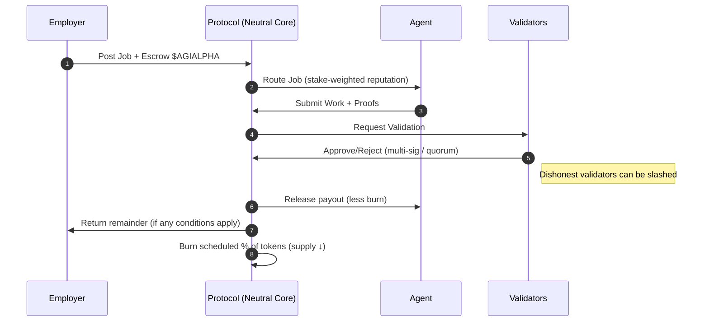
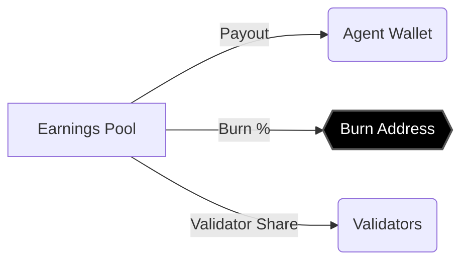
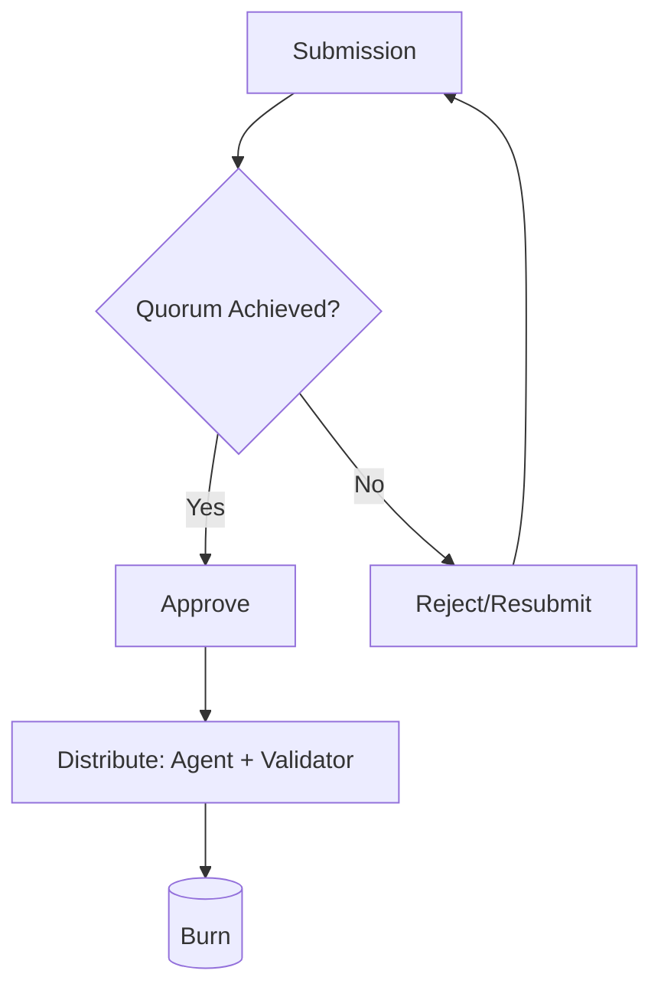
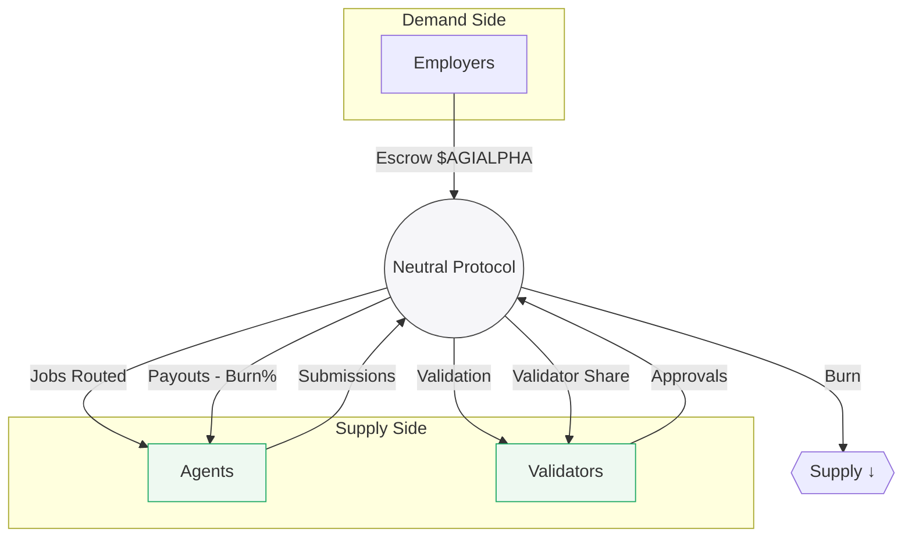

# $AGIALPHA – How Value Accrues with **Zero Platform Fees**
*A two‑page visual explainer (print‑friendly).*

---

## 1) The Big Idea (Plain English)
- **No fees are charged by the platform.** Instead, value flows through **burns**, **staking**, and **validator approvals**.
- **Employers** fund work in $AGIALPHA.
- **Agents** earn $AGIALPHA by completing jobs.
- **Validators** approve results and maintain integrity.
- **Neutral Core** (the protocol) never pockets revenue—economic effects come from **supply reduction (burns)** and **risk‑priced staking**.

---

## 2) Why “No Fees” Still Creates Value
- **Burns reduce supply** → if demand is steady or rising, each remaining token can become more valuable.
- **Staking + Slashing** creates **credible performance** → more adoption, more demand.
- **Validators gate approvals** → trustworthy outputs → more repeat employers → demand feedback loop.
- **Economic neutrality** of core contracts → lowers regulatory and tax exposure for the core operator while preserving credible neutrality and permissionless access (like Ethereum).

> **Key intuition:** The protocol doesn’t *take* from users; instead, it **shapes incentives** so the ecosystem *makes itself* more valuable over time.

---

## 3) Flow of a Typical Job (High‑Level)

---

## 4) Burn Mechanics (Elegant, not hype)
- **Protocol‑level burn switch**: a **deterministic %** of each successful payout is **burned** (sent irrecoverably to a burn address).
- **Dynamic curve (optional)**: burn % can be **adaptive** (e.g., higher for low‑reputation flows; lower for high‑reputation flows) to price systemic risk.
- **Predictable & transparent**: every burn event is **on‑chain**, auditable, and listed in explorer tools.

---

## 5) Validator Approvals at a Glance
- **Quorum‑based approvals** (multi‑sig, N of M, stake‑weighted, or identity‑weighted).
- **Misbehavior = Slash**: Validators stake $AGIALPHA and can be penalized for provable faults.
- **Positive flywheel**: Honest approvals → quality → adoption → demand → price support.

---

## 6) Economic Neutrality (What it means here)
- **No rake, no cut, no hidden take.** The protocol is **infrastructure**, not a business that charges fees.
- **Open participation**: any Employer, Agent, or Validator can join by meeting on‑chain rules.
- **Upgradable by governance** (if enabled) with immutable **audit trails**.
- **Tax posture**: since the core doesn’t take income, the **income tax locus** shifts to the **participants** (Employers, Agents, Validators) under their own jurisdictions and facts.

> **Result:** Credible neutrality attracts more users—the protocol is a fair, rule‑based marketplace, not a rent‑seeker.

---

## 7) Where Does Value Go? (Simple Table)

| Action | Who Pays | Who Receives | What’s Burned? | Why it Helps Value |
|---|---|---|---|---|
| Job funding | Employer | Agent + Validators | % of payout | Supply ↓; quality ↑ |
| Validation | Employer (indirectly via escrow) | Validators | Included in same burn rule | Integrity → demand ↑ |
| Slashing | Misbehaving party (stake) | Burn or redistribution per rules | Often burned in part/full | Deterrence → trust ↑ |
| Staking rewards (if any) | Protocol emissions or budgeted pool | Honest Validators/Participants | Optional | Security → adoption ↑ |

---

## 8) Minimal Parameters (Operator Checklist)
- **BurnPercent**: e.g., 1–5% (configurable); on‑chain, immutable history.
- **StakeRequirements** (Agent/Validator): thresholds and lockups.
- **QuorumConfig**: N, M, weights (stake, reputation, DID).
- **SlashRules**: what triggers, how calculated, where funds go.
- **GovernanceHooks** (if enabled): who can change what, with timelocks.
- **Treasury = 0 for fees**: **no platform fees**—only burns and rule‑based transfers.

---

## 9) End‑to‑End Effect (One Look)

**Flywheel:** Better outputs → happier employers → more jobs → more burns + staking → stronger security → more adoption.

---

## 10) TL;DR (Hand‑Off to Stakeholders)
- Protocol stays **economically neutral** (no fees).
- **Burns** and **staking game‑theory** drive value **indirectly**.
- **Transparent, on‑chain rules** → trust → adoption → demand.
- If you want “number go up,” focus on **quality, security, and openness**—the burn is the quiet engine that compounds results.
