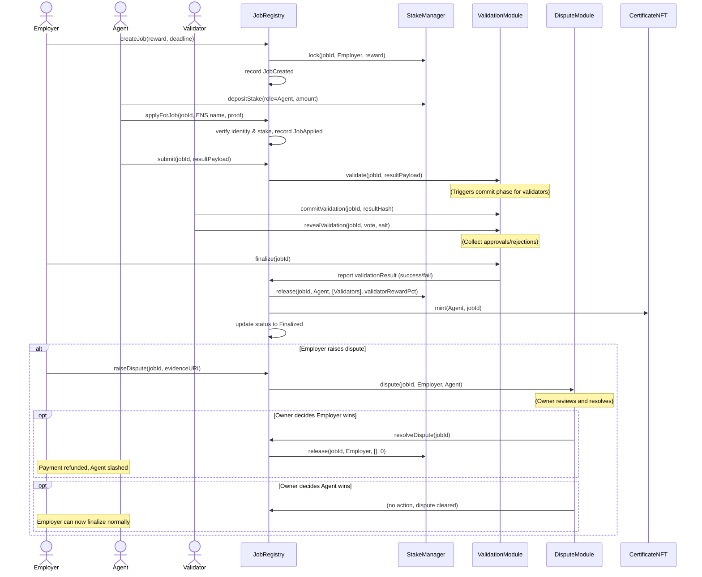

# AGI Jobs v0 (v2) – AI Labor Market Grand Demo Implementation Plan

## Overview & Goals

This plan outlines a fully automated, user-friendly demonstration of the AGI Jobs v0 (v2) platform that showcases a trustless AI labor marketplace. The demo simulates real-world actors (for example government agencies, companies, AI agents, and validators) interacting through the AGI Jobs smart contracts to post AI tasks, fulfill them, validate results, and resolve disputes. The primary goals are:

- **Comprehensive feature showcase** – demonstrate the most advanced combination of v2 functionality, including identity checks, staking, job lifecycle, commit–reveal validation, dispute resolution, and issuance of reputation and certificate NFTs while staying grounded in the existing repository’s capabilities.
- **User-friendly web UI** – provide a browser-based React UI for non-technical users so they can intuitively interact with the system, perform role-based workflows, and follow real-time updates with visual aids such as Mermaid diagrams and dashboards.
- **Local Web3 simulation** – run entirely on a local Ethereum testnet (for example the Hardhat network), with wallet-controlled entities simulated locally, while retaining configuration hooks for future public testnet or mainnet deployment.
- **Grandiose experience** – deliver a polished, “single-click” demo experience using automated scripts for starting the chain, deploying contracts, seeding data, and launching the UI.
- **Best-practice architecture** – adhere to AGI Jobs v2’s modular architecture and security practices, including upgradeable module wiring, pausability, multisig ownership transfers, proper treasury/fee handling, and governance-controlled parameters.

## System Architecture

### Component Overview

The demo combines on-chain smart contracts, a local blockchain node, and an off-chain front-end application:

- **AGI Jobs v2 smart contracts** – deploy the complete v2 module suite locally (StakeManager, ReputationEngine, IdentityRegistry, ValidationModule, DisputeModule, CertificateNFT, FeePool, TaxPolicy, JobRegistry) so the demo mirrors production architecture.
- **Local blockchain (testnet simulation)** – automatically launch a Hardhat node and run the repository’s deployment scripts to wire modules, configure parameters, and mint the $AGIALPHA test token supply.
- **Browser-based UI** – deliver a React SPA under `demo/ai-labor-market-demo/` that connects via Ethers.js, provides role-based dashboards, and visualizes the workflow with diagrams and live status indicators.

### Simulation Accounts

Preconfigure local accounts to represent employers, agents, and validators. A “guest mode” in the UI can use Hardhat default accounts automatically, while an optional “expert mode” lets users connect their own EIP-1193 wallet providers.

### Off-Chain Orchestrator (Optional)

While the demo focuses on manual interaction, it remains compatible with the AGI-Alpha One-Box orchestrator for future natural language job requests.

### Job Lifecycle Sequence



## Demo Directory Structure

Create a dedicated `demo/ai-labor-market-demo/` hierarchy to contain documentation, deployment automation, front-end code, tests, and diagrams:

```
demo/ai-labor-market-demo/
├── README.md
├── contracts/
├── deploy/
├── frontend/
│   ├── public/
│   └── src/
├── scripts/
├── cypress/
├── ci.yml
└── mermaid-diagrams/
```

Key components include:

- **README.md** – high-level documentation, run instructions, diagrams, and screenshots.
- **Deployment scripts** – Hardhat tasks to deploy and configure modules, mint tokens, and register identities.
- **Front-end** – React SPA providing employer, agent, validator, and owner views with live updates and diagram overlays.
- **Test files** – Hardhat scenario tests and Cypress end-to-end tests that reproduce the full workflow.
- **CI integration** – GitHub Actions job to build the UI, run scenario tests, and keep demo paths under lint/formatting coverage.

## Smart Contract Coverage

The demo integrates the existing v2 modules without modifying their logic. Highlights include:

- **JobRegistry** orchestrates job creation, application, submission, validation, finalization, and dispute hooks.
- **StakeManager** escrows rewards, enforces staking, releases funds with validator splits, and triggers burns via FeePool.
- **ValidationModule** handles commit–reveal voting, approval thresholds, and reporting results back to JobRegistry.
- **DisputeModule** manages dispute initiation and resolution, including stake slashing and refunds.
- **IdentityRegistry** verifies participants via ENS-based policies or emergency allowlists for the local demo.
- **ReputationEngine** tracks agent and validator reputation changes across apply/finalize events.
- **CertificateNFT** mints completion certificates for successful agents.
- **FeePool & TaxPolicy** implement burn mechanics, treasury routing, and tax acknowledgments.

## Demo Workflow Scenario

The user journey covers initialization through post-demo analytics:

1. **Initialization** – `npm run demo:start` compiles contracts, launches Hardhat, deploys modules, seeds identities/stakes, and starts the React UI.
2. **Job posting** – employers submit jobs with rewards and metadata, locking tokens in StakeManager.
3. **Agent staking & application** – agents stake tokens, apply with ENS-style identities, and accept jobs.
4. **Submission** – agents upload results; ValidationModule begins the commit–reveal cycle.
5. **Validator voting** – validators commit and reveal votes; thresholds decide outcomes.
6. **Finalization & payout** – employers finalize successful jobs, releasing funds, minting certificates, and updating reputation metrics.
7. **Dispute handling** – employers can escalate disputes; the owner console resolves outcomes that trigger refunds or continue finalization.
8. **Dashboards** – role-specific and global views display balances, reputation, NFTs, burn totals, and validator performance.

## Ownership, Upgrades & Safety

- Transfer module ownership to governance (for example multisig or timelock) and optionally wire through `SystemPause` for emergency stops.
- Demonstrate module hot-swapping (for example replacing `ValidationModule`) using `JobRegistry.setModules` in an admin view.
- Surface key parameters and pause state in the UI while referencing owner control guides for deeper operations.

## Testing & Automation

- **One-click launch** – orchestrate Hardhat node, deployment, seeding, and UI startup via a single npm script using tooling like `concurrently`.
- **Automated scenario test** – run a Hardhat test covering the job lifecycle, validation, and dispute branches to ensure regression safety.
- **End-to-end UI test** – execute Cypress scripts to simulate user flows and verify on-screen state changes.
- **Continuous integration** – extend GitHub Actions to run build/test steps on every push and enforce linting/formatting for demo assets.

## Documentation & Experience

- Embed Mermaid diagrams, dashboards, and screenshots in `README.md` to guide users visually through the workflow.
- Highlight best-practice configurations (identity policy, staking requirements, fee/burn mechanics) with cross-references to existing AGI Jobs documentation.
- Incorporate immersive UI elements (animations, celebratory notifications, AI-themed styling) to deliver a grand showcase without compromising clarity.

By following this implementation plan, the repository will ship a comprehensive AGI Jobs v2 AI labor market demonstration that is scripted, testable, visually compelling, and aligned with the project’s architectural and security standards.
