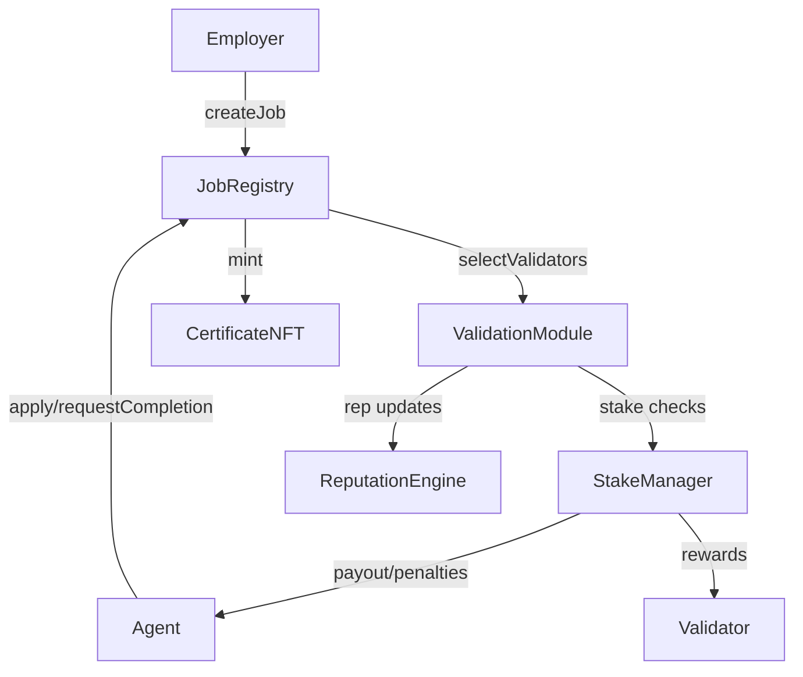
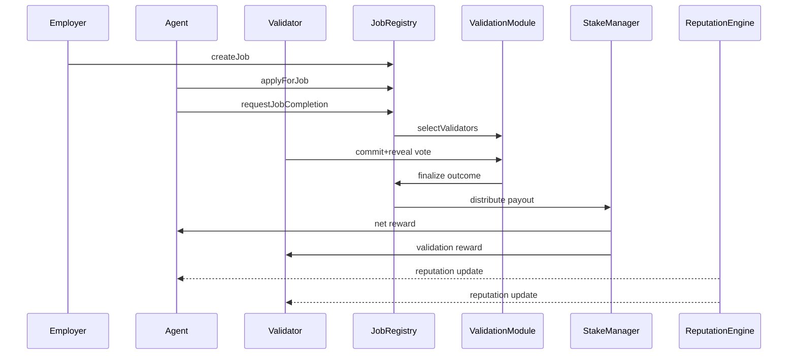

# AGIJobManager v2 Architecture

AGIJobManager v2 decomposes the monolithic v1 contract into immutable modules with single responsibilities. Each module is `Ownable` so that only the contract owner can update parameters or perform privileged actions. The design emphasises gas efficiency, governance composability and game-theoretic soundness.

## Modules
- **JobRegistry** – posts jobs, escrows payouts and tracks lifecycle state.
- **ValidationModule** – selects validators, orchestrates commit‑reveal voting and returns final outcomes.
- **StakeManager** – escrows validator and agent collateral, releases rewards and executes slashing.
- **ReputationEngine** – updates reputation scores and blacklists misbehaving agents or validators.
- **CertificateNFT** – mints ERC‑721 proof of completion to employers.

## Module Interactions

## Job Settlement Flow

## Incentive Refinements
- Validator stake scales with job value; majority approval finalises after a grace period while minority can trigger an appeal round with a larger validator set.
- Slashing percentages exceed potential rewards so dishonest behaviour is an energy‑costly deviation.
- Employers receive a share of slashed agent stake on any failure, aligning interests.
- Sole dissenters that reveal incorrect votes incur extra penalties, discouraging extortion.
- Parameters (burn rates, stake ratios, validator counts) are tunable by the owner to keep the Nash equilibrium at honest participation.

## Statistical‑Physics View
The protocol behaves like a system seeking minimum free energy. Honest completion is the ground state: any actor attempting to cheat must input additional "energy" in the form of higher expected stake loss, making dishonest equilibria unstable.

## Interfaces
Reference Solidity interfaces are provided in `contracts/v2/interfaces` for integration and future implementation.
