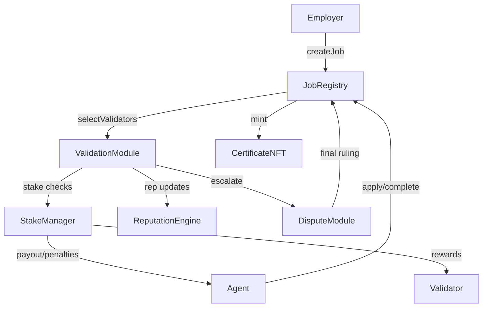
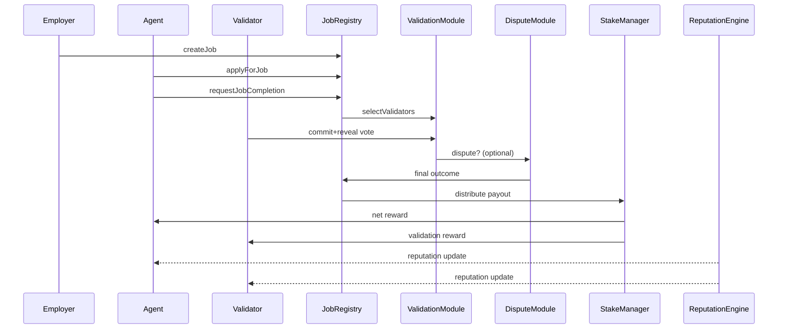

# AGIJobManager v2 Architecture

AGIJobManager v2 decomposes the monolithic v1 contract into immutable modules with single responsibilities. Each module is deployed once and interacts with others only through minimal interfaces so storage layouts remain isolated. Every module inherits `Ownable`, ensuring only the contract owner can tune parameters or perform privileged actions. The design emphasises gas efficiency, governance composability and game-theoretic soundness while remaining simple enough for non‑technical users to invoke through block explorers such as Etherscan.

## Modules
- **JobRegistry** – posts jobs, escrows payouts and tracks lifecycle state.
- **ValidationModule** – selects validators, orchestrates commit‑reveal voting and returns preliminary outcomes.
- **DisputeModule** – optional appeal layer where moderators or a larger validator jury render final decisions.
- **StakeManager** – escrows validator and agent collateral, releases rewards and executes slashing.
- **ReputationEngine** – updates reputation scores and blacklists misbehaving agents or validators.
- **CertificateNFT** – mints ERC‑721 proof of completion to employers.
Each component is immutable once deployed yet configurable by the owner through minimal setter functions, enabling governance upgrades without redeploying the entire suite.

| Module | Core responsibility | Owner‑controllable parameters |
| --- | --- | --- |
| JobRegistry | job postings, escrow, lifecycle management | job reward, required agent stake |
| ValidationModule | validator selection, commit‑reveal voting, tallying | stake ratios, reward/penalty rates, timing windows, validators per job |
| DisputeModule | optional appeal and moderator decisions | appeal fee, jury size, moderator address |
| StakeManager | custody of validator/agent collateral and slashing | minimum stakes, slashing percentages, reward recipients |
| ReputationEngine | reputation tracking and blacklist enforcement | reputation thresholds, authorised caller list |
| CertificateNFT | ERC‑721 proof of completion | base URI |

Every module inherits `Ownable`, so only the contract owner (or future governance authority) may adjust these parameters.

All public methods accept plain `uint256` values (wei and seconds) so they can be invoked directly from a block explorer without custom tooling. Owners configure modules by calling the published setter functions in Etherscan's **Write** tab, while agents and validators use the corresponding read/write interfaces for routine actions.

## Module Interactions


## Job Settlement Flow


## Interface Summary
Key Solidity interfaces live in [`contracts/v2/interfaces`](../contracts/v2/interfaces) and capture the responsibilities of each module. Examples:

```solidity
interface IJobRegistry {
    function createJob(address agent) external returns (uint256 jobId);
    function finalize(uint256 jobId) external;
    function setJobParameters(uint256 reward, uint256 stake) external;
}

interface IValidationModule {
    function selectValidators(uint256 jobId) external returns (address[] memory);
    function commitValidation(uint256 jobId, bytes32 commitHash) external;
    function revealValidation(uint256 jobId, bool approve, bytes32 salt) external;
    function finalize(uint256 jobId) external returns (bool success);
    function setParameters(
        uint256 validatorStakeRequirement,
        uint256 validatorStakePercentage,
        uint256 validatorRewardPercentage,
        uint256 validatorSlashingPercentage,
        uint256 commitDuration,
        uint256 revealDuration,
        uint256 reviewWindow,
        uint256 resolveGracePeriod,
        uint256 validatorsPerJob
    ) external;
}

interface IDisputeModule {
    function raiseDispute(uint256 jobId) external;
    function resolve(uint256 jobId, bool employerWins) external;
    function setAppealParameters(uint256 appealFee, uint256 jurySize) external;
}

interface IReputationEngine {
    function addReputation(address user, uint256 amount) external;
    function subtractReputation(address user, uint256 amount) external;
    function setCaller(address caller, bool allowed) external;
    function setThresholds(uint256 agentThreshold, uint256 validatorThreshold) external;
}

interface IStakeManager {
    enum Role { Agent, Validator }
    function depositStake(Role role, uint256 amount) external;
    function withdrawStake(Role role, uint256 amount) external;
    function lockStake(address user, Role role, uint256 amount) external;
    function slash(address user, uint256 amount, address recipient) external;
    function setStakeParameters(
        uint256 agentStakePercentage,
        uint256 validatorStakePercentage,
        uint256 validatorSlashingPercentage
    ) external;
}

interface ICertificateNFT {
    function mint(address to, string memory uri) external returns (uint256 tokenId);
    function setBaseURI(string memory newBaseURI) external;
}
```

## Governance and Owner Controls
Each module exposes minimal `onlyOwner` setters so governance can tune economics without redeploying code. Typical controls include:

- **JobRegistry** – `setModules` wiring validation, reputation, stake manager, dispute and certificate NFT contracts.
- **ValidationModule** – `setParameters` for stake ratios, rewards, slashing and timing.
- **DisputeModule** – `setAppealParameters` and moderator address.
- **StakeManager** – `setStakeParameters` and `setToken`.
- **ReputationEngine** – `setCaller` and `setThresholds` for agent/validator reputation.
- **CertificateNFT** – `setBaseURI` for metadata.

All setters are accessible through block‑explorer interfaces, keeping administration intuitive for non‑technical owners while preserving contract immutability.

These interfaces favour explicit, single-purpose methods, keeping gas costs predictable and allowing front‑end or Etherscan interactions to remain intuitive.

## User Experience
Non‑technical employers, agents and validators can call these methods directly through Etherscan's read and write tabs. Every parameter uses human‑readable units (wei for token amounts and seconds for timing) so that wallets and explorers can display values without custom tooling. No external subscription or Chainlink VRF is required; validator selection relies on commit‑reveal randomness seeded by the owner.
If a result is contested, employers or agents invoke the DisputeModule's `raiseDispute` through the explorer and a moderator or expanded validator jury finalises the job.

## Incentive Refinements
- Validator stake scales with job value; majority approval finalises after a grace period while minority can trigger an appeal round with a larger validator set.
- Slashing percentages exceed potential rewards so dishonest behaviour is an energy‑costly deviation.
- Employers receive a share of slashed agent stake on any failure, aligning interests.
- Sole dissenters that reveal incorrect votes incur extra penalties, discouraging extortion.
- A dedicated DisputeModule coordinates appeals and moderator input, ensuring collusion requires prohibitive stake.
- Parameters (burn rates, stake ratios, validator counts) are tunable by the owner to keep the Nash equilibrium at honest participation.

## Statistical‑Physics View
The protocol behaves like a system seeking minimum Gibbs free energy. Honest completion is the ground state in this Hamiltonian system: any actor attempting to cheat must input additional "energy"—manifested as higher expected stake loss—which drives the system back toward the stable equilibrium. Using the thermodynamic analogue

\[ G = H - T S \]

slashing raises the system's enthalpy \(H\) while the commit‑reveal process injects entropy \(S\). Owner‑tuned parameters act as the temperature \(T\), weighting how much randomness counterbalances potential gains from deviation. When parameters are calibrated so that \(G\) is minimised at honest behaviour, rational participants naturally settle into that state.

### Hamiltonian and Game Theory
We can sketch a simplified Hamiltonian

\[ H = \sum_i s_i - \sum_j r_j \]

where \(s_i\) represents stake lost by misbehaving participants and \(r_j\) denotes rewards for correct actions. The owner adjusts coefficients through setter functions, shaping the potential landscape so that the minimal free energy occurs when agents, validators and employers follow the protocol. Deviations raise \(H\), matching game‑theoretic expectations that dishonest strategies carry higher expected cost than cooperative ones.

## Interfaces
Reference Solidity interfaces are provided in `contracts/v2/interfaces` for integration and future implementation.

## Solidity Structure Recommendations
- Prefer immutable module addresses and minimal storage writes for gas efficiency.
- Use `uint256` for amounts and timestamps and pack related structs to reduce storage slots.
- Isolate permissioned setters with `onlyOwner` modifiers and emit update events for every configuration change.
- Avoid external libraries requiring subscriptions; commit‑reveal randomness keeps the system trust-minimised.
- Separate state-changing logic from read-only helpers to simplify audits and Etherscan interactions.
- Use custom errors instead of revert strings to save deployment and runtime gas.
- Where arithmetic is already bounds-checked, wrap operations in `unchecked` blocks for marginal savings.
