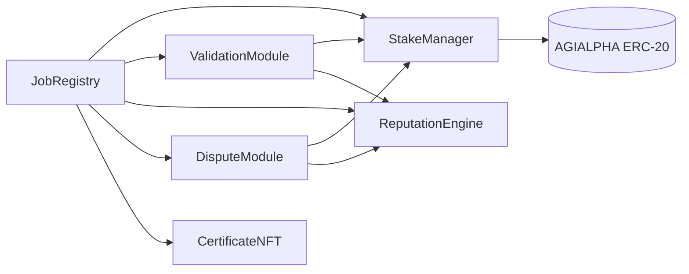
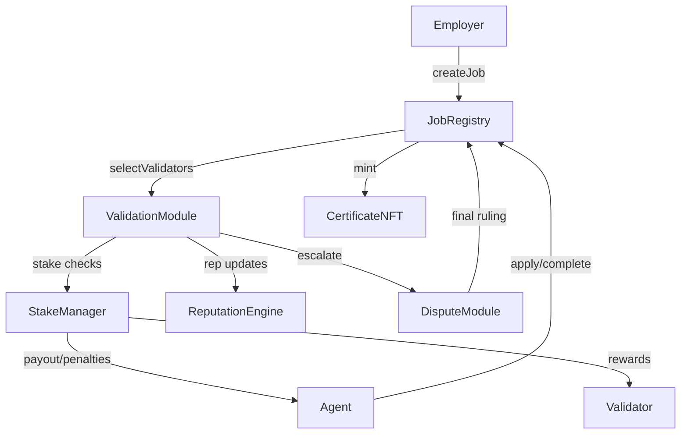
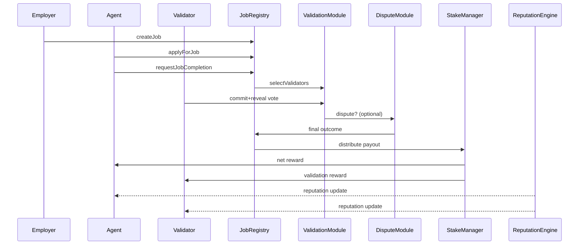
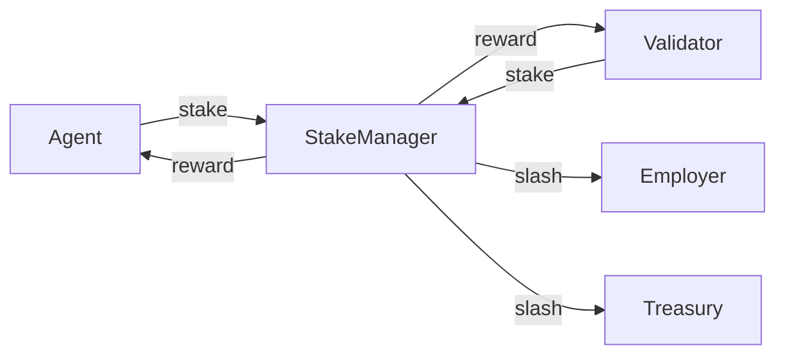

# AGIJobManager v2 Architecture

AGIJobs v2 replaces the monolithic v1 manager with immutable, single-purpose modules. Each contract is deployed once, owns its state, and interacts through a minimal interface so storage layouts remain isolated. Governance (ideally a multisig or timelock) can retune parameters or swap module addresses without redeploying the entire suite, delivering composability while keeping on-chain logic simple enough for block-explorer interactions. Core production modules inherit [`Governable`](../contracts/v2/Governable.sol), which expects privileged calls to arrive through an OpenZeppelin `TimelockController`, while ancillary components (e.g., `ValidationModule`, `ReputationEngine`, `CertificateNFT`) use lightweight `Ownable` guards so the owner or the [`OwnerConfigurator`](../contracts/v2/admin/OwnerConfigurator.sol) facade can execute setters. The design emphasises gas efficiency and game-theoretic soundness while remaining approachable for non-technical users.

For a quick visual overview of the system, see the [architecture overview](architecture.md).

## Governance and ownership model

```mermaid
flowchart LR
    classDef gov fill:#fef2f2,stroke:#b91c1c,color:#7f1d1d,stroke-width:1px;
    classDef govMod fill:#f8fafc,stroke:#1e293b,color:#0f172a,stroke-width:1px;
    classDef owner fill:#f5f3ff,stroke:#7c3aed,color:#5b21b6,stroke-width:1px;

    Governance[TimelockController / Safe]:::gov --> JobRegistry[JobRegistry (Governable)]:::govMod
    Governance --> StakeManager[StakeManager (Governable)]:::govMod
    Governance --> DisputeModule[DisputeModule (Governable)]:::govMod
    Governance --> SystemPause[SystemPause (Governable)]:::govMod

    Governance --> OwnerConfigurator[OwnerConfigurator (Ownable2Step)]:::owner
    OwnerConfigurator --> ValidationModule[ValidationModule (Ownable)]:::govMod
    OwnerConfigurator --> ReputationEngine[ReputationEngine (Ownable)]:::govMod
    OwnerConfigurator --> CertificateNFT[CertificateNFT (Ownable)]:::govMod
```

- **Governable contracts** (e.g., `JobRegistry`, `StakeManager`, `DisputeModule`, `SystemPause`) are deployed with a `TimelockController` owner and gate privileged functions behind the `onlyGovernance` modifier. Updating a parameter requires scheduling and executing a timelock proposal or Safe transaction that targets the module directly.
- **Ownable contracts** (e.g., `ValidationModule`, `ReputationEngine`, `CertificateNFT`) accept direct `onlyOwner` calls. Production deployments delegate those writes to the [`OwnerConfigurator`](../contracts/v2/admin/OwnerConfigurator.sol) so the operator emits structured `ParameterUpdated` events for every change.
- Ownership can be transferred at any time via `Governable.setGovernance` or the two-step flow in `OwnerConfigurator`, giving the contract owner complete control over who can initiate updates.

## Trust assumptions

- **Deterministic randomness** - validator selection uses commit-reveal entropy seeded by the owner and on-chain data. When `block.prevrandao` is unavailable, the module mixes recent block hashes and the caller address, removing any need for off-chain randomness providers.
- **Governance control** - `Governable` and `Ownable` setters let the designated timelock or owner retune parameters at will. Users must trust this address to act in good faith.
- **No external dependencies** - the architecture avoids Chainlink VRF and subscription services entirely.

## Validator pool sizing & gas costs

The validator selection routine uses an in-place Fisher-Yates shuffle, so
gas consumption scales linearly with the candidate pool. Selecting ten
validators from one hundred candidates consumes roughly **2.0M gas**, while
two hundred candidates cost about **3.5M gas**. At ~20k gas per
candidate, we recommend capping the validator pool around **500
validators** to keep `selectValidators` under ~10M gas on mainnet.

## Modules



The core modules below cooperate to orchestrate the job lifecycle while exposing focused setter functions so governance can retune parameters without migrations.

| Module | Core responsibility | Example privileged setters |
| --- | --- | --- |
| **JobRegistry** (Governable) | Job lifecycle, escrow, ENS roots and acknowledgement policy. | `setModules`, `setJobStake`, `setFeePct`, `setTreasury`, `setValidatorRewardPct`, `setTaxPolicy`, `setAgentRootNode`. |
| **ValidationModule** (Ownable) | Validator pool management, commit/reveal timing and quorum control. | `setCommitWindow`, `setRevealWindow`, `setValidatorPool`, `setValidatorSlashingPct`, `setApprovalThreshold`, `setSelectionStrategy`, `setRandaoCoordinator`. |
| **DisputeModule** (Governable) | Appeal flow, moderator quorums and dispute economics. | `setDisputeFee`, `setDisputeWindow`, `setCommittee`, `setTaxPolicy`, `setModerator`, `setStakeManager`. |
| **StakeManager** (Governable) | Stake custody, slash routing and payout splits. | `setRoleMinimums`, `setSlashingParameters`, `setTreasury`, `setFeePct`, `setUnbondingPeriod`, `setValidationModule`, `setOperatorSlashPct`. |
| **ReputationEngine** (Ownable) | Reputation accounting, authorised caller registry and blacklist. | `setAuthorizedCaller`, `setScoringWeights`, `setStakeManager`, `setThreshold`, `setBlacklist`, `setPauser`. |
| **CertificateNFT** (Ownable) | ERC-721 certificates for completed jobs. | `setBaseURI`, `setJobRegistry`, `setStakeManager`. |

### Token Configuration

`StakeManager` holds the address of the ERC-20 used for all payments, staking and dispute fees. v2 deployments fix this token to $AGIALPHA at `0xA61a3B3a130a9c20768EEBF97E21515A6046a1fA`, which operates with **18 decimals**. All economic parameters (stakes, rewards, fees) must therefore be provided in base units of this token (e.g., `100_000000000000000000` for 100 AGIALPHA). The `DisputeModule` pulls its `disputeFee` from `StakeManager`, so dispute resolution also uses this ERC-20.

`Governable` modules restrict setters to the configured timelock or multisig via `onlyGovernance`, while `Ownable` modules rely on `onlyOwner`. In both cases the contract owner can rotate control addresses (`setGovernance` or `transferOwnership`) to keep ultimate authority over parameter changes.

All public methods accept plain `uint256` values (wei and seconds) or primitive structs so they can be invoked directly from a block explorer without custom tooling. Owners can either call the setters via Etherscan's **Write** tab or route changes through `OwnerConfigurator.configure{,Batch}` to emit structured change logs.

### Owner Controls & Explorer Usability

- `onlyGovernance` and `onlyOwner` modifiers map cleanly to timelock or Safe permissions, ensuring a single governance surface tunes parameters.
- `JobRegistry` can re-point to replacement modules via `setModules`, enabling upgrades without migrating state.
- Functions use primitive types and include NatSpec comments so Etherscan displays human-readable names and prompts.

## Module Interactions



## Job Settlement Flow



## Interface Summary

Key Solidity interfaces live in [`contracts/v2/interfaces`](../contracts/v2/interfaces) and capture the responsibilities of each module. Examples:

```solidity
// Key setter signatures (abbreviated)

// contracts/v2/JobRegistry.sol — timelock-gated
function setJobStake(uint96 stake) external onlyGovernance;
function setFeePct(uint256 _feePct) external onlyGovernance;
function setValidatorRewardPct(uint256 pct) external onlyGovernance;
function setModules(
    IValidationModule validation,
    IStakeManager stakeManager,
    IReputationEngine reputation,
    IDisputeModule dispute,
    ICertificateNFT certNFT,
    IFeePool feePool,
    address[] calldata acknowledgers
) external onlyGovernance;

// contracts/v2/ValidationModule.sol — owner-gated
function setCommitWindow(uint256 commitDur) external onlyOwner;
function setRevealWindow(uint256 revealDur) external onlyOwner;
function setValidatorsPerJob(uint256 count) external onlyOwner;
function setValidatorSlashingPct(uint256 pct) external onlyOwner;

// contracts/v2/modules/DisputeModule.sol — timelock-gated
function setDisputeFee(uint256 fee) external onlyGovernance;
function setDisputeWindow(uint256 window) external onlyGovernance;
function setCommittee(address newCommittee) external onlyGovernance;
function setTaxPolicy(ITaxPolicy policy) external onlyGovernance;

// contracts/v2/ReputationEngine.sol — owner-gated
function setAuthorizedCaller(address caller, bool allowed) external onlyOwner;
function setScoringWeights(uint256 stakeWeight, uint256 reputationWeight) external onlyOwner;
function setThreshold(uint256 threshold) external onlyOwner;
function setBlacklist(address user, bool status) external onlyOwner;

// contracts/v2/StakeManager.sol — timelock-gated
function setRoleMinimums(uint256 agent, uint256 validator, uint256 platform) external onlyGovernance;
function setSlashingParameters(uint256 employerSlashPct, uint256 treasurySlashPct) external onlyGovernance;
function setTreasury(address treasury) external onlyGovernance;
function setFeePct(uint256 pct) external onlyGovernance;
```

## Governance and Owner Controls

The setter matrix above matches the earlier module table and underpins the [OwnerConfigurator playbook](owner-control-parameter-playbook.md). Governance can:

- Schedule timelock transactions that target `onlyGovernance` functions on `JobRegistry`, `StakeManager`, `DisputeModule`, and `SystemPause`.
- Execute multi-call batches through `OwnerConfigurator.configureBatch` for `onlyOwner` modules such as `ValidationModule` and `ReputationEngine`, emitting `ParameterUpdated` events for every change.
- Rotate control by calling `setGovernance` or the two-step `transferOwnership` flow when onboarding a new Safe or timelock, ensuring the contract owner maintains full authority over platform parameters.

All setters remain accessible through block-explorer interfaces, keeping administration intuitive for non-technical maintainers while preserving contract immutability.

### Swapping validation modules

Different validation strategies can be wired into `JobRegistry` by calling `setValidationModule` with the address of the desired implementation:

```solidity
JobRegistry registry = JobRegistry(<registry>);
NoValidationModule fast = new NoValidationModule(registry);
OracleValidationModule oracle = new OracleValidationModule(registry, <oracle>);

// use fast auto-approval for low-stakes jobs
registry.setValidationModule(address(fast));

// later switch to oracle-driven validation
registry.setValidationModule(address(oracle));
```

## User Experience

Non-technical employers, agents and validators can call these methods directly through Etherscan's read and write tabs. Every parameter uses human-readable units (wei for token amounts and seconds for timing) so that wallets and explorers can display values without custom tooling. No external subscription or Chainlink VRF is required; validator selection relies on commit-reveal randomness seeded by the owner.
If a result is contested, employers or agents invoke the DisputeModule's `raiseDispute` through the explorer and a moderator or expanded validator jury finalises the job.

For detailed explorer walk-throughs see [docs/etherscan-guide.md](etherscan-guide.md).

## Incentive Refinements

- Validator stake scales with job value; majority approval finalises after a grace period while minority can trigger an appeal round with a larger validator set.
- Slashing percentages exceed potential rewards so dishonest behaviour is an energy-costly deviation.
- Employers receive a share of slashed agent stake on any failure, aligning interests.
- Sole dissenters that reveal incorrect votes incur extra penalties, discouraging extortion.
- A dedicated DisputeModule coordinates appeals and moderator input, ensuring collusion requires prohibitive stake.
- Parameters (burn rates, stake ratios, validator counts) are tunable by the owner to keep the Nash equilibrium at honest participation.

### Dynamic Validator Committees

Validator count expands with job value to raise collusion costs. An owner-set schedule maps payout tiers to committee sizes:

| Job payout (AGI) | Validators |
| ---------------- | ---------- |
| < 1,000          | 3          |
| 1,000-10,000     | 5          |
| > 10,000         | 7          |

Jobs default to majority rule; ties resolve to success unless appealed. Adjusting the tiers is an owner-only action via `ValidationModule.setParameters`, keeping validator entropy proportional to value at risk.

## Statistical-Physics View

The protocol behaves like a system seeking minimum Gibbs free energy. Honest completion is the ground state in this Hamiltonian system: any actor attempting to cheat must input additional "energy"-manifested as higher expected stake loss-which drives the system back toward the stable equilibrium. Using the thermodynamic analogue

\[ G = H - T S \]

slashing raises the system's enthalpy \(H\) while the commit-reveal process injects entropy \(S\). Owner-tuned parameters act as the temperature \(T\), weighting how much randomness counterbalances potential gains from deviation. When parameters are calibrated so that \(G\) is minimised at honest behaviour, rational participants naturally settle into that state.

### Hamiltonian and Game Theory

We can sketch a simplified Hamiltonian

\[ H = \sum_i s_i - \sum_j r_j \]

where \(s_i\) represents stake lost by misbehaving participants and \(r_j\) denotes rewards for correct actions. The owner adjusts coefficients through setter functions, shaping the potential landscape so that the minimal free energy occurs when agents, validators and employers follow the protocol. Deviations raise \(H\), matching game-theoretic expectations that dishonest strategies carry higher expected cost than cooperative ones.

### Incentive Flow Diagram



The flow highlights how collateral enters the system and where it is routed on success or failure. Rewards are paid out of escrow while slashed stakes are split between the employer and treasury, ensuring misbehaviour carries an immediate, quantifiable cost.

## Interfaces

Reference Solidity interfaces are provided in `contracts/v2/interfaces` for integration and future implementation.

## Solidity Structure Recommendations

- Prefer immutable module addresses, cache them locally during calls, and minimise storage writes for gas efficiency.
- Use `uint256` for amounts and timestamps and pack related structs to reduce storage slots; counters can downsize to `uint64` or `uint128` when safe.
- Favour `external` functions and `calldata` parameters for user interactions.
- Isolate permissioned setters with `onlyOwner` modifiers and emit update events for every configuration change.
- Guard external state-changing functions with `nonReentrant` in `StakeManager` and `JobRegistry`.
- Avoid external libraries requiring subscriptions; commit-reveal randomness keeps the system trust-minimised.
- Separate state-changing logic from read-only helpers to simplify audits and Etherscan interactions.
- Use custom errors instead of revert strings to save deployment and runtime gas.
- Where arithmetic is already bounds-checked, wrap operations in `unchecked` blocks for marginal savings.

### Additional Gas Optimization Tips

- Enable the Solidity optimizer with high `runs` to reduce bytecode size.
- Group related storage writes to minimise `SSTORE` operations.
- Declare configuration constants as `immutable` or `constant` to cut storage reads.

## Compliance note

Although rewards settle on-chain, builders and users remain responsible for obeying the laws and regulations of their local jurisdictions. This document does not constitute legal or tax advice.
