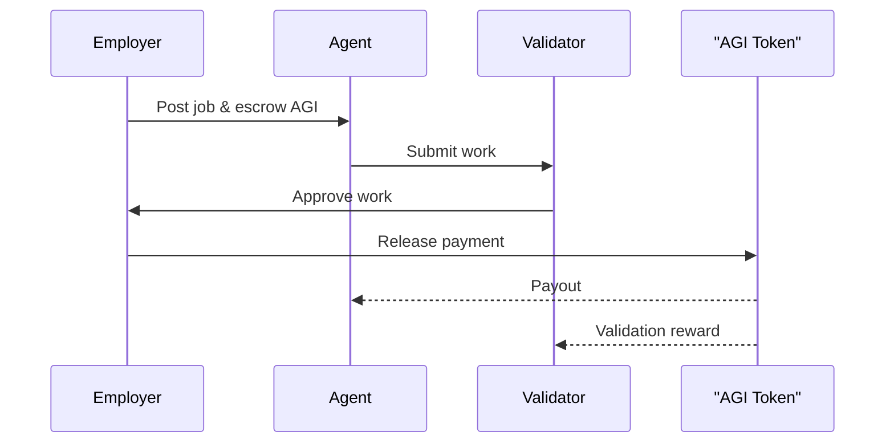

# Architecture Diagram

```mermaid
sequenceDiagram
    participant Employer
    participant Agent
    participant Validator
    participant AGI as "AGI Token"

    Employer->>Agent: Post job & escrow AGI
    Agent->>Validator: Submit work
    Validator->>Employer: Approve work
    Employer->>AGI: Release payment
    AGI-->>Agent: Payout
    AGI-->>Validator: Validation reward
```

