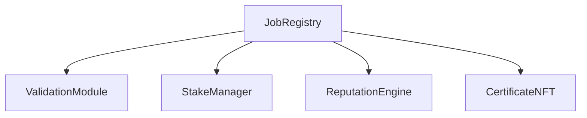
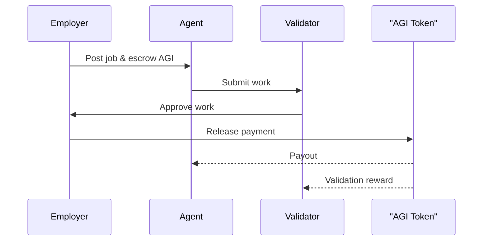
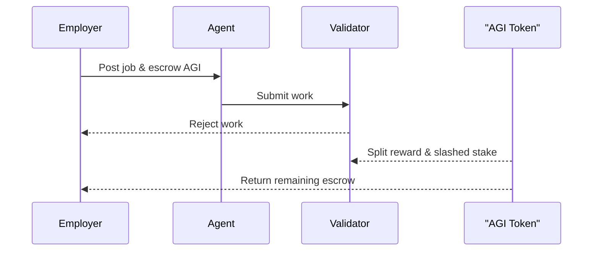

# Architecture

## Modules
- [JobRegistry](../contracts/v2/JobRegistry.sol) – orchestrates job lifecycle and coordinates with external modules.
- [StakeManager](../contracts/v2/StakeManager.sol) – holds deposits, pays rewards, and slashes stake.
- [ReputationEngine](../contracts/v2/ReputationEngine.sol) – tracks reputation scores for participants.
- [ValidationModule](../contracts/v2/ValidationModule.sol) – returns preset validation outcomes for jobs.
- [CertificateNFT](../contracts/v2/CertificateNFT.sol) – mints ERC721 certificates for successful jobs.

## Module Interactions

## Job Flow

## Employer-Win Dispute Flow

