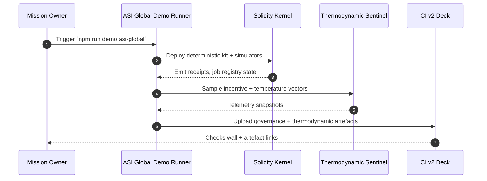

# Global Autonomous Economic Orchestrator – ASI Take-Off Demonstration

[](https://github.com/MontrealAI/AGIJobsv0/actions/workflows/demo-asi-global.yml)

The **ASI Global Take-Off** drill elevates the AGI Jobs v0 (v2) stack from a single-
nation rehearsal to a planetary coordination exercise.  The demonstration stays entirely
within the repository’s battle-tested primitives while orchestrating five continental
programmes and a global audit loop.

## Objectives

- **Planetary labour orchestration.** Execute the plan → simulate → execute pipeline for
  continent-specific jobs and a cross-planet audit using `scripts/v2/testnetDryRun.ts`.
- **Governance supremacy.** Prove that the contract owner (multisig + timelock) retains
  unilateral capability to pause, reconfigure, and tune every subsystem via
  `ownerCommandCenter`, `ownerParameterMatrix`, `renderOwnerMermaid`, and
  `verifyOwnerControl`.
- **Thermodynamic stewardship.** Snapshot incentive parameters, role shares, and
  temperature bounds to show how the RewardEngineMB can be rebalanced during global
  operations.
- **Audit-grade artefacts.** Produce immutable artefacts (JSON, Markdown, Mermaid,
  mission bundles) hashed into the governance kit for CI and reviewer verification.



## Running the Demonstration

```bash
npm install
npm run demo:asi-global
```

The command emits artefacts to `reports/asi-global`:

- `dry-run.json` – Plan→simulate→execute replay with gas usage, actors, and validator
  votes across all scenarios.
- `thermodynamics.json` – Snapshot of the thermodynamic policy envelope and role shares.
- `mission-control.md` – Governance flight deck with call graphs and risk posture.
- `command-center.md` – Owner command matrix confirming multisig, timelock, thermostat,
  and treasury control with remediation checklists.
- `parameter-matrix.md` – Machine-readable list of every adjustable parameter and the
  CLI required to exercise it.
- `governance.mmd` / `governance.md` – Mermaid source and Markdown rendering of the live
  owner-control topology for dashboards.
- `asi-global-governance-kit.json/md` – Manifest with SHA-256 hashes for every artefact
  plus an operational checklist.

A local Anvil/Hardhat rehearsal that deploys the stack and regenerates the report bundle
is available with:

```bash
npm run demo:asi-global:local
```

> ℹ️  Export `AURORA_LOCAL_GAS_LIMIT=1000000000` (and optionally `AURORA_LOCAL_CODE_SIZE_LIMIT=1048576`) before launching the local rehearsal to match the CI-grade execution envelope; the bootstrap script prints the detected values so reviewers can confirm the expanded block budget and code-size allowance in real time.【F:demo/asi-global/bin/asi-global-local.sh†L20-L40】【F:.github/workflows/demo-asi-global.yml†L60-L76】

See `demo/asi-global/RUNBOOK.md` for the full operator drill.

## Continuous Integration

The demonstration is wired into CI via `.github/workflows/demo-asi-global.yml`.  The job
runs on every pull request touching the demo or scripts and on the main branch, ensuring
that artefacts, governance controls, and thermodynamic telemetry remain reproducible.
Generated artefacts are uploaded to the PR for reviewer inspection.

### Signals captured
- **Deterministic rehearsal:** `npm run demo:asi-global` executes with Foundry 1.4.0 and Node 20.18.1, mirroring the automated toolchain.【F:.github/workflows/demo-asi-global.yml†L40-L67】
- **Local sovereignty:** `npm run demo:asi-global:local` exercises the Anvil deployment with deterministic private keys and the `31337` chain id so reviewers can replay every log offline.【F:.github/workflows/demo-asi-global.yml†L57-L67】
- **Immutable artefacts:** `actions/upload-artifact@v4` publishes both deterministic and local receipts for compliance review.【F:.github/workflows/demo-asi-global.yml†L69-L76】

## Owner Control Guarantees

- **Pause authority.** `SystemPause` wiring is re-verified (`owner:verify-control`) and
  drilled via `owner:command-center` checklists.
- **Parameter agility.** `owner:parameters` renders the parameter matrix, making it
  trivial for the multisig to adjust role shares, thermostat targets, or staking rules.
- **Governance topology.** Mermaid diagrams (source + Markdown) provide an instant view
  of timelock, governor, thermostat, reward engine, and treasury relationships.
- **Thermodynamic levers.** The kit bundles the JSON snapshot and update scripts so the
  owner can execute temperature or share updates with a single, audited command.

By binding these artefacts into the governance kit, a non-technical executive can review
and approve global economic orchestration with full confidence that safety interlocks and
owner authority remain intact.
