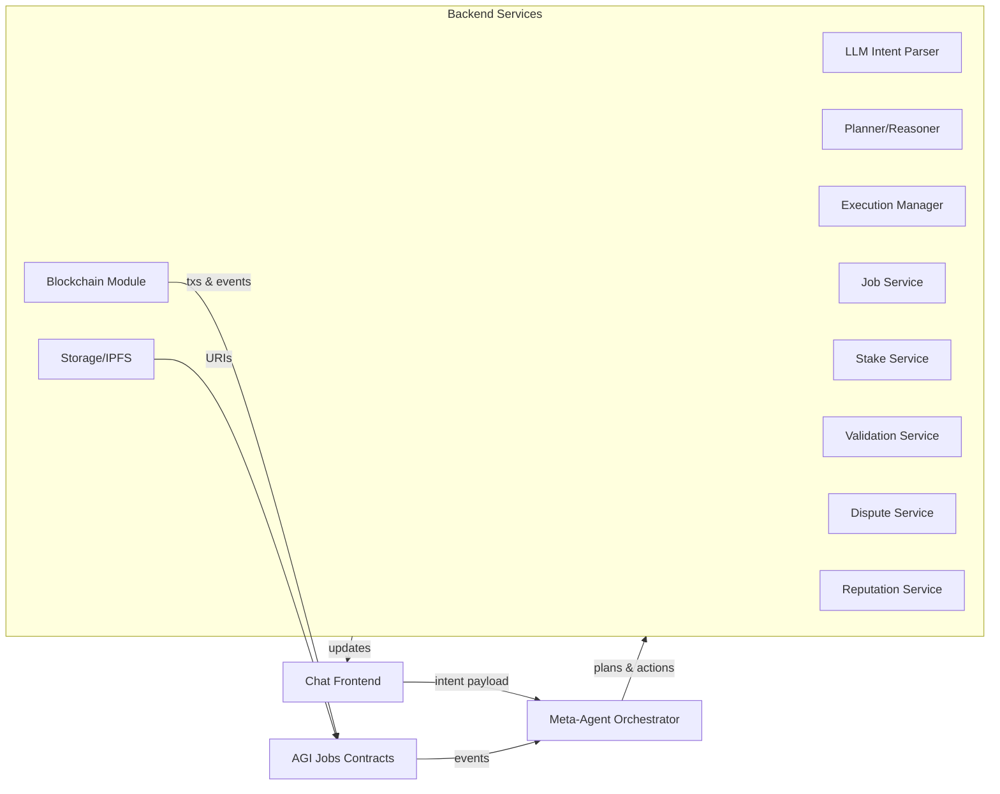

# Chat-Centric UX and Meta-Agent Architecture for AGI Jobs v0

## Purpose

This document proposes a conversational interface and supporting backend architecture that hides blockchain complexity behind a ChatGPT-style user experience. It extends AGI Jobs v0 with an AI orchestrator capable of translating natural language goals into the correct on-chain and off-chain actions while maintaining compatibility with the existing modular contract stack.

## Experience Principles

- **Single-entry chat surface** – every persona (employer, agent, validator, arbitrator, platform operator) interacts through one chat thread. The interface adapts responses and follow-up prompts based on user role, context, and task stage.
- **Goal-first dialogues** – users describe desired outcomes (e.g., “Hire someone to label 500 images”), and the assistant collects only the missing parameters. Blockchain steps, token transfers, and module selections occur automatically in the background.
- **Human-readable confirmations** – all critical actions receive plain-language previews (“You are posting job #124 with a 50 AGIα reward”) and completions (“Job posted and escrow funded”). Technical details remain accessible in an expandable “advanced view.”
- **Progressive disclosure** – optional quick-reply buttons, file uploads, and inline previews streamline common tasks while keeping the core interaction text-based.

## High-Level Architecture



### Chat Interface (Frontend)
- Built with a modern framework (e.g., React or React Native) and a chat component library for message bubbles, typing indicators, and streaming responses.
- Maintains conversational context, renders structured prompts (forms, carousels, file upload buttons), and supports social login. Real-time updates stream via WebSockets to mirror a “typing assistant.”

### Auth & Wallet Abstraction
- Social login (Web3Auth, Magic, or similar) mints or unlocks a keypair bound to the user’s credentials.
- Wallet operations remain invisible: the frontend obtains a session token so the backend can issue meta-transactions or account abstraction UserOperations on the user’s behalf without exposing keys.

### Meta-Agent Orchestrator
- **NLU/Intent Parser** – prompts an LLM (GPT-4-class or open-source equivalent) with system instructions to parse free text into structured intents and slot values.
- **Planner/Reasoner** – adapts the AGI-Alpha-Agent meta-agent framework to decompose goals into ordered actions. Supports iterative refinement and clarification questions when inputs are incomplete or ambiguous.
- **Execution Manager** – turns each planned action into service/tool invocations, monitors progress, and loops back to the planner on errors or newly discovered constraints. Maintains per-conversation state such as pending confirmations and job metadata.

### Backend Services Layer
- **Job Service** – wraps JobRegistry calls (create, apply, complete, cancel) and ensures job specifications and artifacts are written to IPFS or another decentralized storage.
- **Stake Service** – manages role-specific stake deposits, withdrawals, and slashing hooks through StakeManager.
- **Validation Service** – handles commit–reveal flows, validator assignments, and tally aggregation from ValidationModule events.
- **Dispute Service** – abstracts DisputeModule operations including bond management, evidence submission, and arbitrator messaging.
- **Reputation Service** – queries ReputationEngine for summaries the chat can present (“Reputation: 5 jobs, 100% success”).
- **Blockchain Module** – centralizes EVM connectivity (ethers.js/web3.py), relayer integration, ERC-4337 paymasters, event subscriptions, transaction simulation, and allowance/permit helpers.
- **Storage Adapter** – pins large assets (datasets, result files) to IPFS or similar, persists metadata in a database for fast lookup, and distributes URIs to workers and validators.

## End-to-End Conversational Flows

### 1. Employer: Job Creation & Funding
1. User request captured (“I need 500 cat/dog images labeled”).
2. Planner identifies missing fields (reward, deadline, accuracy) and prompts via chat.
3. Execution Manager:
   - Uploads task brief/dataset to IPFS.
   - Issues ERC-20 permit or approval if needed.
   - Calls `JobRegistry.createJob` through the Blockchain Module with escrow amount.
4. Chat confirms job ID, escrow status, and monitoring plan.
5. Event listener notifies the employer when an agent accepts, completes, or if validation/disputes occur.

### 2. Agent: Application & Completion
1. Agent queries for jobs (“List available image labeling work”).
2. Planner composes response from indexed job data, offers quick actions.
3. Upon acceptance, Stake Service ensures collateral via `StakeManager.depositStake` and registers participation (`JobRegistry.apply` / role assignment).
4. Task assets delivered via chat (download links, instructions). If the worker is an AI microservice, the Orchestrator can spawn specialized agents using the AGI-Alpha toolchain.
5. Completion triggers result upload, IPFS hashing, and `JobRegistry.completeJob(jobId, resultHash)` call.
6. Chat informs the agent about validation status, stake locks, and payout timeline.

### 3. Validator: Quality Assurance
1. Validation Service subscribes to `JobCompleted` events and invites staked validators through chat.
2. Votes collected conversationally; Execution Manager handles commit hash generation (`ValidationModule.commitVote`) and reveal scheduling.
3. Final outcome prompts payouts, slashing, and reputation adjustments, all summarized in human-friendly chat updates.

### 4. Dispute Resolution
1. Any participant can escalate (“Dispute job 123 outcome”).
2. Planner confirms costs (bond amount) and obtains approval.
3. Dispute Service escrows bond, submits evidence, and coordinates arbitrator communications (potentially another system agent or human panel).
4. Resolution events propagate to all parties with clear explanations of fund movements and reputation effects.

### 5. Platform Staking & Governance
- Advanced users can stake to the protocol, adjust parameters, or vote on governance proposals via chat instructions mapped to StakeManager or governance contract methods.
- Responses include yield projections, cooldown timers, and safety checks before executing irreversible operations.

## Gasless & Walletless Execution

- **Meta-transactions** – users sign intent messages; relayers submit transactions paying gas. The system may recover gas costs in AGIα or subsidize them.
- **Account abstraction** – optional ERC-4337 smart accounts grant the Orchestrator limited rights to initiate whitelisted actions once the user approves in chat.
- **Allowance automation** – first-time token usage triggers a backend-managed approval or EIP-2612 permit, sparing users from manual approval steps.
- **Friendly units** – all balances are displayed in AGIα and equivalent fiat, hiding 18-decimal precision. Error messages translate RPC failures into actionable language.

## Security & Reliability Considerations

- Every high-impact step includes a natural-language confirmation summarizing simulated results before broadcast.
- Role-based policy engine ensures the Orchestrator cannot execute operations outside the user’s permissions or stake limits.
- Logs capture full reasoning traces (intent, plan, executed actions) for auditability and post-mortems.
- Fallback flows revert to human support or safe defaults if AI planning confidence falls below a threshold.
- Continuous monitoring tracks contract events, relayer health, and AI-agent performance.

## Recommended Implementation Stack

| Layer | Suggested Technologies |
| --- | --- |
| Frontend | React/Next.js, chat UI component library, WebSocket streaming, Web3Auth SDK |
| Orchestrator | Python (FastAPI) or Node.js (NestJS) with LangChain/AutoGPT-style agent loops, task queues |
| AI Models | GPT-4/Claude for planning, lightweight local models for quick intent parsing, specialized task agents for work execution |
| Blockchain | ethers.js or web3.py, Biconomy/OpenZeppelin Defender relayer, ERC-4337 paymaster, The Graph subgraph |
| Storage | IPFS via web3.storage/Pinata, PostgreSQL or MongoDB for metadata and conversation state |
| Monitoring | Prometheus + Grafana, structured logging, alerting on failed transactions or AI errors |

## Sample Conversation Snapshot

```
User: I want to hire someone to label 500 images of cats vs dogs.
Assistant: Great! What reward would you like to offer, and do you have a deadline?
User: Pay 50 AGIα and finish within a week.
Assistant: Understood. I’ll post a job offering 50 AGIα with a one-week deadline and 98% accuracy target. Confirm?
User: Yes.
Assistant: ✅ Job 124 is live! Reward escrowed, dataset uploaded, and I’ll ping you once an agent accepts it.
```

## Alignment with AGI Jobs Roadmap

- Respects the existing modular contract architecture—no changes required on-chain; instead, the Orchestrator layers intelligent automation on top.
- Incorporates AGI-Alpha meta-agent patterns so the system can spawn specialized AI workers or validators as capabilities mature.
- Keeps room for future upgrades (e.g., plug-in governance, new modules) by encapsulating each contract-facing service behind stable APIs.

