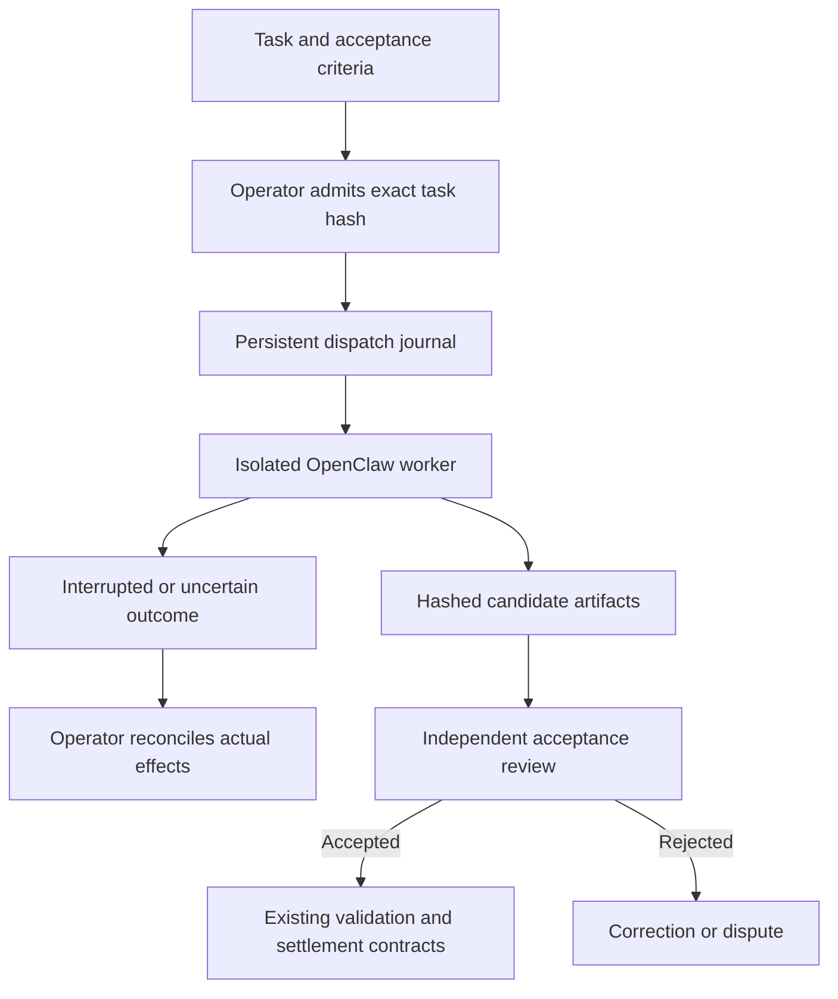

# Computer work: from an agent's screen to reviewable evidence

AGI Jobs can coordinate work performed through browser and desktop interfaces, in addition to its existing APIs, code tools and contract workflows. The `computer-work` pipeline connects to an operator-configured **OpenClaw Responses gateway**. An OpenClaw agent can use its configured browser, desktop, integrations and native Codex harness. The worker produces a candidate deliverable; independent validators and the existing contracts govern acceptance and settlement.

**Try it first:** [the complete supplier-desk lab](../demo/One-Box/computer-work/README.md) runs a real isolated Chromium browser with deterministic worker decisions. No provider account or wallet is needed. It demonstrates both accepted and rejected results.

## Choose the right execution surface

| Surface | How it fits | Repository support |
| --- | --- | --- |
| OpenClaw with native Codex Computer Use | The documented Codex-owned route controls a macOS desktop through its configured runtime and OS permissions | Implemented Responses adapter and admission journal; commission your actual gateway separately. OpenClaw's cross-platform paired-node route is a separate integration. |
| OpenClaw managed browser or other approved tools | A dedicated worker carries out browser, integration or file tasks | Same adapter; worker policy determines available tools |
| ChatGPT Work with Computer Use | An operator performs a scoped task in Work, reviews permissions and exports evidence | Supported operating procedure; no invented remote Work API or automated login |
| OpenAI Responses computer tool or code-execution tool | A custom worker supplies an isolated environment and handles tool calls | Extension path through an approved agent endpoint; a direct OpenAI desktop runtime is not bundled here |

Official documentation checked **2026-10-07**: [OpenClaw Codex Computer Use](https://docs.openclaw.ai/plugins/codex-computer-use), [OpenClaw Responses API](https://docs.openclaw.ai/gateway/openresponses-http-api), [OpenClaw security](https://docs.openclaw.ai/gateway/security), [ChatGPT Work Computer Use](https://learn.chatgpt.com/docs/computer-use), and [OpenAI API computer use](https://developers.openai.com/api/docs/guides/tools-computer-use). Availability and configuration remain version- and account-dependent; record the versions actually commissioned.

OpenClaw's Responses endpoint is disabled by default. Enable `gateway.http.endpoints.responses.enabled` deliberately. It accepts agent routing such as `openclaw/procurement`; bearer authentication can grant full gateway operator authority. Deploy a separate gateway, credentials and OS identity for each trust boundary. A new conversation is not an isolation boundary.

For native Codex desktop work, follow the official plugin setup and run `/codex computer-use status` in an OpenClaw chat surface. These are chat commands, not `openclaw codex` shell commands. Work's desktop plugin separately requires app access and, on macOS, Screen Recording and Accessibility permissions. Neither integration bypasses those controls. For jobs that require native Codex Computer Use, the current OpenClaw configuration offers `plugins.entries.codex.config.computerUse.strictReadiness: true` to require a live readiness check before a turn starts. Its default is false; installation alone is not a successful desktop check. Set and commission the policy deliberately, and record the actually installed OpenClaw and desktop versions.

## Record the runtime that actually passed commissioning

The repository services use the pinned Node toolchain in [START_HERE](START_HERE.md). A separately installed OpenClaw worker has its own supported runtime requirements; do not upgrade the repository's Node version merely to match a worker. Record the installed OpenClaw version, Codex runtime/plugin version, provider/model identifier and authentication route with the commissioning evidence. Test the selected combination against the actual account and desktop before admitting jobs.

OpenClaw's [2026.9.8 release notes](https://docs.openclaw.ai/releases/2026.9.8), checked on 2026-10-07, still describe GPT-6.1 Sol support as incomplete. A newer model name is not proof that a particular worker supports it. Preserve a tested configuration until its replacement passes the same acceptance and recovery checks.

For the operator-led [ChatGPT Work route](https://learn.chatgpt.com/docs/computer-use), use structured plugins where they fit the task and Computer Use for permitted application interactions. Work cannot automate terminal applications or ChatGPT itself, act as an administrator, or approve operating-system security prompts. Choose an API/code worker or a separately authorized operator step when a job requires those capabilities. Keep that step explicit in the work order and evidence.

## The acceptance boundary



The adapter enforces exact task admission, provider destination, bearer-token lookup, unique sessions, bounded HTTP time and response size, expected artifact names/types, local hashes, and a persistent replay barrier. The orchestrator validates the committed task and current operator profile before selecting an agent, depositing stake or applying for the job. A specification carrying `metadata.computerWork` must declare the `computer-work` category. Pipeline construction also runs before application, rejecting custom computer stages, unknown handlers and unapproved endpoints. This read-only preflight creates no dispatch claim and contacts no worker; dispatch reloads the profile and checks admission again, so later revocation is respected. It does **not** enforce the remote desktop's network or action policy. Set those controls in the worker environment before admitting a task. Instructions to a model are not a sandbox.

Each receipt has `status: "evidence-ready"`, `review.status: "required"`, `settlementApproved: false` and `productionApproved: false`. Provider completion means the provider returned its result; it does not establish correct work. Current deliverables are bounded UTF-8 JSON, CSV, Markdown or plain text. Screenshots and larger binary files need a separately commissioned artifact store and integrity checks; the fixture saves screenshots locally.

The adapter rejects malformed UTF-8 transport bytes, unpaired Unicode surrogates in task and evidence strings, and artifacts exceeding **128,000 UTF-8 bytes** each. The [local evidence reviewer](EVIDENCE_REVIEW.md) compares the original admitted task with a completed receipt, verifies exact bytes and records unsigned acceptance findings. Neither hash consistency nor a review export authenticates the worker or authorizes settlement.

## Commission a real worker

1. Prepare a dedicated standard OS account or VM, separate browser profile and least-privilege application accounts. Keep personal sessions, production signing keys and deployment secrets out of the worker. Allow only the job's apps, sites, inputs and output locations. Prefer structured integrations when available.
2. Install and test your chosen OpenClaw runtime. Configure its actual tools, network egress, action approvals, run limits, cancellation and spending controls. Test prompt injection, redirects, unexpected downloads, wrong accounts, app crashes and lost connections. The adapter's `max_output_tokens` is a best-effort provider output hint, **not** a tool-call or money cap.
3. Copy [worker-profiles.example.json](../demo/One-Box/computer-work/worker-profiles.example.json) to a protected operator configuration file. Set the endpoint, agent ID, unique `deploymentId` (chain ID plus registry address), time/size limits and token variable name. The example has **no admitted jobs**.
4. Provision `COMPUTER_WORK_PROCUREMENT_TOKEN` through your secret manager or protected service environment. Set absolute `COMPUTER_WORK_PROFILES_FILE` and `COMPUTER_WORK_STATE_DIR` paths. The latter must be persistent and shared by all dispatchers for the deployment; do not use ephemeral container storage. The profile must be a regular file owned by the orchestrator account or root, without group/world write permission; use mode `0600` for a private operator profile. Existing state directories must belong to the orchestrator account with mode `0700`. Symlinked profile files and state directories are rejected. Inspect ownership and existing contents before deliberately correcting permissions; never delete a journal to bypass a check. Restrict parent directories and, on Windows, enforce equivalent access controls with ACLs. Back up the journal.
5. Prepare a task with [the task schema example](../demo/One-Box/computer-work/task.json). Review its goal, sources, data rights, exact origins, deliverables and measurable acceptance conditions. The data-class field is an assertion to check, not automatic permission to disclose data. The orchestrator pins manifests and stage outputs; use only material approved for that publication path.
6. Inspect the normalized task before admission:

   ```bash
   npm run build:orchestrator
   node demo/One-Box/computer-work/run.cjs inspect /absolute/path/task.json
   ```

   Add `{ "jobId": "123", "taskSha256": "THE_REVIEWED_64_HEX_DIGEST" }` to that profile's `approvedJobs`. Job IDs are positive decimal strings. Any task change invalidates admission. Do not generate approvals from untrusted job metadata automatically.
7. For a standalone provider commissioning run, invoke:

   ```bash
   node demo/One-Box/computer-work/run.cjs run /absolute/path/task.json 123
   ```

   This performs real worker actions and writes a receipt to stdout and the protected journal. It does not submit a transaction. For marketplace execution, use `category: "computer-work"` and `metadata.computerWork: <task>` in the job specification, configure a capable registered identity, and run the existing orchestrator. The dedicated pipeline cannot be replaced by job-supplied stages.
8. Independently check the actual deliverables against the admitted task and source/application state. Reconcile the provider's observed usage and any external effects. Commission the validator flow and existing contract lifecycle with disposable accounts and a test network before accepting production jobs.

The meta-orchestrator now calls `submit` with the manifest's actual content hash. It does not finalize immediately after producing work. Positive outcome learning and dependent jobs wait for successful contract state `Finalized` at the RPC's `finalized` block; a disputable `JobCompleted` event is insufficient. Its generic structural validator abstains on computer-work evidence; a properly commissioned independent validator must supply the acceptance decision. Submission still requires the existing identity, tax acknowledgement, stake and contract prerequisites. A successful provider commissioning run alone does not establish those prerequisites.

## Recovery and stop controls

| Observation | Meaning and next action |
| --- | --- |
| Job/task digest is not admitted | Agent selection, staking, application and dispatch are blocked. Inspect and approve the exact task through the operator configuration, then replay discovery for that job. Revocation after a confirmed application blocks future dispatch but does not unlock an existing stake; reconcile that assignment on-chain. |
| Missing token or invalid configuration | Nothing is dispatched. Repair the protected service configuration. Never paste credentials into a job. |
| `COMPUTER_WORK_OUTCOME_UNKNOWN` | The provider may have acted. Stop and inspect the attempt UUID, gateway session and actual app state. No automatic retry occurs. |
| Job already dispatched | The journal prevents duplicates across processes/restarts. Inspect the saved receipt or reconcile the earlier attempt. |
| Timeout, cancellation or process crash | Preserve the journal; stop the worker through its own controls and verify external effects. Client cancellation cannot undo a completed action. |
| Incorrect deliverable | Reject through independent review; keep original evidence and create a separately admitted correction job or follow the dispute procedure. |
| Invalid or incomplete provider response | No successful receipt is created. Reconcile, even if the provider returned HTTP 200. |

Do not delete a journal to make an error disappear. Use a new explicitly admitted job after reconciliation. Removing admission stops future dispatch, not an already running worker. Gateway and host stop controls remain necessary.

## Other execution fixes and migration

The [enterprise portal](../apps/enterprise-portal/README.md) now exports the exact specification bytes for publication and verifies the real storage URI before asking for a job transaction. Its structured, conversational and governance flows share this verification boundary; the governance flow verifies before token approval. Selected attachments remain local until separately published. Existing funded jobs with invented or unavailable specification URIs require operator reconciliation; this update neither rewrites their commitments nor relaxes byte verification.

Generic job-supplied agent URLs now require an exact operator entry in `ORCHESTRATOR_AGENT_ENDPOINTS`, a JSON array of URLs. Calls reject redirects, time out after 30 seconds and cap both request and response size at 1 MiB. Remote endpoints require HTTPS; literal loopback HTTP is available for local workers. Credentials, query strings and fragments are rejected. Configure authentication at your approved service boundary; these generic calls do not inherit the computer worker's token.

Job specifications and validator downloads use a 15-second, 4 MiB bounded reader. `ORCHESTRATOR_ARTIFACT_ORIGINS` controls additional exact origins; the default is the IPFS, W3S and Cloudflare IPFS gateways. An explicitly configured IPFS gateway is also trusted. Redirects are rejected. IPFS references reject traversal, encoded separators and nested escapes, and remain under the configured gateway path prefix. Use network egress controls as well: an approved hostname is not protection against a compromised service or DNS change. Existing deployments with other artifact hosts must configure their origins deliberately.

The meta-orchestrator persists pending outcome handoffs **before** submitting evidence. Set `ORCHESTRATOR_SETTLEMENT_STATE_DIR` to an absolute path on an operator-owned durable volume (default: `storage/orchestrator/settlement` under the working directory). Records are scoped by chain ID and registry. They contain untrusted artifact/specification data and agent addresses, never wallet private keys. JSON records are limited to 8 MiB, written to fixed hashed filenames with private permissions, and must never be executed or rendered as trusted HTML. Back up this volume with the identity configuration. Unversioned or malformed journals fail startup and require operator migration; do not replay them automatically. Startup restores pending jobs. A saved result without a submission-attempt marker resumes only after checking the on-chain assignment and unsubmitted state. The marker is synced before any broadcast; an existing marker with no confirmed submission requires operator inspection of chain history and wallet nonce, never an automatic retry. If the submission mined before a restart, its worker and result hash must match the saved execution before review timers and dispute evidence are rebuilt. The current validator committee is read from the contract; a mined validator commitment is never overwritten with a new salt. The meta-orchestrator validation loop in `apps/orchestrator/service.ts` keeps reveal secrets in memory, so loss of those secrets requires operator reconciliation and is a remaining production limitation (computer-work jobs already require independent review). The separate `agent:validator` rehearsal example now has a durable reveal journal; see its [setup and recovery guide](AGENTIC_QUICKSTART.md). That change does not retrofit this loop or supply independent content review. A 30-second recovery loop reads authoritative job state, recovering finalization missed while offline. Execution, transport, artifact-publication and submission errors remain operational audit/watchdog signals; they never create a success/failure training label. An unknown computer dispatch retains its worker journal and requires reconciliation before any settled outcome can be recorded. Learning and dependent jobs wait for contract state `Finalized` at the RPC's `finalized` block tag, using the final success bit. The RPC must support that tag; unavailable finality fails closed and retains the journal.

A durable claim prevents duplicate learning and subtask creation. If the process fails during those external effects, the retained `.claim.json` deliberately blocks automatic replay. Compare the pending record, training output, audit log and already-posted child jobs before an operator authorizes reconciliation; deleting a claim without that inspection can duplicate paid work. Failed subtask creation retains the claim for the same reason. `JobCompleted` records a disputable validation outcome. A subsequent dispute can reverse it. Employer/governance fund finalization is a separate contract step, and only that finalized outcome can trigger learning or dependent work.

Before worker selection, staking or application, the orchestrator downloads the job specification and verifies its exact bytes against `JobCreated.specHash`. A mutable URL or gateway response cannot substitute an uncommitted task. Validator routing also uses hash-verified job specifications, never claims in a worker result. Every prospective vote retrieves and hash-checks the authoritative `JobCreated` specification; a cached ordinary classification cannot authorize a vote. A cached computer-work classification may only cause safe early abstention. Missing history, an unavailable specification or a hash mismatch causes abstention. Known computer work abstains **before** any fallible artifact evaluation, including RPC/download failures. There is no job-age cutoff: saved specification URIs are checked against the on-chain URI hash, and unknown creation events are recovered across the complete history (using 2,000-block pages when the RPC rejects a wide indexed query). Use an archival RPC capable of serving the registry’s creation events; missing history or an unavailable page fails closed. Finalized outcome records release the applied-job cache after the durable completion marker is saved.

The Python bridge keeps `python` and pre-dispatch `auto` simulation available for demonstrations. `StepResult.simulated` and logs identify it, and simulated work no longer earns worker success credit. Production services should set `ORCHESTRATOR_BRIDGE_MODE=node`. Missing runtime/script, unknown live tool and interrupted dispatch now fail; dispatched failures never fall back to simulation or automatic retries. `ORCHESTRATOR_BRIDGE_TIMEOUT_SECONDS` defaults to 120 (range 1–600). A bridge exit or log line still requires external receipt verification before settlement.

## Opportunity and evidence

Screen-based work expands the kinds of jobs an agent can attempt: data entry and reconciliation, software QA, document and spreadsheet preparation, research, design-tool workflows and operational tasks. Each job needs its own access rights, measurable outcome and evaluation; successful interaction with a UI is not proof of reliable performance across a profession.

The **$40 trillion/year** figure is retained as a **planning assumption supplied by the project vision**, not a verified market estimate or expected platform revenue. Keep separate: total labor spend, digitally addressable tasks, accessible/licensed workflows, tasks meeting acceptance thresholds, actual customer adoption and marketplace revenue. No test in this repository validates that market number or establishes universal human-level work capability.

The existing contracts, token rules, demonstrations and original diagrams remain in place. Extend capability by commissioning additional worker profiles and task-specific evaluators, with evidence for each new work category.


## Sealed SUCCESSOR mission bindings

SUCCESSOR work uses the unchanged schemaVersion 1 task plus a separately hashed outer binding. Protected operator admission must match both digests; stripping or changing the outer mission metadata fails before dispatch. The new route is fixture-only until remote effect enforcement is commissioned. See [compatibility and migration](successor/migration.md) for exact configuration, nonce/restart behavior and the distinction between work acceptance, settlement, proof and authority.
