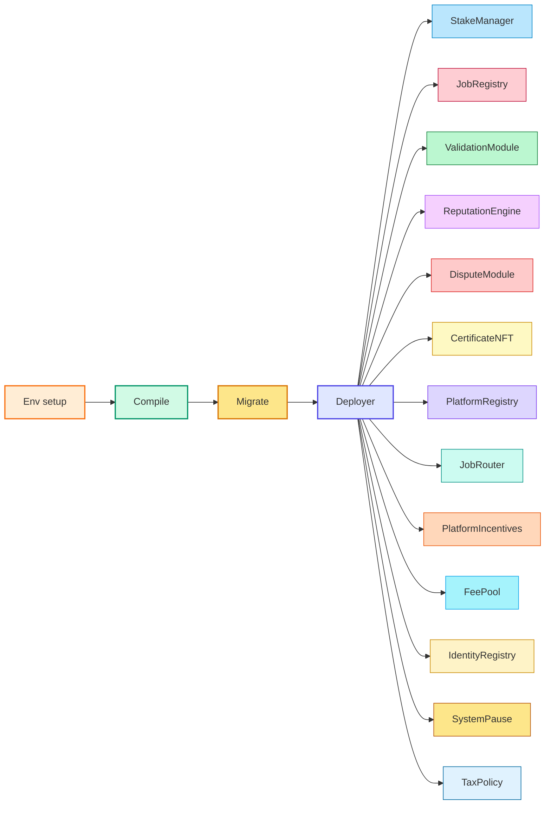

# Deploying AGIJobs v2 to Ethereum Mainnet (CLI Guide)

This guide walks through a production‑grade deployment of the AGIJobs v2
contracts to Ethereum mainnet using the Truffle CLI. It assumes you are
deploying the canonical $AGIALPHA stack and want all modules wired together
in one transaction.

## Deployment flow



## Prerequisites

1. **Node & npm** – Use Node 20.x and npm 10+. A matching `nvm` version is
   recommended.
2. **Dependencies** – Clone the repository and install packages:
   ```bash
   git clone https://github.com/MontrealAI/AGIJobsv0.git
   cd AGIJobsv0
   npm install
   ```
3. **Truffle** – Install Truffle globally or use `npx`:
   ```bash
   npm install -g truffle
   ```
4. **Ethereum access** – An RPC endpoint (Infura/Alchemy etc.) and a deployer
   private key with enough ETH.
5. **Governance address** – Multisig or timelock that will own the system.
6. **Etherscan API key** – Enables automatic verification.
7. **Dry-run** – Always run the migration on a public testnet (e.g. Sepolia)
   with the same environment variables to confirm gas usage and wiring
   before attempting a mainnet deployment.

## Environment variables

Create a `.env` file or export the variables before running Truffle:

```bash
export MAINNET_PRIVATE_KEY="0x..."         # deployer key
export MAINNET_RPC_URL="https://mainnet.infura.io/v3/<id>"
export GOVERNANCE_ADDRESS="0xYourMultisig"
export ETHERSCAN_API_KEY="YourKey"         # optional but recommended
# Optional overrides
export FEE_PCT=5                           # protocol fee (0‑100)
export BURN_PCT=5                          # burn percentage (0‑100)
export NO_TAX=true                         # set to skip TaxPolicy
```

### Truffle configuration

`truffle-config.js` reads these variables to configure the mainnet network
using `HDWalletProvider`:

```javascript
// truffle-config.js
module.exports = {
  networks: {
    mainnet: {
      provider: () =>
        new HDWalletProvider(
          process.env.MAINNET_PRIVATE_KEY,
          process.env.MAINNET_RPC_URL
        ),
      network_id: 1,
      confirmations: 2,
      timeoutBlocks: 200,
      skipDryRun: true,
    },
  },
};
```

The `$AGIALPHA` token address and decimals are fixed in
`config/agialpha.json` and compiled into the contracts; no extra token
configuration is required.

## Migration script

The Truffle migration below deploys and wires the entire AGIJobs v2 stack. It
reads the environment variables above and prints the address of each module as
it completes:

```javascript
// migrations/2_deploy_agijobs_v2.js
const Deployer = artifacts.require('Deployer');

module.exports = async function (deployer, network, accounts) {
  const governance = process.env.GOVERNANCE_ADDRESS || accounts[0];
  const withTax = !process.env.NO_TAX;
  const feePct = process.env.FEE_PCT ? parseInt(process.env.FEE_PCT) : 5;
  const burnPct = process.env.BURN_PCT ? parseInt(process.env.BURN_PCT) : 5;

  await deployer.deploy(Deployer);
  const instance = await Deployer.deployed();

  const ids = {
    ens: '0x00000000000C2E074eC69A0dFb2997BA6C7d2e1e',
    nameWrapper: '0xD4416b13d2b3a9aBae7AcD5D6C2BbDBE25686401',
    clubRootNode:
      '0x39eb848f88bdfb0a6371096249dd451f56859dfe2cd3ddeab1e26d5bb68ede16',
    agentRootNode:
      '0x2c9c6189b2e92da4d0407e9deb38ff6870729ad063af7e8576cb7b7898c88e2d',
    validatorMerkleRoot: '0x' + '0'.repeat(64),
    agentMerkleRoot: '0x' + '0'.repeat(64),
  };

  const econ = {
    feePct,
    burnPct,
    employerSlashPct: 0,
    treasurySlashPct: 0,
    commitWindow: 0,
    revealWindow: 0,
    minStake: 0,
    jobStake: 0,
  };

  let receipt;
  if (withTax) {
    if (feePct !== 5 || burnPct !== 5) {
      receipt = await instance.deploy(econ, ids, governance);
    } else {
      receipt = await instance.deployDefaults(ids, governance);
    }
  } else {
    if (feePct !== 5 || burnPct !== 5) {
      receipt = await instance.deployWithoutTaxPolicy(econ, ids, governance);
    } else {
      receipt = await instance.deployDefaultsWithoutTaxPolicy(ids, governance);
    }
  }

  const log = receipt.logs.find((l) => l.event === 'Deployed');
  const args = log.args;
  console.log('Deployer:', instance.address);
  console.log('StakeManager:', args.stakeManager);
  console.log('JobRegistry:', args.jobRegistry);
  console.log('ValidationModule:', args.validationModule);
  console.log('ReputationEngine:', args.reputationEngine);
  console.log('DisputeModule:', args.disputeModule);
  console.log('CertificateNFT:', args.certificateNFT);
  console.log('PlatformRegistry:', args.platformRegistry);
  console.log('JobRouter:', args.jobRouter);
  console.log('PlatformIncentives:', args.platformIncentives);
  console.log('FeePool:', args.feePool);
  if (withTax) {
    console.log('TaxPolicy:', args.taxPolicy);
  }
  console.log('IdentityRegistry:', args.identityRegistryAddr);
  console.log('SystemPause:', args.systemPause);
};
```

## Compile

```bash
truffle compile
```

## Deploy

Run the migration for mainnet. The repository already includes a migration that
deploys and wires the entire module set:

```bash
truffle migrate --network mainnet
```

The script prints the addresses for StakeManager, JobRegistry, ValidationModule
and the rest. Save them for later use.

## Verify

After deployment, verify the contracts on Etherscan. Example:

```bash
truffle run verify Deployer StakeManager JobRegistry ValidationModule \
  ReputationEngine DisputeModule CertificateNFT PlatformRegistry JobRouter \
  PlatformIncentives FeePool TaxPolicy IdentityRegistry SystemPause \
  --network mainnet
```

Only include `TaxPolicy` in the command if you did not set `NO_TAX`.

## Post‑deployment checks

1. Confirm each contract is owned by your governance address (or by the
   `SystemPause` contract where applicable).
2. Test pausing and unpausing through the `SystemPause` contract.
3. Optionally run `npm run verify:wiring` to ensure all module addresses point
   to each other correctly.

With these steps you have a repeatable, production‑ready path for launching
AGIJobs v2 to Ethereum mainnet using the Truffle CLI.
