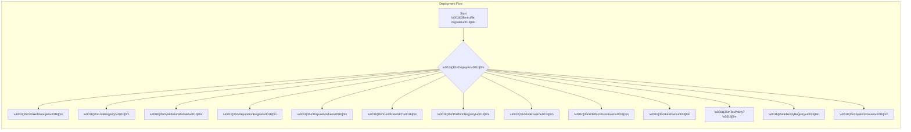

# Deploying AGIJobs v2 to Ethereum Mainnet (CLI Guide)

This guide walks you through a production-grade deployment of the **AGIJobs v2** contracts to Ethereum mainnet using the Truffle CLI. It assumes you already understand the protocol and simply want a fool-proof, scriptable process for launch.

## Prerequisites

1. **Node & NPM** – Use [Node.js 20.x](https://nodejs.org/) and npm 10+. Install with `nvm install` to match the repository's `.nvmrc`.
2. **Install dependencies** – After cloning `AGIJobsv0`, run:
   ```bash
   npm install
   ```
3. **Ethereum provider** – Export `MAINNET_RPC_URL` in `truffle-config.js` or via `WEB3_PROVIDER_URI`.
4. **Deployer key** – Set `PRIVATE_KEY` in your environment (never commit it).
5. **Governance address** – Multisig/Timelock that will own the system. Set `GOVERNANCE_ADDRESS` before migration.
6. **Optional flags** –
   - `NO_TAX` – omit the `TaxPolicy` module
   - `FEE_PCT` / `BURN_PCT` – override default 5% fee/burn
7. **Etherscan key** – export `ETHERSCAN_API_KEY` for automatic verification.

## One‑shot deployment

Compile and deploy everything in one go:

```bash
npx truffle migrate --network mainnet
```

The migration script [`migrations/2_deploy_agijobs_v2.js`](../migrations/2_deploy_agijobs_v2.js) will:

1. Deploy the `Deployer` helper.
2. Deploy and wire all protocol contracts with sane defaults.
3. Transfer ownership to your `GOVERNANCE_ADDRESS`.
4. Print addresses for all modules.

After migration, verify contracts:

```bash
npx truffle run verify Deployer StakeManager JobRegistry ValidationModule ReputationEngine DisputeModule CertificateNFT PlatformRegistry JobRouter PlatformIncentives FeePool IdentityRegistry SystemPause --network mainnet
```
Include `TaxPolicy` at the end if it was deployed.

## Architecture overview



Each module is colour‑coded in **purple** to stand out, while CLI steps appear in **cyan** for clarity.

## Production checklist

- **Dry run** on a testnet (`--network sepolia`) with the same parameters.
- Confirm ownership of all modules via `owner()` calls.
- Record deployed addresses and verified links for transparency.
- Exercise `SystemPause` to ensure emergency controls work.

With the migration and verification complete, your AGIJobs v2 stack is live on Ethereum mainnet.
