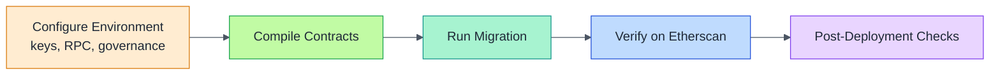

# Deploying AGIJobs v2 to Ethereum Mainnet (CLI Guide)

This guide explains how to deploy the production AGIJobs v2 contract suite to Ethereum mainnet with the Truffle CLI. A single migration launches and wires every module, assuming the canonical `$AGIALPHA` token and the default ENS‑based identity policy.

## Overview

AGIJobs v2 coordinates trustless labour markets between autonomous agents. The repository (named `AGIJobsv0`) contains all contracts and a migration that deploys StakeManager, JobRegistry, ReputationEngine and other modules in one transaction. The steps below follow best practices for a production launch: using a governance multisig, verifying source code and keeping pause controls ready.



## Prerequisites & setup

- **Node & npm** – install Node.js 20.x and npm 10+. The repo includes an `.nvmrc` to help match versions.
- **Repository** – clone `MontrealAI/AGIJobsv0` and install dependencies plus Truffle tooling:
  ```bash
  git clone https://github.com/MontrealAI/AGIJobsv0.git
  cd AGIJobsv0
  npm install
  npm install --save-dev truffle @truffle/hdwallet-provider truffle-plugin-verify
  ```
- **Environment** – export mainnet RPC, deployer key, governance address and Etherscan key:
  ```bash
  export MAINNET_RPC_URL="https://mainnet.infura.io/v3/<id>"
  export MAINNET_PRIVATE_KEY="0x..."
  export GOVERNANCE_ADDRESS="0x<multisig_or_timelock>"
  export ETHERSCAN_API_KEY="<key>"
  ```
- **Funding** – ensure the deployer account holds sufficient ETH to cover gas for all contract creations.
- **Token & ENS** – `$AGIALPHA` lives at `0xA61a3B3a130a9c20768EEBF97E21515A6046a1fA`. Ensure you control `agi.eth` if enforcing ENS subdomains or adjust the migration.
- **Dry‑run** – test the process on a public testnet (Sepolia/Goerli) before mainnet to confirm gas usage and environment variables.

## 1. Compile

Truffle uses `truffle-config.js` and the migration at `migrations/2_deploy_agijobs_v2.js`.

```javascript
// migrations/2_deploy_agijobs_v2.js
const Deployer = artifacts.require('Deployer');

module.exports = async function (deployer, network, accounts) {
  const governance = process.env.GOVERNANCE_ADDRESS || accounts[0];
  const withTax = !process.env.NO_TAX;
  const feePct = process.env.FEE_PCT ? parseInt(process.env.FEE_PCT) : 5;
  const burnPct = process.env.BURN_PCT ? parseInt(process.env.BURN_PCT) : 5;

  await deployer.deploy(Deployer);
  const instance = await Deployer.deployed();

  const ids = {
    ens: '0x00000000000C2E074eC69A0dFb2997BA6C7d2e1e',
    nameWrapper: '0xD4416b13d2b3a9aBae7AcD5D6C2BbDBE25686401',
    clubRootNode:
      '0x39eb848f88bdfb0a6371096249dd451f56859dfe2cd3ddeab1e26d5bb68ede16',
    agentRootNode:
      '0x2c9c6189b2e92da4d0407e9deb38ff6870729ad063af7e8576cb7b7898c88e2d',
    validatorMerkleRoot: '0x' + '0'.repeat(64),
    agentMerkleRoot: '0x' + '0'.repeat(64),
  };

  const econ = {
    feePct,
    burnPct,
    employerSlashPct: 0,
    treasurySlashPct: 0,
    commitWindow: 0,
    revealWindow: 0,
    minStake: 0,
    jobStake: 0,
  };

  let receipt;
  if (withTax) {
    if (feePct !== 5 || burnPct !== 5) {
      receipt = await instance.deploy(econ, ids, governance);
    } else {
      receipt = await instance.deployDefaults(ids, governance);
    }
  } else {
    if (feePct !== 5 || burnPct !== 5) {
      receipt = await instance.deployWithoutTaxPolicy(econ, ids, governance);
    } else {
      receipt = await instance.deployDefaultsWithoutTaxPolicy(ids, governance);
    }
  }

  const log = receipt.logs.find((l) => l.event === 'Deployed');
  const args = log.args;
  console.log('Deployer:', instance.address);
  console.log('StakeManager:', args.stakeManager);
  console.log('JobRegistry:', args.jobRegistry);
  console.log('ValidationModule:', args.validationModule);
  console.log('ReputationEngine:', args.reputationEngine);
  console.log('DisputeModule:', args.disputeModule);
  console.log('CertificateNFT:', args.certificateNFT);
  console.log('PlatformRegistry:', args.platformRegistry);
  console.log('JobRouter:', args.jobRouter);
  console.log('PlatformIncentives:', args.platformIncentives);
  console.log('FeePool:', args.feePool);
  if (withTax) {
    console.log('TaxPolicy:', args.taxPolicy);
  }
  console.log('IdentityRegistry:', args.identityRegistryAddr);
  console.log('SystemPause:', args.systemPause);
};
```

```bash
npx truffle compile
```

## 2. Deploy

Run the migration to deploy and wire all modules. By default it uses a 5% protocol fee and burn and includes the TaxPolicy module. Set `NO_TAX=1` to omit it or override economics with `FEE_PCT` and `BURN_PCT`.

```bash
npx truffle migrate --network mainnet
```

The script prints the address of every module (StakeManager, JobRegistry, ValidationModule, ReputationEngine, DisputeModule, CertificateNFT, PlatformRegistry, JobRouter, PlatformIncentives, FeePool, [TaxPolicy,] IdentityRegistry and SystemPause). Save this output.

## 3. Verify

If `ETHERSCAN_API_KEY` is set, contracts can be verified immediately:

```bash
npx truffle run verify Deployer StakeManager JobRegistry ValidationModule ReputationEngine DisputeModule CertificateNFT PlatformRegistry JobRouter PlatformIncentives FeePool IdentityRegistry SystemPause --network mainnet
```

Include `TaxPolicy` in the list if it was deployed.

## 4. Post‑deployment checks

1. **Ownership** – confirm all modules are owned by `GOVERNANCE_ADDRESS`. Transfer any stragglers with `transferOwnership`.
2. **Pause safety** – the `SystemPause` contract allows pausing and resuming all modules; test `pauseAll()`/`unpauseAll()` via governance.
3. **Wiring** – run `npm run verify:wiring` to ensure addresses are correctly linked.
4. **Parameter tuning** – adjust protocol fee and burn percentages through governance calls on `JobRegistry` and `FeePool` as needed.

## References

- [truffle-config.js](../truffle-config.js)
- [migrations/2_deploy_agijobs_v2.js](../migrations/2_deploy_agijobs_v2.js)
- [contracts/v2/Deployer.sol](../contracts/v2/Deployer.sol)
- [v2-deployment-and-operations.md](v2-deployment-and-operations.md)
- [system-pause.md](system-pause.md)
